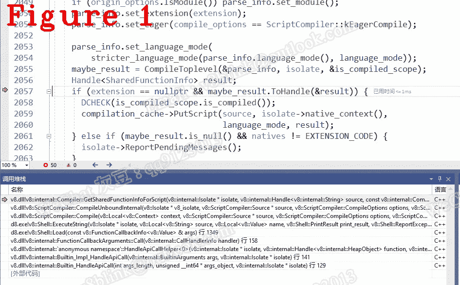

# 让我们了解 Chrome V8:编译缓存——让编译器更快

> 原文：<https://javascript.plainenglish.io/lets-understand-chrome-v8-compilation-cache-make-the-compiler-faster-5d230185d127?source=collection_archive---------13----------------------->

## 第 19 章:解释编译缓存工作流程和关键基础。

*欢迎阅读* [*其他章节让我们来了解一下 Chrome V8*](https://medium.com/@huidou)

出于性能原因，V8 使用编译缓存来保存编译结果 SharedFunction，一旦相同的 JavaScript 代码被再次编译，缓存就直接返回结果。

你可能会问为什么同样的代码又被编译了。先编译，后执行——这是 V8 的流水线。即使完全相同的代码，相同的函数，仍然需要发送给编译器，但并不总是重新编译。实际上，JavaScript 代码在执行过程中可能会改变，所以第一个动作总是从编译缓存中获取 JavaScript 代码的哈希值，如果缓存命中，则返回 SharedFunction，然后反过来重新编译 JavaScript。

# **1。初始化和填充**

Isolate 是 V8 虚拟机实例，负责初始化 CompilationCache，isolate::Init，如下所示:

最后一行现在是 CompilationCache，即初始化。让我们更深入地研究一下。

上述功能有三个重要的基本要素:

1.第 3 行的 LookupScript()。它用于查找缓存以取出保存对应于 JavaScript 代码的字节码的 SharedFunction。如果命中，直接跳过编译进入执行单元。

2.在第 13 行放置 Script()。如果 LookupScript 未命中，PutScript()会在执行前将对应于您的 JavaScript 代码的哈希和编译器生成的 SharedFunciton 放入缓存中。

3.第 7 行和第 16 行的 LookupEval 和 PutEval。它们与 LookupScript 和 PutScript 相同，但专门用于 JavaScript eval 方法，因为 eval 不仅需要 SharedFunction，还需要上下文。

让我们更深入地研究一下 LookupScript:

我们可以发现，CompilationCache::LookupScript 只是入口，关键的函数，以及重要的代码都在 CompilationCacheScript::Lookup()中。

1.在 Lookup()中，参数源是您作为开发人员实际编写的 JavaScript，它将被编译。

2.从第 20 行开始。它是保存 PutScript 放入的数据的实际表。

3.CompilationCacheTable::第 21 行的 LookupScript。在表中查找命中表示共享功能或缺失为空的结果。

4.在第 25 行:根据来源检查 SharedFunction 是否正确。

我们来看一下 HasOrigin。

从第 1 行到第 3 行，注释提供了来源检查规则。具体来说，实现是从第 14 行到第 16 行。

接下来，让我们进入 PutScript。

与 LookupScript()一样，CompilationCache::PutScript 是入口，所有重要的东西都在 CompilationCacheTable::put script 中。

在 PutScript 中，我想通知您缓存表将被填满。下面是 CacheTable 源代码:

从第 1 行到第 11 行，评论提供了更多足够对应的解释。

让我们回到 CompilationCacheScript::Put()并前进到第 16 行，这是 CompilationCacheTable::Put script()。

我认为重要的是，PutScript 将 JavaScript 源代码和 SharedFuncation 绑定为一个散列对，并将其放入缓存中，实现在第 9 行到第 15 行。

# **2。查找和更新**

让我们进入编译器::GetSharedFunctionInfoForScript。

在第 14 行，这意味着如果 LookupScript 丢失，我们需要编译 JavaScript 代码，因此我们跳到第 21 行来执行编译并生成 inner_result。然后在第 29 行，将 inner_result 放入缓存。我们可以发现 innuer_result 就是第 32 行的 maybe_result。

图 1 显示了调用栈。

除了 LookupScript 和 PutScript，V8 中还有 LookupEval、PutEval 以及 LookupRegExp、PutRegExp。它们的工作流程和 LookupScript、PutScript 一样，请自行学习。

*好了，这部分就到此为止了。下次再见，保重！*

如果你有任何问题，请联系我。【v8blink@outlook.com】微信: qq9123013 **邮箱:**

*更多内容看* [***说白了。报名参加我们的***](https://plainenglish.io/) **[***免费周报***](http://newsletter.plainenglish.io/) *。关注我们关于* [***推特***](https://twitter.com/inPlainEngHQ) ，[***LinkedIn***](https://www.linkedin.com/company/inplainenglish/)*，*[***YouTube***](https://www.youtube.com/channel/UCtipWUghju290NWcn8jhyAw)*，以及* [***不和***](https://discord.gg/GtDtUAvyhW) *。***