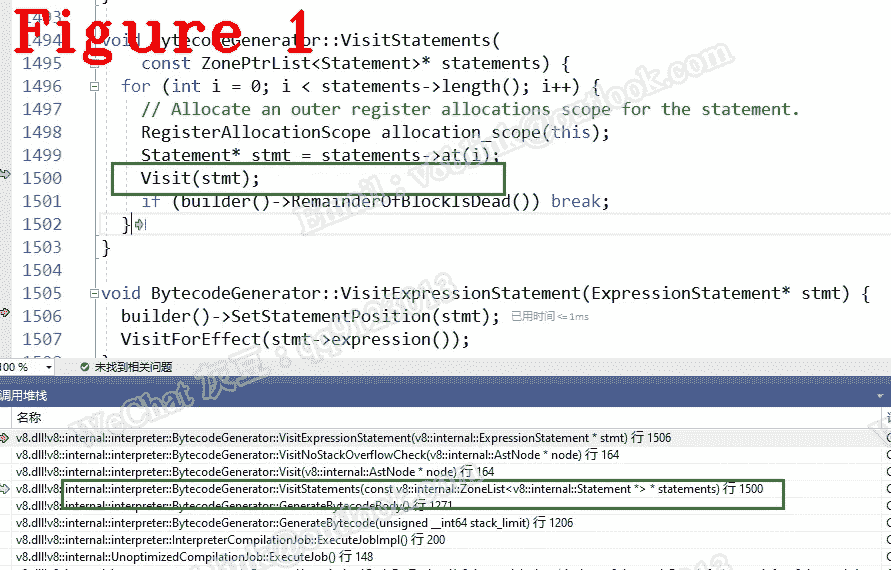

# 让我们来理解 Chrome V8:编译器工作流:字节码，常量池

> 原文：<https://javascript.plainenglish.io/lets-understand-chrome-v8-compiler-workflow-bytecode-constant-pool-4b77825812b4?source=collection_archive---------14----------------------->

## 第 22 章:字节码生成的细节

*欢迎阅读* [*其他章节让我们来了解一下 Chrome V8*](https://medium.com/@huidou)

在本文中，我们将深入字节码，详细研究字节码生成和常量池。

# **1。字节码生成**

GenerateUnoptimizedCodeForToplevel 负责将 AST 树转换成字节码。

第 7 行 *job- > ExecuteJob()* 从 parse_info 中读取 AST 树并生成字节码。通过调试它，我们进入下面的函数，该函数分析每个 AST 节点并生成相应的字节码。

在上面的函数中，第 11、12 和 23 行首先分别分析声明、导入模块和语句，然后生成相应的字节码。

在我们的例子中，我们将更深入地研究第 11 行 VisitDeclarations()。在 VisitDeclarations()中，调用了以下函数。

在第 3 行，OutputLdaConstant 将一个全局常量存储到常量池中，并生成用于加载该常量的字节码 LdaGlobal，这样我们就可以在执行过程中通过 LdaGlobal 取出该常量。关于恒池，我以后再说。

通过调试 OutputLdaConstant()，我们进入了 EmitBytecode()，它为相应的语句生成一个字节码，也是为全局常量生成 LdaGlobal 的函数。

从第 4 行到第 25 行，计算我们的 LdaGlobal 的操作数大小，因为在执行中，字节码需要操作数大小来正确操作操作数。

回到 GenerateBytecodeBody()，在第 23 行，VisitStatements()读取一个表示相应 JavaScript 语句的 AST 节点，并生成一个字节码。

**注意:**如果一个 AST 节点代表一个 JavaScript 语句块，VisitStatements()会递归调用自身生成很多字节码。

图 1 显示了 VisitStatements 的调用堆栈。

# **2。常量池**

编译函数 test()时，编译器推断将调用 add3，add3 地址应该被推入常量池。

但是，这里有一个问题。如果 add3()还没有编译，我们就没有地址。在这种情况下，编译器在常量池中为 add3 保留一个槽，并在 add3()编译后填充它，即 DeferredConstants。

让我们看一下 FinalizeBytecode()。

在第 4 行，AllocateDeferredConstants 创建了 DeferredConstants。

从第 4 行到第 10 行，循环 for 将全局变量存储到常量池中。

从第 11 行到第 35 行，将 sharedfunction、constant property 和其他内容存储到常量池中。

# **3。FinalizeBytecode**

FinalizeBytecode()是生成字节码的最后一步。让我们看一下 FinalizeBytecode 的第 13 行，*builder()->ToBytecodeArray*重新组织字节码并返回一个字节码数组，该数组包含一个表示 JavaScript 代码的字节码数组。什么是“重组”？它只是放置字节码、常量池等。因为所有的东西在 ToBytecodeArray 之前就已经做好了。

第 9 行显示了 handler_table，也就是我刚才提到的 dispatch_table。

第 11 行将 handler_table 地址存储到一个字节码数组中。请记住，每个字节码只有一个处理程序，它是实际的 worker，由 dispatch_table 保存。

让我们看一下第 11 行字节码 _ 数组 _ 写入器 _.ToBytecodeArray。

第 7 行生成 constant_pool，第 9 行生成一个字节码数组，源代码如下:

第 12 行从 V8 堆中分配内存，然后第 15–25 行将字节码数组复制到内存中，最后第 28 行返回字节码。

# **外卖**

*   常量池保存常量、函数地址等。**注:**如果一个变量名是已知的，它作为一个常量存储在常量池中；
*   常量池始终位于字节码数组[0]中。换句话说，给定一个字节码数组，数组的第一个元素总是常量池；
*   字节码数组是一个堆对象，它的类型是 FixedArray。

*好了，这部分就到此为止了。下次再见，保重！*

如果你有任何问题，请联系我。**微信** : qq9123013 **邮箱**:[v8blink@outlook.com](mailto:v8blink@outlook.com)

*更多内容看* [***说白了就是***](https://plainenglish.io/) *。报名参加我们的* [***免费周报***](http://newsletter.plainenglish.io/) *。关注我们* [***推特***](https://twitter.com/inPlainEngHQ) ，[***LinkedIn***](https://www.linkedin.com/company/inplainenglish/)*，*[***YouTube***](https://www.youtube.com/channel/UCtipWUghju290NWcn8jhyAw)*，*[*不和*](https://discord.gg/GtDtUAvyhW) *。*