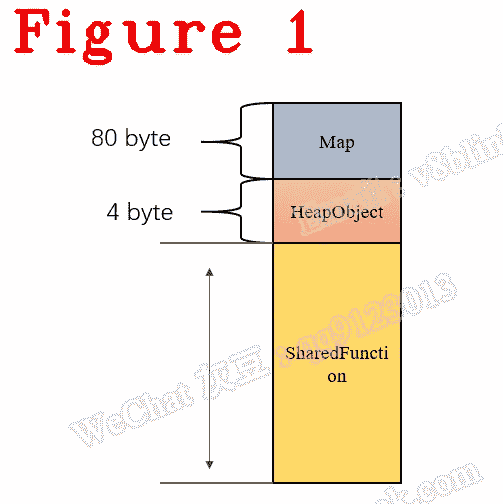

# 我们来了解一下 Chrome V8:编译器工作流程:V8 是如何描述你的 JavaScript 函数的

> 原文：<https://javascript.plainenglish.io/lets-understand-chrome-v8-compiler-workflow-how-does-v8-describe-your-javascript-function-20b762270561?source=collection_archive---------8----------------------->

## 第 24 章:SharedFunction 和 JSFunction 的基础知识

*欢迎阅读* [*其他章节让我们来了解一下 Chrome V8*](https://medium.com/@huidou)

当我们学习 V8 时，SharedFunction 和 JSFunction 是两个非常常见和重要的术语，可能会让初学者感到困惑。那么它们是什么呢？两者有什么区别？一般来说，ShardFunction 的主要作用是放置字节码的地方，还有其他的东西，比如我以后会谈到的蹦床。“Shared”，你可以大致把 SharedFunction 想象成一个 DLL 库，可以在任何地方调用。编译器将 JavaScript 函数编译成 SharedFunction，SharedFunction 可以像 DLL 一样在任何地方使用。这就是它的名字叫共享功能的原因。

大致来说，JSFunction 等于 SharedFunction +一个上下文。当 V8 要调用 SharedFunction 时，V8 需要将一个 context 绑定到 shared function，bind 是 V8 的一个术语，意思是将一个 shared function 和一个 context 绑定在一起，即 JSFunction。JSFunction 是一个可执行实例，可由 V8 解释器点火执行。

# **1。共享功能**

以下代码是 SharedFucntion 类。

第 1–2 行注释了 SharedFunction 可以由多个实例共享。

在这里，我给你一些共享函数的重要成员。

*   第 5 行，GetCode()返回代码，我将进一步说明该代码是内置代码，而不是您的 JavaScript 源代码，内置代码用于构建解释器启动的函数序言。在调用一个函数之前，V8 需要构造一个调用栈，获取第一个指令地址，这一切都由内置代码负责；
*   第 6 行，SetScript()将 JavaScript 源代码设置到 SharedFunction 中；
*   第 9–11 行，它们设置了描述字节码和 JavaScript 源代码之间对应位置的 offset
*   第 12-15 行描述了 SharedFunction 是否是 API 函数；
*   第 16-18 行，它们为 SharedFunction 获取并设置字节码数组；
*   第 19 行，是以后要讲的 InterpreterTrampoline 地址；
*   第 27-35 行，它们是涡轮风扇发动机的优化理由。下面列出的是优化原因。

*   第 36–37 行，将模式设置为严格或草率；
*   第 40–48 行，宏 DECL _ 布尔 _ 访问器的定义如下:

*   第 72 行，它定义了 SharedFunction 的内存布局，下面是源代码，图 1 显示了内存布局:

# **2。JSFunction**

函数 NewFunctionFromSharedFunctionInfo 读取 SharedFunction 并生成相应的 JSFunction。以下是源代码:

在上面的代码中，第 7 行调用了 NewFunction()。

在这里，我给你一些新功能的细节。

*   第 17-18 行描述了一些 SharedFunction 没有的属性和元素。
*   第 21 行，是我上面提到的绑定上下文。
*   第 19–20 行，它们设置了相应的 SharedFunction 并将代码内置到 JSFunction 中。

好的，SharedFunction 可以被多个实例共享，JSFunction 是一个可执行的实例。

好了，这部分就到此为止了。下次再见，保重！

如果你有任何问题，请联系我。**微信** : qq9123013 **邮箱**:[v8blink@outlook.com](mailto:v8blink@outlook.com)

*更多内容看* [***说白了。报名参加我们的***](https://plainenglish.io/) **[***免费周报***](http://newsletter.plainenglish.io/) *。关注我们关于* [***推特***](https://twitter.com/inPlainEngHQ) ，[***LinkedIn***](https://www.linkedin.com/company/inplainenglish/)*，*[***YouTube***](https://www.youtube.com/channel/UCtipWUghju290NWcn8jhyAw)*，以及* [***不和***](https://discord.gg/GtDtUAvyhW) *。对增长黑客感兴趣？检查* [***电路***](https://circuit.ooo/) *。***