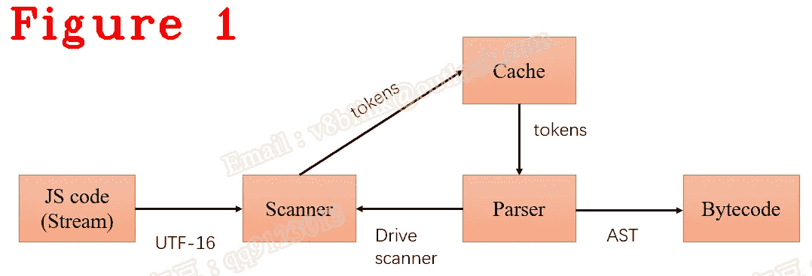

# 让我们来理解 Chrome V8:编译器工作流，解析器

> 原文：<https://javascript.plainenglish.io/lets-understand-chrome-v8-compiler-workflow-parser-36941d0ff204?source=collection_archive---------10----------------------->

## 第 20 章:解析器基础和关键数据结构

*欢迎阅读* [*其他章节让我们来了解一下 Chrome V8*](https://medium.com/@huidou)

在过去的文章中，我们讨论了很多关于 V8 的 JavaScript 编译器。我们涵盖了解析器、扫描器和字节码，以及它们的基础知识、内核代码和密钥结构。

在接下来的文章中，我们将遍历编译器工作流，并观察 V8 如何一步一步地将 JavaScript 代码转换成字节码。

图 1 显示了工作流程，它从您编写的 JavaScript 代码开始，经过扫描器和解析器，最后生成字节码。

**注意:**在本文中，我使用 d8.exe 而不是 v8.exe，因为 d8.exe 可以直接在终端上打印，而且 d8 比 v8 更轻便。

# **1。读取 JavaScript 代码**

下面是我们的测试案例:

下面是负责执行 JavaScript 代码的 Execute()。很简单，它首先从文件中读取 JavaScript 代码，然后编译并执行代码。

在第 5 行中，NewFromUtf8 获取文件名，这是我们的例子。在第 8 行，ReadFile 获取文件内容，这实际上是我们的例子。

第 8 行和第 10 行根据类型是 ExternalOneByte 还是 UTF8 返回 JavaScript 代码。这里我们的案例是 UTF8，关于 String::ExternalOneByteStringResource，以后再讲。

回到 SourceGroup::Execute()，并在第 14 行单步执行 Shell::ExecuteString，其源代码如下所示:

在第 13 行，我们的 JavaScript 被包装到一个变量 script_source 中，该变量包含行和列的偏移量。因为 V8 只编译正在执行的 JavaScript 函数，而不是完整的 JavaScript 代码，所以变量 script_source 帮助编译器记录编译信息。

在第 14 行，开始编译 JavaScript。

# **2。解析器初始化**

在工作流中，第一部分是扫描器，第二部分是解析器。实际上，扫描器是被动的，而解析器是主动的，这意味着解析器主动从编译缓存中取出一个令牌，一旦缓存未命中，扫描器就被解析器唤醒，生成令牌并填充缓存。

下面是由 ScriptCompiler::Compile 在第 14 行上面调用的 CompileUnboundInternal()。

上面的函数生成了 UnboundInternal 的东西，第 11 行告诉我们这个东西实际上只是一个 Sharedfunction。但是，绑定是什么？Sharedfunction 不能直接执行，V8 需要将上下文与 Sharedfunction 匹配，“匹配”就是 bing。

让我们步入 GetSharedFunctionInfoForScript。

第 7 行查找我在上一篇文章中提到的编译缓存。

第 13 行，parse_info 是 Parser 的包装器，就像前面提到的变量 script_source 一样。

第 15 行，Parser_info 初始化，代码如下所示:

从第 6 行到第 12 行，将 JavaScript 代码(我们的例子)包装到变量脚本中，然后初始化 line_offset 和 column_offset。它就像我说的那样。

返回编译器::GetSharedFunctionInfoForScript()，并单步执行第 23 行的 CompileToplevel()。

第 5 行，literal()返回抽象语法树(AST)，V8 启动编译器生成 AST，如果是 nullptr。

第一次，AST 为空，并进入 ParseProgram。

在第 5 行，创建解析器，即解析器初始化。

从第 8 行到第 18 行，取出编译信息，例如扫描仪和编译模式。

从第 9 行到第 23 行，重要的东西是 can _ compile _ lazily。

第 25 行启用以%开头的本地命令。

# **总结**

*   V8 使用 UTF16 编码 JavaScript 源代码；
*   V8 使用 v8::internal::source 来管理我们的 JavaScript 代码；
*   首先，查找编译缓存，如果缓存未命中，则启动编译器；
*   扫描器是被动的，解析器是主动的。

*好了，这部分就到此为止了。下次再见，保重！*

如果你有任何问题，请联系我。v8blink@outlook.com:[微信 : qq9123013 **邮箱**](mailto:v8blink@outlook.com)

*更多内容看* [***说白了。报名参加我们的***](https://plainenglish.io/) **[***免费周报***](http://newsletter.plainenglish.io/) *。关注我们关于* [***推特***](https://twitter.com/inPlainEngHQ) ，[***LinkedIn***](https://www.linkedin.com/company/inplainenglish/)*，*[***YouTube***](https://www.youtube.com/channel/UCtipWUghju290NWcn8jhyAw)*，以及* [***不和***](https://discord.gg/GtDtUAvyhW) *。***