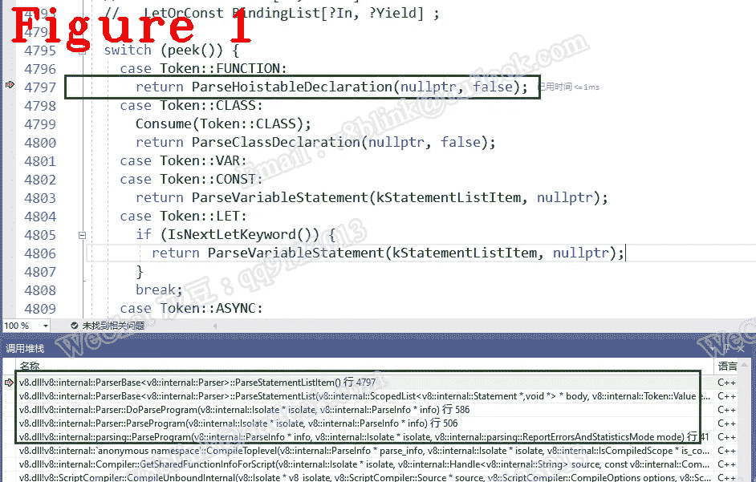

# 让我们来了解一下 Chrome V8:编译器工作流程:Token，AST

> 原文：<https://javascript.plainenglish.io/lets-understand-chrome-v8-compiler-workflow-token-ast-8f629bd79803?source=collection_archive---------7----------------------->

## 第 21 章:DoParseProgram 函数和 AST 生成

*欢迎来到* [*其他章节让我们来了解一下 Chrome V8*](https://medium.com/@huidou)

在上一篇文章中，我们谈到了解析器，我们知道扫描器是被动的，需要被解析器唤醒。在这里，我将带您详细了解编译器工作流、观察标记和 AST。

# **1。扫描仪和令牌**

下面的函数负责生成 AST，它包含扫描器初始化、扫描器执行和解析器令牌，在这里你可以详细观察编译器的工作流程。

第 3 行是扫描仪初始化，下面是源代码:

在第 3 行，Init()初始化扫描器。在第 5 行中，Scan()只生成一个令牌，记住扫描器是由解析器驱动的，这个令牌首先用来唤醒解析器，然后很快触发令牌缓存缺失，最终启动编译器管道。让我们更深入地研究一下 Init()。

在第 2 行，Advance()从 JavaScript 代码中获取一个字符，这是开发人员实际编写的。

第 11 行显示了 Advance()源代码。在第 15 行，关键字 c0_ 指向 Advance()将取出的下一个字符。source_->Advance 的定义在第 18 行。请看第 24 行，Peek()是从 JavaScript 中获取字符的实际函数，因为在第 25–28 行，它读取保存 JavaScript 的缓冲流。

回到 void Scanner::Initialize()，让我们深入扫描()。

在第 4 行，ScanSingleToken()使用 Advance()一个接一个地取出字符，直到遇到一个终止符。

在我们的例子中，起始字符是一个`f`，我们知道`f`可能意味着关键字函数或者一个普通的用户定义的变量，这取决于后面的字符。因为我们的例子是关键字函数，所以进入第 16–17 行。

扫描器的基础是有限状态自动机，V8 使用预定义的宏模板和开关盒来扫描字符，然后将相关字符组织在一起作为令牌，并填充到缓存中。

让我们看一下 ScanIdentifierOrKeyword():

ScanIdentifierOrKeywordInner()在一次执行中生成一个令牌。

# **2。生成 AST**

DoParseProgram()负责生成 AST 树。

第 2 行 get out lazy 选项，默认情况下，lazy 为真，在 *flag-definitions.h* 中定义。第 8 行创建了一个空的 AST 主体。

在第 16 行，ParseStatementList()解析令牌并生成 AST。

在第 4 行，peek()获取当前令牌的类型。在我们的例子中，第一个令牌是 Token::FUNCTION，它既不是 Token::STRING，也不是 end_token，所以进入 ParseStatementListItem()。

在 ParseStatementListItem 中，根据令牌类型，执行下面的操作。确切地说，ParseStatementListItem 也是一个有限状态自动机，它使用预定义的宏模板和大小写转换来匹配和分析字符。

图 1 显示了调用栈。

在 JavaScript 中，一个语句可能是一个变量定义、一个函数或者一个语句块，所以 ParseStatementListItem()经常递归调用自己。

# **外卖**

**(1)** 编译器的基本原理是用有限状态自动机来分析字符。具体来说，V8 使用宏模板和开关盒。

**(2)** 编译器的最小粒度是一个 JavaScript 函数。

**(3)** 既然懒编译在这里，那么一个函数在即将执行的时候编译。

**(4)**function literal 保存代表您的 JavaScript 函数的 AST 树。

**(5)** 下面是定义 Token 的宏模板:

*好了，本次分享到此结束。下次再见，保重！*

如果你有任何问题，请联系我。**微信** : qq9123013 **邮箱**:[v8blink@outlook.com](mailto:v8blink@outlook.com)

*更多内容请看* [***说白了就是***](https://plainenglish.io/) *。报名参加我们的* [***免费每周简讯***](http://newsletter.plainenglish.io/) *。关注我们关于*[***Twitter***](https://twitter.com/inPlainEngHQ)，[***LinkedIn***](https://www.linkedin.com/company/inplainenglish/)*，*[***YouTube***](https://www.youtube.com/channel/UCtipWUghju290NWcn8jhyAw)*，以及* [***不和***](https://discord.gg/GtDtUAvyhW)**。**