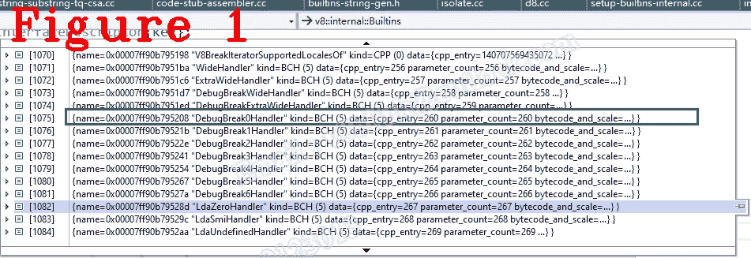
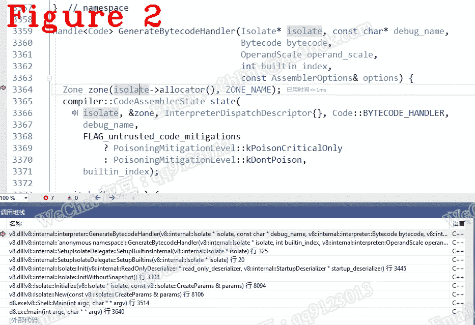

# 让我们来理解 Chrome V8:字节码是如何工作的

> 原文：<https://javascript.plainenglish.io/lets-understand-chrome-v8-how-bytecode-works-86771378b62?source=collection_archive---------9----------------------->

## 第 26 章:字节码处理程序的基础

*欢迎阅读* [*其他章节让我们来了解一下 Chrome V8*](https://medium.com/@huidou)

# **1。简介**

对于一个字节码，处理程序的职责是什么？在 V8 中，解释器本身由一组处理程序代码片段组成，每个代码片段处理一个特定的字节码。所以处理程序是一个实现字节码的指令。

在 C++中，你知道 V8 是用 C++编写的，处理程序是一个实现字节码的函数，而解释器执行字节码只是调用相应的函数。我们来思考一个问题，给一个字节码，如何找到合适的处理程序？字节码和处理程序之间可能有映射。是的，是 dispatch_table 数组将字节码映射到正确的处理程序，其中字节码是索引，处理程序地址是值。所有处理程序都在解释器-生成器. cc 中实现。

让我给你一个如何处理的感觉，只是给你一个高层次的概述，没有更多的细节。

上面的代码是两个处理程序，其中一个是 Star，另一个是 Mov。dispatch()正在查找 dispatch_table 来跳转下一个字节码，你可以把这个 Dispatch 看作是 PC 机寄存器。

# **2。初始化**

当 V8 创建隔离时，它将从快照文件加载处理程序。在构建 V8 之前，已经构建了所有的处理程序，并将其写入二进制文件 snapshot.bin。对于 V8，处理程序只是外部导入函数。下面的代码是加载处理程序，即 setup builtins。

我在上一章说过这些宏像 BUILD_BCH 和 BUILTIN_LIST。以下是 GenerateBytecodeHandler。

在上面的代码中，Builtins::name 知道所有的字节码名称。我的意思是你可以在这里看到名字。我从初学者开始就把名字印在纸上。下面的代码是 Builtins::name。

正如我所说的，builtin_metadata 保存所有内置名称，其中不仅有字节码名称，还有其他内置名称。图 1 显示了 1075 号，名字是 DebugBreakHandler，类型是 BCH。

下面的代码是 interpreter::GenerateBytecodeHandler()，它在代码 GenerateBytecodeHandler()中被调用。

在上面的代码中，第 14 行 switch 和宏 BYTECODE_LIST 一起初始化所有的字节码处理程序。下面的代码是 BYTECODE_LIST。

在上面的代码中，我展开了 kWide 和 kLdaSmi 来演示开关是如何工作的，图 2 显示了调用堆栈。

下面的代码是 LdaSmi 初始化相关的宏展开。如果你深究一下，你会发现字节码的基类来自于涡扇。以后我会演示涡扇如何生成字节码。

参见上面的代码，第 19 行获取操作数 smi，并将其存储到第 20 行的累加器中。如果您编写了 asm 代码，您会发现字节码很像 asm。
关于字节码，有三个重要的类你需要注意，分别是 InterpreterAssembler、CodeAssembler、CodeAssembler。如果你是一名逆向工程师，你应该更深入地研究字节码，因为基于字节码的保护在网站上被广泛使用。

*好了，这部分就到此为止了。下次再见，保重！*

如果你有任何问题，请联系我。**微信** : qq9123013 **邮箱**:[v8blink@outlook.com](mailto:v8blink@outlook.com)

*更多内容看* [***说白了。报名参加我们的***](https://plainenglish.io/) **[***免费周报***](http://newsletter.plainenglish.io/) *。关注我们关于* [***推特***](https://twitter.com/inPlainEngHQ) ，[***LinkedIn***](https://www.linkedin.com/company/inplainenglish/)*，*[***YouTube***](https://www.youtube.com/channel/UCtipWUghju290NWcn8jhyAw)*，* [***不和***](https://discord.gg/GtDtUAvyhW) *。对增长黑客感兴趣？检查* [***电路***](https://circuit.ooo/) *。***