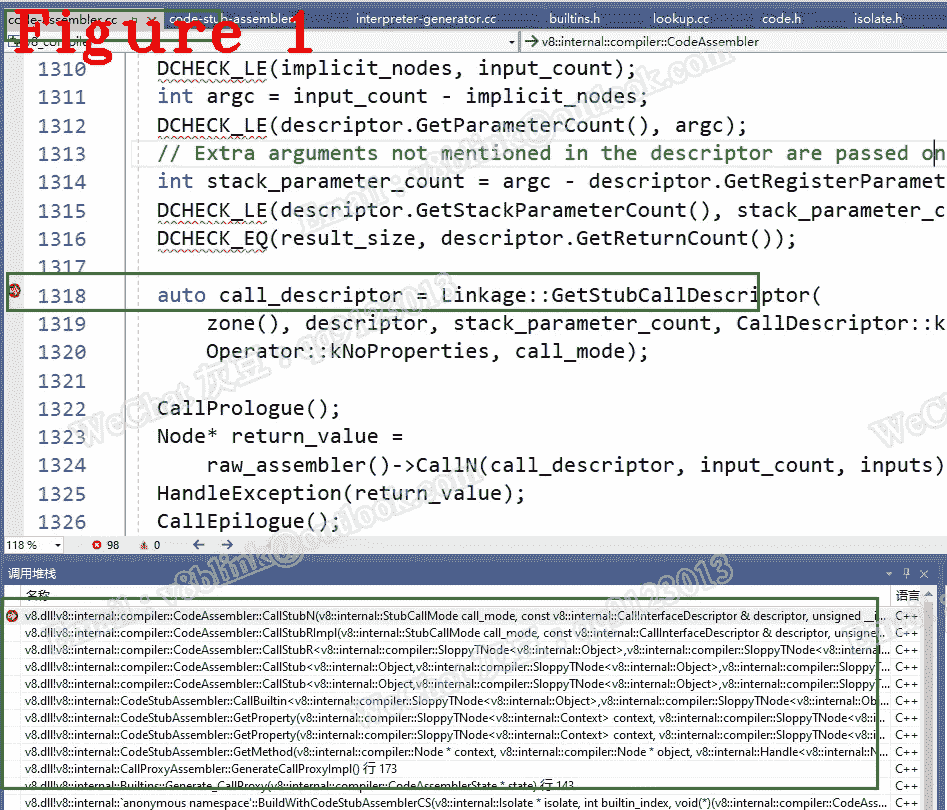

# 让我们来了解一下 Chrome V8:call builtin 是如何工作的

> 原文：<https://javascript.plainenglish.io/lets-understand-chrome-v8-how-does-callbuiltin-work-453033d22faa?source=collection_archive---------10----------------------->

## 第 29 章:内置调用约定

*欢迎阅读* [*其他章节让我们来了解一下 Chrome V8*](https://medium.com/@huidou)

在 V8 中，如果你检查 integration.cc，你会发现字节码处理程序使用 CallBuitlin 调用 builtins 是很常见的。CallBuiltin 仅用于调用其他内置函数，如字节码处理程序或 CSA 函数。换句话说，如果您想在 buitlin 中调用内置功能，CallBuiltin 是一种常见的方式。同样，如果你在一个内置函数中调用一个运行时函数，有一种方法已经为你准备好了，我将在以后讲到。

在 CallBuiltin 的过程中，有两个重要的部分，一个是查找被调用者的地址，另一个是为被调用者计算参数。

# **1。CallBuiltin**

让我们看看它是如何查找地址的。

**(1)** 被调用者名称是一个 enum 变量，可以用来查找内置表，enum 如下。

下面是扩展的枚举变量。

**(2)** 枚举变量由 iso ate->isolate _ data _->builtins _ 保存。

在上面的代码中， *builtins_* 是一个*地址*指针数组，通过使用 *enum Name:int32_t{}* 来给出某个内置地址。

**(3)**callinterface descriptor 计算被调用者需要的参数。在这里，我们应该熟悉如何组织参数列表，因为您可能会编写一些新的内置函数。

在上面的代码中，第 5 行和第 6 行给出了被调用方的返回值。第 7、8 和 9 行给出了被调用者的参数，stackParameter 的意思是，如果参数计数太多而无法超过寄存器计数，那么超出的参数将由堆栈传递给被调用者。所有这些东西，比如返回值和寄存器参数，都是使用下面的 CallInterfaceDescriptorData 来管理的。

# **2。CallBuiltin 用例**

让我们看看下面的场景，这是字节码处理程序 LdaNamedProperty。

*ldanamedpropertynoffeedback*将名称属性加载到寄存器累加器中。可以想象使用 String.substring，其中第一件事就是获取对象 String 的函数 substring，由 LdaNamedProperty 负责。让我们看看 CallBuiltin。

在上面的代码中，枚举 id 就是我前面提到的。args 的长度为 2，其中 args[0]是一个对象(在我们的例子中是对象字符串)，args[1]是一个名称(是我们的子字符串)。稍微深入调试一下，您会看到下面的代码。

在上面的代码中，第 7 行返回一个节点，代表我们正在调用的被调用者。如果你在节点附近徘徊，更多细节见*节点海*。但是对于理解 CallBuiltin 来说，以上就足够了。

图 1 显示了调用栈。

好了，这部分就到此为止了。下次再见，保重！

如果你有任何问题，请联系我。**微信** : qq9123013 **邮箱**:[v8blink@outlook.com](mailto:v8blink@outlook.com)

*更多内容看* [***说白了。报名参加我们的***](https://plainenglish.io/) **[***免费周报***](http://newsletter.plainenglish.io/) *。关注我们关于* [***推特***](https://twitter.com/inPlainEngHQ) ，[***LinkedIn***](https://www.linkedin.com/company/inplainenglish/)*，*[***YouTube***](https://www.youtube.com/channel/UCtipWUghju290NWcn8jhyAw)*，以及* [***不和***](https://discord.gg/GtDtUAvyhW) *。对增长黑客感兴趣？检查* [***电路***](https://circuit.ooo/) *。***