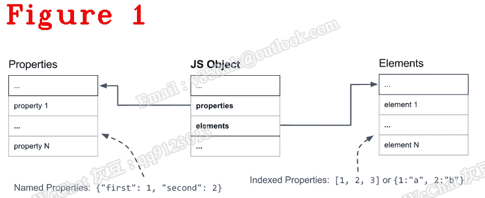
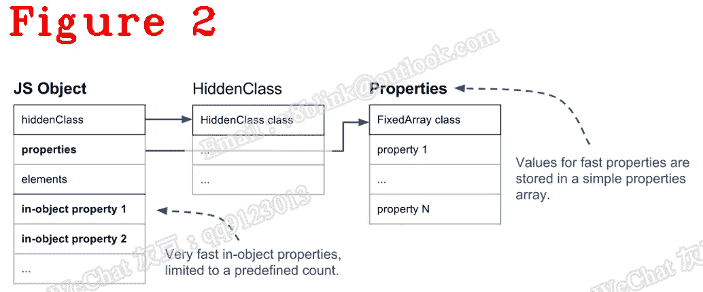
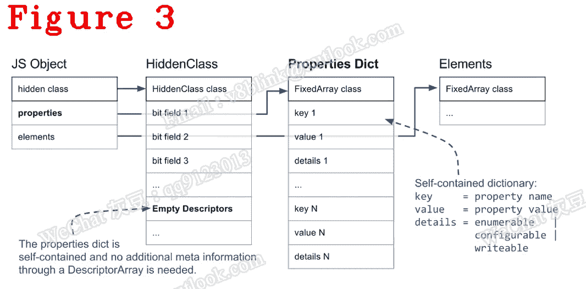
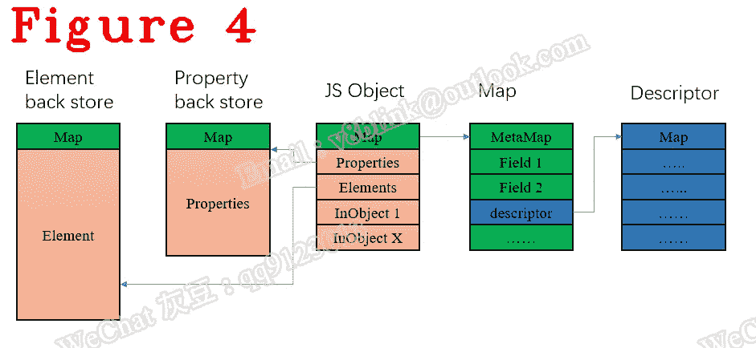
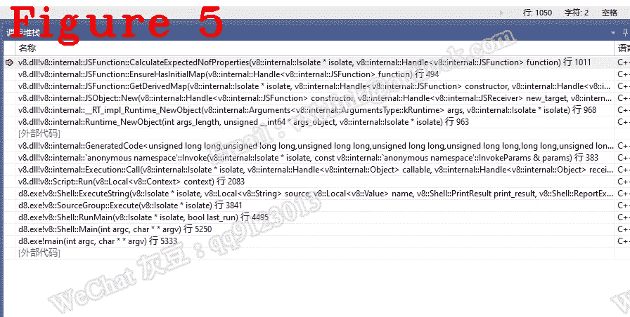

# 我们来了解一下 Chrome V8:V8 是如何实现一个 JavaScript 对象的？

> 原文：<https://javascript.plainenglish.io/lets-understand-chrome-v8-how-does-v8-implement-a-javascript-object-ddde32120bb5?source=collection_archive---------7----------------------->

## 《让我们了解 Chrome V8: JavaScript 对象内存布局和新方法》第 17 章。

*欢迎阅读* [*其他章节让我们来了解一下 Chrome V8*](https://medium.com/@huidou)

我们知道 JavaScript 对象是一组属性和元素。出于性能和内存的原因，V8 设计了几种不同的属性表示，如 in-object、slow property 和 self-dict。在本章中，让我们更深入地研究 JavaScript 对象。

# **1。JavaScript 对象布局**

下图 1 显示了一个基本的 JavaScript 对象在内存中的样子。

元素和属性存储在两个独立的数据结构中，这使得对于不同的使用模式，添加和访问属性或元素更加有效。

元素主要用于各种 *Array.prototype* 方法，比如 pop 或者 slice。考虑到这些函数在连续的范围内访问属性，V8 也在内部将它们表示为简单的数组——大多数时候。

命名属性以类似的方式存储在单独的数组中。然而，与元素不同，我们不能简单地使用键来推断它们在属性数组中的位置；我们需要一些额外的元数据。在 V8 中，每个 JavaScript 对象都有一个关联的 HiddenClass。HiddenClass 存储关于对象形状的信息，以及从属性名到属性索引的映射，更多细节在第 14 章中。

在图 2 中，有元素、属性和对象内属性。与元素或属性不同，对象内属性存储在对象本身中，这意味着您可以直接访问它们而无需 map。在创建 JavaScript 对象时分配对象内的数量。(不同 V8 版本中的数量可能不同)

在图 3 中，有三种不同的命名属性类型:对象内、快速和慢速/字典。

**(1)** 对象内属性直接存储在对象本身，并提供最快的访问。

**(2)** 快速属性存在于属性存储中，所有元信息存储在 HiddenClass 上的描述符数组中。

**(3)** 慢速属性存在于一个自包含的属性字典中，元信息不再通过 HiddenClass 共享。

图 4 显示了 JavaScript 对象内存布局。

所有 V8 托管堆对象必须有一个存储在第一个地址的映射指针。当然，也有元素和属性。描述符是地图的重要成员，负责描述一个物体的属性，这个我们以后会讲到。

在下面的例子中，sayname 是一个等于 console.log 的函数。

我们来思考另一个问题:一个对象的函数存储在哪里？也就是说，sayname 在哪里？

第一部分是 JavaScript 代码，最后是相应的字节码。

第 19–21 行使用 person 对象构造一个名为 worker 的实例。

第 23 行加载名称为 sayname 的属性。

你明白第 23 行吗？它告诉我们，sayname 只是一个属性，与它的类型无关。如果再深入一点，您会发现控制台和日志也是属性。

因此，在 JavaScript 对象中，所有函数都被视为属性。

# **2。新的 JavaScript 对象**

为了调试上述情况，我们将单步执行以下代码:

RUNTIME _ FUNCTION(RUNTIME _ new object)是我们在上一章提到的一个宏。它调用 JSObject::New()来创建一个新对象。JSObject::New()调用 JSFunction::GetDerivedMap()来分配新的映射。

在 JSFunction::GetDerivedMap()中，将调用以下函数。

第 7 行返回构造函数期望的属性数量。

第 26 到 30 行生成原型，关键字 function 是一个构造函数。在我们的例子中，函数是 person，原型为 null，因为 person 是第一次执行，所以执行第 29 行。

生成的原型被绑定到构造函数，并由所有实例共享，这就是 V8 实现的原型原则。

下面是第 7 行调用的 CalculateExpectedNofProperties。

第 28 行，MaxInObject 是对象内的最大数量，超出的属性存储在属性列表中。图 5 显示了调用栈。

# **参考文献**

[V8 中的快速属性](https://v8.dev/blog/fast-properties)

*好了，这部分就到此为止了。下次再见，保重！*

我的博客是 cncyclops.com。如果你有任何问题，请联系我。

**微信** : qq9123013 **邮箱**:v8blink@outlook.com

*更多内容请看*[***plain English . io***](https://plainenglish.io/)*。报名参加我们的* [***免费周报***](http://newsletter.plainenglish.io/) *。关注我们关于*[***Twitter***](https://twitter.com/inPlainEngHQ)[***LinkedIn***](https://www.linkedin.com/company/inplainenglish/)*，以及* [***不和***](https://discord.gg/GtDtUAvyhW) *。*