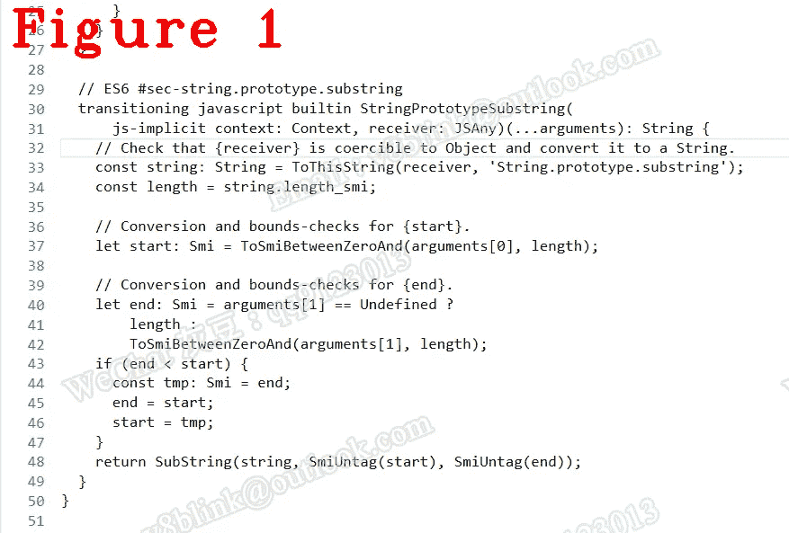

# 先来了解一下 Chrome V8:揭秘 V8 如何实现 JS API

> 原文：<https://javascript.plainenglish.io/lets-understand-chrome-v8-reveal-how-v8-implements-js-api-21f3a4bed1a2?source=collection_archive---------5----------------------->

## 第 28 章:子串的基础

*欢迎阅读* [*其他章节让我们来了解一下 Chrome V8*](https://medium.com/@huidou)

我们知道 V8 是 JavaScript 引擎，它为您和您的 JavaScript 代码支持 string.substring()之类的 API。你想知道 API 是如何实现的吗？让我向您介绍一下 V8 中的 string.substring()源代码，让您了解一下它是如何工作的。有两种子串模式，一种是 CSA 实现的子串，另一种是运行时子串。运行时子串是用相对更容易阅读的 C++编写的，所以我们只讨论 CSA 子串。

# **CSA 子串**

在开始之前，让我们回顾一下 Torque，它是一种 V8 特有的领域特定语言，被翻译成 CodeStubAssembler。所以使用 Torque 实现子字符串，然后翻译成 CSA 代码，在构建 V8 源代码时，该代码将被编译成 V8。我想给你们看的源代码是 CSA 代码，它是 C++代码，从 Torque 转换而来。如果你想知道子串的扭矩代码，可以在 string-substring.tq 文件中找到。

让我们看看代码:

在上面的代码中，第 3 行告诉我们这个代码来自于 string-substring.tq，换句话说，上面的代码是从 string-substring.tq 翻译过来的。

第 5 行将这个对象*转换成一个字符串。我们来看一个例子是*“让我们来了解一下 Chrome V8”。子串(1，4)* ，在这个上下文中，*这个对象*就是*“让我们来理解 Chrome V8”*。无论这个*类型是什么，第一步总是把它转换成字符串。我不会一行一行地解释，因为这段代码是 C++的，相对简单。让我们看看第 51 行，它的功能是将一个字符串切片，取出一个子串，我稍后会谈到。

图 1 显示了子字符串 Torque 代码。

下面说一些扭矩关键词，让你更容易读懂扭矩。

*   ca_。Goto()与 Goto 相同，它的第一个参数是一个将要。

*   ca_。Bind()和 C 语言中设置标签是一样的，Goto()和 Brand()都使用。

*   ca_。Branch()与 if-else 相同，需要两个标签参数。

下面是我在上面第 51 行提到的子串代码。

在上面的代码中，第 9 行 GtoIf()计算子字符串长度，如果长度< 13，则转到下一个标签，即第 8 行；

第 9 行计算字符串是单字节字符串还是双字节字符串；

第 17–23 行，它分配了一个一字节的字符串，我稍后会讲到；

第 24–30 行，它分配一个两字节的字符串；

第 40–49 行，它作用于不是 V8 堆对象的外部字符串；

第 53–58 行，如果子串长度为 1，它将调用 StringCharCodeAt 返回您需要的结果。你知道 StringCharCodeAt 也是 JS API

第 60–70 行，如果字符串类型是外部的，使用 Runtime_StringSubstring 计算结果；

**注意**:看第 9、31、34 行，如果你的子串长度小于 SlicedString::kMinLength 在 my V8 中是 13，结果是一个新对象。相反，结果是通过 from-pointer 和 to-pointer 对原始对象的引用。

让我们看看 AllocateSlicedOneByteString 代码。

执行上面的代码意味着子字符串是一个单字节字符串，长度大于 13。第 13 行为 substring 对象分配内存；第 16–24 行设置子串长度、起始指针和终止指针。这意味着结果是对原始对象的引用，在我们的例子中是*“让我们理解 Chrome V8”*。

记住 sub.length > 13 表示对原始对象的引用。反之，则是新的对象。

*好了，这部分就到此为止了。下次再见，保重！*

如果你有任何问题，请联系我。**微信** : qq9123013 **邮箱**:[v8blink@outlook.com](mailto:v8blink@outlook.com)

*更多内容看* [***说白了。报名参加我们的***](https://plainenglish.io/) **[***免费周报***](http://newsletter.plainenglish.io/) *。关注我们关于*[***Twitter***](https://twitter.com/inPlainEngHQ)，[***LinkedIn***](https://www.linkedin.com/company/inplainenglish/)*，*[***YouTube***](https://www.youtube.com/channel/UCtipWUghju290NWcn8jhyAw)*，以及* [***不和***](https://discord.gg/GtDtUAvyhW) *。对增长黑客感兴趣？检查出* [***电路***](https://circuit.ooo/) *。***