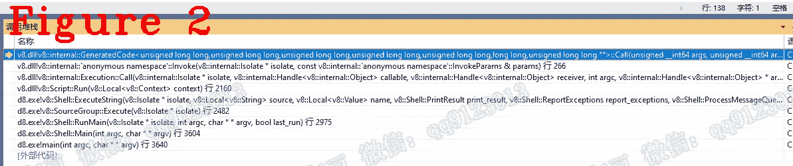

# 让我们来理解 Chrome V8:理解字节码以及如何调试它

> 原文：<https://javascript.plainenglish.io/lets-understand-chrome-v8-understanding-bytecode-and-how-to-debug-it-2e470db67ba5?source=collection_archive---------11----------------------->

## 先来了解一下 Chrome V8(第 18 章):字节码的细节。

*欢迎阅读* [*其他章节让我们来了解一下 Chrome V8*](https://medium.com/@huidou)

字节码是用 CodeStubAssembler (CSA)实现的，可以粗略地看作一个程序集。字节码在 V8 启动时以反序列化的方式加载，没有符号表。所以我想告诉你:CAS 在静态分析中是晦涩难懂的。而且，我们在调试中无法得到字节码的源代码。本文将讨论如何在汇编级别调试字节码，并查看其执行细节。

图 1 显示了字节码的解释器。该图对于 JavaScript 开发人员来说已经足够详细了。但是对于 V8 学习者来说，图 1 缺少很多细节，例如:点火启动、加载字节码和分派。让我们调试字节码来深入了解这些细节。

# **1。准备工作**

**注:**在调试之前，你最好了解一下栈帧，字节码和寄存器的编码，[看这里](https://medium.com/@huidou/lets-understand-chrome-v8-chapter-7-stack-frame-bb3fa3b7ad5)。

下面是调试前的最后一个 C++函数 Invoke。

第 14 到 23 行初始化将要执行的 JSFunction，也就是您的 JavaScript 代码。以下是你应该记住的五个重要成员。这些成员可以帮助您在调试中定位您的位置。它们在一个调试上下文中是不变，但是在不同的调试中是不同的。

**(1)** 第 7 行，*代码*，是 Builtin::JSEntry 指针，现在值是 1FA 0E06 ED30(在我的调试上下文中)。

**(2)** 第 18 行， *stub_entry* ，是点火的入口。下面是从 Builtin::JSEntry 获取 stub_entry 的函数。

条目是 1FA 1326 1840。

**(3)** Line21， *func* ，它是 JSFunction 的地址，也就是你的 JavaScript 代码。值为 16 2BD8 15A9。

**(4)**Builtin::InterpreterEntryTrampoline 的地址是 52 61C0 8A41。

**(5)**dispatch _ table 为 1FA 0E08 CFB0。

图 2 是进入字节码的调用栈。

# **2。调试字节码**

让我们从进入 stub_entry 开始调试字节码。调用()。很抱歉，我不能一行一行地解释，因为汇编代码没有上下文。我认为最好的方法是给出点火执行过程中的重要状态。

在图 3 中，寄存器 RCX 是 1FA 1326 1840(stub_entry)。我提到过，stub_entry 是点火的入口。

在图 4 中，寄存器 RBX 是 1FA0E068A00，这是 stub_entry 的第一个参数。调用()，即 isolate-> isolate _ data()-> isolate _ root()。

图 5 是移动 R8 和调用 RSI。寄存器 R8 是 func，RSI 是 stub_entry，下面是 stub_entry 指向的函数。

在第 12 到 37 行中，我们可以看到它们与图 6 中的汇编代码相同。实际上，Generate_JSEntryVariant 正在执行。Builtin:JSEntry 负责按 std::call 标准组织参数。稍后，函数 Builtin::InterpreterEntryTrampoline 将使用这些参数。

builtin::InterpreterEntryTrampoline 在 dispatch_table 中查找以找到目标字节码并调用它，如图 7 所示。

让我们更深入地研究一下调度，参见图 7。

*   标记 1:机器寄存器 R15 是 dispatch_table。
*   mark 2:计算目标字节码地址，也就是 dispatch_table +字节码的编码。
*   mark 3:调用目标字节码。

在我的例子中，目标字节码是 LdaConstant。

当 LdaConstant 退出时，在 dispatch_table 中查找下一个字节码，如图 8 所示。

在汇编级别，我们可以看到点火启动和字节码执行，这可以帮助我们更好地理解 V8 解释器。

好了，这部分就到此为止了。下次再见，保重！

如果你有任何问题，请联系我。**微信** : qq9123013 **邮箱**:[v8blink@outlook.com](mailto:v8blink@outlook.com)

*更多内容看* [***说白了。报名参加我们的***](https://plainenglish.io/) **[***免费周报***](http://newsletter.plainenglish.io/) *。关注我们关于* [***推特***](https://twitter.com/inPlainEngHQ) ，[***LinkedIn***](https://www.linkedin.com/company/inplainenglish/)*，*[***YouTube***](https://www.youtube.com/channel/UCtipWUghju290NWcn8jhyAw)*，以及* [***不和***](https://discord.gg/GtDtUAvyhW) *。***