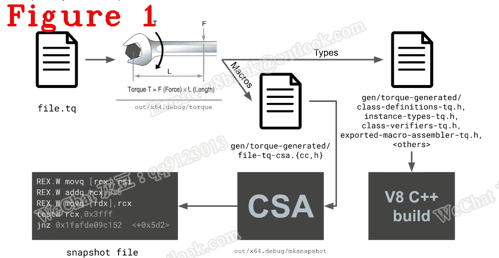
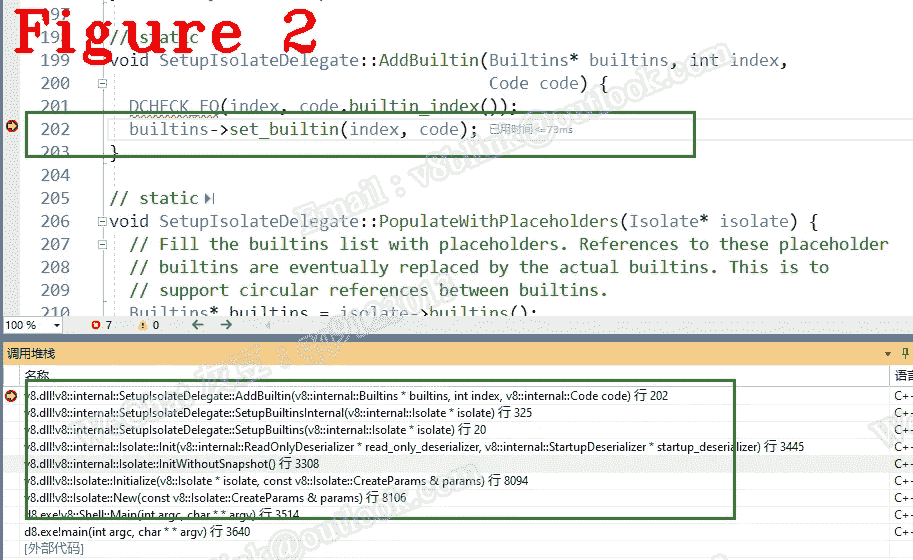
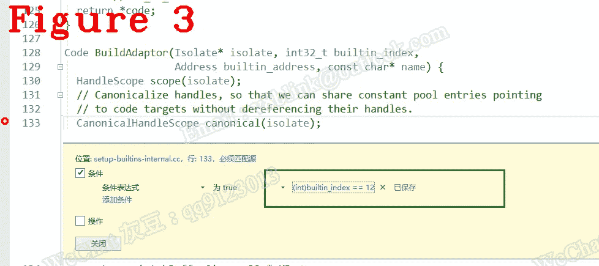
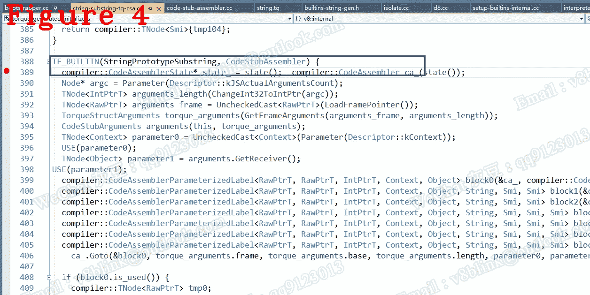

# 让我们来理解 Chrome V8:这里的内置是什么？

> 原文：<https://javascript.plainenglish.io/lets-understand-chrome-v8-what-is-the-builtin-at-play-here-35ccb791702d?source=collection_archive---------8----------------------->

## 第 25 章:内置的基本原理

*欢迎阅读* [*其他章节让我们来了解一下 Chrome V8*](https://medium.com/@huidou)

在第 9 章中，我谈到了内置功能，并展示了一些关于它们如何工作的细节。今天，没有更多的细节，我继续高层次的概念，什么是内置的，它在这里起什么作用。

在 V8 中，builtin 的全名是内置函数，它们负责实现大多数东西，如 ECMAScript API、运行时、点火等等。你知道大部分代码是用 CPP 编写的，少量对性能敏感的代码是用 ASM 编写的，那么 builtin 和 CPP 有什么区别呢？

在我的理解中，我更喜欢称内置为语法糖，它使得开发 V8 更方便。内置有其不同于 CPP 或 ASM 的模式和习惯用法，但遗憾的是，关于 v8.dev 的描述文档非常少。关于 builtin 写代码，具体来说，用 CodeStubAssembler 或者 Torque 写代码不在本章讨论范围内，有兴趣的可以给我发邮件。

# **1。简介**

内置功能使用五种不同的方法实现，每种方法针对不同的权衡进行调整:

**(1)** JavaScript:简洁可读的代码，可以访问快速的内部函数，但频繁使用慢速运行时调用，通过类型污染受到不可预测的性能影响，以及围绕(复杂且不明显)JS 语义的微妙问题。Javascript 内建程序已被弃用，不应再添加。

**(2)** C++:风格与运行时函数非常相似，可以访问 V8 强大的运行时功能，但通常不适合性能敏感的领域。

**(3)** V8 Torque:是一种 V8 特有的领域特定语言，翻译成 CodeStubAssembler。因此，它在 CodeStubAssembler 的基础上进行扩展，提供静态类型以及可读性和表达性的语法。

**(4)** CodeStubAssembler:提供高效的低级功能，非常接近汇编语言，同时保持平台无关性和可读性。

**(5)** 依赖平台的汇编语言:可以很高效，但是需要手动移植到所有平台，维护起来比较困难。

Torque 是 V8 引入的最后一个新模式，用来取代 CSA 来设计内置，因为 Torque 的平台无关特性使内置实现比 CSA 更容易，同时具有与 CAS 相同的性能。

从 1 到 5，越来越难用但性能越来越高。

图 1 显示了扭矩构建过程。简言之，Torque 编译器翻译源代码文件(后缀是。tq)到 XX.cc 和 XX.h，然后将 XX.cc 编译成可执行代码，写入 snapshot.bin

# **2。内置设置**

我认为 C++内置、CSA 和 Torque 是最重要的，因为它们实现了大多数功能，例如，点火是使用 CSA 实现的，所有运行时都使用 C++内置，大多数 ECMAScript APIs 都使用 Torque。让我们再多看看这三种类型的内置。

在上面的代码中，第 8 行，setupbuildins()从 snapshot.bin 加载内置代码。建议多关注 SetupBuiltinsInternal，看看评论。以下是我总结的关于 SetupBuiltinsInternal 的重要内容。

*   建造 TFJ，建造 TFC，建造 TFS，建造 TFH，建造 BCH 和建造美国

*   宏 BUILTIN_LIST 定义了所有内置:

展开 BUILTIN_LIST 和 BUILTIN_LIST_FROM_TORQUE，您将获得所有内置的全名。例如，我们可以通过展开第 9–31 行来获得与 string 相关的 ECMAScript APIs。

*   BUILD_CPP、BUITLD_TFJ 等，这七个宏模板完成了完整的内置初始化。

在上面的代码中，代码是一个 HeapOjbect 指针，临时保存 BuildAdaptor(代码如下)构建的内置地址。第 5 行，AddBuiltin 将内置地址的代码添加到内置数组中。

在上面的代码中，Generate_Adaptor 和 CodeBuilder 一起创建内建程序。现在，内置设置完成。

图 2 显示了内置的设置调用堆栈。

如何调试内置设置？我的方法是扩展宏 BUILTIN_LIST 以获得我感兴趣的索引号，并设置一个如图 3 所示的条件断点。

当然，如果您知道要调试的代码在哪里，您可以立即在那里设置一个断点，如图 4 所示。我敢打赌，大多数时候你不知道它在哪里，因为在 V8 中有很多很多的文件。我认为我的方法比漫无目的地寻找相对容易。

*好了，这部分就到此为止了。下次再见，保重！*

如果你有任何问题，请联系我。v8blink@outlook.com:[微信 : qq9123013 **邮箱**](mailto:v8blink@outlook.com)

*更多内容请看*[***plain English . io***](https://plainenglish.io/)*。报名参加我们的* [***免费周报***](http://newsletter.plainenglish.io/) *。关注我们关于*[***Twitter***](https://twitter.com/inPlainEngHQ)[***LinkedIn***](https://www.linkedin.com/company/inplainenglish/)*[***YouTube***](https://www.youtube.com/channel/UCtipWUghju290NWcn8jhyAw)*[***不和***](https://discord.gg/GtDtUAvyhW) *。对增长黑客感兴趣？检查* [***电路***](https://circuit.ooo/) *。***