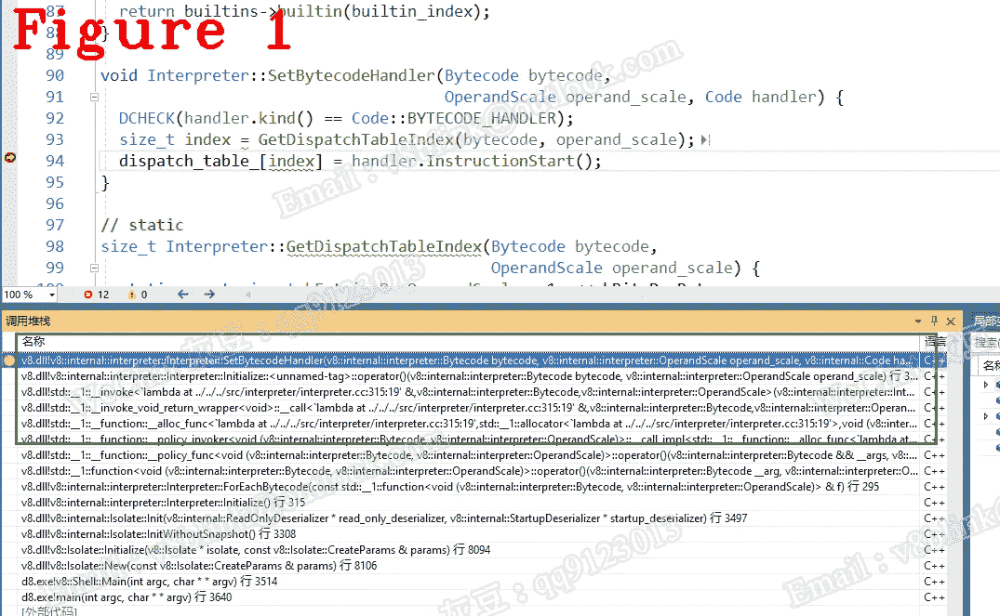
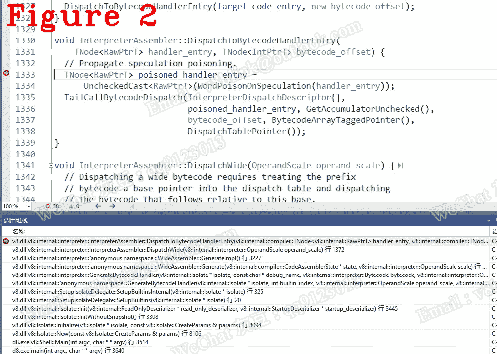

# 让我们来理解 Chrome V8:什么是字节码分派，它是如何工作的

> 原文：<https://javascript.plainenglish.io/lets-understand-chrome-v8-what-is-the-bytecode-dispatch-and-how-does-it-work-44fdac77c42a?source=collection_archive---------6----------------------->

## 第 27 章:字节码分派的基础

*欢迎阅读* [*其他章节让我们来了解一下 Chrome V8*](https://medium.com/@huidou)

# **1。简介**

我们知道一个 SharedFunction 可能不只有一个字节码，而是有很多很多字节码。如何管理这些字节码？V8 使用一个称为字节码数组的数组来管理字节码。解析器生成的字节码顺序存储在字节码数组中，字节码数组是 SharedFunction 的重要成员。当点火执行时，它将从数组中逐个取出字节码。让我们想一想，我们得到了一个字节码，但是如何得到相应的处理程序呢？你认为它应该有一个数组来匹配字节码和处理程序吗？是的，它就是我们称之为 dispatch_table 的数组。

实际上，字节码是一个枚举，dispach_table 使用枚举作为索引来存储相应的处理程序。我打赌你已经猜到字节码是如何连续工作的了。当一个字节码退出时，它会从字节码数组中取出目标字节码即下一个字节码，然后用该字节码作为索引得到一个处理程序地址，最后跳转到该地址，所有这些都打包成一个函数 DISPATCH()。因此 DISPATCH()使字节码一个接一个地正确执行，它充当程序计数器(称为 PC ),在其中分派到下一条指令。

# **2。字节码数组**

下面的代码是 BytecodeArray。

有两个重要的成员:

*   第 3 行，SizeFor(int length)计算字节码数组的内存大小，这在构建 SharedFunction 时经常使用。
*   第 8 行，GetFirstBytecodeAddress()获取第一个字节码地址，当解析器将字节码放入字节码数组时，通常会用到这个地址。

现在，我将演示如何读取一个字节码数组，这就是下面几行中数字的含义。

上面的代码是一个字节码数组。让我们看看第 2 行，其中数字 12 是字节码 enum 代码,[0]是 LdaConstant 需要的参数。用数字 12，可以得到对应的处理程序，dispatch_[0x12]是 LdaConstant 处理程序，下面的代码是字节码 enum 类。

[0]是常量池索引，因此 LdaConstant 参数是 constant_pool[0]，即*0x 005 EAE 402 f 59<String[# 22]:ignore case 我们开始！>* 在此上下文中。

# **3。调度**

在上面的代码中，第 25 行将字节码及其处理程序存储到调度数组中，参见下面的代码。

在上面的代码中，第 25 行将字节码及其处理程序存储到调度数组中，参见下面的代码。

见第 5 行，就是我说的 dispatch_table_ array。第 5 行计算字节码的索引，索引与字节码枚举值相同。图 1 显示了 SetBytecodeHandler 的调用栈。

参见下面的代码解释器。我想演示一下如何在你调试 V8 的时候手动获取 dispatch_table_ 的方法。

在上面的代码中，通过第 11 行，我们知道 dispatch_table 是解释器的成员，而解释器是 Isolate 的成员，参见下面的代码。

因此，您可以使用公式*Isolate->interpreter _->dispatch_table_*来获得 dispatch _ table _。

在这里，我展示了 dispatch()，您可以通过下面的代码更准确地理解 Dispatch 是如何工作的。

简言之，第 5 行计算目标字节码偏移量；第 17 行获取相应的处理程序，第 27 行分派给目标；第 34–41 行生成一个节点并将其添加到当前基本块的尾部，详见节点的*海。图 2 显示了调度的调用栈。*

# **带走**

*   字节码枚举值是相应处理程序的索引；
*   使用公式*Isolate->interpreter _->dispatch _ table _*得到 dispatch _ table；
*   InV8，解释器使用机器寄存器维护 idspatch_table_ 表。

*好了，这部分就到此为止了。下次再见，保重！*

如果你有任何问题，请联系我。**微信** : qq9123013 **邮箱**:[v8blink@outlook.com](mailto:v8blink@outlook.com)

*更多内容请看*[***plain English . io***](https://plainenglish.io/)*。报名参加我们的* [***免费周报***](http://newsletter.plainenglish.io/) *。关注我们关于*[***Twitter***](https://twitter.com/inPlainEngHQ)[***LinkedIn***](https://www.linkedin.com/company/inplainenglish/)*[***YouTube***](https://www.youtube.com/channel/UCtipWUghju290NWcn8jhyAw)*[***不和***](https://discord.gg/GtDtUAvyhW) *。对增长黑客感兴趣？检查* [***电路***](https://circuit.ooo/) *。***