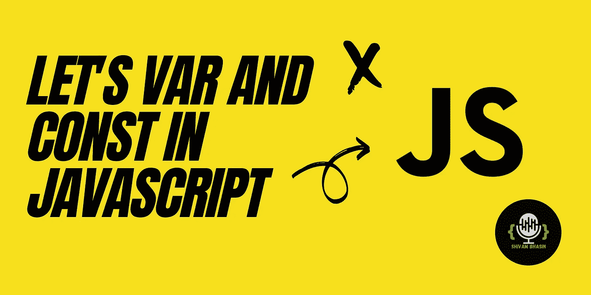
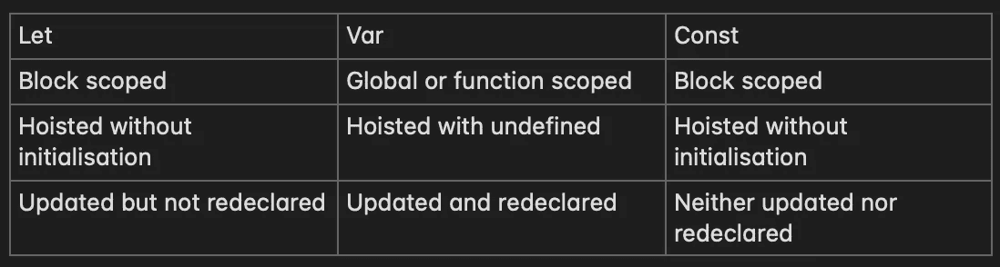

# JavaScript 关键字深度:关于“let”、“var”和“const”的综合指南

> 原文：<https://javascript.plainenglish.io/lets-var-and-const-in-javascript-4e0319dbf463?source=collection_archive---------9----------------------->

## 探索三个最容易混淆的关键词——‘T0’，‘T1’和‘T2’，以及它们的范围和提升行为。



在过去几年中，像 React、Angular 和 Vue.js 这样的 JavaScript 框架的流行吸引了许多 web 开发人员向它们转移。虽然它们没有问题，但让我担心的一件事是，我看到有些人完全忽略了普通 JavaScript 的概念，仍然可以很好地使用框架。

当我看到一些奇怪的事情时，我正在为我的组织面试 React Developer。我注意到有两年多 React 经验并对其有很好理解的人不知道 JavaScript 的基础知识，甚至不知道 let、var 和 const 之间的区别。我得到的一个有趣的回答是`let`只是`var`的新版本。

接下来，让我们讨论三个关键词— `let`、`var`和`const`它们的范围，以及它们的提升行为。

# 定义变量

在 ES6 之前，var 一切都很好，但是用`var`关键字声明的变量有问题。我们先来了解一下 var 是如何表现的。

## 范围

用 var 声明的变量在函数外部声明时是全局作用域的，在函数内部声明时是函数或块作用域的。参见下面的代码。

```
var iAmGlobal = 'global scoped';function func() {
  var iAmBlock = 'bloack scoped';
}console.log(iAmBlock); // **error: iAmBlock is not defined**
```

在上面的例子中，变量`iAmGlobal`是全局声明的，可以在代码中的任何地方使用，甚至可以在函数`func`中使用，但是`iAmBlock`的作用域只在函数`func`中。所以当我们试图在函数外访问`iAmBlock`时，JavaScript 抛出一个错误，说它没有被定义。

## 提升

在执行代码之前，使用 var 声明的所有变量都被提升到其作用域的顶部。在函数的情况下，整个函数体被提升。参见下面的代码。

```
console.log(a); // undefined
func(); // 'this function can execute even before declaration'var a = 10;
var func = function () {
  console.log('this function can execute even before declaration');
};
```

在上面的例子中，变量`a`和`func`都是托管的，因此在声明之前就可以使用。然而，在`a`的情况下，其提升值未定义。

在从 ES6 引入的`let`和`const`开始之前，最好先了解一下`var`的问题。

## 风险值的问题

`var`的问题是变量可以被重新声明，这导致了代码的混乱。参见下面的示例。

```
var mesg = 'I am this message';// many lines aftervar mesg = 'I am updated to this';console.log(mesg); // **'I am updated to this'**
```

虽然如果我们知道我们在做什么，这不是问题，但是在现实世界中，许多开发人员处理同一个项目，有时处理同一个文件，这可能导致代码中的不一致。考虑到这一点，引入了`let`和`const`。

# 让

`let`解决了我们刚刚讨论过的问题。使用`let`初始化的变量可以在其作用域内更新，但不能重新声明。

## 范围

`let`是块范围的，这意味着任何被声明的变量只能在它被初始化的块内部被访问。参见下面的代码。

```
if(true){
   let mesg = 'I am inside the if block only';
   console.log(mesg); // **I am inside the if block only** }
console.log(mesg); // **error: mesg is not defined**
```

在上面的例子中，变量`mesg`是在`if`块中声明的，因此当在外部访问时，它将抛出一个错误。

## 提升

用`let`声明的变量也在执行前被提升到代码的顶部，但没有初始化。因此，如果我们试图在它们声明之前访问它们，我们将得到一个引用错误。参见下面的代码。

```
console.lot(mesg); // **error: mesg is not defined**
let mesg = 'You can't access me before this line';
```

# 常数

`const`变量类似于`let`变量，但是既不能更新也不能重新声明。因此，它们在整个代码执行过程中保持不变的值。请参见下面的示例。

```
const mesg = 'You can't update me';
mesg = 'This won't work'; // **error: Assignment to constant variable**
```

但是我们可以更新一个`const`对象内部的值。请参见下面的示例。

```
const user = { fname: 'shivam', lname: 'bhasin' };
user.fname = 'updated name'; // **This is allowed and valid**
```

## 范围

就像 let 一样，const 变量也是块范围的。因此可以在它们的声明块中访问它们。

## 主办；主持

同样，与 let 变量类似，const 变量也被提升到顶部，但没有初始化。

如果你错过了什么，这里有一个故事的简短修订。



如果你是一名 JavaScript 开发人员，或者希望有一天成为一名开发人员，我强烈推荐你回来看看这个空间，因为我保证你会爱上 JavaScript。

*更多内容看* [***说白了。报名参加我们的***](http://plainenglish.io/) **[***免费周报***](http://newsletter.plainenglish.io/) *。在我们的* [***社区不和谐***](https://discord.gg/GtDtUAvyhW) *获得独家获取写作机会和建议。***