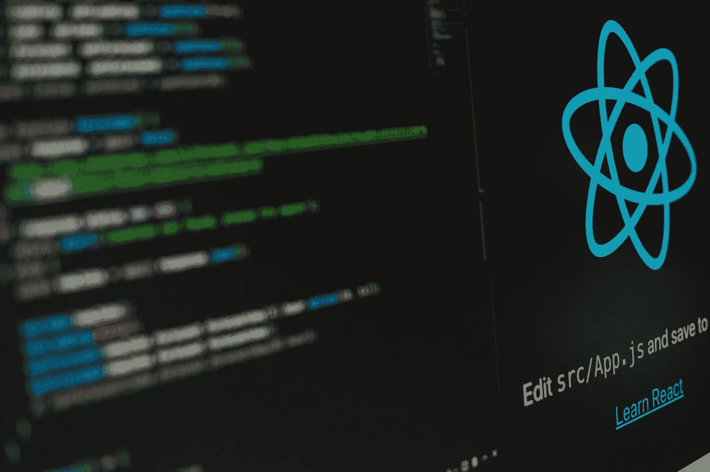

# React 中提升状态还是下推状态？

> 原文：<https://javascript.plainenglish.io/lift-state-up-or-push-state-down-in-react-2b592cc5dbaf?source=collection_archive---------9----------------------->

State management in React

React 中的状态管理并不总是一项简单的任务。React 提供了强大而简单的存储状态的方法，但是随着应用程序的增长，需要仔细考虑数据流。

本文不是关于使用什么状态管理工具，因为 React 本身就是一个强大而充分的状态管理工具，而是关于在 React 应用程序中何处存储状态。

在我描述存储状态的两种主要方法之前，重要的是要问我们自己:我们正在处理什么类型的状态？我们还应该问问自己，React 组件被分配了哪些职责。

描述状态类型的一种简单方式是，关于 UI 的本地信息应该保存在本地状态中，而需要跨组件共享的信息应该被提升。虽然这是真的，但这是 React 应用程序的一个非常简化的版本。

让我们看一个不需要共享状态的例子:

## 1.将状态向下推

假设我们有一个窗口组件，其职责是允许用户输入文本值，然后允许用户通过单击“保存”按钮来保存该值。

该组件可能如下所示:

让我们假设父组件需要这个文本值。第一个立即想到的想法是“让我们提升这个状态，因为这个状态需要被我们的父母分享”。这将是一个有效的解决方案，但在全局公开状态之前，我们应该三思。一般来说，只要不需要公开数据，数据就应该保持封装状态。此外，软件组件不应该太了解其他软件组件的内部实现细节。

在这种情况下，我们实际上不需要提升状态来共享它。我们可以做的是将一个函数作为道具发送给窗口组件，并允许窗口组件用我们感兴趣的值调用我们的函数:

使用这种方法，我们不必提升状态，因为我们可以将一个事件挂接到子组件，并允许组件在某个时间点触发该方法。我喜欢把这种方法理解为“推动”或保持状态下降，而不是提升状态。

## 2.提升状态

根据 React 文档，这是跨组件共享状态的推荐方法。这里，有必要注意一下 React 中的数据流。当你学习 React 时，你首先听到的是 React 中的数据流是单向的。与其他一些框架不同，在这些框架中，数据可以在多个组件之间单向流动，React 通常只允许数据使用所谓的 props 从父组件流向其子组件。这是设计 React 应用程序时要考虑的最重要的事情之一，因为随着应用程序的增长，不正确的数据处理会导致许多架构问题。

为了举例说明这一点，请考虑以下组件:

这是一个组件，根据发送给它的类型呈现不同的用户控件。它目前只支持两种类型:文本输入和复选框。

假设我们创建了另一个组件，该组件应该使用该组件，然后保存该组件的值:

由于 React 中单向数据流的性质，这是不可能的。默认情况下，父组件不能访问子组件的状态。尽管有一些方法可以实现类似的行为，比如使用`useImperativeHandle`钩子，但是这违反了 React 中的自然数据流。

在这种情况下，当前存储在子组件中的状态必须提升一级，以便与其父组件共享该状态:

通过提升状态，数据现在单向流动，子组件从父组件接收状态。

## 提升状态总是理想的吗？

当频繁提升状态时，可能出现的一个问题是，倾向于创建在组件树的上层管理的大块状态。如果有状态逻辑变得很重，这可能是使用 React 中内置的“useReducer”钩子将有状态逻辑移动到 reducer 的原因。`useReducer`钩子的一个用例是，如果需要同时更新多个状态，或者状态包含需要以特定方式处理的复杂数据结构。

如果有状态逻辑在组件之间是重复的，那么它可能是一个定制钩子的有效用例。每个场景都各不相同，但底线是开发人员必须仔细考虑 React 应用程序的整体架构，以避免引入反模式和违反数据流。

感谢阅读！

*更多内容请看*[***plain English . io***](https://plainenglish.io/)*。报名参加我们的* [***免费周报***](http://newsletter.plainenglish.io/) *。关注我们关于*[***Twitter***](https://twitter.com/inPlainEngHQ)*和*[***LinkedIn***](https://www.linkedin.com/company/inplainenglish/)*。查看我们的* [***社区不和谐***](https://discord.gg/GtDtUAvyhW) *加入我们的* [***人才集体***](https://inplainenglish.pallet.com/talent/welcome) *。*