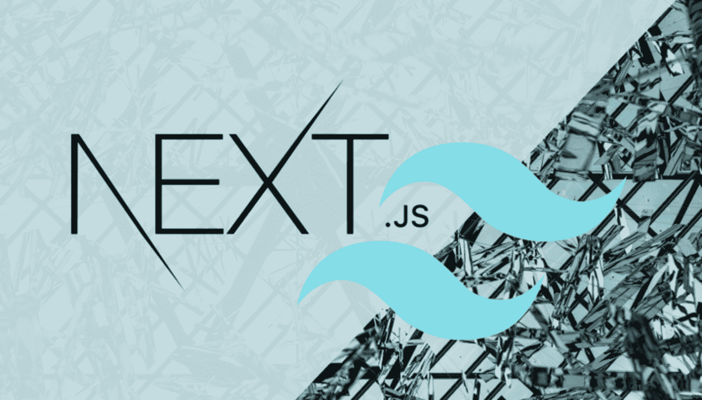

# NEXTJS 中使用 TailwindCSS 的明暗模式

> 原文：<https://javascript.plainenglish.io/light-dark-mode-in-nextjs-using-tailwindcss-2b39ce1d6fac?source=collection_archive---------0----------------------->



你一定遇到过一些支持明暗模式的奇特网站。这是一个非常巧妙的功能，真正增强了你的应用程序。

在本教程中，我们将看到如何使用 NextJS 和 TailwindCSS 实现黑暗模式

但是…

## 什么是 NextJS？

NextJS 是一个开源的 react 框架，由 vercel 开发，支持基于 react 的应用程序，具有诸如服务器端渲染和静态站点生成等功能(您可以从我专门为其解释的这篇文章中了解更多关于后者的信息)。NextJS 还提供了搜索引擎优化的特性，这样你就不用从头开始写了。

## 什么是 TailwindCSS？

Tailwind CSS 是一个实用的 CSS 框架，可以用低级别的 CSS 快速构建高度可定制的用户界面，这很棒，因为它提供了一种简单的方法来实现你的网页设计，并且它只装载网页上正在使用的 CSS，这使得整个应用程序更加轻便高效。

让我们深入主题！

## 注意:本教程已经考虑到我们已经设置了 NextJs 项目并安装了 TailwindCSS。

## 1.让我们安装项目中需要的所有依赖项

```
npm install next-themes react-icons --save
```

I)下一个主题将允许我们实现亮暗模式

ii)反应图标将使我们能够在我们即将创建的组件上使用图标。

## 2.为我们的应用添加黑暗模式支持

在 pages 文件夹中，转到 your _app.js 文件，复制并粘贴以下内容:

```
import '../styles/globals.css';
import { ThemeProvider } from 'next-themes';

function MyApp({ Component, pageProps }) {
  return (
    <ThemeProvider enableSystem={true} attribute="class">
      <Component {...pageProps} />
    </ThemeProvider>
  );
}

export default MyApp;
```

接下来，在您的 *tailwind.config.js* 文件中的内容数组后添加 **darkMode : 'class'** ，如下所示:

```
/** @type {import('tailwindcss').Config} */
module.exports = {
  content: [
    "./app/**/*.{js,ts,jsx,tsx}",
    "./pages/**/*.{js,ts,jsx,tsx}",
    "./components/**/*.{js,ts,jsx,tsx}",
  ],
  darkMode: 'class',
  theme: {
    extend: {},
  },
  plugins: [],
}
```

## 3.创建我们的 ThemeToggler.js 组件

在项目的根目录下创建一个组件文件夹，然后在其中创建一个“ThemeToggler.js”文件，或者根据项目文件配置创建一个“ThemeToggler.js”组件。

这个文件将是负责从亮模式切换到暗模式的组件，反之亦然。

```
import React from 'react'
import { BsFillSunFill, BsFillMoonFill } from "react-icons/bs";
import { useTheme } from 'next-themes';
import { useState, useEffect } from 'react';

export default function ThemeToggler() {
const { theme, setTheme } = useTheme();
const [mounted, setMounted] = useState(false);
useEffect(() => setMounted(true), []);
if (!mounted) return null;

return (

<button className='w-8 h-8 rounded-lg dark:bg-slate-800 flex items-center justify-center border'>
{theme === 'light' ? <BsFillMoonFill onClick={() => {setTheme('dark')}} />: <BsFillSunFill onClick={() => {setTheme('light')}}/> }
</button>
)
}
```

让我们看看它是如何工作的:

*   usetheme 挂钩来自我们之前安装的 next-theme 包。当主题变量为亮时，我们处于亮模式，当主题变量为暗时，我们处于暗模式。
*   因为我们不知道服务器上的`theme`，所以从`useTheme`返回的许多值将是`undefined`，直到被装载到客户机上。这意味着如果你试图在客户端挂载之前基于当前主题渲染 UI，你会看到一个水合不匹配错误。这就是为什么我们在上面的代码中添加了第 8 行到第 10 行的内容(不要担心，你可以在[下一个主题文档](https://www.npmjs.com/package/next-themes)中了解更多)
*   最后，我们使用一个三元运算符来检查当前模式，以便在 UI 上显示正确的按钮

## 4.为黑暗模式添加顺风实用程序类

假设我们想给一个段落文本添加一个实用程序类，这就是我们要做的。

```
<p className="text-slate-800 dark:text-slate-300"
>
Hello my brothers and sisters!
</p>
```

我们可以观察到 *dark* 实用程序类的增加，我们现在将指定段落在切换到深色模式时将采用的颜色(文本白色)

## 5.将 ThemeToggler 组件导入到我们选择的页面

对于这一部分，假设我们有一个简单的 *index.js* 文件，它包含以下内容，只是为了向您展示它是如何工作的

```
import ThemeToggler from '../Components/ThemeToggler'

export default function Home() {
  return (
    <div className="flex justify-center items-center flex-col">
{/* Importing ThemeToggler.js Component}
      <span className='rounded-xl p-4'><ThemeToggler /></span>
      <h1 className=' dark:text-white text-2xl ease-in'>Hello my brothers and sisters!</h1>
      <div className="flex justify-center mt-4">
  <div className="rounded-lg shadow-2xl bg-white max-w-sm dark:bg-slate-800 ease-in">
    <a href="#!" data-mdb-ripple="true" data-mdb-ripple-color="light">
      
    </a>
    <div className="p-6">
      <h5 className="text-gray-900 text-xl font-medium mb-2 dark:text-white ease-in">Dark Mode Tutorial!</h5>
      <p className="text-gray-700 dark:text-gray-300 text-base mb-4">
        Some quick example text to build on the card title and make up the bulk of the card's
        content.
      </p>
      <button type="button" className=" inline-block px-6 py-2.5 bg-blue-600 text-white font-medium text-xs leading-tight uppercase rounded shadow-md hover:bg-blue-700 hover:shadow-lg focus:bg-blue-700 focus:shadow-lg focus:outline-none focus:ring-0 active:bg-blue-800 active:shadow-lg transition duration-150 ease-in-out">Button</button>
    </div>
  </div>
</div>
        </div>
  )
}
```

我们的最终结果:


Final result

如果你撒了谎，请鼓掌并分享这个帖子！；-)

坚持住！🚀


gif from giphy

*更多内容看* [***说白了就是***](https://plainenglish.io/) *。报名参加我们的* [***免费周报***](http://newsletter.plainenglish.io/) *。关注我们关于* [***推特***](https://twitter.com/inPlainEngHQ) ，[***LinkedIn***](https://www.linkedin.com/company/inplainenglish/)*，*[***YouTube***](https://www.youtube.com/channel/UCtipWUghju290NWcn8jhyAw)*，以及* [***不和***](https://discord.gg/GtDtUAvyhW) ***。***

***对缩放您的软件启动感兴趣*** *？检查出* [***电路***](https://circuit.ooo?utm=publication-post-cta) *。*