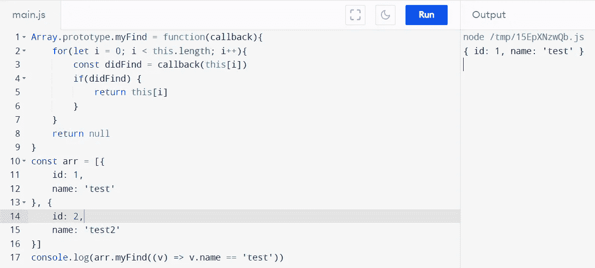
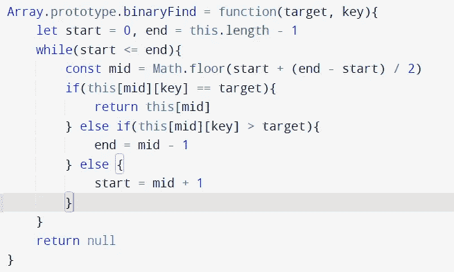

# JavaScript 中的线性、二进制和散列搜索

> 原文：<https://javascript.plainenglish.io/linear-binary-and-hashing-search-in-javascript-908a54ca7658?source=collection_archive---------3----------------------->


Photo by [Ali Hajian](https://unsplash.com/@alisvisuals?utm_source=medium&utm_medium=referral) on [Unsplash](https://unsplash.com?utm_source=medium&utm_medium=referral)

# JavaScript 中的搜索算法

当我们需要从任何数据存储中查找数据时，通常有三种类型的搜索算法。它们是线性搜索、二分搜索法和散列搜索。搜索意味着从数据集中找到一个数据记录，该数据可以是任何地图或项目列表。每种搜索算法都有一定的要求，然后才能使用它，甚至应用到您的程序中:

*   线性搜索—线性搜索需要应用于未排序的数组，查找是基于将每个元素与要搜索的目标进行比较来完成的
*   二分搜索法——如果数组从相同的键或相同的方向排序，二分搜索法是从数组中搜索元素的优化方法
*   哈希——如果我们想在 Hashmap 上搜索，我们将使用哈希算法来存储哈希的键，并直接用值映射它，而不是在数组中搜索。这个算法的时间复杂度是 O(1 ),因为程序已经知道具有相同密钥的值的散列或索引

在这里阅读更多关于搜索算法的信息

## 线性搜索

在 JavaScript 中，我们在数组原型`find`中有一个方法，它使用线性搜索来查找元素。让我们创建 find 的定义来理解这里的线性算法是如何工作的



Example of linear search

下面是线性搜索的例子，我们首先在 Array 上创建了 prototype 方法，并在运行提供的回调方法时迭代所有元素，如果回调成功，则返回完整的对象

这种算法最坏的情况是目标元素在最后一个索引上，使它运行 N 次。所以时间复杂度是 O(N ),其中 N 是数组中的项数

## 二进位检索

接下来是二分搜索法，但是请记住，二分搜索法将只对排序后的数组起作用，所以首先，我们需要确保数组是排序的

## **对象数组注释:**

在 JavaScript 中处理对象数组时，应该使用要搜索的键对数组进行排序。例如，如果您想要在数组的对象中搜索名称作为属性之一，那么数组应该只根据名称字段进行格式化，而不使用对象数组中的任何其他字段

## 算法

在二分搜索法中，由于数组是按照某种顺序排序的，我们可以使用这意味着我们知道应该走哪条路径来搜索目标元素。让我们举个例子来了解更多

```
const arr = [1, 3, 5, 7, 9]
```

正如你所看到的，数组是按照奇数的 ASC 顺序排序的。因此，为了更加慷慨**，我们首先取一个中间元素(你可以取任何数字，但是为了得到最准确的结果，你应该总是取中间元素)**

下一步是比较目标元素和中间元素

```
let start = 0, end = arr.length - 1
const mid = start + ( end - start) / 2
arr[mid] == target
```

> 我们也可以使用 end + start / 2，但是如果数组很大，就会产生内存错误，所以最好使用上面的方法来计算中间的索引

如果我们找到了元素，我们将返回中间的元素，否则我们将检查是否

```
target > arr[mid] - go for mid + 1 indexes
target < arr[mid] - go for mid - 1 indexes
```

现在你将有一个基于上述条件的新数组，然后我们将需要重新执行相同的逻辑，直到数组大小变为 1，我们找到元素

```
0 .. mid
OR
mid .. last-index
```

## 程序

讨论够了，让我们写一些代码来看看我们如何使它工作

我们将使用这个集合来创建程序，并观察数组是否按 score 参数排序，我也想用相同的参数进行搜索

```
const arr = [{
    id: 1,
    score: 8,
    name: 'test'
}, {
    id: 2,
    score: 9,
    name: 'test2'
}, {
    id: 3,
    score: 12,
    name: 'test2'
}, {
    id: 4,
    score: 30,
    name: 'test2'
}, {
    id: 5,
    score: 60,
    name: 'test2'
}]
```



Binary search example

这里，我们维护数组的开始和结束，我们操作开始和结束来创建一个替代数组，同时检查目标是否匹配。

这将是它。你的二分搜索法已经准备好为你服务了。

二分搜索法的时间复杂度为 O(log n)。让我简单介绍一下如何计算它的时间复杂度

## 计算时间复杂度

在计算之前，让我们看看需要对变量运行多少次特定的语句

首先，在 2^n 部分，执行的语句数量正在减少

```
N = 16
N = 8 // we divide array based on middle element
N = 4 // we divide array based on middle element
N = 2 // we divide array based on middle element
N = 1 // we divide array based on middle element
```

现在，让我们设计二分搜索法的公式，因为他们每个人都是 2 的乘数，我们可以很容易地说

```
2^k = N, we would need to find the value of k
```

让我们两边都用圆木

```
Log(2^k) = log(N)
```

我们有一个对数公式

```
log(a^b) = blog(a)
```

所以新的等式是

```
klog(2) = log(N)
k = log(N) // since log(2) is 1
```

这就是你计算二分搜索法时间复杂度的方法。计算时间复杂度本身是一个很大的讨论话题，但是我们用了很小的一部分来展示它是如何实现的

## 散列法

哈希算法非常简洁，只针对 Hashmaps。因为 hashmap 存储数据的模式总是知道条目的键，所以从它开始搜索是一个单一的调用。一个简单的例子是

```
const obj = {
  name: 'test'
}obj.name == 'test' // true
```

哈希的时间复杂度是 O(1 ),因为响应操作不受哈希包含的项数的影响

## 结论

这个主题对于开始算法练习并希望了解如何创建和计算方法的您来说非常具体。

我希望你今天能学到一些好东西。编码快乐！