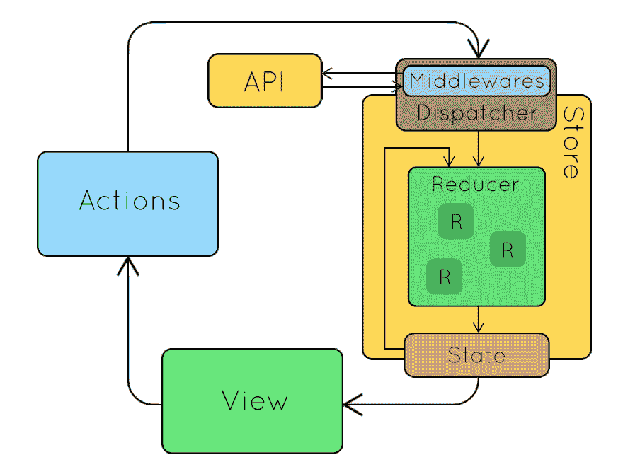

# 本地存储 vs 会话存储 vs Cookies vs Redux 存储

> 原文：<https://javascript.plainenglish.io/local-storage-vs-session-storage-vs-cookies-vs-redux-store-1a933440d57d?source=collection_archive---------2----------------------->

## 了解这些不同种类的存储是什么以及它们是如何工作的。


Photo by [AltumCode](https://unsplash.com/@altumcode?utm_source=medium&utm_medium=referral) on [Unsplash](https://unsplash.com?utm_source=medium&utm_medium=referral)

最近一个朋友问我关于本地存储和会话存储的区别，为了回答这个问题，我做了快速的研究，我写在这里与你分享。

第一步是了解所有这些类型的存储是什么以及它们是如何工作的。

## **什么是本地存储？**

是一个对象，由浏览器用来在内存中存储数据。使用 LocalStorage 对象保存键/值对，以便保存没有过期的数据。

```
// Create
localStorage.setItem('miGato', 'Juan');// Read
var cat = localStorage.getItem('miGato');
```

**什么是会话存储？**

LocalStorage 的主要区别在于，数据会一直保存到会话结束。换句话说，数据会一直保存到您刷新或关闭浏览器。

```
// Create
sessionStorage.setItem('key', 'value');

// Read
var data = sessionStorage.getItem('key');
```

**什么是饼干？**

cookie 是 web 应用程序为了保存数据而发送给浏览器的文本片段，该数据更常用于记住用户的偏好，但也可用于存储会话并允许验证用户。

```
// Create
document.cookie = "username=John Doe";// Read
let x = document.cookie;
```

**redux 店是什么？**

在存储应用程序状态树的对象中，这些数据在同一个标签会话中保存，如果您刷新浏览器的标签，所有状态树都会重新启动，因此之前的所有信息都不再存在于内存中。

在 redux 的情况下，将代码放在这里更复杂，相反，有一个 Redux 流，我可以使用下面的图像来解释。



在未来，我将制作一个完整的教程，介绍 redux 是如何工作的，以及如何在一个 React o angular 项目中实现它。当这一切发生时，我将返回这里并链接教程。

**参考文献**

[](https://redux.js.org/api/store) [## 商店| Redux

### 存储保存了应用程序的整个状态树。改变其内部状态的唯一方法是发送一个…

redux.js.org](https://redux.js.org/api/store) [](https://medium.com/analytics-vidhya/using-local-storage-in-javascript-5cced3fd888d) [## 在 JavaScript 中使用本地存储

### 我们被要求开发一个单页应用程序(SPA)作为我们在新兵训练营的第三个项目。在这个项目中，我们…

medium.com](https://medium.com/analytics-vidhya/using-local-storage-in-javascript-5cced3fd888d) [](https://www.drauta.com/localstorage-y-cookies-diferencias-y-uso) [## 本地存储 y Cookies:差异 y uso

### Cookies:在导航中使用的数据和在会话中创建的持续信息…

www.drauta.com](https://www.drauta.com/localstorage-y-cookies-diferencias-y-uso)  [## Cómo 利用 Google las cookies

### 饼干描述了一个连续的过程，所有的都是如此。Para 管理…

policies.google.com](https://policies.google.com/technologies/cookies?hl=es) 

*更多内容请看*[***plain English . io***](https://plainenglish.io/)*。报名参加我们的* [***免费周报***](http://newsletter.plainenglish.io/) *。关注我们关于*[***Twitter***](https://twitter.com/inPlainEngHQ)*和**[***LinkedIn***](https://www.linkedin.com/company/inplainenglish/)*。查看我们的* [***社区不和谐***](https://discord.gg/GtDtUAvyhW) *加入我们的* [***人才集体***](https://inplainenglish.pallet.com/talent/welcome) *。**