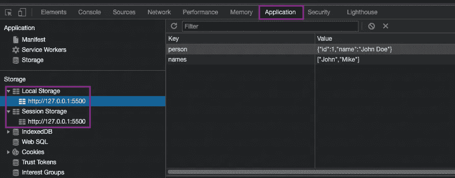

# JavaScript 中的本地存储与会话存储——综合指南

> 原文：<https://javascript.plainenglish.io/local-storagevs-session-storage-in-javascript-a-comprehensive-guide-df887398e69?source=collection_archive---------9----------------------->

## JavaScript 中的 Web 存储 API


Photo by: [**Boitumelo Phetla**](https://unsplash.com/@writecodenow)on [unsplash](https://unsplash.com/)

大多数 web 应用程序需要在用户的浏览器中存储一些数据。这些数据可能包括用户偏好，如网站颜色主题、深色或浅色模式，以及来自服务器的静态数据。web 应用程序将使用这些数据来正常运行。在 web 浏览器中拥有安全的数据保存机制至关重要。

*[***Web 存储 API***](https://developer.mozilla.org/en-US/docs/Web/API/Web_Storage_API) *提供了安全机制，通过这些机制，浏览器可以存储键/值对，这比使用*[*cookie*](https://developer.mozilla.org/en-US/docs/Glossary/Cookie)*要直观得多。**

*在 HTML5 之前，应用程序数据必须存储在[cookie](https://developer.mozilla.org/en-US/docs/Glossary/Cookie)中，包含在每个服务器请求中。与 cookies 不同，存储限制要大得多(至少 5MB ),并且信息永远不会传输到服务器。Web 存储是基于源的(基于域和协议)。来自同一个源的所有页面可以存储和访问相同的数据。*

*所有主流浏览器都支持 Web 存储 API。以下是支持 Web 存储 API 的最低浏览器版本:*

*   *谷歌浏览器:4*
*   *火狐浏览器:3.5*
*   *边缘:12*
*   *Safari: 4*
*   *歌剧:10.5*

*Web 存储 API 提供了两个用于在客户端浏览器中保存数据的对象。*

1.  *`window.localStorage`*
2.  *`window.sessionStorage`*

*在浏览器中使用网络存储之前，我们可以按如下方式检查`localStorage`和`sessionStorage`的浏览器兼容性。*

```
*if (typeof Storage !== 'undefined') {
   *// Support Web Storage API* } else {
   *// No support* }*
```

## *局部存储器*

*`localStorage`对象允许在客户端的浏览器中存储数据，并且没有截止日期。这意味着当浏览器关闭时，数据不会被删除，并且可用于将来的会话。*

## *会话存储*

*`sessionStorage` object 允许在客户端浏览器中存储一个会话的数据。当浏览器窗口关闭时，数据被删除。*

*`localStorage`和`sessionStorage`都提供了五种处理存储数据的方法。*

1.  *`setItem()`*
2.  *`getItem()`*
3.  *`removeItem()`*
4.  *`clear()`*
5.  *`key()`*

*所有数据将以字符串形式保存到存储器中。如果我们正在保存`Arrays`，`Objects`..等等，这些数据在保存到存储器之前应该被转换成字符串。*

## *将数据保存到存储器*

*可以使用`setItem()`方法将数据保存到存储器中。`setItem()` 方法接受参数:一个键和一个值。稍后可以引用该键来检索附加到它的值。*

```
*const age = 30;
const person = {
  id: 1,
  name: 'John Doe',
};
const names = ['John', 'Mike'];sessionStorage.setItem('age', age);
localStorage.setItem('person', JSON.stringify(person));
localStorage.setItem('names', JSON.stringify(names));*
```

*您可以使用浏览器的开发工具查看存储的数据，如下所示:*

**

## *从存储器中检索数据*

*可以使用`getItem()`方法从存储器中检索存储的数据。方法接受一个参数:一个键和与该键相关的值将被返回。*

*使用`person`键检索我们在上面的代码示例中保存的`person`对象。*

```
*localStorage.getItem('person');
// "{"id":1,"name":"John Doe"}"*
```

*由于检索的数据是一个字符串，我们需要在访问`person`对象的属性之前将它传递给一个`JSON`对象。*

```
*const result = localStorage.getItem('person');
const person = JSON.parse(result);
console.log(person.name); // John Doe*
```

## *从存储中删除数据*

*使用`removeItem()`方法可以删除存储的数据。`removeItem()`方法接受一个参数:一个键和与该键相关联的值将从存储中删除(如果存在的话)。如果没有任何项目与给定的键相关联，此方法将不执行任何操作。*

*从`sessionStorage`上取下`age`，从`localStorage`上取下`person`，步骤如下。*

```
*sessionStorage.removeItem('age');
localStorage.removeItem('person');*
```

## *从存储器中删除所有数据*

*使用`clear()`方法可以删除所有存储的数据。调用此方法时，会清除该域的所有记录的整个存储。它不接收任何参数。*

```
*sessionStorage.clear();
localStorage.clear();*
```

## *获取存储对象中特定位置的键的名称*

*`key()`方法允许获取一个键的名称。`key()`方法接受一个参数:number，它是存储对象中特定条目的索引。*

```
*localStorage.key(index)*
```

*在我们需要遍历存储对象的键的情况下，`key()`方法非常方便，它允许将一个数字或索引传递给`localStorage`或`sessionStorage`来检索键的名称。*

****存储 Web API 很容易使用，也很容易误用。****

*`localStorage`和`sessionStorage`有以下限制。*

*   *它不能替代基于服务器的数据库，因为信息只存储在浏览器上。*
*   *所有主流浏览器的存储空间都被限制在 5MB 以内。*
*   *存储是同步的，这意味着每个被调用的操作只会一个接一个地执行。*

****请勿*** *使用存储来保存敏感数据。原因是，存储是非常不安全的，因为它没有任何形式的数据保护，可以被你网页上的任何代码访问。**

## *结论*

*`localStorage`和`sessionStorage`都允许在用户的浏览器中存储数据。尽管如此，关闭浏览器窗口/选项卡后，保存在`sessionStorage`对象中的数据将被删除。尽管如此，`localStorage`关闭浏览器后，数据不会被删除，这些数据也将被保留以供将来的会话使用。*

*感谢阅读。😍*

# *你是 JavaScript 爱好者吗？*

*请阅读下面我写的文章，了解一些关于 JavaScript 的令人兴奋的事情。*

*   *[*什么是 JavaScript 中的闭包——综合指南*](https://medium.com/@sudarshanadayananda/what-is-a-closure-in-js-eab2fcb68ccc)*
*   *[*箭头函数与 JavaScript 中的常规函数——综合指南*](/arrow-functions-vs-regular-functions-in-js-fa1a1f235c86)*
*   *[*什么是 JavaScript 中的严格模式—综合指南*](https://medium.com/javascript-in-plain-english/what-is-strict-mode-in-javascript-a-comprehensive-guide-b3fcd9daa220)*
*   *[*JavaScript 提升—综合指南*](/javascript-hoisting-a-comprehensive-guide-89211c219d45)*

*希望你在阅读这篇文章时能学到一些新东西。请 [***关注我***](https://medium.com/@sudarshanadayananda) *以后阅读这类文章。干杯！**

**更多内容请看*[***plain English . io***](https://plainenglish.io/)*。报名参加我们的* [***免费周报***](http://newsletter.plainenglish.io/) *。关注我们关于*[***Twitter***](https://twitter.com/inPlainEngHQ)**和*[***LinkedIn***](https://www.linkedin.com/company/inplainenglish/)*。查看我们的* [***社区不和谐***](https://discord.gg/GtDtUAvyhW) *加入我们的* [***人才集体***](https://inplainenglish.pallet.com/talent/welcome) *。***