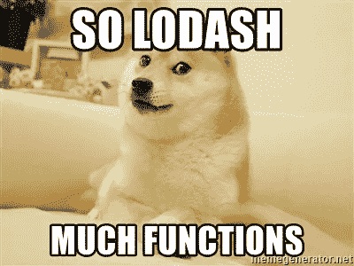
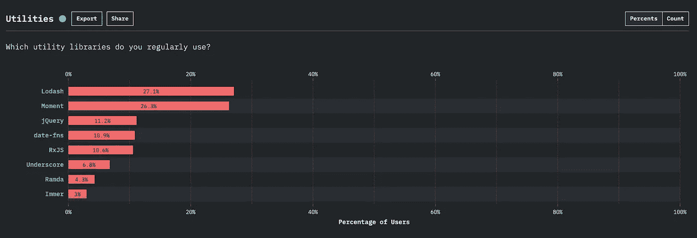

# 使用 Lodash 方法来减少您编写的代码量

> 原文：<https://javascript.plainenglish.io/lodash-methods-to-make-your-life-a-breeze-3f5aae11f7?source=collection_archive---------3----------------------->

## 使用 Lodash 库使您的 JavaScript 代码更具可读性。

当使用 JavaScript 时，您将经常不得不与数组、对象和字符串密切合作，并且不得不操纵它们。传统上，这将需要您编写自己的方法，但是如果您想要使用一些预构建的方法，您可以使用 Lodash 库。


# 为什么要用 Lodash？

使用 Lodash 可以很容易地减少操作数组、字符串和对象所需编写的代码量。这将使你的代码更加简洁易读。

# 设置

使用 npm:

```
$ npm i — save lodash
```

使用 CDN:

```
<script src="[https://cdn.jsdelivr.net/npm/lodash@4.17.15/lodash.min.js](https://cdn.jsdelivr.net/npm/lodash@4.17.15/lodash.min.js)"></script>
```

在 Node.js 中:

```
// Load the full build.
var _ = require('lodash');// Load the core build.
var _ = require('lodash/core');// Load the FP build for immutable auto-curried iteratee-first data-last methods.
var fp = require('lodash/fp');// Load method categories.
var array = require('lodash/array');
var object = require('lodash/fp/object');// Cherry-pick methods for smaller browserify/rollup/webpack bundles.
var at = require('lodash/at');
var curryN = require('lodash/fp/curryN');
```

# 重要方法



**isEqual**

```
_.isEqual(value, other)
```

你可能认为这类似于字符串相等方法，但是这种方法在比较对象时非常方便。它不仅会比较结构，还会比较每个值，因为这是一个深度比较。

```
const obj1 = {
 name: ‘Sumeet’,
 age: 30,
 location: {
 state: ‘AR’
 }
};const obj2 = {
 name: ‘Sumeet’,
 age: 30,
 location: {
 state: ‘AR’
 }
};console.log(_.isEqual(obj1, obj2));  //**true**obj2.name = "lilo"console.log(_.isEqual(obj1, obj2));  //**false**
```

如果您维护某种状态，并且只希望在用户对该对象进行了更改时调用某个服务/方法，这将非常有用。

*注意——这通常比其他比较物体的方法更快，也是最常用的方法。*

**是空的**

```
_.isEmpty(value)
```

这是一个非常方便的快速验证对象的方法，这些对象可能是空的、未定义的、空数组或空对象。

```
const obj1 = { name: ‘foo’ };
console.log(_.isEmpty(obj1)); // **false**const obj2 = {};
console.log(_.isEmpty(obj2)); // **true**const array1 = [];
console.log( _.isEmpty(array1)); // **true**const array2 = [1, 2, 3];
console.log(_.isEmpty(array2)); // **false**const nullValue = null;
console.log(_.isEmpty(nullValue)); // **true**const undefinedValue = undefined;
console.log(_.isEmpty(undefinedValue)); // **true**
```

这对于检查空对象特别方便，你可以使用它而不是使用标准的 **Object.keys(obj1)。长度=== 0。**

**次**

```
_.times(value, methodName)
```

此方法接受两个参数，然后调用所提供的方法，调用次数与第一个参数值一样多，并返回数组中的数据。

```
function getRandomInteger() {    
  return Math.round(Math.random() * 100);
} 
var result = _.**times**(5, getRandomNumber);
// result => [64, 70, 29, 10, 23]
```

这在创建模拟数据时特别有用。

**去抖**

```
_.debounce(methodName, timeInMilliSec)
```

此方法将仅在第二个 param 等效时间(以毫秒为单位)后调用传递的方法名。

```
function validateEmail() {    
  //check here if user entered proper email format and show error
} var emailInputField = document.getElementById("email-field");
emailInputField.addEventListener("keyup", _.debounce(validateEmail, 500));
```

在上面的例子中，只有在用户最后一次按键事件发生 500 毫秒后，才会向用户显示电子邮件格式错误。这样，您可以避免每次按键时都向他显示错误。

**获取**

```
_.get(object, path, [defaultValue])
```

这是一个非常有用的方法，可以在一个特定的路径上获取对象内部的值，如果它存在的话。如果路径中不存在该值，您可以指定一个默认值

```
const user = {
 name: ‘Sumeet’,
 age: 30,
 location: {
   state: ‘AR’
 }
};console.log(_.get(user, 'location.state', {})); // **AR**console.log(_.get(user, 'location.city', "NA"));  //**NA**
```

如果您需要在采取某些操作之前检查服务的响应中是否存在某些值，这将非常方便。使用这种方法，您不必为嵌套对象添加一堆未定义和空的检查。如果你用它来访问一个对象，它将不会返回一个标准错误(*错误:无法读取未定义*的属性‘XXX’)，而是直接返回缺省值。

**去毛刺**

```
_.deburr(value)
```

这将删除所有“组合变音符号”，因此“é”变成了“e”。

```
_.deburr(“déjà vu”);// -> **deja vu**
_.deburr(“Juan José”);// -> **Juan Jose**
```

如果您的产品支持多种语言，或者您需要在将数据存储到数据库之前对其进行整理，这将非常方便。当存在国际化和本地化时，为搜索功能去除文本毛刺是一个好习惯。

**克隆深度**

```
_.cloneDeep(value)
```

这大概是我用的非常频繁的方法。它将克隆一个对象及其值，而不保留引用。

```
const user = {
 name: ‘Sumeet’,
 age: 30,
 location: {
   state: ‘AR’
 }
};const cloneUser = _.cloneDeep(user);console.log(user.name === cloneUser.name); // false
console.log(cloneUser === user); // false
```

如果您计划更改原始对象的值，同时希望保留其副本以备后用，这将特别有用。

**排序依据和排序依据**

```
_.sortBy(collection, [iteratees=[_.identity]])
```

您可以使用此方法根据特定条件或对象内部的值对对象数组进行升序排序，这将非常方便。

```
const users = [
  { 'user': 'fred',   'age': 48 },
  { 'user': 'barney', 'age': 36 },
  { 'user': 'frank',   'age': 40 },
  { 'user': 'bailey', 'age': 34 }
];

//sort users by age
console.log(_.sortBy(users, [function(user) { return user.age }]));

// output: 
{'user':'bailey','age':34},
{'user':'barney','age':36},
{'user':'frank','age':40},
{'user':'fred','age':48}]_.orderBy(collection, [iteratees=[_.identity]], [orders])
```

orderBy 方法类似于 sort by，但是在这里您还可以定义您希望结果是升序还是降序。

```
const users = [
  { 'user': 'fred',   'age': 48 },
  { 'user': 'barney', 'age': 36 },
  { 'user': 'frank',   'age': 50 },
  { 'user': 'bailey', 'age': 34 }
];

// sort by user in descending order
console.log(_.orderBy(users, ['user'], ['asc']));// output: 
[{'user':'bailey','age':34},
{'user':'barney','age':36},
{'user':'frank','age':40},
{'user':'fred','age':48}]// sort by user in ascending order and age by descending order
console.log(_.orderBy(users, ['user', 'age'], ['asc', 'desc']));

// output: 
{'user':'bailey','age':34},
{'user':'barney','age':36},
{'user':'frank','age':50},
{'user':'fred','age':48}]
```

# 结论



Lodash 是一个很好的助手库，它为您提供了许多有益的方法，可以减少您的工作和代码复杂性。它是最流行的 JavaScript 库之一。该库非常轻便(69 KB)，高效，受欢迎，深受喜爱(Github 上超过 18，000 颗星)。我强烈建议您将这个库合并到您的新项目或现有项目中，您不会失望的。

如果你喜欢这篇文章，也可以看看其他的:

[](/react-hooks-all-that-you-need-to-ever-know-d197109e99da) [## React Hooks —您需要知道的一切

### 当我开始将我们以前的产品从使用类过渡到使用功能组件和钩子时，我面临着…

javascript.plainenglish.io](/react-hooks-all-that-you-need-to-ever-know-d197109e99da) [](/really-useful-array-methods-in-javascript-127f8a3b0d25) [## JavaScript 中 12 个非常有用的数组方法

### 虽然 JavaScript 中有很多数组方法，但这里列出了一些我认为非常有用的数组方法

javascript.plainenglish.io](/really-useful-array-methods-in-javascript-127f8a3b0d25) [](/require-vs-import-in-js-82a7a47671f) [## 比较 JavaScript 中的 require()和 import()

### 探索 JavaScript 中 require()和 import()方法的特性。

javascript.plainenglish.io](/require-vs-import-in-js-82a7a47671f) [](/all-about-importing-methods-in-javascript-d8d84fbd30d3) [## 关于在 JavaScript 中导入方法的所有内容

### 知道在什么情况下使用什么语法。

javascript.plainenglish.io](/all-about-importing-methods-in-javascript-d8d84fbd30d3) 

*更多内容请看*[***plain English . io***](https://plainenglish.io/)*。报名参加我们的* [***免费周报***](http://newsletter.plainenglish.io/) *。关注我们关于*[***Twitter***](https://twitter.com/inPlainEngHQ)**和*[***LinkedIn***](https://www.linkedin.com/company/inplainenglish/)*。查看我们的* [***社区不和谐***](https://discord.gg/GtDtUAvyhW) *加入我们的* [***人才集体***](https://inplainenglish.pallet.com/talent/welcome) *。**