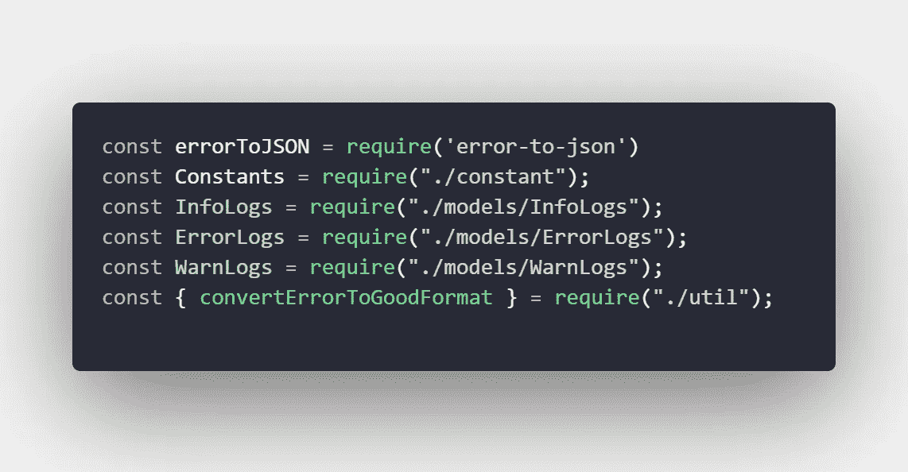
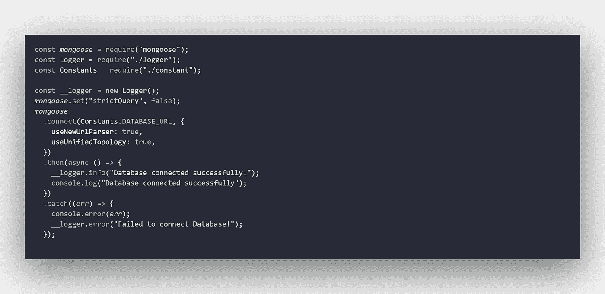

# NodeJS 和 Mongoose 中的日志系统

> 原文：<https://javascript.plainenglish.io/logging-system-in-nodejs-and-mongoose-f0f6a8854f2d?source=collection_archive---------2----------------------->


Photo by [Pankaj Patel](https://unsplash.com/@pankajpatel?utm_source=medium&utm_medium=referral) on [Unsplash](https://unsplash.com?utm_source=medium&utm_medium=referral)

# 什么是日志记录？

对于任何生产稳定的应用程序，我们需要一些日志机制来让我们知道应用程序日志、错误、警告或任何其他重要的细节。有很多方法可以使用普通的`console.log`或`winston`或任何其他库来设置应用程序日志，但有时您可能需要创建自己的日志记录机制来获得顶级的功能。

它还取决于应用程序中使用的编程语言及其本地支持

## 什么是数据库级应用程序日志？

对于需要在任何页面上查看日志和/或支持外部 API 进行日志记录的应用程序，我们需要将它们存储在数据库中。通常，有 3 个级别(可以更多)的日志记录

*   错误
*   信息
*   警告

我们还将在数据库中保留 3 个不同的表/集合

> 我们可以将所有内容存储在一个表/集合中，但是日志的数量可能会更大，这会影响获取日志的速度。在级别上还可以有另一个双重性，可以基于它们创建集合

## 开始

让我们从开始一个新的节点项目`npm init -y`开始，你也可以在你现有的项目中使用它，然后定义你想要用于日志的模型。

我们还将创建`models`文件夹，并将所有模型文件放在那里。从`ErrorLogs`开始，因为我们不知道类型，它可以是集合中的任何东西，我们使用`strict: false`模式让用户存储任何东西，但你可以考虑定制它


ErrorLogs.js

在`ErrorLogs`之后，让我们创建一个新的集合`InfoLogs`来存储信息日志


InfoLog.js

在`InfoLogs`之后，让我们创建一个新的集合`WarnLogs`来存储信息日志


WarnLog.js

我不喜欢直接使用`process`实例，所以我将创建一个常量文件，并将环境放在一个引用中，以后再使用它


constant.js

存储错误响应时，可能会出现循环依赖。所以我们将避免使用圆形对象，这样包装函数将会照顾我们


util

除了循环依赖，我们将通过使用包`[error-to-json](https://www.npmjs.com/package/error-to-json)`使用它来迭代有效载荷中的任何`Error`实例。


Converting error to JSON

## 创建记录器

让我们为 Logger 创建一个类，它的属性包含信息、警告和错误列表对象以及它们的阈值。以下是我们将使用的属性

*   错误、警告、信息—列表
*   阈值—

导入我们创建的模型和 utils 文件将是我们的第一步



imports

用描述的属性为我们的类创建框架。我们将为所有这些值设置日志、警告和错误的阈值。我们为每个阈值赋予不同的级别属性

```
class CustomMongoLogger {
  constructor(logThreshold = 20, errorThreshold = 5, warningThreshold = 5) {
    this.warnings = [];
    this.errors = [];
    this.infos = [];
    this.levels = {
      info: "info",
      error: "error",
      warning: "warning",
    };
    this.logThreshold = logThreshold;
    this.errorThreshold = errorThreshold;
    this.warningThreshold = warningThreshold;
  }
}
```

因为所有的文档都是部分日志，所以让我们创建一个私有的包装器函数，将数据绑定到一个简单的格式。我们将添加一些默认属性，如时间戳和消息属性

```
#createEntry(payload, level) {
    const checkedPayload =
      typeof payload === "string" ? { message: payload } : payload;
    const input = {
      timestamp: new Date(),
      level,
      message: checkedPayload.message,
      meta: {
        ...checkedPayload,
        ENV: Constants.NODE_ENV,
        service: "main",
        timestamp: new Date(),
      },
    };
    return input;
  }
```

我们将需要在各自的集合中存储日志，因此也需要很少的方法。首先，我们将所有日志存储为临时变量，然后清除它们，同时存储在数据库中

```
async saveInfoLogs() {
    const toBeUploaded = [...this.infos]
    this.infos.length = 0
    await InfoLogs.insertMany(toBeUploaded);
 }
async saveErrorLogs() {
  const toBeUploaded = [...this.errors]
  this.errors.length = 0
  await ErrorLogs.insertMany(toBeUploaded);
}
async saveWarningLogs() {
  const toBeUploaded = [...this.warnings]
  this.warnings.length = 0
  await WarnLogs.insertMany(toBeUploaded);
}
```

现在，最后一步是同步更改，并检查何时需要将数据存储到数据库中。每当该值超过阈值时，我们将使用之前创建的方法将其存储在数据库中

```
async #syncChanges(listKey) {
    try {
        switch (listKey) {
          case this.levels.info:
            if (this.infos.length >= this.logThreshold) {
              await this.saveInfoLogs();
            }
            break;
          case this.levels.error:
            if (this.errors.length >= this.errorThreshold) {
              await this.saveErrorLogs();
            }
            break;
          case this.levels.warning:
            if (this.warnings.length >= this.warningThreshold) {
              await this.saveWarningLogs();
            }
            break;
          default:
            break;
        }
    } catch (error) {
        console.error(error)
        console.log('==')
        console.error(error.message)
        this.error({
          message: error.message,
          critical: 1,
        })
    }
  }
```

现在我们将公开将在应用程序中使用的方法，该方法可以接受 string 或 JSON 对象作为输入

```
info(payload) {
    this.infos.push(this.#createEntry(payload, this.levels.info));
    this.#syncChanges(this.levels.info)
}
error(payload) {
  const isString = typeof payload === "string"
  const error = isString ? new Error(payload) : payload.err ?? payload.error ?? new Error(payload.message);
  convertErrorToGoodFormat(error);
  const customizedPayload = isString ? { error, message: payload } : { ...payload, error } 
  this.errors.push(this.#createEntry(convertPayloadToErrorJson(customizedPayload), this.levels.error));
  this.#syncChanges(this.levels.error)
}
warn(payload) {
  this.warnings.push(this.#createEntry(payload, this.levels.warning));
  this.#syncChanges(this.levels.warning)
}
```

最终的代码看起来像这样，我们可以用它来创建应用程序日志的实例


Logger.js

## 结论

现在我们有了一个日志类，我们可以使用实例来存储日志。您可以在整个应用程序中分发单个实例，也可以为每个功能创建单独的实例。为了测试这个特性，让我们用它来连接数据库



Testing

这将按预期工作。您可以在[mongose logger](https://github.com/Piyush-Use-Personal/mongoose-logger)资源库中找到源代码。编码快乐！

## 更多内容请访问 [PlainEnglish.io](https://plainenglish.io/) 。

*报名参加我们的* [***免费每周简讯***](http://newsletter.plainenglish.io/) *。关注我们关于* [***推特***](https://twitter.com/inPlainEngHQ) ， [***领英***](https://www.linkedin.com/company/inplainenglish/) ***，***[***YouTube***](https://www.youtube.com/channel/UCtipWUghju290NWcn8jhyAw)***，以及****[***不和***](https://discord.gg/GtDtUAvyhW)*

## *想扩大你的软件创业规模吗？检查[电路](https://circuit.ooo/?utm=publication-post-cta)。*