# Loopback 4:超快速 REST APIs

> 原文：<https://javascript.plainenglish.io/loopback-4-super-fast-rest-apis-bc29750547a3?source=collection_archive---------13----------------------->


ìPhoto by [Tekton](https://unsplash.com/@tekton_tools?utm_source=medium&utm_medium=referral) on [Unsplash](https://unsplash.com?utm_source=medium&utm_medium=referral)

最近，我一直在寻找一个 REST API 框架，以在 [Node.js](https://nodejs.org/) 中提供健壮的 API。我需要一些能让我更快地创建模型、关系、CRUD APIs 控制器的东西，并附带一个内置的 ORM 层。

[**环回 4**](https://loopback.io/) 满足了我的所有需求。

Loopback 是一个开源的 [Node.js](https://nodejs.org/) 框架，有助于将来自 API 请求的数据连接到后端资源，具有开箱即用的集成。

所以你只需要关注你的应用程序的逻辑。

在本文中，我们将深入探讨环回项目的基础知识。我们将探索架构、主要层、示例应用程序背后的部分，最终我们将看到无需编写一行代码，使用*模型*、*关系*和*数据库*集成来构建回送应用程序是多么容易和快速！

# CLI 和项目创建

Loopback 提供了一个非常方便的命令行界面，为我们简化、自动化和生成东西。我们可以在全球范围内安装:

```
npm i -g @loopback/cli
```

我们可以使用的第一个命令是`lb4 app`:它将指导我们创建一个新的 Loopback 项目。我们将能够选择项目名称，项目描述，主要应用程序类名和许多其他功能，我们可能希望在我们的应用程序。

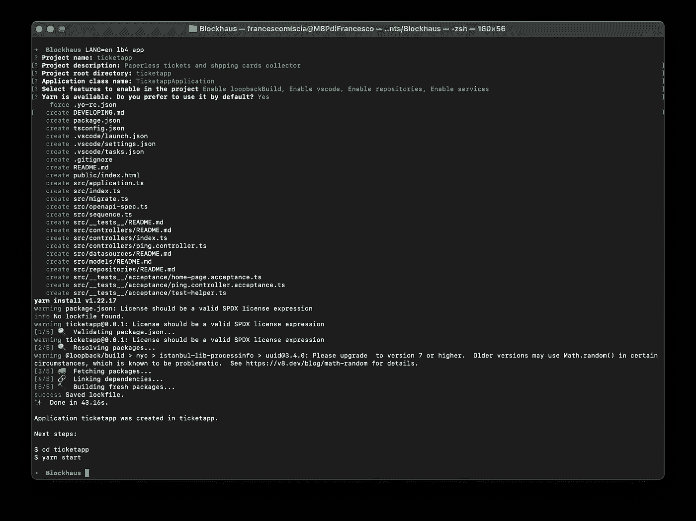

一旦一切就绪，我们就可以使用 ***npm*** 或(在我的例子中) ***yarn*** : `yarn start`来运行应用程序

# 项目层

如果我们看一下由`lb4 app`创建的项目，我们会看到不同的文件夹。它们代表了环回应用程序最重要的层:

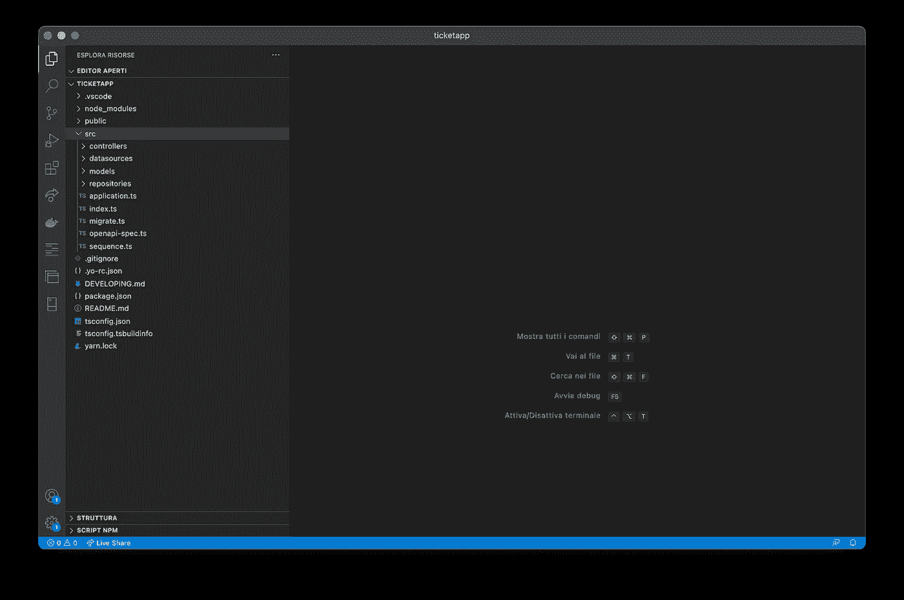

Project structure of a sample Loopback4 project

*   模型
*   控制器
*   数据源
*   仓库

## 模型

**M *模型*** 表示业务领域对象及其关系。我们可以用两种方式创建它们，最常见的方式是使用`@model`装饰器通过代码创建。

A simple User model

但是*最简单快捷的方式*是使用 CLI，用命令:`lb4 model`

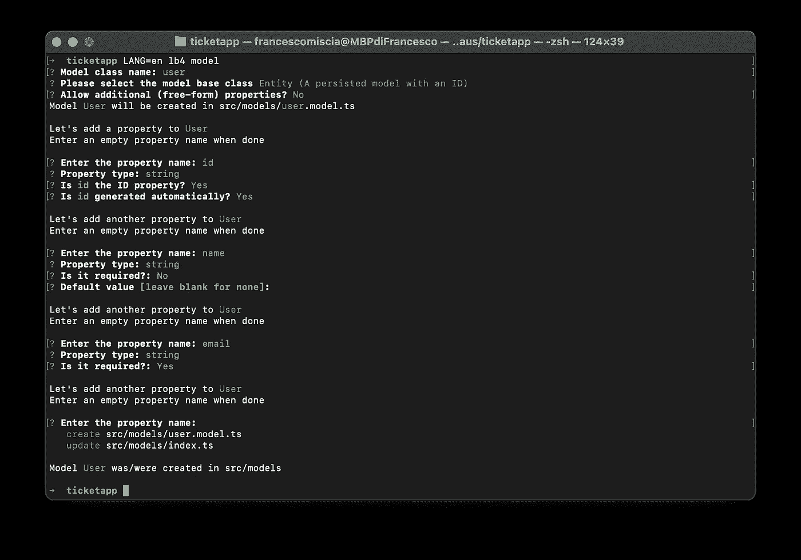

A simple User model created by the CLI

CLI 将让我们定义模型名称和我们需要的所有属性。

一个域对象是一个 ***实体*** (一个有 ID 的域对象)如果它*扩展了****实体*类**，否则，如果它扩展了 ***模型*类**，它就是一个 ***模型*** (一个没有 ID 的域对象)。

*注意:当处理数据库时，应用程序的持久对象将是实体。我们也可以称它们为* ***数据库模型*** *。*

域对象可以通过**关系在回环中相互链接。**最重要的有以下四种:

*   [**HasMany**](https://loopback.io/doc/en/lb4/HasMany-relation.html) :表示一对多的连接。
*   [**有一个**](https://loopback.io/doc/en/lb4/HasOne-relation.html) :表示一对一的连接。
*   [**隶属于**](https://loopback.io/doc/en/lb4/BelongsTo-relation.html) :表示多对一的连接。
*   [**hasmany through**](https://loopback.io/doc/en/lb4/HasManyThrough-relation.html):表示多对多的连接。

我们如何在 Loopback4 应用程序中创建上述关系？

使用 CLI 只需几秒钟！命令是`lb4 relation`

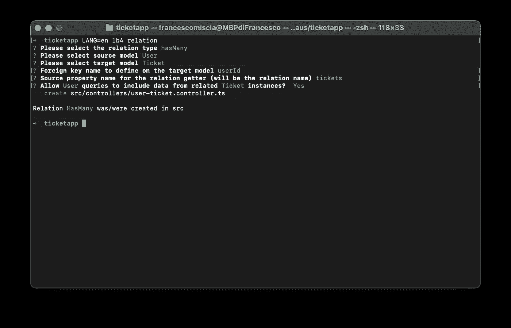

Create a Relation with the CLI

CLI 将建议应用程序中已经存在的模型，并为我们创建关系。

*注意* : *为了创建模型之间的关系，我们需要为这些模型创建一个* ***存储库*** *。我们将在本文中进一步看到* ***资源库*** *。*

## 控制器

***控制器*** 是包含 *API 端点的对象。他们实现应用程序的特定业务逻辑，并将来自 API 请求的数据连接到域/数据库模型。*

CLI 创建的空应用程序(使用`lb4 app`)包含一个名为`PingController` *的示例**控制器**。*非常简单:它只提供了一个名为`ping`的`GET`端点，该端点显示一些信息作为响应(如果您的应用程序正在运行，您可以在这里找到它:[http://localhost:3000/ping](http://localhost:3000/ping))。

感谢[*装饰模式*](https://en.wikipedia.org/wiki/Decorator_pattern) ，以及 Loopback 对它的大量使用，我们可以以声明的方式向我们的控制器添加逻辑和内置助手。

一个**控制器**中最重要的装饰器是 [*OpenAPI 装饰器*](https://loopback.io/doc/en/lb4/Decorators_openapi.html) *。它们允许回送来自动路由、生成请求和响应定义以及创建文档。*

因此，让我们通过查看示例应用程序提供的`PingController`类来更深入地了解回送**控制器**。

上面的代码让我们发现了三个重要的装饰者:

*   [**@inject**](https://loopback.io/doc/en/lb4/Decorators_inject.html) :向[回送 IoC 容器](https://loopback.io/doc/en/lb4/Dependency-injection.html)请求之前用*绑定密钥绑定的特定服务或属性。* 在上面的代码中，我们将每个 *HTTP 请求*注入到 *req* 私有变量中，因此我们可以在我们的逻辑中使用它。Loopback 提供了不同的内置服务，我们可以在类中注入这些服务。常见的可通过以下绑定访问:
    -[**AuthenticationBindings**](https://loopback.io/doc/en/lb4/apidocs.authentication.authenticationbindings.html) **-**[**boot bindings**](https://loopback.io/doc/en/lb4/apidocs.boot.bootbindings.html) **-**[**core bindings**](https://loopback.io/doc/en/lb4/apidocs.core.corebindings.html) **-**[**rest bindings**](https://loopback.io/doc/en/lb4/apidocs.rest.restbindings.html)。
*   [**@get**](https://loopback.io/doc/en/lb4/apidocs.openapi-v3.get.html) :是 [@operation](https://loopback.io/doc/en/lb4/Decorators_openapi.html#operation-decorator) decorator 的简写，用于定义端点的*动词、路径、参数和响应*。通过这种简化，我们公开了一个带有端点`/ping`的`GET`请求。当然 Loopback 为其他 *HTTP 动词提供了同样的简写:
    -*[**Post**](https://loopback.io/doc/en/lb4/apidocs.openapi-v3.post.html)
    -[**Put**](https://loopback.io/doc/en/lb4/apidocs.openapi-v3.put.html)
    -[**Patch**](https://loopback.io/doc/en/lb4/apidocs.openapi-v3.patch.html)
    -[**Del**](https://loopback.io/doc/en/lb4/apidocs.openapi-v3.del.html)
*   [**@response**](https://loopback.io/doc/en/lb4/Decorators_openapi.html#oasresponse) :这是另一个用来定义你的端点如何响应的便利装饰器。我们可以手动设置响应对象(使用`ResponseObject`类型)或者使用**域对象**。

A response object

像往常一样，要创建一个空的**控制器**，我们可以使用 CLI 命令:`lb4 controller`。

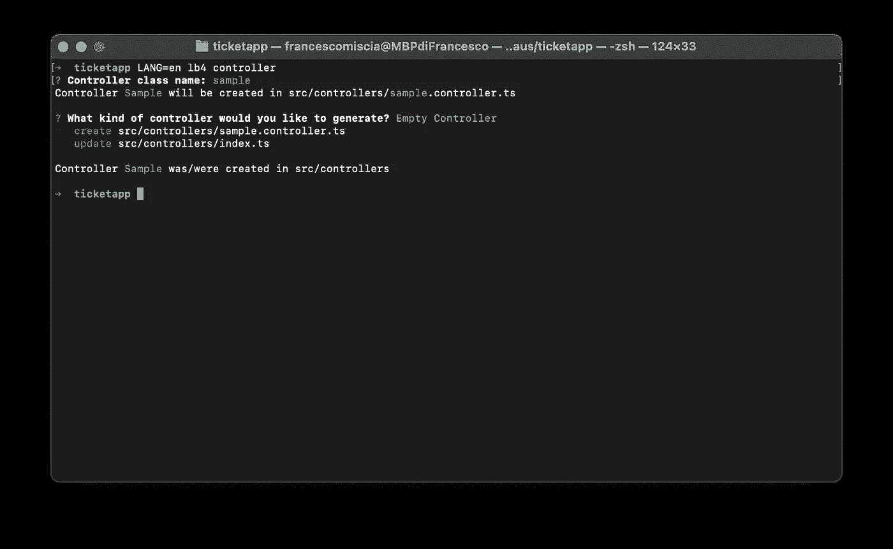

上面的命令创建了一个空的**控制器**，但是使用相同的命令，我们也可以创建 CRUD 控制器来在**数据库模型上执行基本的 CRUD 操作。**

为了做到这一点，我们首先需要一个**存储库**和一个**数据源** *。*

所以，让我们来探索它们。

# 数据源

一个 ***数据源*** 使用一个 [*连接器*](https://loopback.io/doc/en/lb4/Connectors-reference.html) 来表示外部系统中的数据。多亏了数据源，我们可以将 SQL 和 NoSQL 数据库连接器、SOAP 服务或 Loopback 或社区提供的任何其他内置连接器附加到我们的应用程序上。

为了创建一个数据源，我们可以使用 CLI 命令:`lb4 datasource`

该命令将指导我们选择连接器类型、配置，并为我们生成所有需要的代码。
有几十个内置连接器，创建一个只需几秒钟！

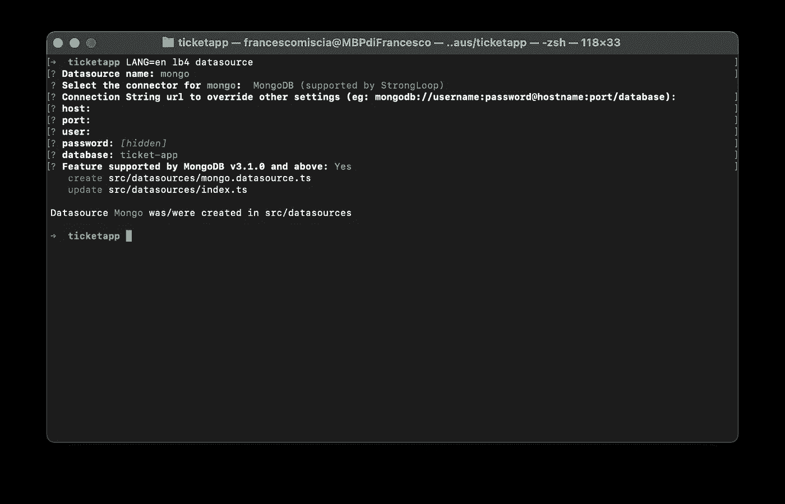

# 仓库

一个 ***存储库*** 提供数据访问操作(例如，CRUD APIs)来针对数据库或服务(或更一般的**数据源**)操纵域对象。

因此，虽然**模型**描述了域对象的形状，但是**库**添加了行为，反映了对**数据源**的每一个操作。

Loopback 提供了很少的内置存储库来创建 CRUD 或键值操作。这些实现基本上将**数据库模型** *(* 实体 *)* 链接到**数据源** 并自动生成访问数据的逻辑。

我们如何为 CRUD 操作创建一个基本的存储库？

CLI 将再次帮助我们。使用命令`lb4 repository`，我们将被引导选择**数据源**和**实体**，最终将为我们生成代码。

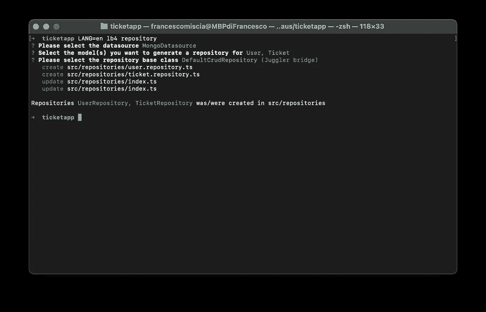

现在，有了这个新创建的**库** ，我们就有了 API 来对一个**实体** 执行 CRUD 操作，这些操作将被反映到**数据源**。

例如，可以调用这些 API 的地方是 ***控制器*** 。

事实上，命令`lb4 controller`和`lb4 relation`都会生成控制器，这些控制器使用存储库的 API 来操纵实体，并以透明的方式为数据源提供信息。

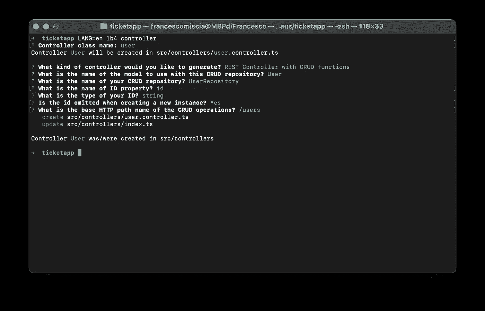

Controller with CRUD operations

# 一款包含 5 个步骤的票务管理应用

现在，我们将创建一个非常简单的应用程序，允许用户以无纸化的方式收集他们的门票或购物卡。这将是超级快，我们甚至不会打开一个编辑器来做这件事。让我们看看步骤:

1.用`lb4 app`启动项目。


App creation

2.用`lb4 model`创建以下域对象:**用户**和**票证。** 属性可以很少:一个*电子邮件*和一个*名称*用于**用户**和一个*标题*和一个*描述*用于**票据。**然后，我们希望它们在数据库中持久化，所以它们需要是*实体*并有一个 *id。*


User entity

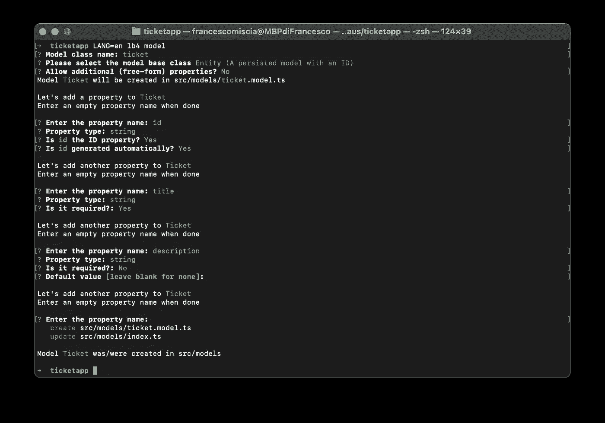

Ticket entity

3.使用`lb4 datasource`创建一个带有数据库连接器(例如 MongoDB)的**数据源**。


Datasource with a MongoDB connector

4.使用`lb4 repository`创建两个**库**来为**数据库模型**添加 CRUD 操作:**用户库**和**票据库**。


CRUD Repositories

5.创建**关系**与`lb4 relation` :
**。**一个**用户** *有很多* **票
。**一张**票** *归属于* *一张* ***用户***


Relation User HasMany Ticket

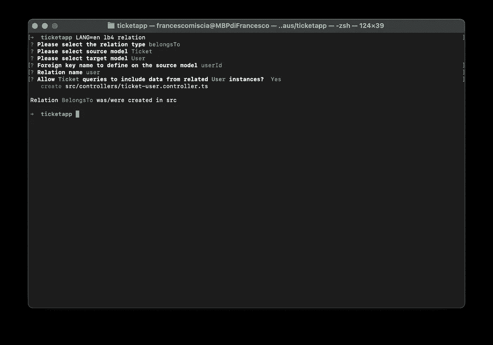

Relation Ticket BelongsTo User

就是这样！正如您所看到的，所有的事情都可以用 Loopback CLI 来完成，而无需编写任何代码！

现在使用`yarn start`运行项目，并打开位于[http://localhost:3000/explorer/](http://localhost:3000/explorer/)的 api explorer

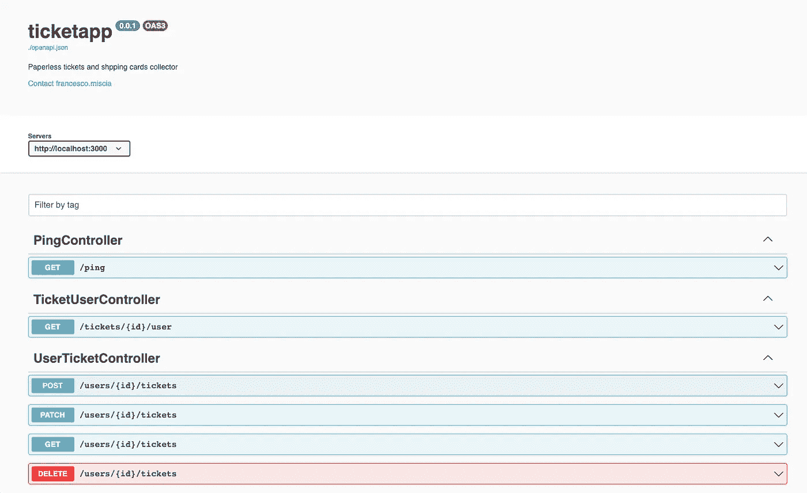

瞧啊！创建我们的 REST APIs 花了 5 分钟和 0 行代码！

当然，这个应用程序缺少一些(非常)重要的服务，比如*认证*和*授权*，但是我们将在下次用更多的代码来探索它们。😁

*更多内容请看*[***plain English . io***](https://plainenglish.io/)*。报名参加我们的* [***免费周报***](http://newsletter.plainenglish.io/) *。关注我们关于*[***Twitter***](https://twitter.com/inPlainEngHQ)*和*[***LinkedIn***](https://www.linkedin.com/company/inplainenglish/)*。加入我们的* [***社区不和谐***](https://discord.gg/GtDtUAvyhW) *。*