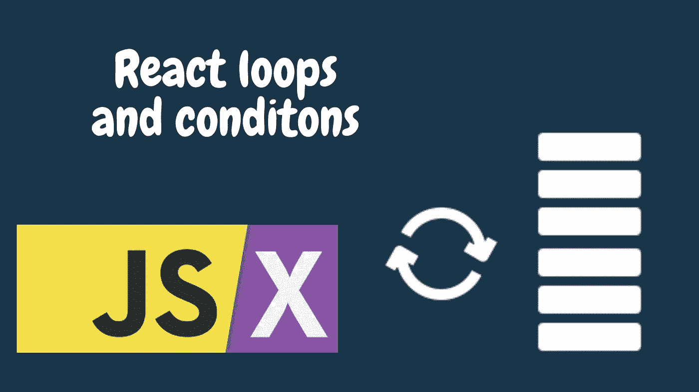
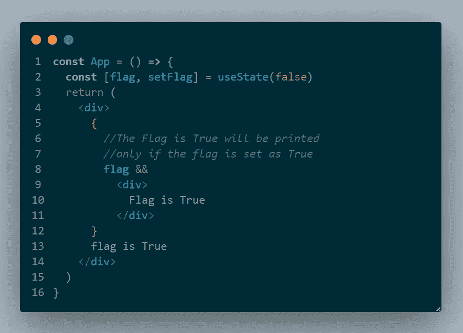
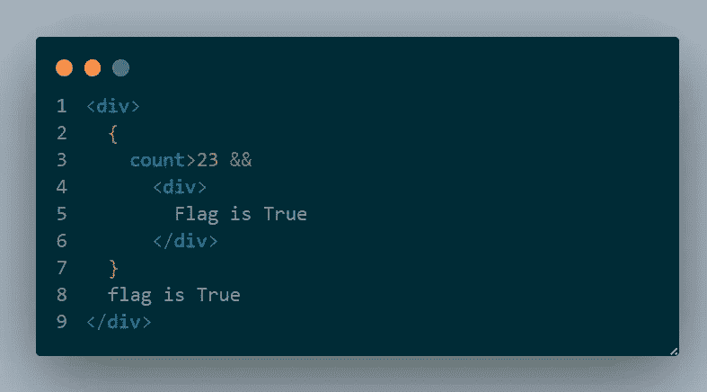
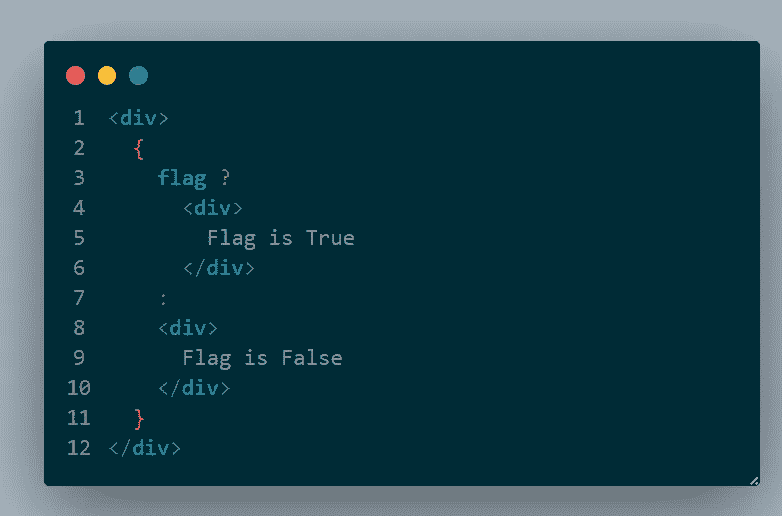
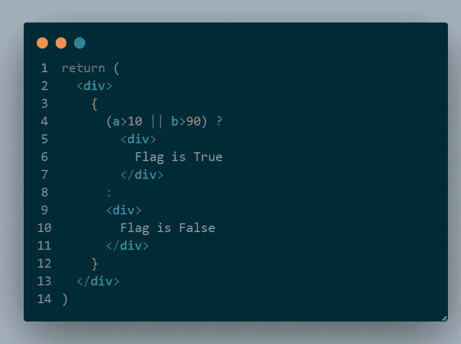
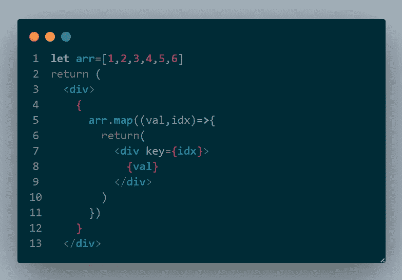
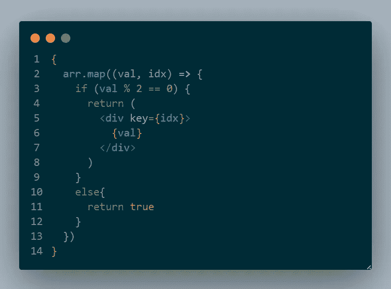
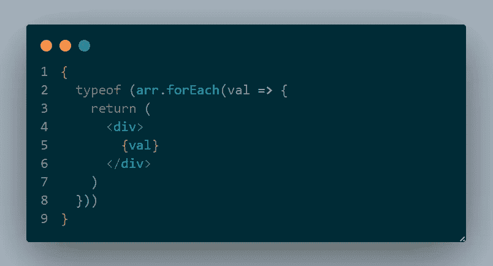
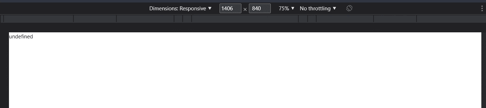

# 了解 React 中的循环和条件

> 原文：<https://javascript.plainenglish.io/loops-and-conditions-in-react-js-db8a0b49b2bf?source=collection_archive---------7----------------------->

## React 中循环和条件语句的简要指南。

如果一块石头指向天空，它肯定会击中 JavaScript 开发人员，主要是 React 开发人员。React 就是这么受欢迎的。它因易于使用和理解而受欢迎。

大多数开发人员更喜欢 React，不仅仅是因为它的虚拟 DOM 所带来的性能，还因为它易于编码。React 使开发人员的代码速度更快，也使开发人员保持一个清晰的代码库，其中控制流是显而易见的，易于理解。

普通 JavaScript (Vanilla)很棒，但是当涉及到条件呈现或呈现数据列表时，Vanilla JS 要比 React 困难得多。让我们看看 JSX 中的条件语句和循环(主要用于呈现元素列表)。

## 概述

1.  条件语句
2.  迭代可迭代对象

# 条件语句

条件语句是高度

1.  使用`&&`运算符

`&&`运算符用于检查两个条件是否都为真。如果任一条件为假，将返回假。JSX 的`&&`操作符的工作方式是，在`&&`操作中，只有当`&&`操作符之前的条件为真时，才会执行或检查`&&`之后的条件。如果`&&`之前的条件为假，则整个语句将返回假。因此，这些元素将不会被呈现。只有当`&&`操作符之前的条件为真时，才会呈现元素。

## 使用逻辑运算符

在上面的语句中，我直接使用了一个布尔值，但是布尔变量可以被任何返回 true 的语句替换。例如，返回布尔值或逻辑语句等的函数。在下面的例子中，逻辑条件将总是返回一个布尔值。

## 使用三元运算符

if-else 条件可以使用三元运算符在 JSX 内部实现。三元运算符只是带有显式或隐式 return 语句的 if-else 条件的快捷方式。在这里，我们使用一个逻辑条件来检查布尔值，如果布尔值为真，那么该语句将返回第一个语句，如果为假，它将返回冒号前面的第二个语句。

## 多个逻辑语句

我们也可以使用多个逻辑条件，这些逻辑条件由一些条件运算符连接起来。条件&运算符和条件||运算符可用于连接逻辑条件。可能有任意数量的逻辑条件，但唯一的限制是语句应该只有一行，这意味着不能有多行语句。

# 成圈

在 React 中，大多数时候我们会渲染一个 iterable(一个数组)。为了渲染一个 iterable，我们已经并将只使用 map 函数。首先，我们将看到如何使用 map 函数，然后我们可以讨论为什么其他循环方法(for，while，foreach)不能使用。

使用映射功能的示例如下:

## 有条件循环

map 函数还可以根据一些标准使用条件来呈现内容。在下面的例子中，我返回了 true 而不是 JSX 元素，因为如果条件失败，我什么也不用做。

## 为什么其他循环不能用？

这可以通过理解不同的循环很容易地理解。看看这个来理解 JavaScript 中不同的循环是如何工作的。只有 map、filter 和 reduce 方法会返回一个新数组，但其他循环不会返回任何内容。因此，它们的返回类型是未定义的，因此不会呈现任何内容。

*更多内容看* [***说白了。报名参加我们的***](https://plainenglish.io/) **[***免费周报***](http://newsletter.plainenglish.io/) *。关注我们关于* [***推特***](https://twitter.com/inPlainEngHQ)[***LinkedIn***](https://www.linkedin.com/company/inplainenglish/)*[***YouTube***](https://www.youtube.com/channel/UCtipWUghju290NWcn8jhyAw)*[***不和***](https://discord.gg/GtDtUAvyhW) *。对增长黑客感兴趣？检查* [***电路***](https://circuit.ooo/) *。*****