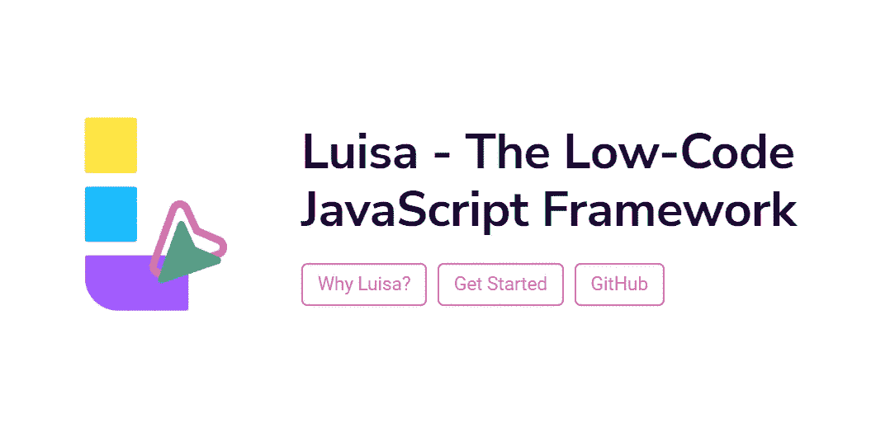
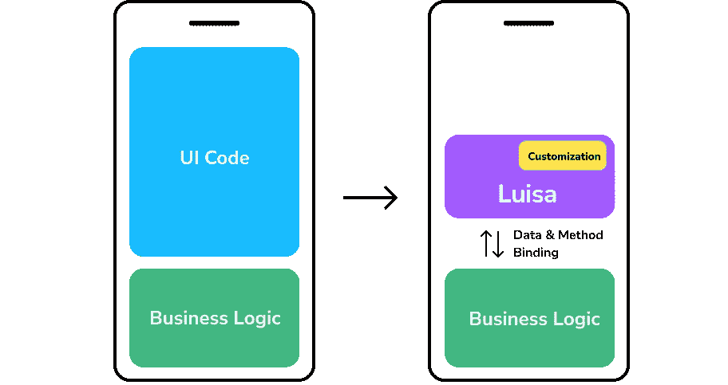
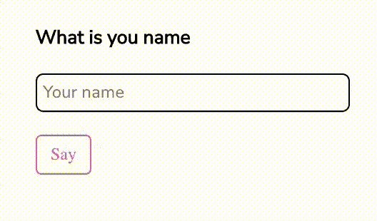
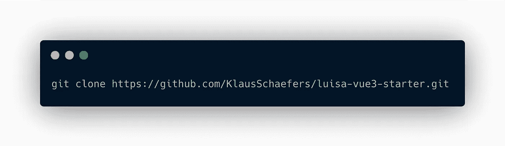
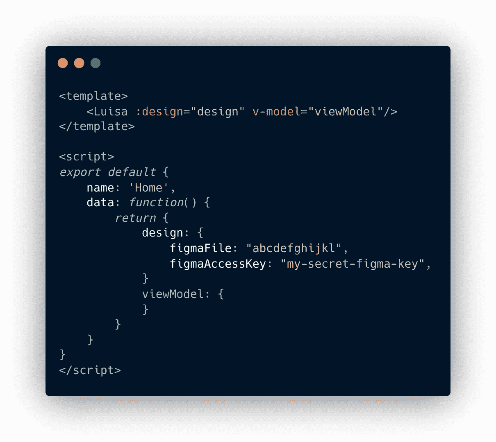
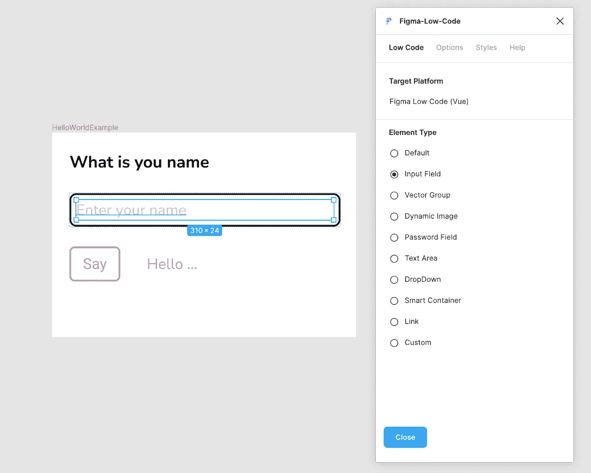
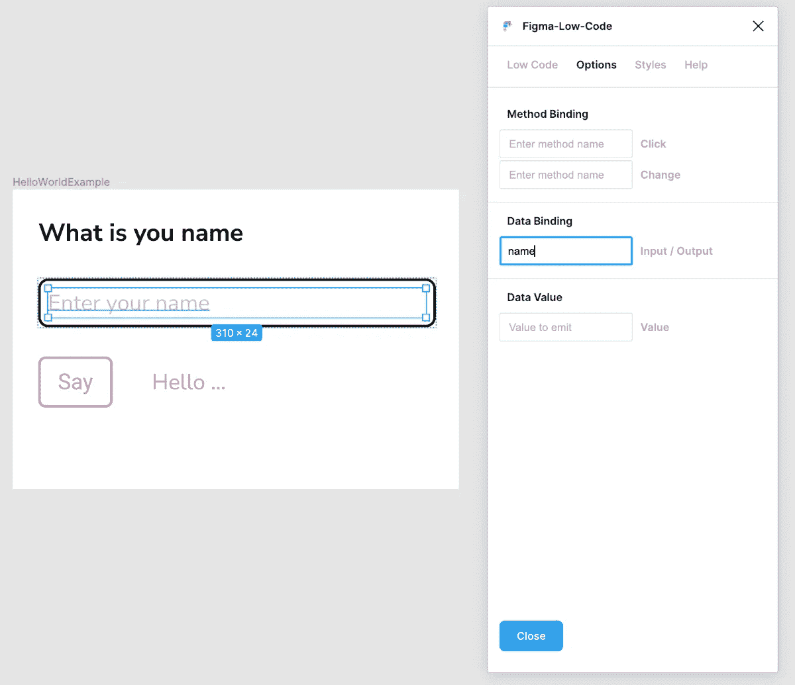
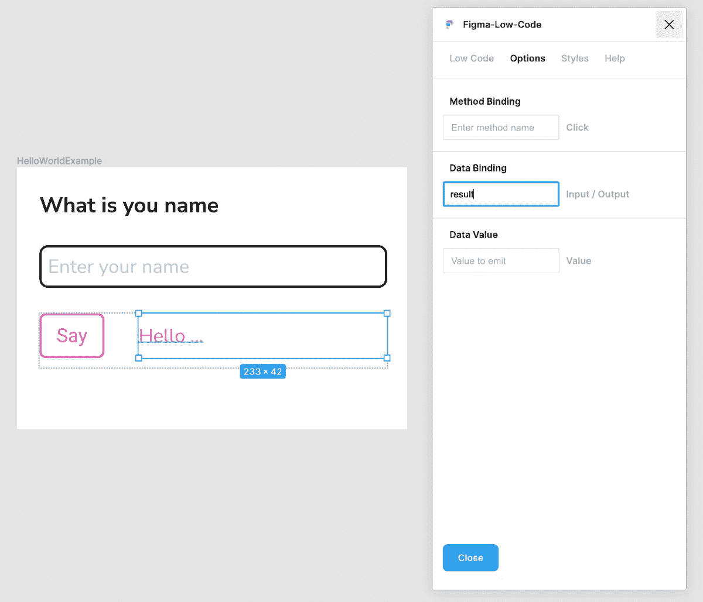
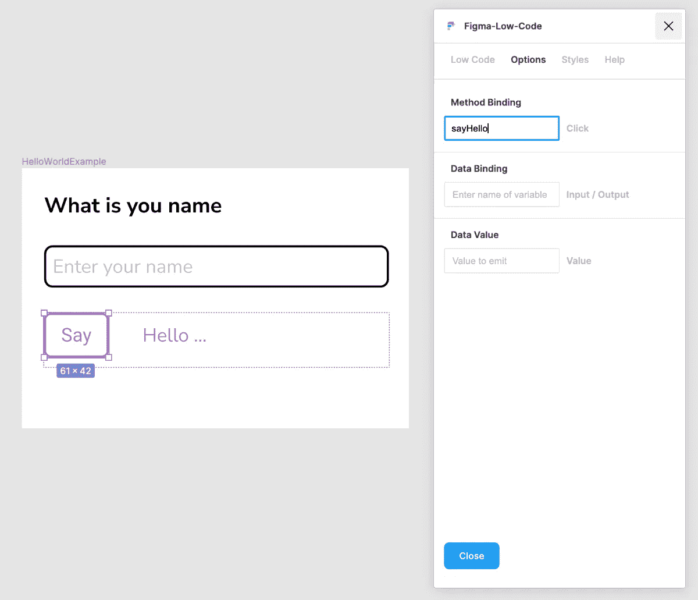
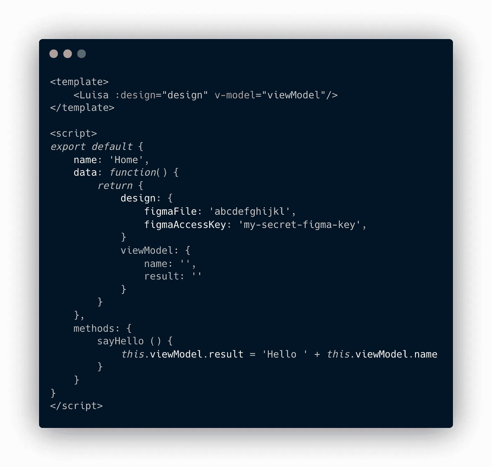

# Luisa——低代码 UI 框架

> 原文：<https://javascript.plainenglish.io/luisa-the-low-code-ui-framework-5aad9a8bbf50?source=collection_archive---------6----------------------->

## Luisa 框架是一个开源项目，它将 Figma 和 Quant-UX 的设计转化为全功能的 Vue 应用。

在应用程序开发过程中，一个持续的痛点是设计和前端团队之间的交接。通常，这个过程不是没有摩擦的。一旦设计被转化为代码，就没有单一的真理来源，以后的设计变更可能会变得越来越复杂，难以实现。

Luisa 框架采用低代码思想进行前端开发，并确保设计保持真实的单一来源。**低代码**的概念是应用程序的某些方面可以使用可视化工具更容易地描述。这方面的一个很好的例子是用户界面。无论如何，它是在图形工具中设计的，比如 Figma、Sketch 或 Framer，那么为什么要手动翻译成代码呢？

低代码并不意味着你的整个应用程序需要可视化建模。对于许多方面来说，明码仍然是更好的选择，例如，业务逻辑或后端服务调用。Luisa 框架解决了这些问题，并仔细平衡了低代码和手动编码。虽然在默认情况下，整个设计会自动转换为 HTML、JavaScript 和 CSS，但很容易就可以挂接业务逻辑、定制组件或 CSS 覆盖。

Luisa reduces UI code and allows to hook-in the business logic

在本教程结束时，您将学会如何在不编写任何 HTML 或 CSS 代码的情况下构建一个视觉上吸引人的 Vue.js 应用程序。

# 设计

让我们从一个 Hello World 的例子开始。这个想法很简单。用户可以输入她的名字，当她按下一个按钮时，她的名字就会出现。在开始使用 Luisa 之前，您需要在 Figma 中创建设计。最低要求如下所示。对于输出，有一个输入元素、一个按钮和一个文本元素。input 元素由一个带有嵌入文本元素的自动布局框架组成。
“Hello World”基于 Figma 设计

“Hello World” based on a Figma design

# 项目设置

设计就绪后，您需要建立一个 Vue 项目。最好的开始方式是克隆我们的模板库，重新开始。它包括您需要的一切，并且配置完整。如果您想将 Luisa 添加到现有项目，请阅读 Luisa.cloud 主页上的[添加到现有项目](https://luisa.cloud/help/luisa_add_existing.html)一章。

# 链接 Figma

一旦你设置好 Luisa，是时候加入你的设计了。有两种方法可以做到这一点。

1.  最简单的方法是**将** Luisa 链接到 Figma 的“现场”版本。链接项目是有利的，因为最新的设计是在页面重新加载时加载的。当你在 Figma 中修改一些东西时，只需重新加载页面，设计就会更新。
2.  或者，您可以**下载**fig ma 文件到您的项目，并下载所有图像和矢量图形。页面加载速度会快得多；然而，一旦设计改变，你必须重新下载所有的东西。您可以在[部署到生产](https://luisa.cloud/help/deploy_figma_website.html)中找到更多信息。

要将 Luisa 链接到 Figma，您需要传递 *figmaFile* ID 和 *figmaAccessKey* ，有时称为 Figma 访问令牌。figmaFile ID 是浏览器中显示的 URL 的一部分。所以如果 URL 是[*https://www.figma.com/file/abcdefghijkl/My-project*](https://www.figma.com/file/abcdefghijkl/My-project)，那么文件 id 就是“abcdefghijkl”。您可以在 Figma 设置([详细信息](https://www.figma.com/developers/api#access-tokens))中获取 Figma 访问密钥

打开 *src/views/Home.vue* 文件，将链接作为设计对象传递。

现在您可以启动服务器并在 [http://localhost:8080](http://localhost:8080/) 上检查您的结果。您还可以从命令行启动服务器(“npm run serve”)，就像任何其他 Vue 项目一样。

# 使用插件

如果你在浏览器中试用这款应用，你会发现它没有交互性。input 元素只是一个 DIV，因此您不能在文本字段中输入数据，当您按下按钮时也没有任何反应。要改变这一点，您需要使用 [Figma-Low-Code](https://www.figma.com/community/plugin/858477504263032980/Figma-Low-Code) 插件并向设计中添加元数据，以便 Luisa 知道如何呈现元素，例如，创建一个真正的 HTML 输入元素。

一旦你安装了 Figma 插件，你需要运行插件(鼠标右键点击>插件> Figma 低代码)。该插件将允许您设置所需的元数据。对于我们的 Hello World 示例，请执行以下步骤:

1)选择要转换为输入元素的元素。在我们的例子中，文本元素被放在框架内。插件 UI 将会更新。您现在可以选择正确的输入类型，在本例中，**输入字段**。

Turn a text element into a input field

2)将选项卡更改为**选项**，并将“名称”输入到**数据绑定**字段。因此，Luisa 会将用户输入的所有文本保存到名为“name”的变量中。

Link the input element to the viewModel.

3)选择应该显示输出消息的文本元素。将**数据绑定**字段设置为“结果”。在运行时，Luisa 将用存储在“结果”变量中的值替换设计中的文本。

4)选择按钮元素，在**方法绑定**字段中输入“sayHello”。当用户点击按钮时，Luisa 将尝试找到一个名为“sayHello”的方法并执行它。

# 业务逻辑

当您刷新浏览器时，您可以看到现在有一个输入字段，并在其中输入数据。

最后一步是处理数据并将其转换为“Hello {name}”消息。为此，你需要访问路易莎的数据。这是通过所谓的**视图模型**实现的。向 Home.vue 文件中定义的 viewModel 添加两个名为“name”和“result”的字符串变量。此外，您需要创建一个名为“sayHello”的方法，该方法将 name 变量与单词“Hello”连接起来，并将结果存储在 result 变量中。

刷新浏览器时，可以输入数据。按下“说”按钮将更新旁边的文本元素。

The entire code for hello world. No HTML, no CSS.

查看上面的代码片段，可以看到只需编写很少的定制代码。 **< Luisa >** 组件呈现整个用户界面，并且只需要实现一个视图模型和业务逻辑。

你可以在 [https://luisa.cloud](https://luisa.cloud) 找到更多关于 Luisa 的信息。如果你喜欢这个项目，不要忘记在 GitHub 给我们一颗星。