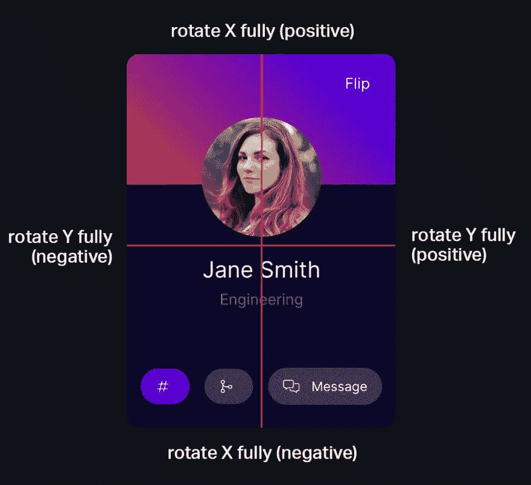

# 用 JavaScript 制作 3D CSS 翻转卡

> 原文：<https://javascript.plainenglish.io/make-3d-css-flippable-cards-with-javascript-620a11e57e02?source=collection_archive---------23----------------------->


不久前，[我写了一篇关于 3d 交互 CSS 按钮的文章](https://fjolt.com/article/css-3d-interactive-flippable-cards)。使用类似的技术，我决定设计一些 3d 交互式(可翻转的)CSS 用户卡。这些对于许多不同的东西也很有用——例如，银行卡用户界面、扑克牌用户界面，或者只是一个团队页面。下面可以看到演示！

[完整的代码一如既往地可以在 CodePen 上获得。](https://codepen.io/smpnjn/pen/qBVPvpZ)

# 带有 CSS 和 JavaScript 的 3d 翻转卡

将鼠标悬停在下面的卡片上(或轻按移动设备上卡片上的任意位置),以全面查看效果。

为了达到这个效果，我们必须在 JavaScript 和 CSS 中结合一些不同的东西:

1.  **首先**，我们需要创建一个函数，让我们根据鼠标位置来操纵卡片的角度。
2.  **接下来**，我们需要使用该函数计算出位置，以在卡片顶部添加一个“眩光”灯光效果。
3.  **然后**，我们需要添加很多 CSS 来为卡片创建一个背面和一个正面。
4.  **最后**，我们需要在我们的 Javascript 中添加一些函数来允许我们“翻转”卡片。

# 创建 HTML

让我们从 HTML 开始。这是我们第一张卡的样子。每张卡有两个主要部分— `inner-card`和`inner-card-backface`。第一个包含卡的正面，第二个包含背面。

我们还有两个按钮——翻转和不翻转，用来改变卡片的哪一面是可见的。

```
<div class="card blastoise">
        <span class="inner-card-backface"> <!-- back of the card -->
            <span class="image">
                <span class="unflip">Unflip</span>
            </span>
        </span>
        <span class="inner-card"> <!-- front of the card -->
            <span class="flip">Flip</span> 
            <span class="glare"></span> <!-- to store the glare effect -->
        </span>
    </div>
```

# 创建 JavaScript 部件

我们的 JS 做一件基本的事情——那就是找出用户在卡片上的位置，并将其转换成一个角度，然后传递给我们的 CSS，以改变我们对卡片的看法。为此，我们需要了解用户离卡片中心有多远。我们只需要担心两个轴——当用户到达顶部或底部时，我们可以相对于中心旋转卡片，如下图所示。



# JavaScript 如何为 3d 翻转 CSS 卡工作

最后，为此我们编写了一个接受“card”元素的函数，并相应地更新它的 CSS:

```
let calculateAngle = function(e, item, parent) {
    let dropShadowColor = `rgba(0, 0, 0, 0.3)`
    if(parent.getAttribute('data-filter-color') !== null) {
        dropShadowColor = parent.getAttribute('data-filter-color');
    } parent.classList.add('animated');
    // Get the x position of the users mouse, relative to the button itself
    let x = Math.abs(item.getBoundingClientRect().x - e.clientX);
    // Get the y position relative to the button
    let y = Math.abs(item.getBoundingClientRect().y - e.clientY); // Calculate half the width and height
    let halfWidth  = item.getBoundingClientRect().width / 2;
    let halfHeight = item.getBoundingClientRect().height / 2; // Use this to create an angle. I have divided by 6 and 4 respectively so the effect looks good.
    // Changing these numbers will change the depth of the effect.
    let calcAngleX = (x - halfWidth) / 6;
    let calcAngleY = (y - halfHeight) / 14; let gX = (1 - (x / (halfWidth * 2))) * 100;
    let gY = (1 - (y / (halfHeight * 2))) * 100; // Add the glare at the reflection of where the user's mouse is hovering
    item.querySelector('.glare').style.background = `radial-gradient(circle at ${gX}% ${gY}%, rgb(199 198 243), transparent)`;
    // And set its container's perspective.
    parent.style.perspective = `${halfWidth * 6}px`
    item.style.perspective = `${halfWidth * 6}px` // Set the items transform CSS property
    item.style.transform = `rotateY(${calcAngleX}deg) rotateX(${-calcAngleY}deg) scale(1.04)`;
    parent.querySelector('.inner-card-backface').style.transform = `rotateY(${calcAngleX}deg) rotateX(${-calcAngleY}deg) scale(1.04) translateZ(-4px)`; if(parent.getAttribute('data-custom-perspective') !== null) {
        parent.style.perspective = `${parent.getAttribute('data-custom-perspective')}`
    } // Reapply this to the shadow, with different dividers
    let calcShadowX = (x - halfWidth) / 3;
    let calcShadowY = (y - halfHeight) / 6; // Add a filter shadow - this is more performant to animate than a regular box shadow.
    item.style.filter = `drop-shadow(${-calcShadowX}px ${-calcShadowY}px 15px ${dropShadowColor})`;
}
```

**这个函数做 4 件事:**

*   计算元素的阴影，使其看起来像在三维空间中移动。
*   根据鼠标位置计算卡片的角度。
*   计算背面的位置，使其与卡片正面同步移动。
*   计算眩光的位置，它是用户鼠标所在位置的反射。

我们现在所要做的，就是将这个函数添加到我们的每个鼠标移动事件中，然后当用户的鼠标离开元素时，重置一切。我们还将添加一些“翻转”和“取消翻转”卡片的功能:

```
document.querySelectorAll('.card').forEach(function(item) {
    // For flipping the card backwards and forwards
    if(item.querySelector('.flip') !== null) {
      item.querySelector('.flip').addEventListener('click', function() {
        item.classList.add('flipped');
      });
    } // For 'unflipping' the card.
    if(item.querySelector('.unflip') !== null) {
      item.querySelector('.unflip').addEventListener('click', function() {
        item.classList.remove('flipped');
      });
    } // For when the user's mouse 'enters' the card
    item.addEventListener('mouseenter', function(e) {
        calculateAngle(e, this.querySelector('.inner-card'), this);
    }); // For when the users mouse moves on top of the card
    item.addEventListener('mousemove', function(e) {
        calculateAngle(e, this.querySelector('.inner-card'), this);
    }); // For when the user's mouse leaves the card.
    item.addEventListener('mouseleave', function(e) {
        let dropShadowColor = `rgba(0, 0, 0, 0.3)`
        if(item.getAttribute('data-filter-color') !== null) {
            dropShadowColor = item.getAttribute('data-filter-color')
        }
        item.classList.remove('animated');
        item.querySelector('.inner-card').style.transform = `rotateY(0deg) rotateX(0deg) scale(1)`;
        item.querySelector('.inner-card-backface').style.transform = `rotateY(0deg) rotateX(0deg) scale(1.01) translateZ(-4px)`;
        item.querySelector('.inner-card').style.filter = `drop-shadow(0 10px 15px ${dropShadowColor})`;
    });
});
```

您可能会注意到鼠标事件是针对卡片的，但是转换主要发生在。内卡。那是因为如果角度。卡片改变时,“悬停框”也会改变。如果发生这种情况，用户可能会悬停在卡片上，但角度会发生很大变化，不会再发生变化，使效果看起来很糟糕。通过向卡片添加悬停效果，我们保持了一个恒定的悬停框，同时还允许我们转换。内卡在这个固定的盒子里。

# 添加 CSS

最后，我们可以添加 CSS。这里最基本的是我们有一个卡片容器。包含我们要转换的卡片的卡片--。内卡。

这样做的另一个好处是，当用户点击“翻转”时，我们可以翻转`.card`本身，因为我们维护一个父元素和子元素。这意味着我们可以继续转换`.inner-card,`并翻转。卡的同时，产生更无缝的效果。

在`.inner-card-backface`上，我们添加线条`transform: rotateX(0) rotateY(0deg) scale(1) translateZ(-4px);`将其向后移动 4 个像素。这创造了一个很酷的 3d 深度效果，并确保用户悬停时正面和背面不会碰撞。我们也把`backface-visibility: visible;`加到我们的。所以我们的正面和背面都可以互动。

最后，由于我们使用。翻转类，我们需要将卡片背面的内容“翻转”。如果我们不这样做，背面的文字就会从后到前出现！所以我们有一个名为`.flip-inner-card`的类，它只是让我们翻转卡片的背面，这样文字就不再是从后到前了。

```
.card {
    box-shadow: none;
    backface-visibility: visible;
    background: transparent;
    font-family: Inter,-apple-system,BlinkMacSystemFont,Segoe UI,Roboto,Oxygen,Ubuntu,Cantarell,Open Sans,Helvetica Neue,sans-serif;
    transform-style: preserve-3d;
    padding: 0;
    height: auto;
    margin: 0 2rem 0 0;
    width: 18rem;
    height: 25rem;
    float: left;
    transition: all 0.2s ease-out;
    border: none;
    letter-spacing: 1px;
}
.flip, .unflip {
    background: rgba(0,0,0,0.1);
    font-size: 1rem;
    position: absolute;
    top: 1rem;
    right: 1rem;
    padding: 0.5rem 0.75rem;
    border-radius: 100px;
    line-height: 1rem;
    cursor: pointer;
    transition: all 0.1s ease-out;
}
.unflip {
    top: auto;
    background: #2d2d62;
    bottom: 1rem;
}
.flip:hover {
  background: rgba(0,0,0,0.3);
}
.card .flip-inner-card {
    transform: rotateY(180deg);
    position: absolute;
    top: 0;
    padding: 2rem 1.5rem;
    box-sizing: border-box;
    left: 0;
    width: 100%;
    height: 100%;
}
.inner-card-backface {
    transform: rotateX(0) rotateY(0deg) scale(1) translateZ(-4px);
    border-radius: 14px;
    background: linear-gradient(45deg, #0b0b2a, #0b0b2a);
    position: absolute;
    top: 0;
    color: white;
    padding: 2rem;
    box-sizing: border-box;
    transition: all 0.15s ease-out;
    will-change: transform, filter;
    left: 0;
    width: 100%;
    height: 100%;
}
.card.flipped {
    transform: rotateY(180deg);
}
.card .flip-inner-card {
    transform: rotateY(180deg);
    position: absolute;
    top: 0;
    padding: 2rem 1.5rem;
    box-sizing: border-box;
    left: 0;
    width: 100%;
    height: 100%;
}
```

# 结论

在本教程中，我们已经介绍了如何制作一个 3d CSS 翻转卡。我们已经讨论了当用户悬停在它上面时计算显示角度所需的函数，以及制作这样的 3d 卡片所需的 CSS。我希望您喜欢——请随意在您的任何个人项目中使用，以下是一些有用的链接:

*   所有代码都可以在 Codepen 上找到
*   [这里有一个类似的效果，用按钮代替卡片](https://fjolt.com/article/css-3d-interactive-flippable-cards)

*更多内容请看*[***plain English . io***](http://plainenglish.io/)*。报名参加我们的* [***免费周报***](http://newsletter.plainenglish.io/) *。在我们的* [***社区***](https://discord.gg/GtDtUAvyhW) *获得独家获得写作机会和建议。*