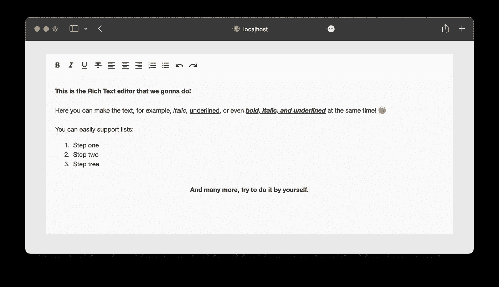
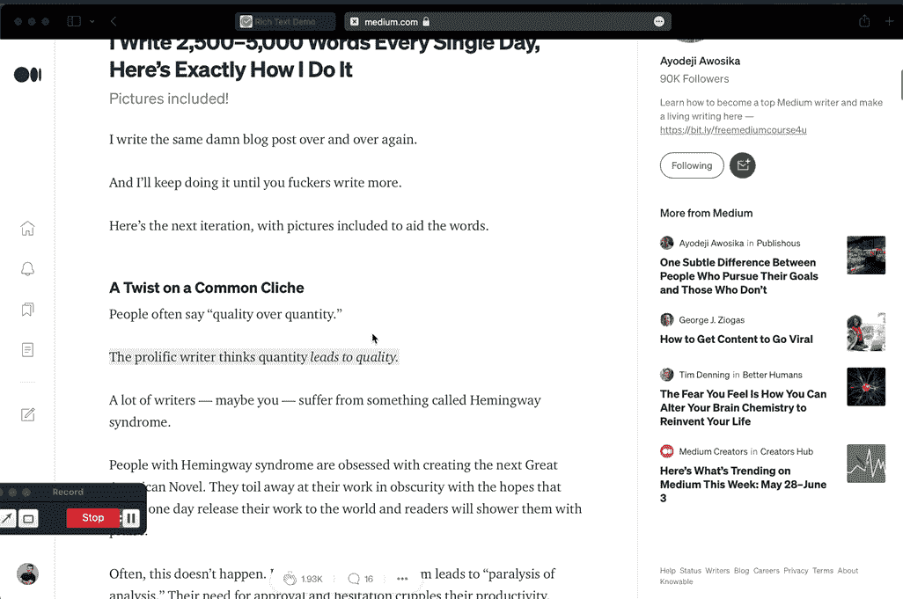

# 用 JavaScript 在 5 分钟内制作一个富文本编辑器

> 原文：<https://javascript.plainenglish.io/make-a-rich-text-editor-with-javascript-in-5-minutes-ee8025694e76?source=collection_archive---------1----------------------->

## 用 100 行代码制作富文本编辑器



This is what we are going to do!

我一直认为做富文本编辑器是火箭科学的事情😆。首先，我想到的是从一个不可见的`textarea`获取一个文本，并将输入的文本附加到输入后面的 HTML 中。当你选择某样东西时，用标签包装选择，或者用正则表达式替换它。但是一切都好办多了！

所有的神奇都是因为添加了一个属性`contenteditable=”true”`而发生的。您可以将它添加到任何元素中，这样该元素及其子元素就可以通过浏览器进行编辑。



Editable content in browser with contenteditable=” true”

如您所见，我们可以修改现有的元素。同样，当我们点击 enter 时，我们添加一个块元素`div`作为新的一行。但是，我们如何改变选定的文本，使一些词，例如，粗体或斜体？

## 如何实现富文本编辑器

最简单的方法就是用`document.execCommand()`。

*这里我不得不说一下* `*document.execCommand*` *是弃用的。一些浏览器不能标准化它，在文档中你会看到这个特性已经过时了。虽然它在某些浏览器中仍然可以工作，但是不鼓励使用它，因为它可以随时被删除。*

但是已经被弃用很多年了。**尽管如此，它没有替代品**，许多开发者**仍然在所见即所得编辑器中使用**它。

有了这个函数，要让选中的文字加粗，我们需要调用`document.execCommand('bold', false);`函数，就这样。

所以我们的任务是创建一个带按钮的工具栏。然后当用户按下它们中的任何一个时，调用一行代码。

现在，让我们创建一个富文本编辑器，作为带有一些格式按钮的定制组件。我喜欢 Lit 库，目前，它是我们演示的一个好选择。

我已经写了一些关于这个图书馆的文章。如果您还没有机会了解这个制作 web 组件的最有性能的库之一，下面是它们:

[](/5-reasons-why-you-should-try-litelement-in-your-next-project-b75f143fbb78) [## 你应该在下一个项目中尝试 LitElement 的 5 个理由

### 可能是构建 web 组件的最佳库

javascript.plainenglish.io](/5-reasons-why-you-should-try-litelement-in-your-next-project-b75f143fbb78) [](/state-management-for-complex-web-components-cb4e370bfd6e) [## 复杂 Web 组件的状态管理

### 如何在 LitElement 组件中使用 Redux

javascript.plainenglish.io](/state-management-for-complex-web-components-cb4e370bfd6e) 

## 用 Lit 库构建富文本 web 组件

这只是一个教程，所以我们将下载 [Lit 组件初学者工具包](https://github.com/lit/lit-element-starter-ts)以节省开发服务器配置的时间。解压缩文件夹并安装依赖项`npm i`。

此外，我们需要安装一个额外的包，用于简单地在按钮中显示材质图标。

```
npm i @material/mwc-icon-button
```

我们已经有了`src/my-element.ts`。我甚至没有改变班级的名字。我只是导入了图标组件，添加了一些样式，在渲染函数中，我添加了一个工具栏和标签，我们将在其中编辑文本。

为了渲染工具栏，我创建了一个包含材质图标名称和它们应该调用的命令的数组。

现在我们只需要修改图标导入和一些 CSS 样式的演示 index.html。

可以在 [**点亮的游乐场**](https://tinyurl.com/4dyckkhe) 上玩组件。

## 替代方法

似乎取代`document.execCommand`的将是[输入事件级别 2](https://w3c.github.io/input-events/) 。但是在将来和现在，它不包含撤销/重做这样的功能。

目前，还可以通过获取选择并将其包装到格式标签中来实现手动 HTML 修改。

比如类似这样的。

```
function bold() {
    const boldEl = document.createElement("b");
    const textSelection = window.getSelection();
    userSelection.getRangeAt(0).surroundContents(strongElement);
}
```

但它将只涵盖包装功能。要撤销更改，我们需要实现一些更复杂的东西。

如你所见，目前，在 2022 年，`document.execCommand`功能几乎是富文本编辑器的单一和直接的选择。

**感谢阅读！**

如果你喜欢我的帖子，出于某种原因，你还不是一个媒体会员，你可以支持我，并通过这个链接获得会员资格。

*更多内容请看* [***说白了。报名参加我们的***](https://plainenglish.io/) **[***免费周报***](http://newsletter.plainenglish.io/) *。关注我们*[***Twitter***](https://twitter.com/inPlainEngHQ)*和*[***LinkedIn***](https://www.linkedin.com/company/inplainenglish/)*。查看我们的* [***社区不和谐***](https://discord.gg/GtDtUAvyhW) *加入我们的* [***人才集体***](https://inplainenglish.pallet.com/talent/welcome) *。***