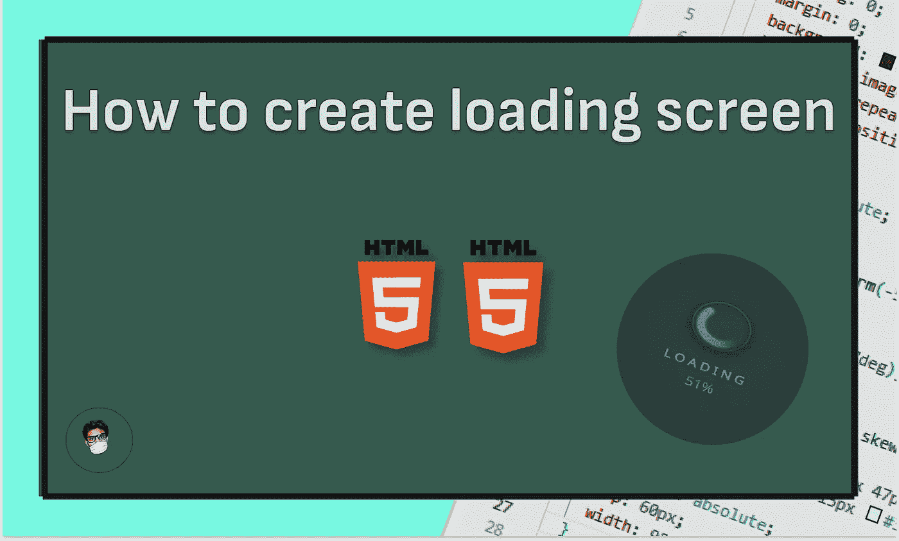

# 仅使用 CSS 和 HTML 制作动画加载屏幕

> 原文：<https://javascript.plainenglish.io/make-an-animated-loading-screen-only-using-css-html-ebcedcf48f96?source=collection_archive---------7----------------------->

## 一个关于如何使用 CSS 和 HTML 开发一个动画加载屏幕的教程

编写一个简单的加载屏幕很容易。但是编写一个可以移动的动画加载屏幕真的很有挑战性。

所以今天我将解释如何只用 CSS 和 HTML 开发一个动画加载屏幕。

我们走吧…😎

## 步骤 01

首先，创建一个 index.html 文件，并将代码放在下面:

## 步骤 02

请创建一个 style.css 文件，并将代码放在下面:

## 结论

希望你能够建设这个项目。请在评论中发表你的创新加载屏幕项目。

*如果你在实现这个过程中有任何困难或者需要任何帮助，请联系我。*😍

*更多内容看* [***说白了就是***](https://plainenglish.io/) *。报名参加我们的* [***免费周报***](http://newsletter.plainenglish.io/) *。关注我们关于* [***推特***](https://twitter.com/inPlainEngHQ) ， [***领英***](https://www.linkedin.com/company/inplainenglish/) *，*[***YouTube***](https://www.youtube.com/channel/UCtipWUghju290NWcn8jhyAw)*，以及* [***不和***](https://discord.gg/GtDtUAvyhW) *。对增长黑客感兴趣？检查* [***电路***](https://circuit.ooo/) *。*