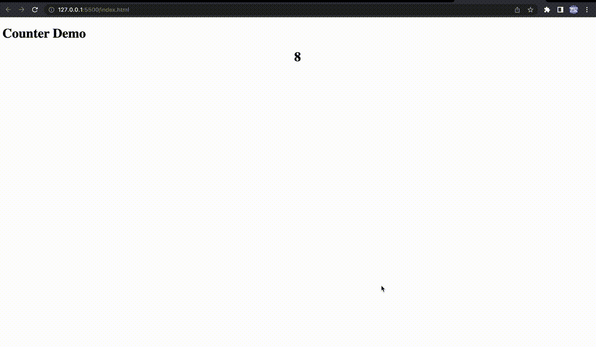

# 只需更改一行代码，即可访问动态 Web 内容

> 原文：<https://javascript.plainenglish.io/make-dynamic-web-content-accessible-with-a-one-line-code-change-7070e830d155?source=collection_archive---------3----------------------->

## 让 JavaScript 修改的文本内容可以被屏幕阅读器阅读


Photo by [Daniel Ali](https://unsplash.com/@untodesign_?utm_source=unsplash&utm_medium=referral&utm_content=creditCopyText) on [Unsplash](https://unsplash.com/s/photos/accessibility?utm_source=unsplash&utm_medium=referral&utm_content=creditCopyText)

许多 web 应用程序没有考虑可访问性的一个主要方面是应用程序中的那些区域，这些区域的内容由 javaScript 动态生成，并随着时间的推移而变化。

如果构建不当，在屏幕阅读器等辅助技术的帮助下与我们的产品进行交互的用户将无法访问这些内容，也无法获得这些内容发生变化的通知。

在这篇短文中，我们以 JavaScript 支持的计数器应用程序为例，通过修改底层模板来提高应用程序的可访问性。

# 不可访问的计数器应用程序:

让我们考虑以下简单的计数器应用:

这是一个简单的网页，DOM 元素中的计数将由添加到其中的 JavaScript 代码定期更新。

如果您在浏览器中打开这个 HTML 文件，您应该会看到如下内容:



Counter demo

一切看起来都很正常，所以让我们用 Mac 内置的画外音应用程序做一个快速的屏幕阅读器测试。

要打开画外音功能，请按`command+F5`键。现在你会听到有人大声朗读课文。但是您会注意到计数器上的数值不会被屏幕阅读器读出。这是因为内容是动态的，屏幕阅读器程序不知道这个事实。

让我们在下一节中解决这个问题。

# 使动态区域可访问:

我们可以通过使用语义 HTML 标签来快速解决上述问题。

因此，我们将修改以下部分:

```
<main>
   <h1>Counter Demo</h1>
   <div id="result"></div>
 </main>
```

如下图所示:

```
<main>
   <h1>Counter Demo</h1>
   <output id="result" aria-label="current count"></output>
</main>
```

现在，如果您再次运行相同的屏幕阅读器测试，您将听到应用程序在每次内容更新时读取更新的计数。

# 为什么有效？

它能工作的原因是大多数浏览器认为`<output>`标签是`aria-live`地区。因此，其中内容的任何变化都将被通知给辅助技术，使读者在应用程序中通过底层代码改变时读取改变的计数。

此外，我们还添加了`aria-label="current count"`，这样读者每次在阅读数字之前都会说，给用户一个数字是什么的上下文。

# 视频演示:

在我的频道上的这个 youtube 短片中，我添加了一个我们在这篇文章中讨论的内容的快速演示:

Dynamic Content Accessibility Demo

## 注意:

值得注意的是，`<output>`标签默认是一个内嵌标签。但是我们可以让它显示块，如果我们想，通过 CSS，正如我们在这个演示中所做的。

# 结论:

因此，我们已经看到了如何通过修改一行代码，让屏幕阅读器快速访问我们的动态内容。

如果你想看到更多这样的内容，可以考虑在 Medium 上关注我。

我也偶尔在我的 [Youtube 频道](https://www.youtube.com/channel/UClBKcKjVHWtePORTW1vJM8A)上发布有用的技术视频。

感谢你通读这篇文章，我希望你今天学到了一些新东西。我会在我的下一篇文章中告诉你们。

干杯:)

*更多内容看* [***说白了就是***](https://plainenglish.io/) *。报名参加我们的* [***免费周报***](http://newsletter.plainenglish.io/) *。关注我们关于* [***推特***](https://twitter.com/inPlainEngHQ) ， [***领英***](https://www.linkedin.com/company/inplainenglish/) *，*[***YouTube***](https://www.youtube.com/channel/UCtipWUghju290NWcn8jhyAw)*，以及* [***不和***](https://discord.gg/GtDtUAvyhW) *。对增长黑客感兴趣？检查* [***电路***](https://circuit.ooo/) *。*