# 让 React 应用更加动态

> 原文：<https://javascript.plainenglish.io/make-react-apps-more-dynamic-49c83944f6de?source=collection_archive---------8----------------------->

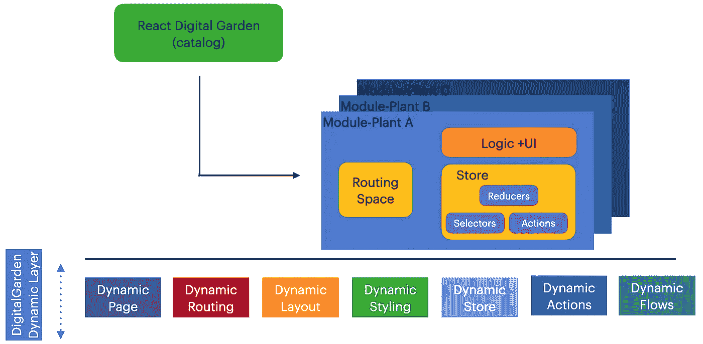

My Digital Garden Architecture ([https://onurdayibasi.dev/](https://onurdayibasi.dev/))

## 我的 REACT 数字花园

## 以更加灵活和可配置的方式编写您的前端应用程序。所以你可以重用很多组件而不需要改变代码库。

我想在这些文章中分享我在数字花园中的经历。也可以看第一篇[(设计可扩展的 React 应用架构)](/design-extensible-react-application-architecture-1c491e9ed525)

这个博客是关于动态性的。动态性意味着业务代码和组件产生的结果是延迟的。当有人使用该应用程序时，代码文件会动态加载，并与元数据结合，构建应用程序和业务逻辑。

为清晰起见，我将给出以下静态、动态用法示例；

# 函数调用

## 静态函数调用

```
import confetti from canvas-confetti
confetti()
```

**动态函数调用**

```
(async () => {
  const { default: confetti } = await **import**('https://cdn.skypack.dev/canvas-confetti');
  confetti();
})();
```

# 组件渲染

## **静态组件用法**

```
import **Calculator** from awesome-react-calculatorreturn (
  <>
     <Calculator />
  </>
```

## **动态组件用法**

```
const Calculator = ***React*.lazy**(() => **import**('https://cdn.skypack.dev/awesome-react-calculator'));
return (
  <>
      <React.Suspense fallback={<div>Loading...</div>}>
        <Calculator />
      </React.Suspense>
  </>
);
```

如上所述，静态代码开发更加简单易懂。我们将 npm 包下载到本地，然后构建并与 webpack 捆绑在一起。

> tada 应用程序已准备就绪。

**问题:**如果静态代码在 Web 应用程序开发中如此成功，我们为什么还要构建动态基础设施？

**答:**我们有时候需要运行时更大的灵活性。并且希望自动化 UI 和业务逻辑的生成。

*   **更少的代码:**因为我们可以处理不同的用例，而不需要用配置编码
*   **可重用性更高:**动态代码使用这种结构，您可以自动生成组件和代码，无需开发人员(无代码)
*   **更灵活:**你可以给一些编辑器，让领域专家快速设计他们的系统。
*   **未来技术:**网络技术越来越分散，每天都可以远程使用。云、SaaS、CDN、认证服务、DB 服务、工作流服务、邮件服务、计费服务都可以在线获得。

我们可以改进开发人员的环境，使其更加灵活。未来也许 Web 应用开发会类似于 Unity、Unreal 等游戏开发编辑器。

和很多游戏开发者一样，网页开发者不需要 HTML、CSS、JS、React 等。比如很多 Unity 或者虚幻编辑器用户不知道 3D 引擎细节；他们专注于编辑器的使用和游戏设计。

在我的数字花园里，只要有可能，我就把我的基础设施转换成静态→动态的 T21 结构。

我将这些转换应用于不同的领域

*   页面管理和路由
*   状态管理和消息传递
*   组件生成
*   后端集成
*   布局管理
*   组件样式
*   等等。

下图显示了我们试图动态构建的 WebApp 基础部分。

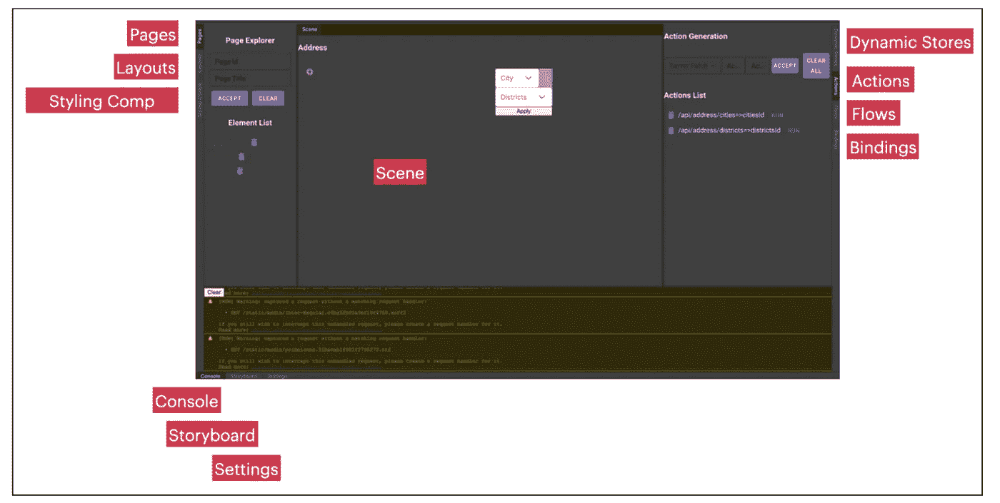

[https://onurdayibasi.dev/dynamic-data-table-binding](https://onurdayibasi.dev/dynamic-data-table-binding)

# A.页面管理和路由

在 Web 应用程序开发中，我们首先设计页面和 URL，然后考虑过渡。

在下面的应用程序中，您可以看到动态页面的创建和动态分配重定向按钮。

**演示:**https://onurdayibasi.dev/dynamic-route2

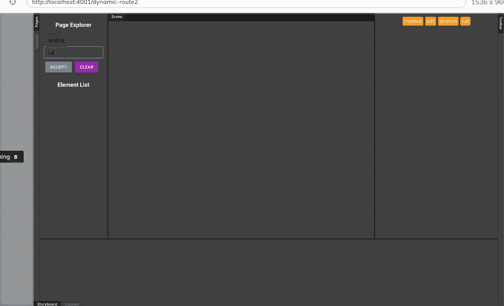

[https://onurdayibasi.dev/dynamic-route2](https://onurdayibasi.dev/dynamic-route2)

你可以在故事板上实时看到页面和这些页面之间的链接，从鸟瞰图看到你做的应用结构。

从上图可以看出，我们使他们能够在不开发任何代码的情况下完成以下技能 ***(针对公民开发者)***

*   动态页面生成
*   动态路由
*   动态导航按钮生成

那么，我们如何执行这个路由阶段呢？路由机制的结构是什么？

**演示样品；**

*   **悬念，动态加载:**https://onurdayibasi.dev/simple-calculator
*   **错误界限:**[https://onurdayibasi.dev/error-boundary](https://onurdayibasi.dev/error-boundary)
*   **主导航:**https://onurdayibasi.dev/
*   **未发现 404 错误:**https://onurdayibasi.dev/abcde

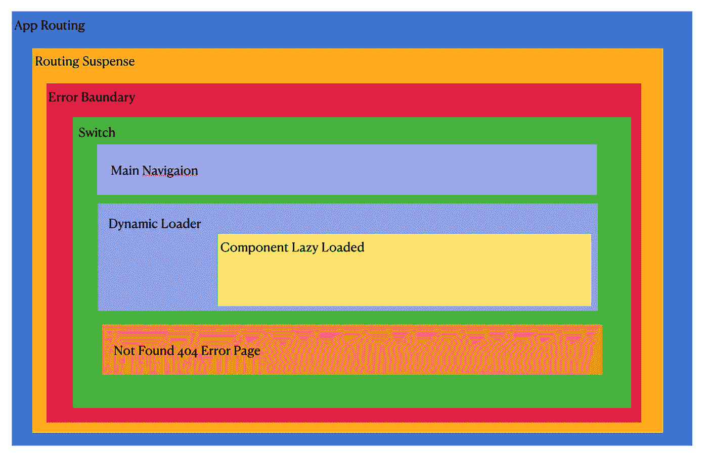

Dynamic Routing Structure

**App 路由:**保存动态 URL 路径和路由配置

```
**routes.barchart**: {
  path: '/barchart',
  title: 'Bar Chart',
  publishDate: '2021.10.25',
  moduleName: 'vis/chart/BarChartPage',
},
```

*   **路由暂停:**在加载状态下，当一个 React 组件加载延迟时，屏幕显示回退组件

```
<React.Suspense fallback={<div>Loading...</div>}>
```

*   **错误边界:**当页面或组件渲染失败时，Error Boundary 句柄抛出错误，屏幕显示回退组件

```
<ErrorBoundary fallback={<p>Page Rendering Exception</p>}>
```

*   **开关。**它的独特之处在于它专门渲染了一条路线*。相比之下，每一个与位置匹配的`<Route>`都包含地渲染*。考虑这些路线:**

```
**<Switch>**
```

*   ****主导航:**首页导航。根路径生成 MainNavigationPage 及其静态。**

```
**<Route exact path={'/'} key={'main-navigation-page'}>
  <MainNavigationPage />
</Route>**
```

*   ****DynamicLoader 和 LazyLoad:** 动态加载页面**

```
**{***Object***.values(***routes***).map(el => (
  <Route exact={!el.nested} 
         path={el.path} 
         key={el.path} 
         component={***React***.lazy(() => import(`...`))} />
))}**
```

*   ****404 错误页面处理****

```
**<Route path={'*'} key={'404-page'}>
  <NotFound404Page />
</Route>**
```

# **B.状态管理和动态存储**

**我在数字花园中使用 Redux 进行状态管理。Redux-Thunk，Redux-Saga，Redux-Promise 等。，中间件存在。**

****通量架构****

**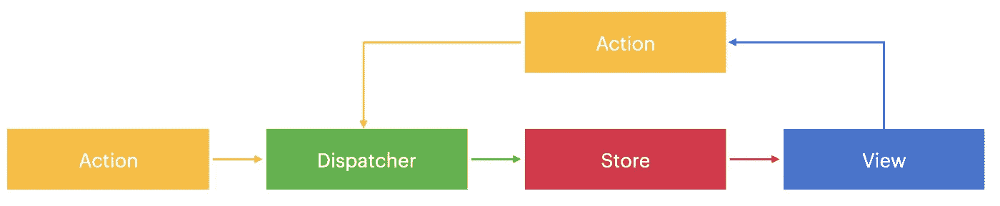**

**Flux Architecture**

*****添加中间件(Redux Thunk，Promise，Persister，Websocket。)来还原*****

**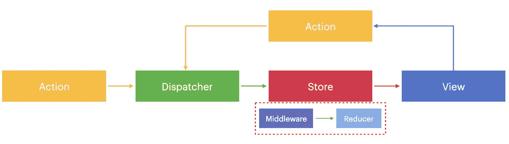**

**Flux Architecture with Middleware**

**以下组件由容器(HoC)包装——用于通信冗余存储、历史和 WebAPI 的高阶组件结构。**

**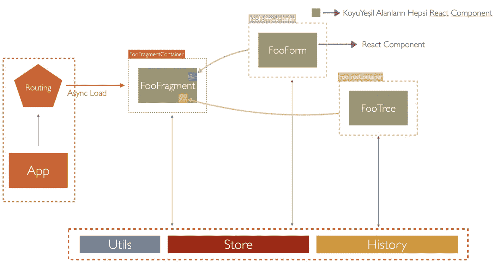**

**React Project Structure**

**让我们仔细看看这个结构中的组件是如何与周围环境通信的。围绕一个组件**

*   **DOM 更新**
*   **URL 更新**
*   **后端集成**
*   **等等。**

**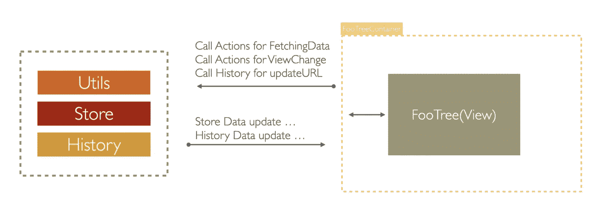**

**Container & Component Mechanism**

**我们使用容器来重用现有项目中的组件，并使它们远离业务逻辑。因此，我们可以选择在不同的领域使用相同的元素。**

**作为反思，我们需要为每个组件创建一个或多个静态容器。因此，我们必须管理大量包含不同业务逻辑的容器组件。**

**减少集装箱组件代码。我们如何使它可配置和动态？**

**下面的 **DynamicContainer** 将根据分配的道具、样式和事件元数据自动运行业务逻辑**

**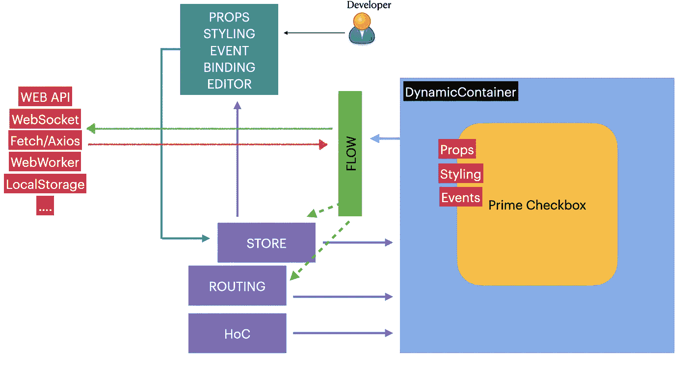**

**在下面的示例中，您可以看到我们如何使用 DynamicCounter 和 DynamicForm 结构动态创建商店链接组件。**

****试玩:**【https://onurdayibasi.dev/dynamic-counter3】T4**

**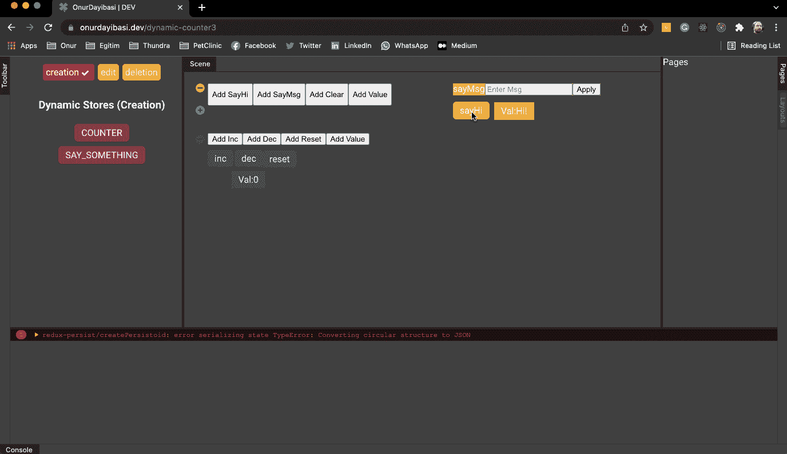**

**[https://onurdayibasi.dev/dynamic-counter3](https://onurdayibasi.dev/dynamic-counter3)**

# **D.动态后端集成**

**如果我们希望我们的应用程序与后端集成并动态拉取数据，我们需要后端服务，但我不想与云和后端打交道，所以我使用 [***MSW(模拟服务工作者)***](https://mswjs.io/)*来模拟后端。***

***关于这个话题我想举两个例子。***

*   ***使用 API 提取城市、地区和邻近地区的数据，并将所需的下拉组件指定为源***
*   ***将提取的用户信息绑定到数据表。***

*****用城市、地区、社区填充下拉列表*****

*   *****演示:**[https://onurdayibasi.dev/form-dynamic-binding](https://onurdayibasi.dev/form-dynamic-binding)***

***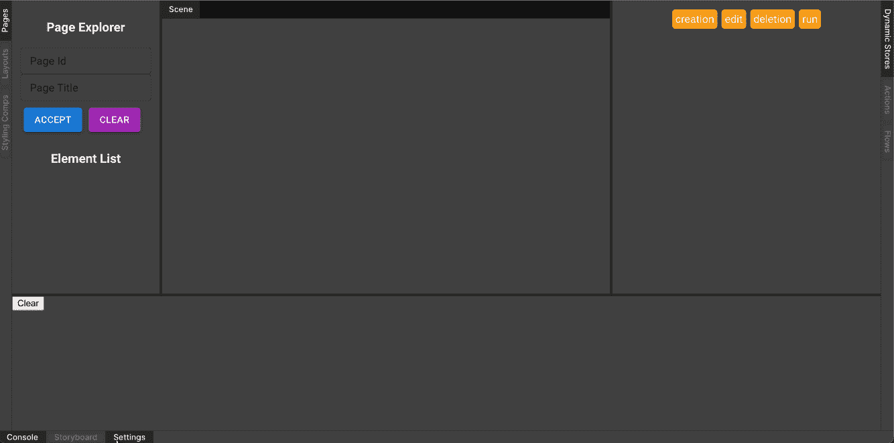***

***[https://onurdayibasi.dev/form-dynamic-binding](https://onurdayibasi.dev/form-dynamic-binding)***

*****用用户数据填充数据表并隐藏某些列*****

*****演示:**https://onurdayibasi.dev/dynamic-data-table-binding***

***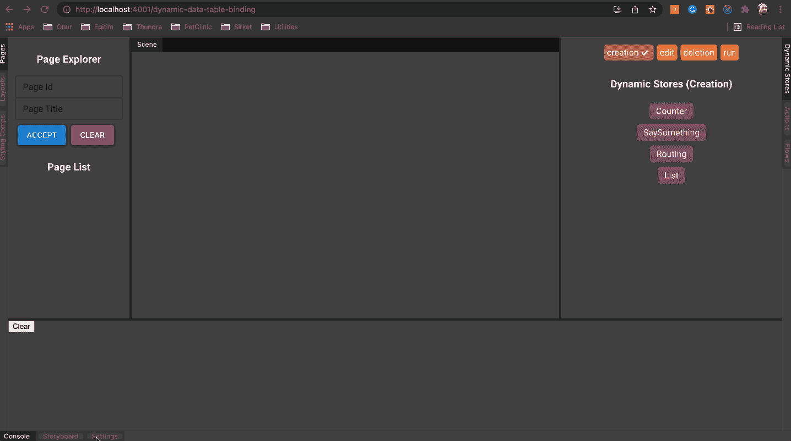***

***[https://onurdayibasi.dev/dynamic-data-table-binding](https://onurdayibasi.dev/dynamic-data-table-binding)***

***我们需要许多动态生成的组件、编辑器和代码单元来创建这样的结构。***

*****BindedFactory:** 我们需要创建动态特性，所以我们编写 BindedFactory 类型来创建与 Redux Store、React Router 等常用机制连接的业务逻辑。例如，计数器工厂、页面工厂、路由工厂、表单工厂***

****DynamicStore(Container+Comp):**由 BindedFactory 创建的 dynamic store 组件由 3 层组成。**

*   ****动态存储(蓝色层):**它提供了一个具有存储和历史组件的集成结构。**
*   ****可编程(黄色层):**该层根据其元数据知道如何使用第三方组件。**
*   ****第三方 UI 组件库(绿色层):**第三方 UI 组件库层。(PrimeReact，Material UI，Ant Design，Semantic 等。)**

****

**Dynamic Store**

****编辑器:**这些是带有配置参数的编辑屏幕，开发者可以在这里从 UI 定义业务逻辑和组件相关的配置。**

**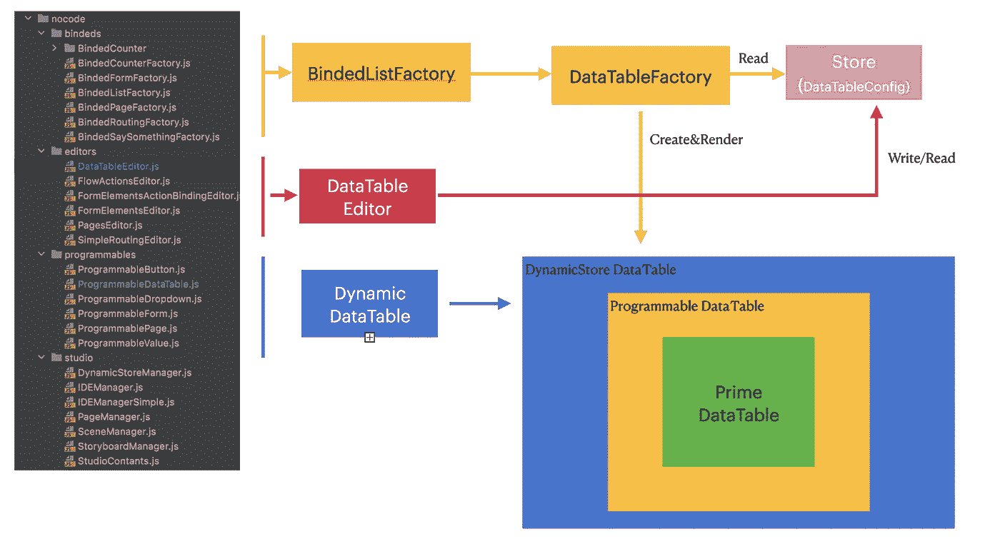**

**Dynamic Store Factory and Editor Structure**

# **E.动态布局**

**Web 应用程序页面可能有不同的布局要求。在动态布局中，我们的目标是以最小的努力实现可重用和可配置的布局结构。**

## **制作您自己的布局**

**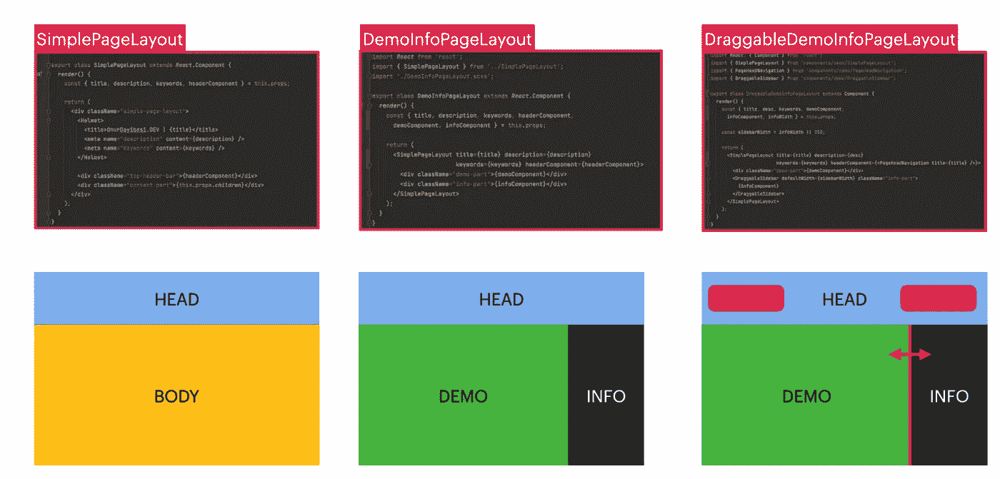**

**Demo Layouts**

*   ****简单页面布局:**[https://onurdayibasi.dev/](https://onurdayibasi.dev/)**
*   ****deminfopagelayout:**https://onurdayibasi.dev/option-selector**
*   ****DraggableSideBarLayout:**[https://onurdayibasi.dev/rerender-with-use-memo](https://onurdayibasi.dev/rerender-with-use-memo)**

## **侧面菜单布局**

**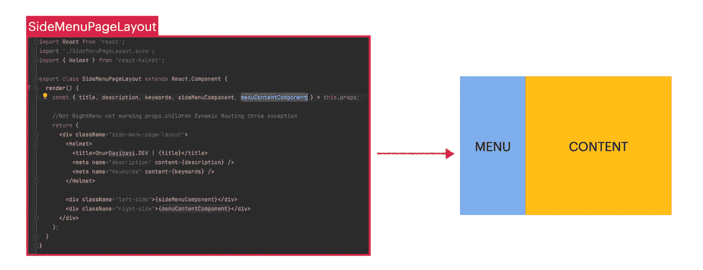**

**Side Menu Layouts**

*   **[https://onurdayibasi.dev/side-menu-layout](https://onurdayibasi.dev/side-menu-layout)**

## **仪表板布局**

**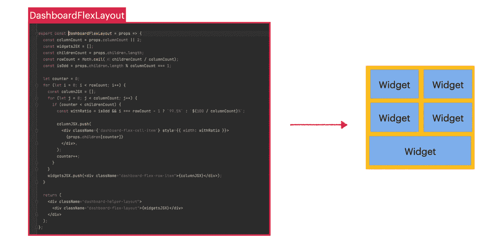**

**Dashboard FlexLayout**

*   **[https://onurdayibasi . dev/dashboard-simple-layout-with columns](https://onurdayibasi.dev/dashboard-simple-layout-with-columns)**

## **游戏布局**

****经典游戏棋盘:**每个游戏都有布局。其中一些是像(俄罗斯方块)这样伟大的布局，而另一些是小的(井字游戏)。所有老式的 80 年代 90 年代游戏都使用像素进行设计。在这个例子中，我试图构建不同的游戏布局。**

****演示:**https://onurdayibasi.dev/classic-game-board**

**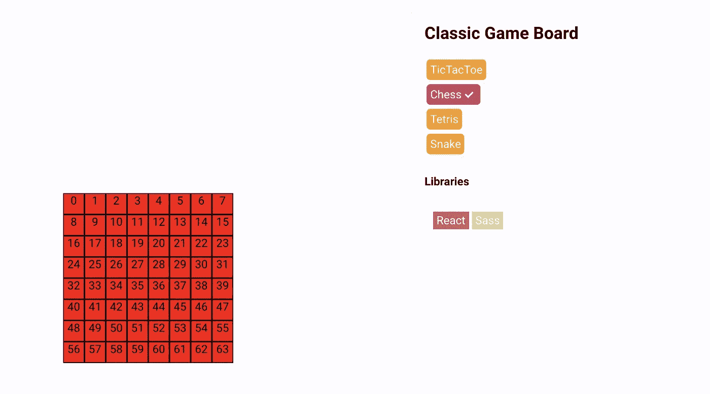**

**[https://onurdayibasi.dev/classic-game-board](https://onurdayibasi.dev/classic-game-board)**

****可滚动游戏板:**部分游戏布局幻灯片为 x 轴或 y 轴。我们将这类游戏定义为侧面滚动游戏(例如**【超级马里奥】*)或垂直滚动游戏(河流突袭)***

****演示:**https://onurdayibasi.dev/scrollable-game-board**

**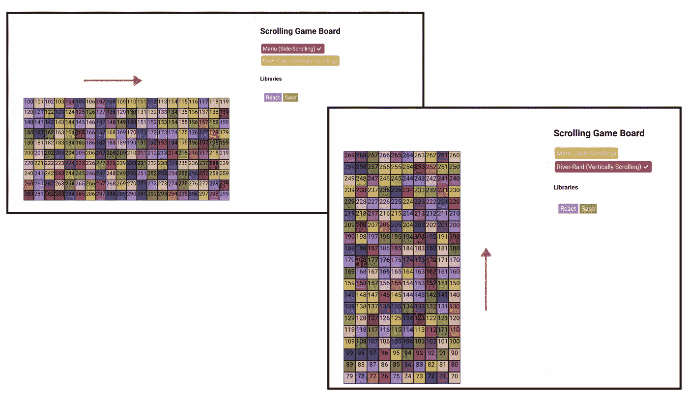**

**[https://onurdayibasi.dev/classic-game-board](https://onurdayibasi.dev/classic-game-board)**

## ****智能布局****

**SmartLayout 是一个 flexbox，用户在运行时设计它，并保存下来供以后使用。它还帮助用户创建漂亮的页面设计。**

****试玩:**【https://onurdayibasi.dev/smart-layout】T2**

**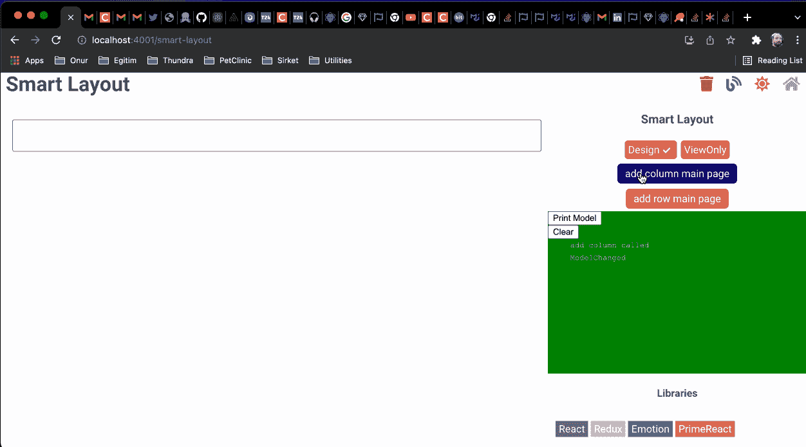**

**[https://onurdayibasi.dev/smart-layout](https://onurdayibasi.dev/smart-layout)**

# **让我们继续阅读😃**

**如果你喜欢这个故事，你可以在这个链接 找到类似的样本和作品 [**👏👏和分享。**](https://onurdayibasi.com/react-lab/?49c83944f6de)**

***更多内容看* [***说白了。报名参加我们的***](https://plainenglish.io/) **[***免费周报***](http://newsletter.plainenglish.io/) *。关注我们关于*[***Twitter***](https://twitter.com/inPlainEngHQ)*和*[***LinkedIn***](https://www.linkedin.com/company/inplainenglish/)*。加入我们的* [***社区***](https://discord.gg/GtDtUAvyhW) *。*****