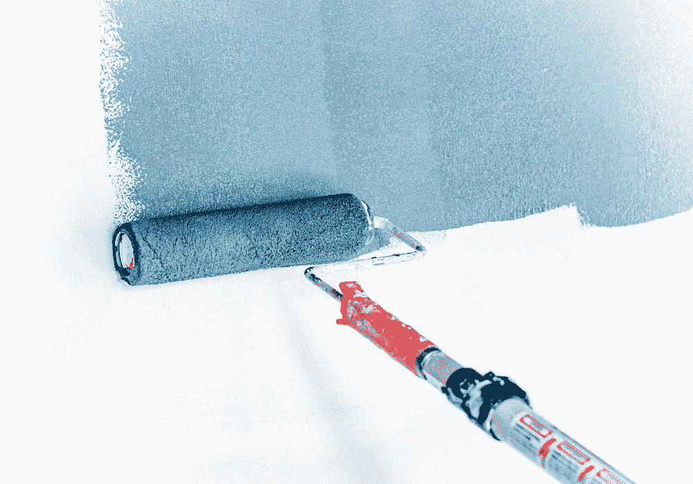
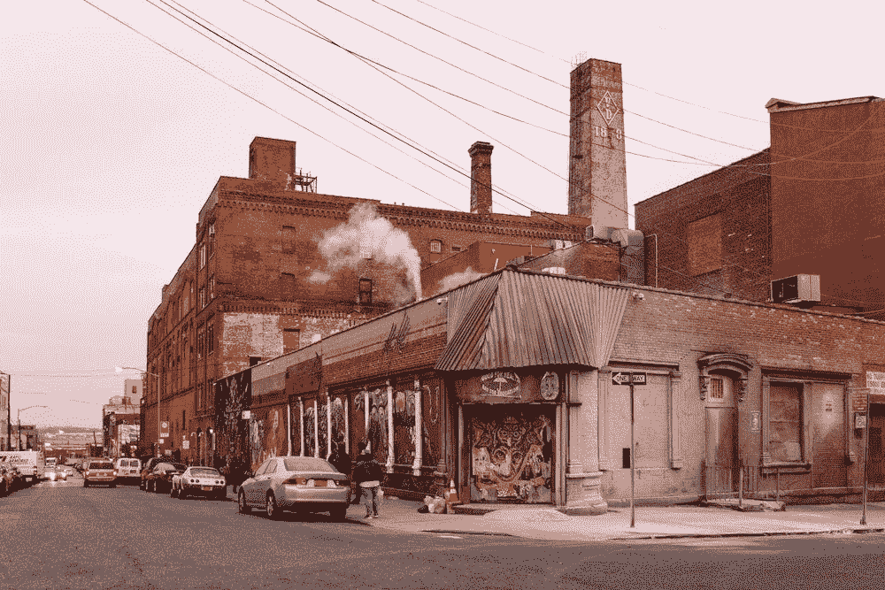

# 只用 CSS 制作一些背景悬停效果

> 原文：<https://javascript.plainenglish.io/make-some-background-hover-effects-using-only-css-acd51775d9aa?source=collection_archive---------4----------------------->

## 关于如何用 CSS 制作一些有益的背景效果的教程。



Photo by [Theme Photos](https://unsplash.com/@themephotos?utm_source=unsplash&utm_medium=referral&utm_content=creditCopyText) on [Unsplash](https://unsplash.com/s/photos/paint-wall?utm_source=unsplash&utm_medium=referral&utm_content=creditCopyText)

在这篇文章中，我将向你展示用`background-position`、`background-size`和`backgroud-image`制作一些有益的悬停背景效果的方法。

# 了解如何进行“背景-职位”工作

在今天构建我们的演示之前，让我们学习如何`background-position`使用百分比值。因为在本文中，我们将使用百分比值来构建几乎所有的演示。

第一，`background-position`和`position`的工作方式不一样。下面我将展示一张关于`position`如何使用`top`和`left`的图片:


在此示例中，我们可以看到，当我们想要定义从“元素 B”到“元素 A”的左上方的空间范围时，您可以将我们的范围值定义为 CSS，如下所示:

```
{
  top: 100px;
  left: 50px;
}
```

与`position`不一样，`background-position`用另一种方式工作。从背景到元素的空间范围将按以下方式计算:

```
(container width - image width) * (position x%) = (x offset value)
(container height - image height) * (position y%) = (y offset value)
```

为了更容易理解，您可以在此图中看到一个示例:


在这个例子中，我将“背景-位置左侧”的值定义为“100%”，从图像到左侧的范围值是 50%。请记住这个公式，因为我们将在本文的许多示例中使用它。

# 带有“背景尺寸”的简单悬停效果

这是理论！让我们开始构建一些只有`background-size`和`background-position`的基本例子。我们将通过改变背景图像的宽度或高度的值来制作四个背景悬停效果的例子。在这些例子中，我们将使用背景图像作为带有`linear-gradient`的绿色背景。

```
background: linear-gradient(#488566 0 0);
```

让我们从第一个也是最简单的例子开始。这是一个文本，当它悬停时，它将从左到右填充背景颜色。为此，我们只需从`background-size` 0%开始，并在`:hover`中将该值设置为 100%。为了使这个动画平滑地变换，我们需要为过渡时间设置一个值，在这里我把它设置为“0.4s”。

让我们看看我们的结果:


就是这么简单！在上面的例子中，我们通过改变`background-size`的宽度制作了悬停效果。如果我们改变高度而不是宽度会发生什么？让我们看看这段代码及其结果:


有用！我觉得毫不费力。要不要做和上面例子相反的类似例子？背景颜色将从右到左、从下到上填充。为此，我只需要将`background-position`设置为 100%，以确保背景总是在元素的底部或右边。这些情况有两个例子:


你看到了吗？只需要改变值`background-position`，我们可以扭转悬停效果。在下一部分，我们将试着用`transitions`做一些例子。这是这部分的笔:

# 使用单个过渡属性制作效果

在上面的例子中，我们用`background-size`和`background-position`制作了“回头”效果。在这一部分，我们将建立“单向”效果，它不像“回头”效果。这里有一个小例子，当元素悬停时，背景颜色将从左向右填充，如果元素没有悬停，则从左向右移除。


为了制作这些悬停效果，我们需要修改上面例子中的`transition`和`background-position`。为了更容易理解，我将在这里一步一步地制作和解释一个例子。

我选择的例子是从左到右的“单向”悬停。在这种效果下，我们有五种状态“悬停前”、“开始悬停”、“完成悬停”、“开始解除悬停”和“解除悬停”。


要做到这一点，我们需要编译上面的两个例子。在“开始悬停”阶段，背景颜色需要从左向右填充。为此，我们将填充 0%到 100%的背景尺寸，并将`background-position`设置为 0%。在“开始脱离”中，我们将把`background-size`从 100%设置为 0%，而`background-position`将被设置为 100%。这一步很重要的一点就是`transition`。如你所见，我们只是想通过改变背景尺寸来制造一种效果。这意味着我们只需要设置`background-size`的过渡时间。下面是这个悬停和结果的 CSS 代码:


效果很好。你想知道如果我们不为所有属性设置`transition`会发生什么吗？让我们看看:


这种效果是混乱的，因为`background-size`和`background-position`的转换同时发生。这就是为什么我只为`background-size`设置了`transition`。请注意，请思考我们需要进行哪些转换才能产生效果。在进入下一部分之前，我将尝试完成这一部分中的其余示例。


我想你在理解了这部分的第一个例子之后就可以轻松做到了。在这一部分中，我们已经学习了如何使用单个过渡属性来制作效果。在下一部分，我们将编译许多转场属性和`delay`来制作一些令人敬畏的悬停效果。

如果你想测试或修改一些东西，让我们检查一下这支笔。

# 制作具有多个过渡属性和延迟的效果

在上面所有的例子中，我们只用一个属性效果来制作效果。在这一部分，我们将学习如何用许多过渡属性来制作一个效果，并用`delay`来控制它们。让我们来看看我们将在这一部分构建的示例。


我认为这是有趣的效果。要制作它们，我们只需要`background-position`、`background-size`和`transition`。不需要`before`、`after`、子元素之类的东西。正如我们在照片中看到的，我们需要在悬停效果中做出两个动作。第一个动作是在文本下画线，这一行将从左到右填充。第二个动作是从下到上用颜色填充元素的其余部分。

在编码之前，我觉得我们需要对这个效果做一个思路。因为我们只用一个背景，所以在这种情况下不能对一个属性做两次变换。所以我又有了一个想法，用`background-position`和`background-size`做这个效果。在我的想法中，我们需要定义一个高度值很小的背景(可能是 0.1 雷姆)。这个背景将被放在元素之外，就像下面带有`background-position`的照片。


现在，我们将计划悬停效果。为此，我们将采取两项措施。第一个动作是将背景移动到元素内部。第二个动作是用`background-size`从底部到元素的其余部分填充背景。


让我们遵循这个计划。开始第一步，在元素外面做一个背景。因为`background-position`不像`position`，所以我们不能设置负值把背景移到元素外面。还记得背景的 x 偏移量和 y 偏移量的计算方法吗？我再次把它放在这里:

```
(container width - image width) * (position x%) = (x offset value)
(container height - image height) * (position y%) = (y offset value)
```

在此基础上，让我们找到符合方程`(100% — x) * y = -x`的值，x 的值大于零。我们有许多符合这个等式的值。但我会为 x 选择 200%，为 y 选择 200%。这意味着我们将有`background-size`的值是“200% 0.1rem”，而`background-position`是“200% 100%”。这是这一步的照片:


让我们转到悬停步骤。第一个动作是将背景移动到元素内部。基于等式`(100%-200%) * y = 100%`，我们可以很容易地找到 y 的值，“100%”。关于`background-size`，我们只需要将数值从“0.1rem”提升到“100%”。关于`transition`，如果要在多个进程中运行多个属性，可以定义`delay`值。在我们的例子中，我们希望首先运行`background-position`的转换，我们只需要将延迟时间`background-size`设置为与`background-position`的持续时间相同的值。以下是我的代码:

让我们来看看结果:


我认为我们的想法和我们计划的一样好。基于这个例子，我认为我们可以很容易地制作从右到左填充背景的悬停效果。我们需要改变的是背景的位置(`background-position`值)。如果我们想把背景移出右边的元素，我们只需要稍微修改一下上面的等式。这里将是`(100%-x) * y = x`。我们可以发现 x 和 y 分别是“200%”和“-200%”。这是我们进行这种改变的代码。

这里我们得到了结果:


我想我们可以进入下一部分，我们将使用多种背景。这是这支笔的其他例子:

# 制作一些多背景的悬停效果

从第一部到上一部，我们只做一个背景，做悬停效果。在这些例子中，我们可能看到的基本流程是将背景从一个地方填充到元素的其余部分。我猜你有一些以前在很多地方发生的背景效果。在这一部分中，我们将制作一些类似于多重背景的悬停效果。如果你理解了前面的部分，你就可以轻松地演奏这一部分。

要定义多个背景，我们只需对单个背景做同样的处理。这些背景由逗号“，”分隔。下面是一个示例代码和结果。


使用多种背景可以帮助我们将悬停效果编译成一种效果。我想我们可以从上面的例子中总结出两个基本的例子。我们要制造一些效果。


在第一个例子中，我们只需要编译“用`background-size`实现简单悬停效果”部分的两个例子。第一个背景将从左向右开始，第二个背景将从右向左开始。很简单，让我们看看代码:

在这段代码中，我使用宽度值“51%”，因为我们不需要在每个背景中填充所有的元素内容。

我们也用同样的方法处理第二个例子，只需要编译上面的两个例子。下面是我的代码和它们的结果:


这种方式也适用于有许多过渡和延迟的悬停效果。下面我们来编译一下边框例子吧！


这是一个可怕的悬停效果。只需使用`background`，不需要任何`before`、`after`或 Javascript…

以下是上述示例的笔:

# 结论

这篇文章里有我想分享的所有东西。希望我给这篇文章带来的对你有帮助。感谢阅读。



Photo by [Robert Katzki](https://unsplash.com/@ro_ka?utm_source=unsplash&utm_medium=referral&utm_content=creditCopyText) on [Unsplash](https://unsplash.com/s/photos/smoke-run?utm_source=unsplash&utm_medium=referral&utm_content=creditCopyText)

通过 [Linkedin](https://www.linkedin.com/in/thaisangnguyen3894/) 或 [Twitter](https://twitter.com/tasyit) 联系我。

*更多内容看* [***说白了。报名参加我们的***](https://plainenglish.io/) **[***免费周报***](http://newsletter.plainenglish.io/) *。关注我们关于* [***推特***](https://twitter.com/inPlainEngHQ) ，[***LinkedIn***](https://www.linkedin.com/company/inplainenglish/)*，*[***YouTube***](https://www.youtube.com/channel/UCtipWUghju290NWcn8jhyAw)*，以及* [***不和***](https://discord.gg/GtDtUAvyhW) *。***