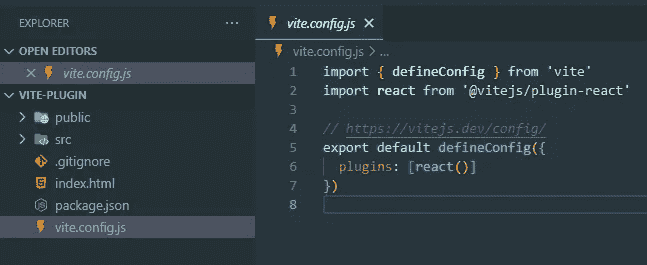
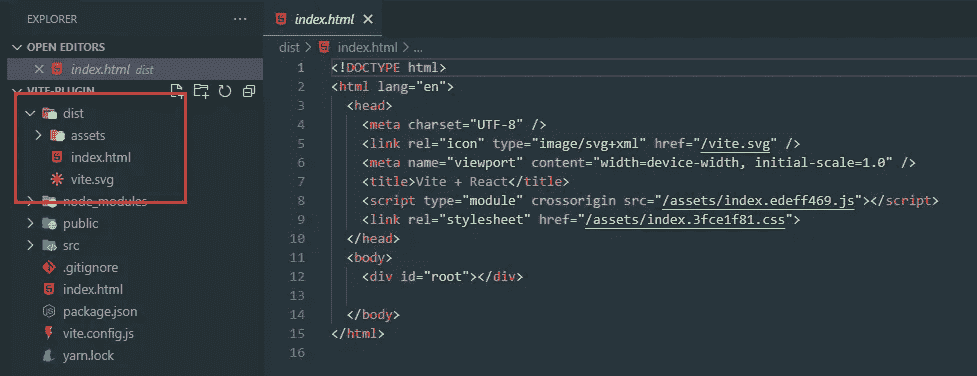
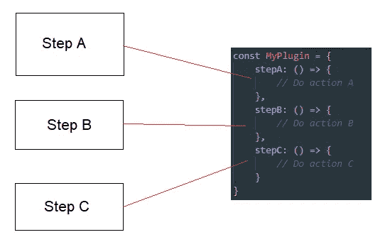
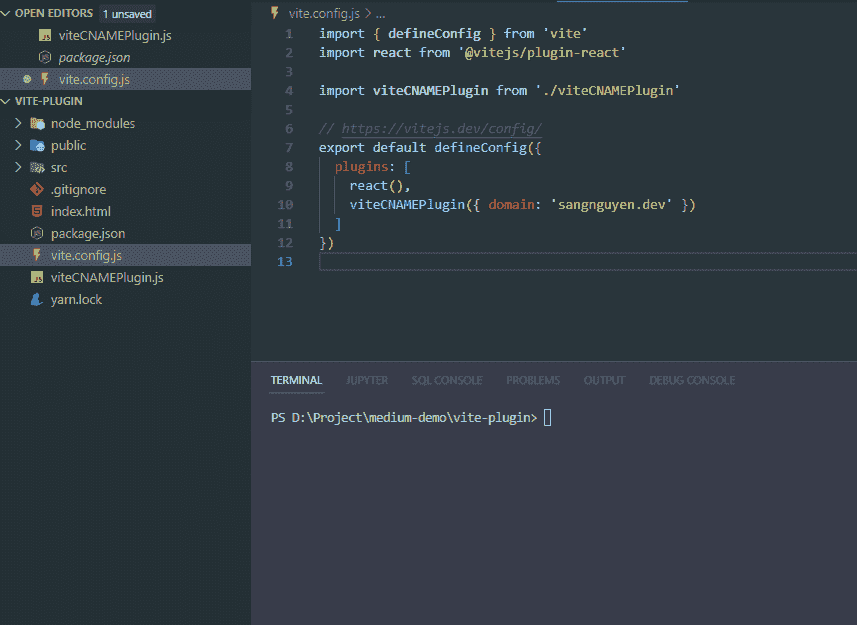
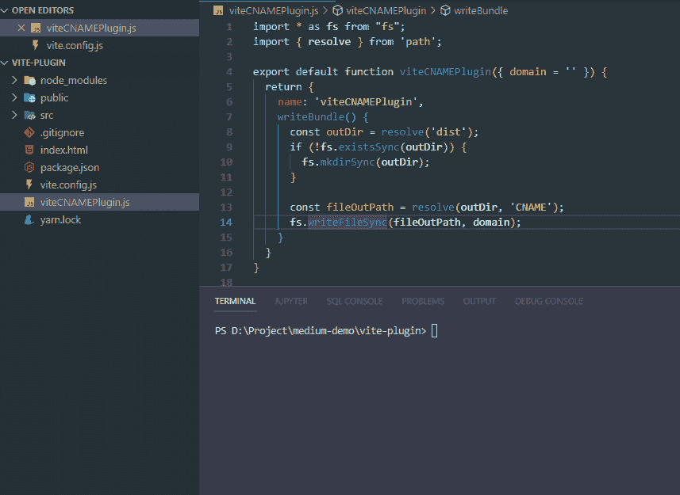
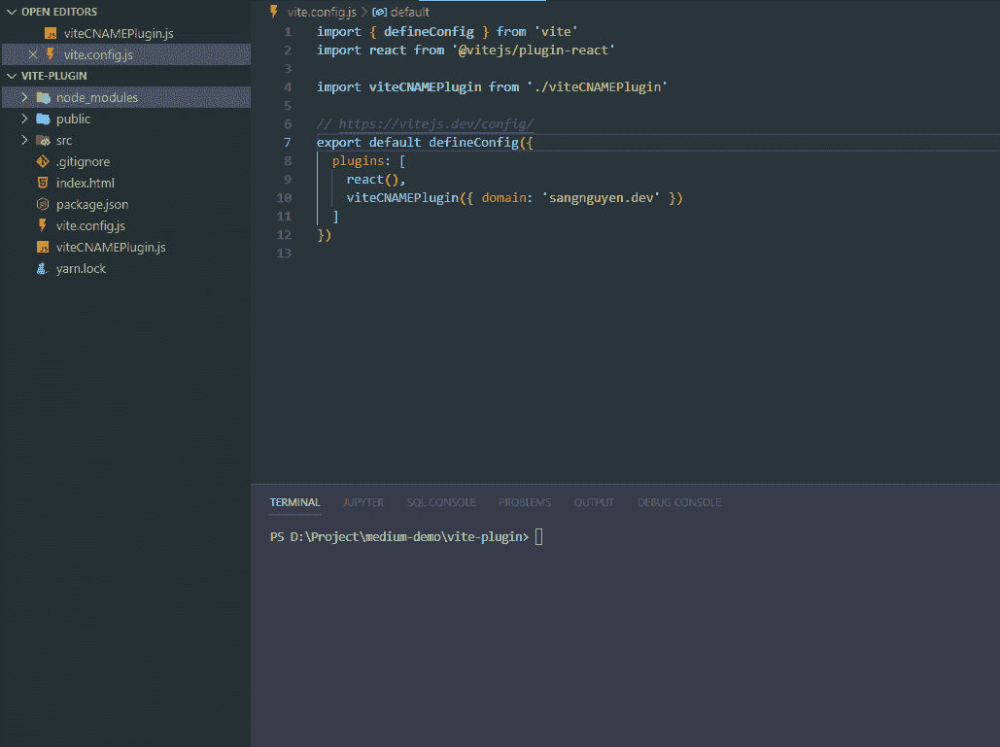

# 制作你的第一个 Vite 插件

> 原文：<https://javascript.plainenglish.io/make-your-first-vite-plugin-de5a37ad9fa9?source=collection_archive---------4----------------------->

## 如何制作一个简单的 Vite 插件的指南


Photo by [Josh Withers](https://unsplash.com/@joshwithers?utm_source=unsplash&utm_medium=referral&utm_content=creditCopyText) on [Unsplash](https://unsplash.com/s/photos/sugarcane?utm_source=unsplash&utm_medium=referral&utm_content=creditCopyText)

对于现代 web 项目来说，Vite 是一个不可思议的构建工具。除了基本的配置，Vite 还让我们用第三方插件做更多的事情。在本文中，我将向您展示一种编写 Vite 插件的最简单的方法。

# 我们要做的插件是什么？

在开始构建一个 Vite 插件之前，我先来谈谈这个插件的主要特性。你知道 CNAME 吗？如果你不知道，你可以看看这里。

 [## CNAME 记录-维基百科

### 规范名称记录(缩写为 CNAME 记录)是域名系统(DNS)中的一种资源记录，它…

en.wikipedia.org](https://en.wikipedia.org/wiki/CNAME_record) 

我们需要创建一个 CNAME 文件来使我们的自定义域工作。这意味着“dist”或“build”目录需要包含这个文件。在 Vite 项目中，我们可以通过在“public”目录中创建 CNAME 文件来轻松实现。但是因为我们在这篇文章中需要做一个 Vite 插件，所以我将为我们的插件选择这个主题。有了这个插件，我们可以自动生成 CNAME 文件，只需要在`vite.config.js`中定义一个域。除了不需要创建一个文件，这个插件允许用户把一些逻辑来定义一个域名是条件，环境…

# 创建一个 Vite 项目

我想我们将从一个基本的步骤开始——创建一个 Vite 项目。我们有很多方法来创建一个 Vite 项目。在本文中，我将通过`yarn create`命令使用一种最简单的方法。我将使用 React 模板创建一个 Vite 项目(可以使用 Vue、其他模板，也可以不使用模板)。我将使用 React 模板运行这个命令来创建一个 Vite 项目:

```
yarn create vite vite-plugin --template react
```

以下是此命令创建的项目:



我们可能会在一个`vite.config.js`文件中看到插件列表。我们已经有了添加的`react`插件。我们将创建一个新的插件，并像这样把它添加到这个列表中。让我们运行构建命令来看看`yarn build`命令的结果。



如您所见，我们将获得目录“dist ”,其中包含所有项目的输出文件。我们插件的任务是在构建过程中自动在这个目录下创建一个 CNAME 文件。我们开始吧！

# 让我们创建我们的插件

在这一步，我们将看看制作一个 Vite 插件的方法和基本原理。基于 Vite 文档，我们可以看到 Vite 插件格式是一个对象。在这个对象中，我们可以定义我们的插件动作。但是 Vite 也建议我们应该创建一个返回实际插件对象而不是普通对象的工厂函数。因为该函数可以接受允许用户定制插件行为的选项。所以在本文中，我将把我们的插件定义为一个工厂函数。我将在根目录下的“viteCNAMEPlugin.js”文件中创建我们的插件。下面是它的源代码:

要使用这个插件，我们只需要将它添加到`vite.config.js`中的插件数组中。

我将再次运行`yarn build`命令。让我们看看结果:


它运行成功。下一步，我们将在 Vite 插件开发中使用“钩子”。

# 用钩子来实施我们的行动

在前一部分中，我们知道 Vite 插件被定义为一个对象。在这一部分，我们将使用这个对象。首先，我们需要了解 Vite 中的“构建钩子”。

每次我们运行 build 命令时，Vite 都会运行许多步骤来完成这个过程。每个步骤都有它的任务(例如:准备构建、加载配置、构建、捆绑…)。Vite 为我们提供了构建钩子，它对应于构建过程中的构建步骤。通过这些挂钩，我们可以将我们的操作添加到构建过程中。这是它的一个示例图片:



在 Vite 中，我们有通用挂钩和 Vite 专用挂钩。在本文中，我们将使用通用钩子和 Vite 特定钩子中的两个钩子。

关于通用钩子，Vite 文档是这样写的

> 在开发过程中，Vite dev 服务器创建了一个插件容器，它以与 Rollup 相同的方式调用 [Rollup 构建钩子](https://rollupjs.org/guide/en/#build-hooks)。

这意味着我们可以遵循 **Rollup.js** 中的构建钩子来定义我们的动作。你可以看看这个页面:

 [## 卷曲

### Rollup 是 JavaScript 的一个模块捆绑器，它将小段代码编译成更大更复杂的代码…

rollupjs.org](https://rollupjs.org/guide/en/#build-hooks) 

在我们的插件中，我将使用钩子“writeBundle”来生成 CNAME 文件。我选择这个钩子，因为这是输出生成阶段的最后一个钩子。我认为这是一个很好的阶段来生成我们的 CNAME 文件。为此，我们只需要在我们的对象插件中添加一个新的属性。属性名是“writeBundle ”,属性值是函数。在这个函数中，我们将在构建目录中创建一个 CNAME 文件。这很容易做到，下面是我们添加这个属性后我的插件源代码:

这是一个简单的函数。它的任务只是在该位置创建一个新文件”。/dist/CNAME”，因为内容是来自“域”的值。来测试一下吧！



效果很好！在 dist 目录中创建内容为“sangnguyen.dev”的 CNAME 文件。我认为我们在这篇文章中达到了目标。我们已经创建了一个插件，允许用户可以自动创建 CNAME 文件。但是你还记得我上面说的吗？我说过我们将同时使用通用钩子和 Vite 特定钩子。目前，我们只使用通用钩子中的一个钩子“writeBundle”。在下一部分中，我们将使用一个特定于 Vite 的钩子。

# **用** `**configResolved hook**`优化我们的插件

在这一部分的标题中，我提到了“configResolved”钩子。这是 Vite 特有的挂钩之一。但是在玩这个钩子之前，我们先来说说我们插件不好的地方。在我们的插件中，我们将构建目录固定为“dist”。如果用户更改了`outDir`，就会出现问题。让我们在这里看看这个演示:



如你所见，问题正在发生。构建命令完成后，我们有两个目录。一个是输出代码。一个是只包含 CNAME 文件的“dist”目录。我们有许多方法来解决这个问题。其中之一是给我们的插件增加一个选项。该选项将定义输出目录位置。但是我不太喜欢这个解决方案。所以我给你推荐另一个解决方案。这是为了使用“configResolved”挂钩来获取构建配置值。

“configResolved”挂钩是一个带参数的函数。这个参数值是一个“resolvedConfig”。基于 Vite 文档，我们只需要创建一个全局变量，并将配置值赋给这个钩子中的变量。然后我们可以访问其他钩子中的配置值。让我们看看变化:

我们创建了一个新的全局变量`viteConfig`。在“configResolved”钩子中，我们只需要将参数赋给`viteConfig`变量。然后我们可以从路径`viteConfig.build.outDir`中的`viteConfig`访问构建区域。让我们来测试一下:



我们有三个案例要测试。第一种情况是正常情况。第二种情况是构建距离命令。最后一种情况是来自`vite.config.js`文件的构建距离。这在三种情况下都很有效。我认为我们可以在这一部分“完成”我们的插件。

# 结论

Vite 是一个现代构建工具。我觉得它以后会长大更多。希望这篇文章能给你一些有用的信息。有了它们，你可以制作自己的 Vite 插件。这是我们在 Github 中演示的完整源代码:

[](https://github.com/tasynguyen3894/vite-plugin-example) [## GitHub-tasynguyen 3894/vite-plugin-示例

### 此时您不能执行该操作。您已使用另一个标签页或窗口登录。您已在另一个选项卡中注销，或者…

github.com](https://github.com/tasynguyen3894/vite-plugin-example) 

除了我在这篇文章中分享的东西，还有一些链接我推荐你应该读一读。

 [## 卷曲

### Rollup 是 JavaScript 的一个模块捆绑器，它将小段代码编译成更大更复杂的代码…

rollupjs.org](https://rollupjs.org/guide/en/#build-hooks) [](https://vitejs.dev/guide/api-plugin.html) [## 轻快地

### Vite 插件通过一些额外的特定于 Vite 的选项扩展了 Rollup 精心设计的插件接口。结果，你…

vitejs.dev](https://vitejs.dev/guide/api-plugin.html) 

感谢阅读。再次希望这篇文章对你有帮助。


Photo by [Kim Hanh Do](https://unsplash.com/@kimham?utm_source=medium&utm_medium=referral) on [Unsplash](https://unsplash.com?utm_source=medium&utm_medium=referral)

通过 [LinkedIn](https://www.linkedin.com/in/thaisangnguyen3894/) 或 [Twitter](https://twitter.com/tasyit) 联系我。

*更多内容请看*[***plain English . io***](https://plainenglish.io/)*。报名参加我们的* [***免费周报***](http://newsletter.plainenglish.io/) *。关注我们关于*[***Twitter***](https://twitter.com/inPlainEngHQ)[***LinkedIn***](https://www.linkedin.com/company/inplainenglish/)*[***YouTube***](https://www.youtube.com/channel/UCtipWUghju290NWcn8jhyAw)*[***不和***](https://discord.gg/GtDtUAvyhW) *。对增长黑客感兴趣？检查* [***电路***](https://circuit.ooo/) *。***