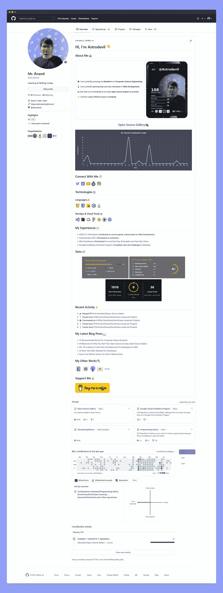
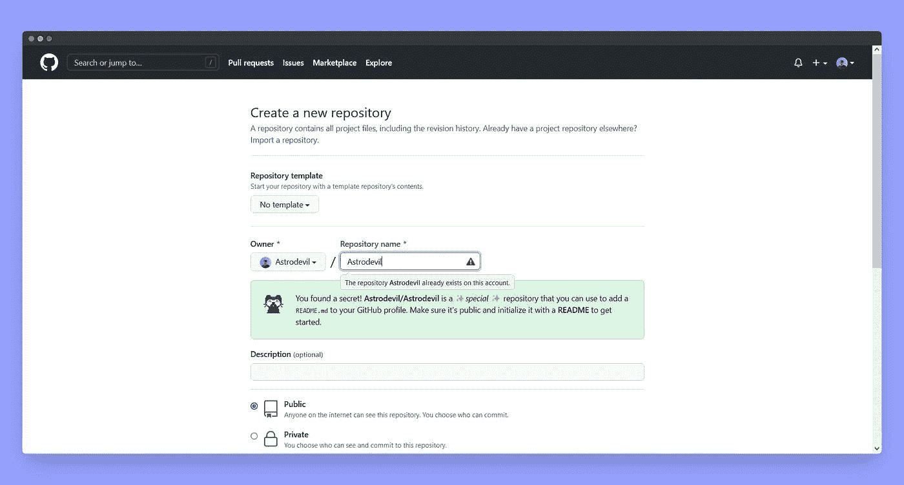
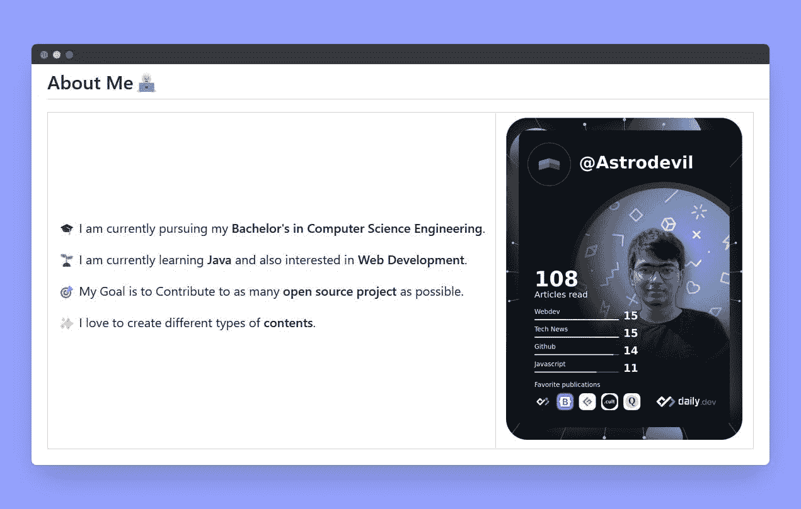
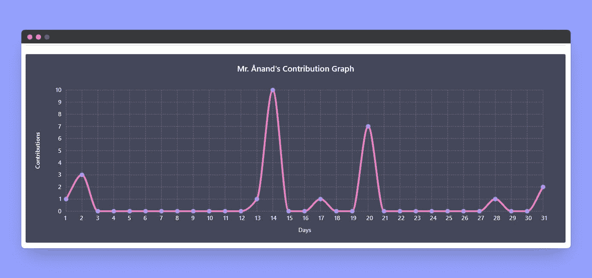
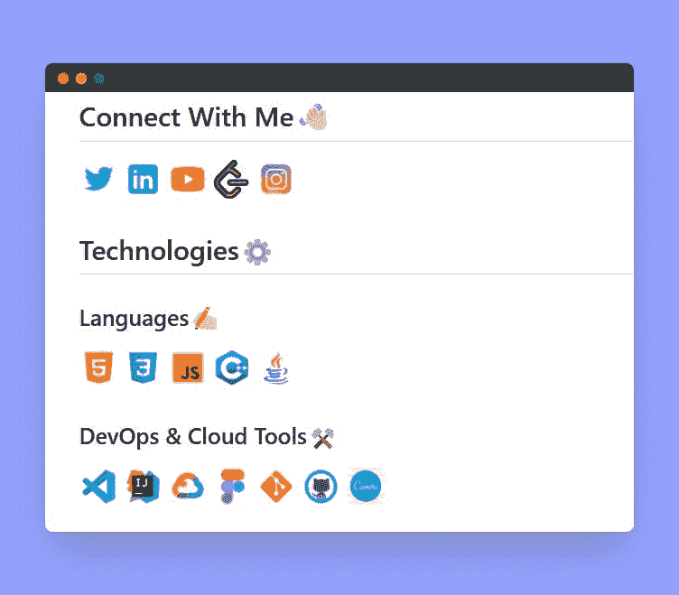
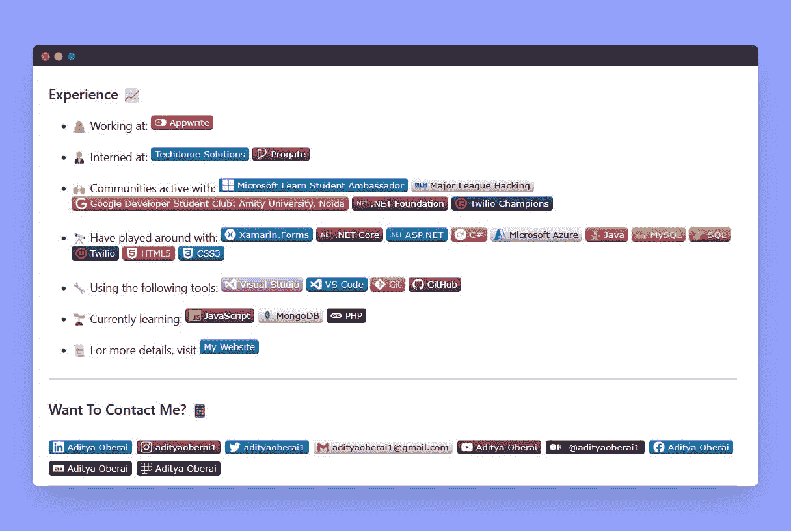
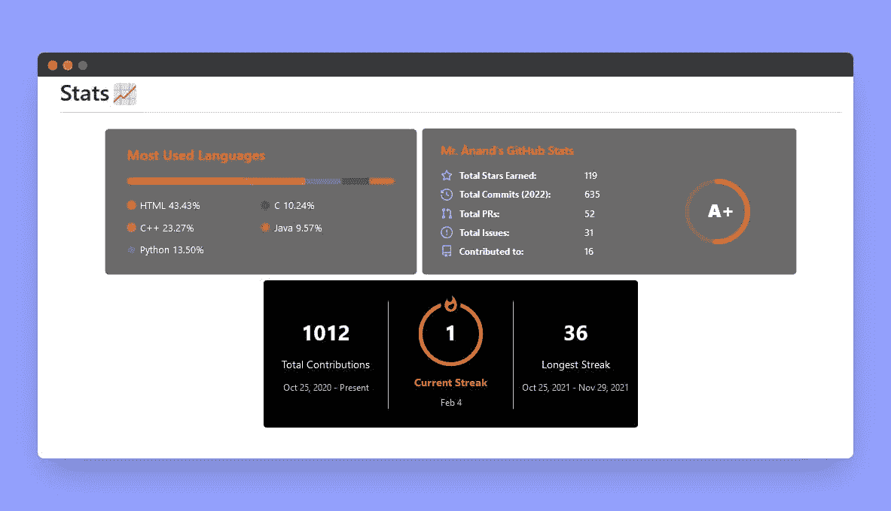
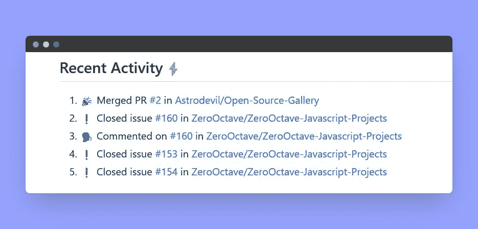

# 让你的 GitHub 档案脱颖而出，吸引更好的机会

> 原文：<https://javascript.plainenglish.io/make-your-github-profile-standout-to-attract-better-opportunities-b9114b7ef686?source=collection_archive---------4----------------------->


为了筛选候选人，该行业正从简历转向 GitHub 简介。在软件行业，开源项目现在很受重视。招聘人员如何知道你声称拥有的能力是你真正拥有的技能？当你是一个没有专业经验的新生时，开源贡献就派上用场了。

在没有任何行业专业知识的情况下，GitHub 允许你展示你的作品。因此，让你的 GitHub 个人资料脱颖而出，展现最好的自己是很重要的。

在本文中，我将介绍一些技巧，让你的 GitHub 档案脱颖而出，吸引更好的机会。

# 简介！



上面的截图是我的 GitHub 个人资料。我已经详细地提到了我的简历，包括贡献图、徽章、技术堆栈、专有名称、用户名、个人资料图片、社交账号和我的副业。你也可以像我一样创建你的 GitHub 档案，甚至更好。我的简介不是比简历更详细更吸引人吗？我希望在看到上面的截图后，你也想让你的 GitHub 个人资料脱颖而出。*我们开始吧！*

# 基石

正如你已经知道的，资源库是 GitHub 的主要特性，每个项目、内容、代码都被恰当地存储在这里。

让我们从登录 GitHub 帐户后创建一个特殊的存储库开始。该存储库名称必须与您的 GitHub 用户名相同。



这是一个✨special ✨资源库，您可以使用它将一个 [README.md](https://docs.github.com/en/repositories/managing-your-repositorys-settings-and-features/customizing-your-repository/about-readmes) 添加到您的 GitHub 个人资料中。确保它是公开的，用一个自述文件初始化它，或者在这个存储库中创建一个 [README.md](http://readme.md/) 文件来开始。

[Markdown](https://en.wikipedia.org/wiki/Markdown) 将用于添加[自述文件](https://docs.github.com/en/repositories/managing-your-repositorys-settings-and-features/customizing-your-repository/about-readmes)中的内容和细节。从这个 [cheetsheet](https://github.com/Astrodevil/Open-Source-Gallery/blob/main/src/markdown-cheatsheet.pdf) 中学习降价语法。自述文件通常用于编写项目存储库的文档。

是时候在您的个人资料自述文件中添加内容了。

## 页眉

在标题中，您可以添加您的姓名、问候信息、照片或 gif，或者根据您的选择不添加任何内容。我正在使用我的个人资料相关的代码，您可以相应地更改。

```
# Hi, I'm Astrodevil 
```


## 关于

在“关于”部分，你可以添加你的简介，你正在做什么，你的目标是什么等等。

```
# replace contents according to you.<table>
<tr>
  <td valign="center">
    🎓 I am currently pursuing my **Bachelor's in Computer Science Engineering**.
    🌱 I am currently learning **Java** and also interested in **Web Development**.
    🎯 My Goal is to Contribute to as many **open source project** as possible.
    ✨ I love to create different types of **contents**.
<td >
# this is my daily.dev card, you can edit this accordingly
    <a href="[https://app.daily.dev/Astrodevil](https://app.daily.dev/Astrodevil)"></a>
  </td></tr>
</table>
```



## 贡献图

我添加了一个贡献图横幅来更新我的 GitHub 个人资料中的每日活动。这是一个很好的方式来展示你是否经常活跃并在项目中做出一些贡献。该图表每天自动更新。

```
# replace username with your own or change theme 
```



## 图标和徽章

在 GitHub 个人资料上添加社交句柄是联系人们并将更多受众转移到您的社交网站的最佳方式。你可以使用徽章或图标。你可以从 [shields.io](https://shields.io/) 创建徽章，也可以使用 [flaticon](https://www.flaticon.com/free-icons/social-media) 的图标。有很多网站可以找到吸引人的图标。您还可以通过使用徽章和图标来添加关于您熟悉的技术堆栈和工具的信息。



## 统计卡

将统计卡添加到 GitHub 页面是另一种常见的个人资料增强。这是一个简单的方法，以有趣、直观的方式显示所有的 GitHub 统计数据。您还可以跟踪您的 GitHub Streak。

```
# replace username with your own or change theme ## Stats📈 <p align="center">     </p>
```



以上是可以让你的 GitHub 概要文件脱颖而出的基本定制方法，我用我的概要文件为例说明如上。您还可以在 GitHub 简介自述文件中添加更多自定义内容，使其更加详细和吸引人。*让我们在下一节*看到。

# 建筑物

*   您还可以使用 GitHub 动作脚本跟踪您的活动，并在您的个人资料自述文件中展示。只需在存储库中创建`/.github/workflows/update-readme.yml`，并将下面的代码粘贴到 update-readme.yml 文件中。该脚本每 30 分钟更新一次活动。

```
name: Update READMEon:
  schedule:
    - cron: '*/30 * * * *'
  workflow_dispatch:jobs:
  build:
    runs-on: ubuntu-latest
    name: Update this repo's README with recent activity steps:
      - uses: actions/checkout@v2
      - uses: jamesgeorge007/github-activity-readme@master
        env:
          GITHUB_TOKEN: ${{ secrets.GITHUB_TOKEN }}
```

将此模块添加到您想要展示您最近活动的 [README.md](http://readme.md/) 文件中

```
<!--START_SECTION:activity-->
<!--END_SECTION:activity-->
```



*   您也可以通过手动添加或使用 GitHub 操作自动完成任务，在您的个人资料自述文件中添加您的博客和副业。查看这篇[文章](https://astrodevil.hashnode.dev/some-cool-github-actions-you-wont-believe-exists)，了解更多有用的行动。你可以通过展示自己令人敬畏的一面来打动招聘人员。


# 最后一击

*   如果你不想学习 Markdown 或者没有足够的时间从头开始写。您可以使用 [GitHub 档案自述文件生成器](https://rahuldkjain.github.io/gh-profile-readme-generator/)、 [GPRM](https://gprm.itsvg.in/) 或[自述文件生成器](https://readme.so/)来创建您的档案自述文件。
*   您也可以从其他配置文件中获得灵感，将降价代码复制粘贴到您的自述文件中进行相应的定制。以下是你可以从中获得灵感的[示例简介](https://eddiehubcommunity.github.io/awesome-github-profiles/profiles)。

我希望这能帮助你让你的 GitHub 档案脱颖而出！你还在等什么？现在去创建您自己的个人资料自述文件，为您自己打开一个充满机会的世界。看看我的 [GitHub](https://github.com/Astrodevil) 🤝

## 如果你❤️我的内容！在推特[上联系我](https://mobile.twitter.com/Astrodevil_)或者通过[请我喝咖啡](https://www.buymeacoffee.com/Astrodevil) ☕来支持我！您也可以在我位于 [Gumroad](https://astrodevil.gumroad.com/) 的商店购买数码产品

*更多内容看* [***说白了。报名参加我们的***](http://plainenglish.io/) **[***免费周报***](http://newsletter.plainenglish.io/) *。在我们的* [***社区不和谐***](https://discord.gg/GtDtUAvyhW) *获得独家获取写作机会和建议。***