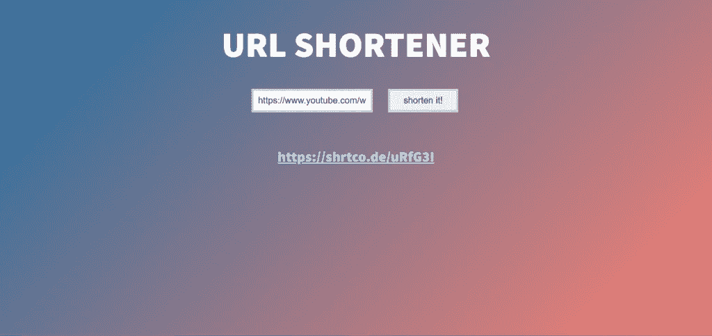
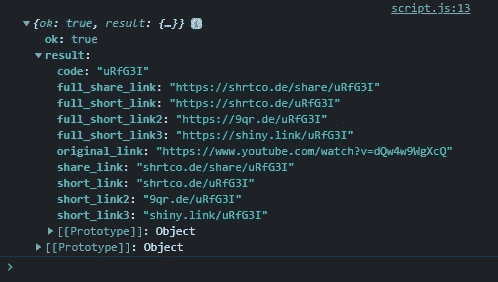

# 使用 Fetch API 制作你自己的网址缩写器

> 原文：<https://javascript.plainenglish.io/make-your-own-url-shortener-using-fetch-api-f6f5b4c69c39?source=collection_archive---------13----------------------->

## 如何制作自己的网址缩略器？


Photo by [Clint Patterson](https://unsplash.com/@cbpsc1?utm_source=medium&utm_medium=referral) on [Unsplash](https://unsplash.com?utm_source=medium&utm_medium=referral)

在这篇文章中，我将向你展示如何制作你自己的网址缩略器。在真正开始做一个网址缩写之前。让我们先了解几个基础知识

# 什么是网址缩写？

网址缩写实际上是一种由网站提供的服务。这项服务把你的又长又丑的网址变成又短又好记的网址。你可能遇到过一些网址缩写，像 Bitly，Cuttly，和其他一些。他们都有相同的目的，那就是缩短一个网址。

# 你要做什么？



这是我们正在制作的，样式并不出众，我知道。我更关注功能和基础，这样你就会理解制作一个网址缩短器的真正概念。于是，你看到它正在把我原来的链接:[**【https://www.youtube.com/watch?v=dQw4w9WgXcQ】**](https://www.youtube.com/watch?v=dQw4w9WgXcQ)转换成一个短链接:[***【https://shrtco.de/uRfG3I】***](https://shrtco.de/uRfG3I)***)***。

# 制作我们的网址缩写的步骤

我们必须遵循这些步骤来缩短我们的网址

*   HTML —用于标记
*   CSS —用于样式
*   JavaScript——通过调用 API 和监听事件使我们的 URL shortener 发挥作用

# 第一步:HTML

现在让我们开始添加 HTML。现在，我要一个简单的页面，有一个按钮和一个输入字段的形式，用户可以粘贴原始的网址。这就是我们所需要的，然后我将把表单放在一个父 div 中，只是为了添加一个背景，并使表单在中心完全对齐。

## **index.html**

```
<!DOCTYPE html>
<html lang="en">
<head>
  <meta charset="UTF-8">
  <meta http-equiv="X-UA-Compatible" content="IE=edge">
  <meta name="viewport" content="width=device-width, initial-scale=1.0">
  <title>URL Shortener</title>
  <link rel="stylesheet" href="style.css">
</head>
<body>
  <div class="wrapper">
    <h1>URL Shortener</h1>
      <form id="form">
          <input id="link" type="text" placeholder="Enter your link">
        <input type="submit" value="shorten it!">
      </form>
    <ul id="parent" class="shortLinks">
    </ul>
  </div>
  <script src="script.js"></script>

</body>
</html>
```

# 第二步:CSS

既然我们已经写了 HTML，现在我们必须添加一个 CSS 文件到 HTML 文件中。您可以通过在 HTML 的 head 标记中使用 link 标记来实现这一点，如下面的代码片段所述。

```
<head>
 <link rel=”stylesheet” href=”style.css”>
</head>
```

现在，让我们开始写 CSS。我在 CSS 文件中做的第一件事是移除所有元素的边距和填充。我使用***“*”***来表示 HTML 中的所有元素，并将边距和填充设置为零。

## style.css

```
[@import](http://twitter.com/import) url('[https://fonts.googleapis.com/css2?family=Source+Sans+Pro:wght@900&display=swap'](https://fonts.googleapis.com/css2?family=Source+Sans+Pro:wght@900&display=swap'));
*{margin:0;
  padding:0;
  box-sizing:border-box;
}
```

现在，我将通过给它宽度和高度以及显示 flex 来设置父对象的样式。我正在设置 display flex，这样我就可以通过将 justify-content 设置为 center 来将表单居中对齐。

```
.wrapper{width:100%;
    min-height:100vh;
    display:flex;
    align-items:center;
    flex-direction:column;
    background-image:linear-gradient(135deg, rgb(30, 110, 162), salmon);
    padding:50px 0;
  }
```

我决定添加一个渐变，因为这样看起来更酷。

现在，让我们来设计其他元素的样式，我已经为其编写了代码，如下所示:

```
ul {list-style-type:none;

  }
  li{margin:30px 0;
    font-size:2em;
    font-family: 'Source Sans Pro', sans-serif;
    color:lightblue;
  }
  a {color:inherit;}
  form{margin:50px 0;
    width:100%;
    max-width:500px;
  }
  input{
      margin:0 15px;
    font-size:20px;
    padding:10px;
    border:5px solid lightgrey;
    outline:none;
  }

  input[type=submit]{padding-left:30px;
    padding-right:30px;
  }
  input:focus{outline:none;}

  h1{font-size:50px;
    font-family: 'Source Sans Pro', sans-serif;
    color:white;
    font-weight:900;
    font-size:5em;
    text-transform:uppercase;

  }
```

# 第三步:JavaScript

好了，现在我们已经添加了 HTML 和 CSS 来使它看起来更好。现在，我们还必须添加 JavaScript 来使其发挥作用。在 JavaScript 的帮助下，我们将能够获得用户输入并处理它。我们将使用 fetch 向 API 服务发送 get 请求。我正在使用的 API 服务是“*短代码*”。首先，让我们从表单中获取用户输入。我们还必须选择要输出短链接的容器。

## script.js

```
const form = document.getElementById("form");
const linkInput = document.getElementById("link");
const parent = document.getElementById("parent");
```

现在我们必须在表单上添加一个事件监听器。

```
form.addEventListener("submit", async (e) => {
    e.preventDefault();
    const originalLink = linkInput.value;
    const apiUrl = `https://api.shrtco.de/v2/shorten?url=${originalLink}`;

    try{
      const response = await fetch(apiUrl);
      const data = await response.json();
      console.log(data);
      let link = document.createElement("li");
      link.className = "output"
      link.innerHTML = `<a href="${data.result.full_short_link}" target="_blank">${data.result.full_short_link} </a>`;
      parent.prepend (link);

    }catch(e){

      console.error(e);
    }

  });
```

这段代码中发生了很多事情。让我给你解释一下这是什么。首先，我们使用。然后我们将响应从 JSON 转换成 JavaScript 对象。我们这样做是因为最初我们的响应是 JSON 格式的，我们必须将它转换成 JavaScript 对象才能使用它。所以我们用这个方法。这是我们的对象从 JSON 转换后的样子。



您也可以在您的控制台中使用 ***console.log()*** 来检查。

现在，为了更好地显示这个短链接，我们正在使用***document . create()***创建另一个元素。这将在用户请求一个短链接时动态地创建一个元素，然后我们将使用***(link . class name = " output ")给它一个类；*** )之后，我们必须添加文本，我们可以通过使用***link . innerhtml***方法来完成，并将其设置为来自对象的短链接。

最后，我们将把它放在父容器的前面，这样新的短链接会使用 ***首先出现。*前置(链接)**。除了使用 prepend，你还可以使用 ***。appendChild(链接)；*** 一种会在末尾添加新元素的方法。

# 制作免费网址缩略器的资源

现在，如果你遵循了我提到的所有步骤，你的最终结果将是这样的。我已经用[***CodePen***](https://codepen.io/tamur20)分享了我的结果，这样你就可以看到我做的所有事情。如果你错过了什么，你可以检查我的代码并修复问题。

**字体:**https://fonts.google.com/specimen/Source+Sans+Pro?query=Source+Sans+Pro

请随意使用代码并做一些实验。或者你可以通过改变布局或设计，或者添加更多的功能，来制作你自己版本的免费网址缩短器。

如果你有兴趣托管你的免费网址缩写，那么你可以阅读这篇文章，这篇文章将向你展示如何使用三个不同的平台免费托管你的网站。

*原载于 2022 年 1 月 4 日*[](https://uprightcodes.com/make-free-url-shortener/)**。**

**更多内容看* [***说白了。报名参加我们的***](http://plainenglish.io/) **[***免费周报***](http://newsletter.plainenglish.io/) *。在我们的* [***社区不和谐***](https://discord.gg/GtDtUAvyhW) *获得独家获取写作机会和建议。****