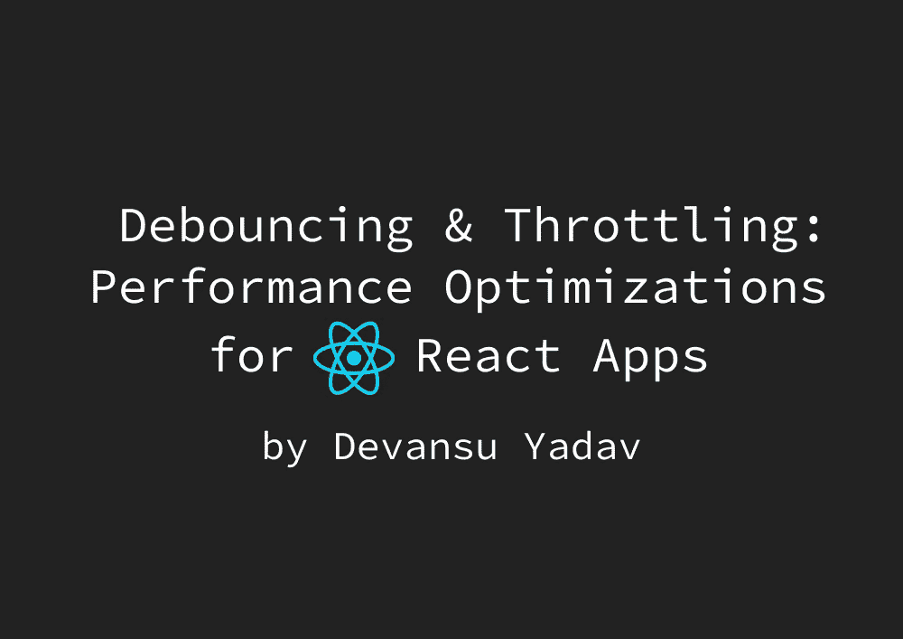
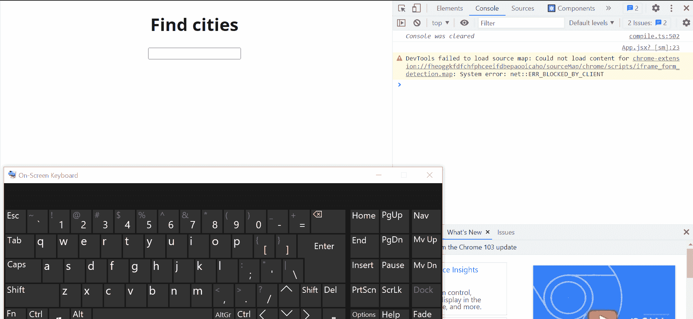

# 使用去抖动和节流功能，提高 React 应用的性能🔥🚀

> 原文：<https://javascript.plainenglish.io/make-your-react-apps-more-performant-using-debouncing-throttling-f90bb4c36855?source=collection_archive---------9----------------------->



Learn Debouncing & Throttling to improve web app performance

## 使用去抖动和节流优化 React 应用性能的简单指南。

你好啊。👋我看到你来这里是为了了解如何使你的 React 应用程序具有高性能，并使用去抖动和节流来优化它们，这很好，因为这意味着你真的关心你的应用程序的性能。值得称赞！👏

请注意，这篇博客假设你对 React 如何工作有一个基本的了解，并且你熟悉 T2 React 钩子。

在我们开始之前，让我们了解一下为什么要优化 React 应用程序的性能？

假设您有一个非常简单的 React 应用程序，带有一个输入栏来搜索城市，如下所示，



A laggy and poorly performant React app

正如你所看到的，这个应用程序是超级滞后，这个应用程序的 UX 是💩。我们只是进行一个非常简单的搜索，根据用户输入从城市列表中过滤城市。

PS:-愿意的可以试试(请自担风险，你不想挂电脑！)——【codesandbox.io/s/debouncing-example-demo-0d.. 

# 现在，你可能会问为什么这个 React 应用程序如此落后？


如果你从上面的应用程序演示中仔细注意到，我们正在从用户每次击键的城市列表中筛选城市(注意演示中虚拟键盘上的击键)。

现在看，这根本不是一个高性能的应用程序，需要优化以提供更好的用户体验。

我们来看看优化这类 app 的两种方法，让它们变得更好！


Let’s understand Debouncing & Throttling

# 什么是去抖动和节流？

有很多情况会降低你的应用程序的性能，比如每次用户在搜索栏上击键时调用 API，点击按钮时执行计算密集型操作，调整窗口大小，或者在滚动条上频繁滚动。

基本上，任何在事件或用户动作上进行昂贵的(就计算或执行时间而言)函数调用的场景都会影响应用程序的性能。

现在，我们来了解一下**去抖** & **节流**。

**去抖**:在去抖中，我们试图通过仅在两个连续事件触发(用户动作)之间的时间差**大于或等于**一个**指定的延迟**时调用**来减少昂贵的函数调用的数量。这个**延迟**可以根据**用例**或者你试图为你的应用设计的**用户体验**的种类来调整。**

**节流**:在节流中，我们试图**限制**高开销函数调用的数量，方法是只有在从**最后一次函数调用**起经过一定的时间限制**后，才每次调用它们。同样，这个时间限制可以根据您的使用情况进行调整。**

去抖动和节流对于处理**速率限制错误**非常有用，这些错误是由**速率限制**在您的应用程序可能使用的某些 API 上引起的，因为我们正在尝试使用这些优化来减少这种昂贵的函数调用的数量。

现在，您已经对去抖动和节流有了一些了解，让我们使用一个简单的例子来说明它们的一些常见用例，从而更深入地了解每个概念。


Are you ready?

# 使用去抖动优化应用

让我们回到我们看到的第一个例子，我们有一个简单的搜索栏，它根据用户输入从城市列表中过滤城市。

在这种情况下，我们可以使用**去抖动**来减少从列表中过滤城市的函数调用的数量。

但是首先，让我们看看演示的初始代码。

**初始代码** -

```
import "./styles.css";
import React, { useState } from "react";
import cities from "cities-list";
import { v4 as uuidv4 } from "uuid";

// An array of city names
const citiesArray = Object.keys(cities);

export default function App() {
  const [cityInput, setCityInput] = useState("");
  const [filteredCities, setFilteredCities] = useState([]);

  // Function that filters cities from the list based on user input
  const cityFilter = (query) => {
    console.log(query);
    if (!query) return setFilteredCities([]);

    setFilteredCities(
      citiesArray.filter((city) =>
        city.toLowerCase().includes(query.toLowerCase())
      )
    );
  };

  return (
    <div className="App">
      <h1 className="app-header">Find cities</h1>
      <div className="city-input">
        <input
          type="text"
          value={cityInput}
          onChange={(e) => {
            setCityInput(e.target.value);
            cityFilter(e.target.value);
          }}
        />
      </div>
      <div>
        {filteredCities.map((city) => {
          return <div key={uuidv4()}>{city}</div>;
        })}
      </div>
    </div>
  );
}
```

上面的代码片段代表了一个**简单的 React 组件**，它带有一个**输入搜索栏**和一个**容器，该容器显示过滤后的城市**。

```
// Function that filters cities from the list based on user input
  const cityFilter = (query) => {
    console.log(query);
    if (!query) return setFilteredCities([]);

    setFilteredCities(
      citiesArray.filter((city) =>
        city.toLowerCase().includes(query.toLowerCase())
      )
    );
  };
```

函数`cityFilter`将**用户搜索查询**作为输入参数，并从城市列表中过滤城市(从名为`cities-list`的 npm 包中获取)。目前，用户在搜索栏上的每一次击键都会运行这个函数。

现在，让我们为上面的`cityFilter`函数写一个**去抖版本**，使其更加优化。我们将在 JavaScript 中使用`setTimeout`来实现这一点。

```
// `timer` to help while clearing setTimeout 
// inside `debouncedCityFilter` function
let timer;

// Debounced version of the `cityFilter` func to filter cities 
// based on user search query
  const debouncedCityFilter = (query) => {
    clearTimeout(timer);
    if (!query) return setFilteredCities([]);

    timer = setTimeout(() => {
      console.log(query);

      setFilteredCities(
        citiesArray.filter((city) =>
          city.toLowerCase().includes(query.toLowerCase())
        )
      );
    }, 500);
  };
```

根据去抖动的概念，只有当两个连续事件触发(用户动作)之间的**时间差大于或等于指定延迟的**时，我们才进行函数调用。

在上面的代码片段中，我们使用`setFilteredCities()`设置状态以获得过滤的城市，它在延迟为`500ms`的`setTimeout`中被调用(这个延迟可以根据用例进行调整)。因此，每当在输入搜索栏上记录到用户击键时，就会调用`debouncedCityFilter`函数来触发`setTimeout`，并在`500ms`之后使用`setFilteredCities()`来设置状态。

然而，如果用户的另一次击键刚好在`500ms`的时间延迟内被记录，则需要清除之前的`setTimeout`以避免过滤城市和设置州。为此，我们使用接受由`setTimeout`函数返回的`id`的`clearTimeout`。

现在，这个`id`需要被保留，以便当我们需要使用`clearTimeout`清除定时器时，它是可用的。我们在 JavaScript 中使用了一个非常流行的概念叫做[闭包](https://www.freecodecamp.org/news/lets-learn-javascript-closures-66feb44f6a44/)，以便能够在`debouncedCityFilter`函数中访问这个`id`。因此，如果你已经注意到了，我们已经在`debouncedCityFilter`函数之外定义了一个`timer`变量，用于该函数内部。

通过简单地去抖动`cityFilter`函数，我们能够减少函数调用的数量，从而能够显著提高 React 应用的性能。

让我们看看做出这些更改后，我们的 React 组件代码是什么样子的。

**最终代码** -

```
import "./styles.css";
import React, { useState } from "react";
import cities from "cities-list";
import { v4 as uuidv4 } from "uuid";

// An array of city names
const citiesArray = Object.keys(cities);

// `timer` to help while clearing setTimeout 
// inside `debouncedCityFilter` function
let timer;

export default function App() {
  const [cityInput, setCityInput] = useState("");
  const [filteredCities, setFilteredCities] = useState([]);

  // Function that filters cities from the list based on user input
  const cityFilter = (query) => {
    console.log(query);
    if (!query) return setFilteredCities([]);

    setFilteredCities(
      citiesArray.filter((city) =>
        city.toLowerCase().includes(query.toLowerCase())
      )
    );
  };

  // Debounced version of the `cityFilter` func to filter 
  // cities based on user search query
  const debouncedCityFilter = (query) => {
    clearTimeout(timer);
    if (!query) return setFilteredCities([]);

    timer = setTimeout(() => {
      console.log(query);

      setFilteredCities(
        citiesArray.filter((city) =>
          city.toLowerCase().includes(query.toLowerCase())
        )
      );
    }, 500);
  };

  return (
    <div className="App">
      <h1 className="app-header">Find cities</h1>
      <div className="city-input">
        <input
          type="text"
          value={cityInput}
          onChange={(e) => {
            setCityInput(e.target.value);
            debouncedCityFilter(e.target.value);
          }}
        />
      </div>
      <div>
        {filteredCities.map((city) => {
          return <div key={uuidv4()}>{city}</div>;
        })}
      </div>
    </div>
  );
}
```

现在，看看去抖如何显著提高该元件的性能！🚀

如果您想处理更多的边缘情况来消除此类函数的抖动，那么您可以查看 [Lodash](https://lodash.com/) ，它有一个`debounce`方法，覆盖了所涉及的大多数边缘情况，以使此类函数更加优化。

现在，让我们看一个简单的例子，它使用节流来提高性能。

# 使用节流优化应用

让我们假设，您有一个简单的 React 组件，它由一个`button`组成，单击**调用一个 API** 来获取一些与不同国家的所有货币相关的数据。

**初始代码** -

```
import "./styles.css";
import React, { useState } from "react";
import axios from "axios";
import { v4 as uuid } from "uuid";

export default function App() {
  const [currencyData, setCurrencyData] = useState({});
  const [clickCounter, setClickCounter] = useState(0);

  const getCurrencyData = async () => {
    console.log("Fetching data ....");

    const { data } = await axios.get(
      "https://cdn.jsdelivr.net/gh/fawazahmed0/currency-api@1/latest/currencies.json"
    );

    // Fetching only 15 currencies for now
    const countryCurrencies = {};
    const currencyObjKeys = Object.keys(data).slice(0, 15);

    currencyObjKeys.forEach((key) => {
      countryCurrencies[key] = data[key];
    });

    setCurrencyData({ ...countryCurrencies });
  };

  return (
    <div className="App">
      <h1>Currencies of different Countries</h1>
      <button
        className="currency-btn"
        onClick={() => {
          setClickCounter((clickCount) => clickCount + 1);
          getCurrencyData();
        }}
      >
        Click to get all currencies
      </button>
      <span>Btn clicked - {clickCounter} times</span>
      <div className="currencies">
        {Object.keys(currencyData).map((currency) => {
          return (
            <div key={uuid()}>
              {currency}: {currencyData[currency]}
            </div>
          );
        })}
      </div>
    </div>
  );
}
```

上面的代码片段是我们的简单组件，有两种状态— `currencyData` & `clickCounter`。在点击按钮时，我们更新`clickCounter`状态以反映到目前为止点击按钮的总数，并调用`getCurrencyData()`函数进行 API 调用以获取货币数据。

我们来看看这个组件是什么样子的！

您可能已经注意到，每一次按钮点击都会触发一个 API 调用。现在，假设您的应用程序被成百上千的用户使用，那么 API 调用的数量将是巨大的！由于如此多的点击，您的后端服务器可能会面临来自每个用户的大量请求。此外，如果您正在使用任何外部付费 API 或服务，那么由于 API 端点上的**速率限制**，端点可能会开始抛出错误。

即使你没有对这样的按钮点击进行任何 API 调用，而是执行一些**计算繁重的**操作，这也会严重影响你的应用程序的性能！

现在，这是一个小问题😅


让我们尝试使用节流来解决这个问题！✨

我们将限制每次点击按钮时发出 API 调用的`getCurrencyData`函数。

目前，`getCurrencyData`的代码看起来像这样，

```
const getCurrencyData = async () => {
    console.log("Fetching data ....");

    const { data } = await axios.get(
      "https://cdn.jsdelivr.net/gh/fawazahmed0/currency-api@1/latest/currencies.json"
    );

    // Fetching only 15 currencies for now
    const countryCurrencies = {};
    const currencyObjKeys = Object.keys(data).slice(0, 15);

    currencyObjKeys.forEach((key) => {
      countryCurrencies[key] = data[key];
    });

    setCurrencyData({ ...countryCurrencies });
  };
```

现在，我们将编写一个函数`throttledGetCurrencyData`，它将节流并使用`getCurrencyData`函数来减少对它的调用次数。

```
// A flag to control the function calls to the `getCurrencyData` function
let shouldFuncBeCalled = true;

const throttledGetCurrencyData = async () => {
    if (shouldFuncBeCalled) {
      await getCurrencyData();
      shouldFuncBeCalled = false;

      setTimeout(() => {
        shouldFuncBeCalled = true;
      }, 500);
    }
  };
```

只有当`shouldFuncBeCalled`标志被设置为`true`时，`throttledGetCurrencyData`函数才会调用`getCurrencyData`函数。一旦这个函数被调用，我们通过使用`setTimeout`延迟对`getCurrencyData`函数的下一个函数调用(这个延迟限制可以根据您的用例进行调整)。

这样，我们只允许从最后一次函数调用起过了一定的时间后再调用函数。这样，我们可以避免使用户界面变慢，或者超过为你的应用程序可能使用的任何 API 定义的速率限制。

我们来看看现在的 app 是如何运作的。

正如您在控制台上看到的，即使在点击按钮这么多次之后，API 调用的数量还是显著减少了！

查看下面的 CodeSandbox，看看使用 Throttling 后我们组件的代码是什么样子。

如果你想处理更多的边缘情况来抑制这样的函数，那么你可以看看 [Lodash](https://lodash.com/) ，它有一个`throttle`方法，覆盖了大部分的边缘情况，使这样的函数更加优化。

# 去抖 vs 节流，什么时候用哪个？

现在我们已经了解了去抖动和节流是如何工作的，让我们来了解一下它们之间的区别以及何时使用去抖动或节流。

**节流**强制每次从最后一次函数调用起一定时间(或延迟)后必须调用一次函数。

然而，**去抖动**强制一个函数只有在经过一定时间(或延迟)后才被调用。如果没有超过该时间，则**去抖计时器**保持**复位**，并且避免**功能调用**。

# 什么时候用什么？

*   **搜索栏**:使用**反跳**避免用户每次击键时都进行搜索。**节流**在这种情况下不方便使用，因为您不想让您的用户等待太长时间来获取搜索结果(在最坏的情况下，如果前一个函数调用是在用户停止键入时进行的)。
*   **射击游戏**:在鼠标点击时使用**节流**，因为射击手枪需要几秒钟的时间来注册，这有助于避免用户在注册前一次射击之前进行射击。**去抖**直到手枪未发射一定时间后才会发射子弹。

你也可以看看这篇惊人的 [Stackoverflow 帖子](https://stackoverflow.com/questions/25991367/difference-between-throttling-and-debouncing-a-function)来了解**去抖** & **节流**和什么时候用什么的区别。

# 结论

**去抖动** & **节流**只是让 React 应用更具性能的几种方法&每种技术都有自己的优缺点，具体取决于使用案例。在这篇博客中，我们首先讨论了**为什么我们应该关心 React 应用程序的性能**，然后我们理解了**我们如何使用去抖动&节流**来优化我们的应用程序的性能，最后我们看到了当我们使用哪种技术时，两种技术和**之间的主要区别**。****

我说的就是这些，非常感谢你们阅读我的博客！🙌我希望这篇博客对你有所帮助，让你了解如何让你的 React 应用程序更有性能。现在，继续让您的应用程序变得更加神奇吧！🚀


> *随时联系我:* [*Twitter*](https://twitter.com/DevanshYtweets)[*Linkedin*](https://www.linkedin.com/in/devansu-yadav/)[*GitHub*](https://github.com/Devansu-Yadav) *您也可以通过邮件联系我:*[*devansuyadav@gmail.com*](mailto:devansuyadav@gmail.com)

*更多内容看* [***说白了。报名参加我们的***](https://plainenglish.io/) **[***免费周报***](http://newsletter.plainenglish.io/) *。关注我们关于*[***Twitter***](https://twitter.com/inPlainEngHQ)*和*[***LinkedIn***](https://www.linkedin.com/company/inplainenglish/)*。查看我们的* [***社区不和谐***](https://discord.gg/GtDtUAvyhW) *加入我们的* [***人才集体***](https://inplainenglish.pallet.com/talent/welcome) *。***