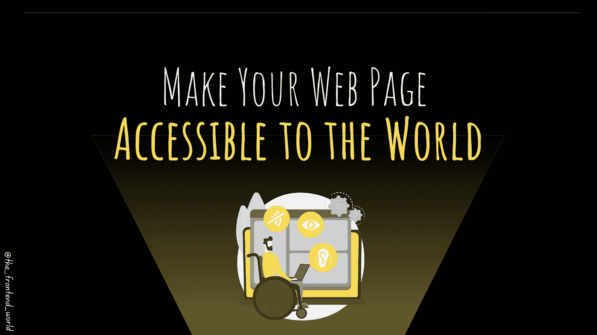
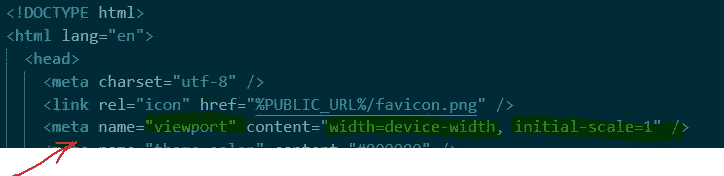
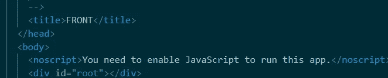
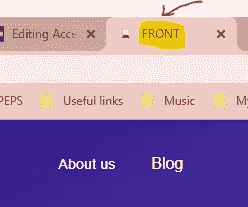
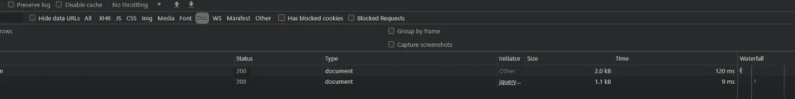
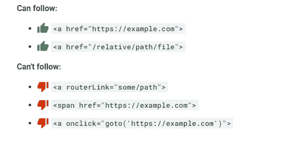
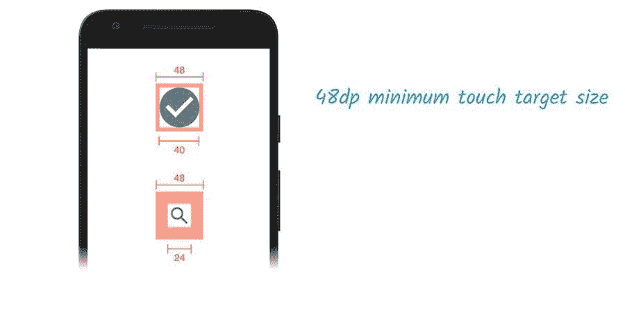

# 让全世界都能访问您的网页

> 原文：<https://javascript.plainenglish.io/make-your-web-page-accessible-to-the-world-c99a867a750b?source=collection_archive---------12----------------------->

## 网页可访问性至关重要



By FAM

这是 HTML 章节的最后一篇文章。这篇文章是关于可访问性的！这不会影响网页的外观，但是在你构建网页的时候，记住可访问性是很重要的。

以下是我对任何网页可访问性的 11 条规则清单:

# 1.结构化数据应该是有效的

> *搜索引擎使用结构化数据来了解你的页面上是什么样的内容。例如，您可以告诉搜索引擎您的页面是一篇文章、一个招聘启事或一个 FAQ。*
> 
> *用结构化数据标记您的内容更有可能包含在丰富的搜索结果中。例如，标记为文章的内容可能会出现在与用户搜索的内容相关的热门故事列表中。— web.dev*

要验证您的应用程序是否遵守此规则，您可以使用下面的谷歌搜索工具:

[](https://developers.google.com/search/docs/advanced/structured-data) [## 模式标记测试工具|谷歌搜索中心|谷歌开发者

### 谷歌官方工具，用于测试你的结构化数据，看看哪些谷歌丰富的结果可以由…

developers.google.com](https://developers.google.com/search/docs/advanced/structured-data) 

# 2.一个网站应该有一个带有`width`或`initial-scale`的`<meta name="viewport">`标签

> 许多搜索引擎根据页面对移动设备的友好程度对其进行排名。如果没有 [*视口元标签*](https://developer.mozilla.org/en-US/docs/Mozilla/Mobile/Viewport_meta_tag) *，移动设备会以典型的桌面屏幕宽度呈现页面，然后缩小页面，使其难以阅读。*
> 
> *设置视窗元标签可以让你控制视窗的宽度和缩放比例，以便在所有设备上正确调整视窗的大小。— web.dev*

*   添加`<meta name="viewport">`标签，针对移动屏幕优化您的应用:



Viewport example

# 3.你的应用程序的 HTML 应该有`<title>`元素

标题是必不可少的，因为它出现在顶部的图标旁边。标题为屏幕阅读器用户提供了页面的概览，搜索引擎用户非常依赖它来确定页面是否与他们的搜索相关。

*   将`<title>**Your title**</title>`添加到您的`index.html`或 HTML 文档中。



*   结果:



Document title

# 4.你的应用文档应该有一个`meta`描述

> *`*<meta name="description">*`*元素提供了搜索引擎在搜索结果中包含的页面内容的摘要。一个高质量的，独特的元描述使你的页面看起来更相关，可以增加你的搜索流量。— web.dev**

*   *可以在搜索结果中包括元描述来概括页面的内容:*

**

*meta description*

# *5.您网站的页面应该返回一个成功的 HTTP 状态*

> **服务器为接收到的每个资源请求提供一个三位数的* [*HTTP 状态码*](https://developer.mozilla.org/en-US/docs/Web/HTTP/Status) *。400s 和 500s 中的状态代码* [*表示请求的资源存在错误*](https://developer.mozilla.org/en-US/docs/Web/HTTP/Status#Client_error_responses) *。如果搜索引擎在搜索网页时遇到状态代码错误，它可能无法正确索引该页面。— web.dev**

*   *具有不成功 HTTP 状态代码的页面可能不会被适当地索引。*

**

*HTTP status*

# *6.链接应该有描述性的文字*

> *链接文本是超链接中可点击的单词或短语。当链接文本清楚地传达了超链接的目标时，用户和搜索引擎都能更容易地理解你的内容以及它与其他页面的关系。— web.dev*

*   *描述性链接文本有助于搜索引擎理解你的内容。避免对一个环节进行以下描述:`click here`、`click this`、`go`、`here`、`this`、`more`。*
*   *好例子:*

```
*<p>To see all of our basketball videos, <a href="videos.html">**See basketball video**</a>.</p>*
```

# *7.你的网站链接不应该是可抓取的*

> *只有当链接是一个带有 href 属性的 `*<a>*` *标签时，Google 才能关注它们。使用其他格式的链接不会被谷歌爬虫跟踪。由于脚本事件，如果没有 href 标签或其他执行链接的标签，Google 无法跟随* `*<a>*` *链接。—谷歌搜索中心**

*   *搜索引擎可能使用链接上的`href`属性来抓取网站。确保锚元素的`href`属性链接到一个合适的目的地，这样你的网站就安全了。*
*   *以下是一些谷歌可以关注和不可以关注的链接示例:*

**

*Google Search Center*

# *8.您的`robots.txt`文件应该是有效的*

> **`*robots.txt*`*文件告诉搜索引擎可以抓取你网站的哪些页面。无效的* `*robots.txt*` *配置会导致两种类型的问题:***
> 
> ***它可以阻止搜索引擎抓取公共页面，导致你的内容在搜索结果中出现的频率降低。***
> 
> **它会导致搜索引擎抓取你不想在搜索结果中显示的页面。— web.dev**

*   **如果您的`robots.txt`文件格式不正确。爬虫可能不理解你想要你的网站如何被爬行或索引。**
*   **如果您的文件无效，请检查以下常见错误:**

**该文件不包括:**

*   **`No user-agent specified`**
*   **`Pattern should either be empty, start with "/" or "*"`**
*   **`Unknown directive`**
*   **`Invalid sitemap URL`**
*   **`$ should only be used at the end of the pattern`**

****有效的** `**robots.txt**` **文件示例:****

# **9.图像元素应该有`[alt]`属性**

*   **信息元素应该以简短的描述性替代文本为目标。**

```
****
```

*   **如果只是装饰性的，就用空的 alt 属性。**

```
****
```

# **10.你的 HTML 应该使用易读的字体大小**

*   **小于`**12px**` 的字体太小，难以辨认，需要移动访问者“捏放大”才能阅读。力争有`**>60%**`的页面正文≥ `**12px**` **。****

# **11.Tap 目标的大小应该适当**

*   **像按钮和链接这样的交互元素应该足够大(`48x48` px)，并且在它们周围有足够的空间，以便在不与其他元素重叠的情况下轻松点击。**
*   **增加太小的点击目标的大小。**
*   **如果需要，使用`margin`之类的属性增加太靠近的点击目标之间的间距。**

****

**web.dev**

# **最后做的事**

**您可以使用 Google Lighthouse 工具来评估您的网站可访问性并修复可能出现的错误:**

**[](https://developers.google.com/web/tools/lighthouse/#devtools) [## 灯塔|网站开发者工具|谷歌开发者

### Lighthouse 是一个开源的自动化工具，用于提高网页质量。你可以在任何网站上运行它…

developers.google.com](https://developers.google.com/web/tools/lighthouse/#devtools)** 

**今天就到这里，看阿雅🙋**

**如果您有任何问题或反馈，请点击评论或通过 LinkedIn 联系我— **我洗耳恭听！****

**[**想给我买杯咖啡吗？☕️**](https://www.buymeacoffee.com/fatimaamzil)**

> **让我们为 2022 年打造一个更好的‘我们’！**

## **了解有关 2022 年网络快车计划的更多信息:**

## **I- [通用网络知识](https://medium.com/geekculture/2022-web-program-chapter-n-1-is-done-499fb0707220?source=your_stories_page----------------------------------------)**

# **II-网页框架:HTML**

*   **[HTML 和页面结构](/the-foundation-of-any-web-page-78ebdcb6d874?source=your_stories_page----------------------------------------)**
*   **[元素&属性](https://levelup.gitconnected.com/what-are-elements-and-attributes-in-html-1cd709c3a418?source=your_stories_page----------------------------------------)**
*   **[表格、输入、图像、](https://medium.com/geekculture/html-content-essentials-that-every-web-developer-should-know-dcb8b8715125?source=your_stories_page----------------------------------------) …**
*   **[列出&表格](https://medium.com/codex/html-content-essentials-that-every-web-developer-should-know-a1e7b966698a?source=your_stories_page----------------------------------------)**
*   **[事件](/htmls-super-ability-1eb41726096e)**
*   **[网络存储](https://levelup.gitconnected.com/web-storage-%EF%B8%8F-43ca7d1d8283)**
*   **[语义 HTML](https://famzil.medium.com/give-your-html-a-meaning-57bbef7bb7aa?source=your_stories_page----------------------------------------)**

> ****无障碍****

**[](https://medium.com/geekculture/2022-web-program-is-launched-f38a3280af1a) [## 2022 网络计划启动！

### 改变来自心态和习惯

medium.com](https://medium.com/geekculture/2022-web-program-is-launched-f38a3280af1a) 

与想成为 web 开发人员的人分享该程序！这将有助于保持进步，并在旅途中互相帮助。

> 如果你喜欢我的文章， [**订阅**](https://famzil.medium.com/subscribe) 获取我的最新。如果你自己喜欢体验媒介，可以考虑通过[**注册会员**](https://famzil.medium.com/membership) 来支持我和其他成千上万的作家。它只需要每月 5 美元，它支持我们，作家，你也有机会用你的作品赚钱。当然，你可以随时取消会员资格。通过注册[这个链接](https://famzil.medium.com/membership)，你将直接用你的一部分费用来支持我，它不会花费你更多。如果你这样做了，万分感谢！

让我们在 [**上**取得联系****](https://medium.com/@famzil/)**[**Linkedin**](https://www.linkedin.com/in/fatima-amzil-9031ba95/)**[**脸书**](https://www.facebook.com/The-Front-End-World)**[**insta gram**](https://www.instagram.com/the_frontend_world/)**[**YouTube**](https://www.youtube.com/channel/UCaxr-f9r6P1u7Y7SKFHi12g)**或**[](https://twitter.com/FatimaAMZIL9)********

******[](https://famzil.medium.com/membership) [## 通过我的推荐链接——FAM 加入 Medium

### 作为一个媒体会员，你的会员费的一部分会给你阅读的作家，你可以完全接触到每一个故事…

famzil.medium.com](https://famzil.medium.com/membership) 

*更多内容看* [***说白了就是***](http://plainenglish.io/) *。报名参加我们的* [***免费周报***](http://newsletter.plainenglish.io/) *。在我们的* [***社区不和谐***](https://discord.gg/GtDtUAvyhW) *中获得独家写作机会和建议。*********