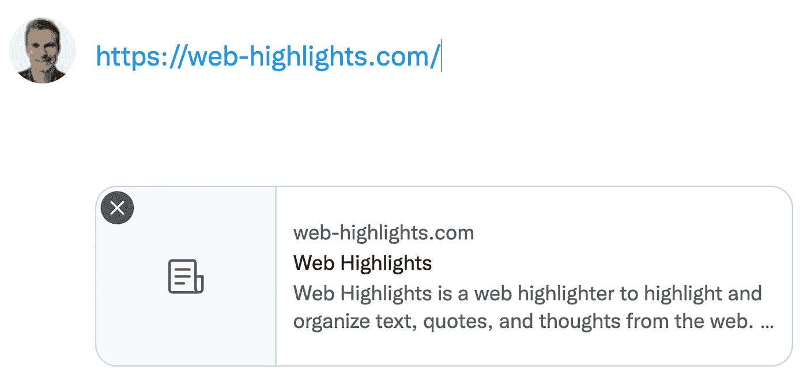
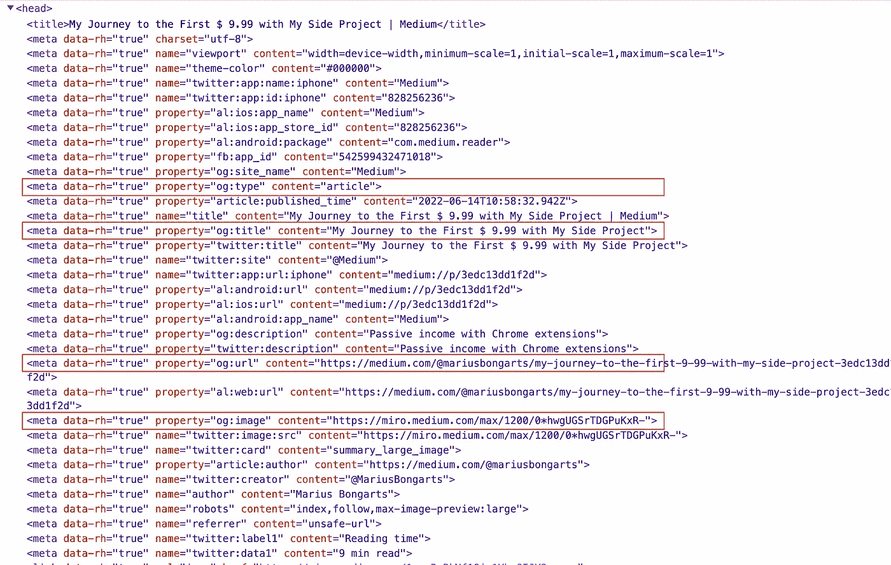

# 让你的网站有一个漂亮的缩略图链接预览

> 原文：<https://javascript.plainenglish.io/make-your-website-have-a-beautiful-thumbnail-link-preview-d610aba7e90e?source=collection_archive---------7----------------------->

## 在你的网站上应用开放图协议。

Photo by [Robert Lukeman](https://unsplash.com/@robertlukeman?utm_source=medium&utm_medium=referral) on [Unsplash](https://unsplash.com?utm_source=medium&utm_medium=referral)

*本文原载于* [*网络集锦博客*](https://web-highlights.com/blog/) *。你可以在这里* *找到* [*。*](http://Apply the Open Graph protocol to your website.    https://web-highlights.com/blog/turn-your-website-into-a-beautiful-thumbnail-link-preview/)

最近，我试图弄清楚如何让我的 [Web Highlights](http://web-highlights.com/) 主页的链接预览以缩略图的形式出现。

我从来没有想过这个问题；它只适用于许多网站。假设我想在 Twitter 上分享我的一篇媒体文章。当我将链接粘贴到 Twitter 时，它神奇地为文章创建了一个漂亮的链接预览:

Tweet Preview

这看起来很神奇，但实际上，有几个 **Open Graph** meta 标签需要添加到网站上才能出现这样的效果。这是一个小细节，但它可以帮助您的网站在社交媒体上脱颖而出，并为您的页面带来更多流量。

举个例子，在我做改变之前，我的[网页突出显示了](http://web-highlights.com/)页面:

Tweet Preview

当然，它正确地抓取了页面的**标题**和**描述**，但它不是提要中最好看的推文。

预览网址的概念不仅可以在 Twitter 上看到，也可以在大多数社交媒体平台上看到，如 LinkedIn、脸书等。

此外，在博客文章中，你可以粘贴网址，它们将被转换成漂亮的缩略图预览。这是我添加了所需的元数据后，Web Highlights 页面的预览图:

 [## 网络亮点- PDF 和网络荧光笔

### Web Highlights 是一个在 Web 上突出显示文本的工具，可以更有效地组织您的研究。提升你的…

web-highlights.com](http://web-highlights.com/) 

这是它在脸书上的样子:

[Web Highlights](http://web-highlights.com/) Facebook link preview

现在，让我们深入挖掘**开放图**让你的网站在任何社交媒体平台上脱颖而出。

## 什么是开放图？

[Open Graph](https://ogp.me/) 是由[脸书](http://fbdevwiki.com/wiki/Open_Graph_protocol)创建的互联网协议，旨在规范网页中元数据的使用，以表示页面内容。通过在你的网站上添加元数据，搜索引擎可以更好地理解你的内容。

通过在我们的页面上使用开放图表标签，我们可以告诉像 Twitter，LinkedIn，脸书等平台。，他们应该使用什么图像作为我们帖子的预览图像。

## 如何给自己的网站添加开放图信息？

要将你的网页变成一个开放的图形对象，你需要添加基本的**元数据**到你的页面。这意味着您将在网页的`<head>`中放置额外的`<meta>`标签。每个页面的四个必需属性是(Source [ogp.me](https://ogp.me/) ):

`*og:title*` *-图形中显示的对象的标题，如“岩石”。*

`*og:type*` *-您的对象的* [*类型*](https://ogp.me/#types) *，如“video.movie”。根据您指定的类型，可能还需要其他属性。*

`*og:image*` *-一个应该在图形中代表你的对象的图像 URL。*

`*og:url*` *-您的对象的规范 URL，将在图中用作其永久 ID，例如“https://www . IMDB . com/title/TT 0117500/”。*

人们可以假设 Medium.com 是搜索引擎优化领域的专家。因此，让我们简单地看一下一篇文章的代码，找出 meta 标签。

Screenshot of Medium.com source code

您可以看到 Medium 提供了四个必需的 meta 标签以及更多。你可以在 [ogp.me](https://ogp.me/) 上找到所有的结构化开放图属性。

此外，Medium 为 Twitter 提供了一些额外的元标签。它们不是开放图协议的一部分，而是由 Twitter 定义的。

当 Twitter 卡片处理器在页面上寻找标签时，它首先检查 Twitter 特有的属性，如果不存在，就返回到支持的 Open Graph 属性。—developer.twitter.com

下面是 [Web Highlights](http://web-highlights.com/) 页面的 meta 标签，显示如上图所示的大缩略图预览:

Web Highlights: Open Graph Meta Tags

## **打开图形可以进行验证。**

一旦你为你的网站提供了所有的元标签，你就要检查它是否显示正确。有时你的网站被搜索引擎或平台缓存，不能直接正确显示。

为了确保您的网站呈现正确，您可以做以下几件事:

*   使用**开放图验证器**来验证你的网站，比如这个:[https://www.opengraph.xyz/](https://www.opengraph.xyz/)
*   使用社交媒体平台上的 **open graph 调试器**，如脸书的[共享调试器](http://web-highlights.com/)或 LinkedIn 的[帖子检查器](https://www.linkedin.com/post-inspector/)。
*   使用 **Chrome 扩展**在开发过程中验证你的网页。我个人喜欢 1 CLICK 扩展中的 [SEO META。](https://chrome.google.com/webstore/detail/seo-meta-in-1-click/bjogjfinolnhfhkbipphpdlldadpnmhc)
*   将你的链接粘贴到社交平台，看看会显示什么样的预览

因此，要添加如此大的缩略图，就像我们在本文开头看到的那样，您还需要添加 meta 标签`twitter:card`，并将其内容设置为`summary_large_image`。

当你把你的网站交给一些验证者时，你可以检查是否一切正常。通常，我会在 [opengraph.xyz](http://opengraph.xyz) 上进行测试，因为可能需要一段时间才能在 Twitter、LinkedIn 或其他社交平台上看到你的更改。

Screenshot [https://www.opengraph.xyz/](https://www.opengraph.xyz/)

请注意，您的图像应该遵循至少 1200px630px 的推荐尺寸(来源:[everywheremarketer.com](https://www.everywheremarketer.com/blog/ultimate-guide-to-social-meta-tags-open-graph-and-twitter-cards#:~:text=For%20the%20summary_large_image%20setting%2C%20rectangular,be%20no%20larger%20than%205MB))才能看起来不错。

# 最后的想法

我希望这篇文章能帮助你理解 Open Graph 的重要性，以及它如何帮助你的网站对搜索引擎和社交媒体网站更有吸引力。

我总是乐于回答问题，并乐于接受批评。随时欢迎联系我！通过**[**LinkedIn**](https://www.linkedin.com/in/marius-bongarts-6b3638171/)**，**关注我**[**Twitter**](https://twitter.com/MariusBongarts)或 [**订阅**](https://medium.com/subscribe/@mariusbongarts) 通过电子邮件获取我的故事。****

****[**这里是无限制访问介质上每一个内容的链接**](https://medium.com/@mariusbongarts/membership) **。如果你使用这个链接注册，我会赚一小笔钱，不需要你额外付费。******

**** [## 通过我的推荐链接加入 Medium-Marius bong arts

### 作为一个媒体会员，你的会员费的一部分会给你阅读的作家，你可以完全接触到每一个故事…

medium.com](https://medium.com/@mariusbongarts/membership)**** 

# ****关于作者****

****我是埃森哲软件工程分析师宋。最驱动我的是我想创造一些可能对他人有帮助并改变他人生活的东西的冲动。****

****比如你是否厌倦了浏览自己的历史来寻找前几天看到的信息？我的 [**网站重点介绍 Chrome 扩展**](https://chrome.google.com/webstore/detail/web-highlights-%20-bookmark/hldjnlbobkdkghfidgoecgmklcemanhm) 覆盖了你，并将通过以结构化和高效的方式组织你的研究来提高你的生产力。就像你在书和文章上做的那样，突出显示任何网页或 PDF 上的文本。你的精彩片段会直接同步到 web-highlights.com[的网络应用上，你可以在任何地方找到它们。](https://web-highlights.com/)****

*****更多内容看* [***说白了就是 io***](https://plainenglish.io/) *。报名参加我们的* [***免费周报***](http://newsletter.plainenglish.io/) *。关注我们关于* [***推特***](https://twitter.com/inPlainEngHQ) ， [***领英***](https://www.linkedin.com/company/inplainenglish/) *，*[***YouTube***](https://www.youtube.com/channel/UCtipWUghju290NWcn8jhyAw)*[***不和***](https://discord.gg/GtDtUAvyhW) *。******