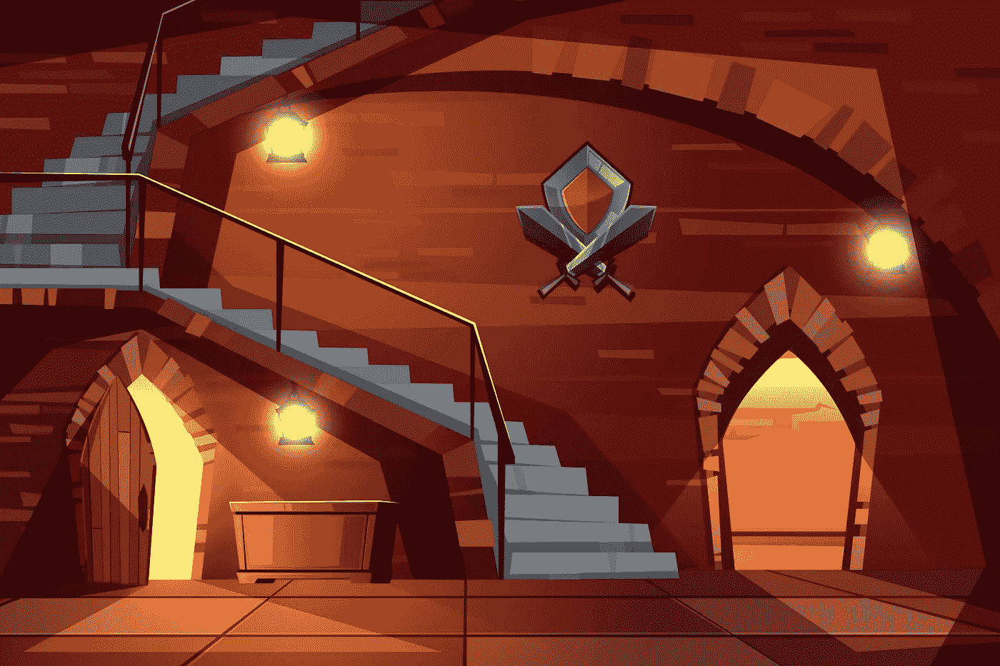
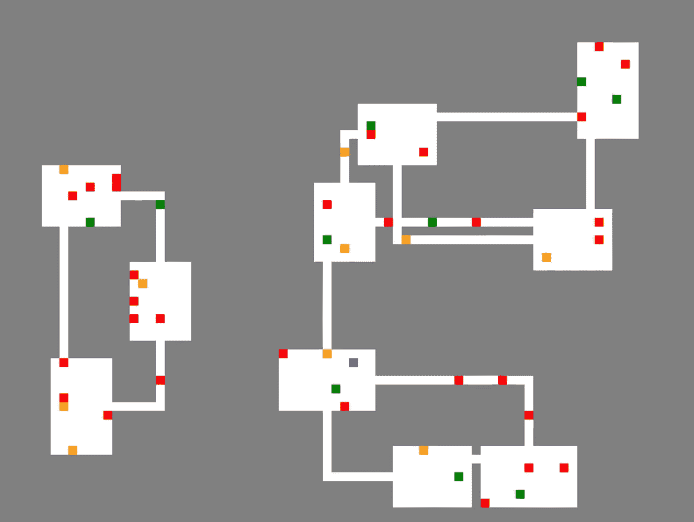
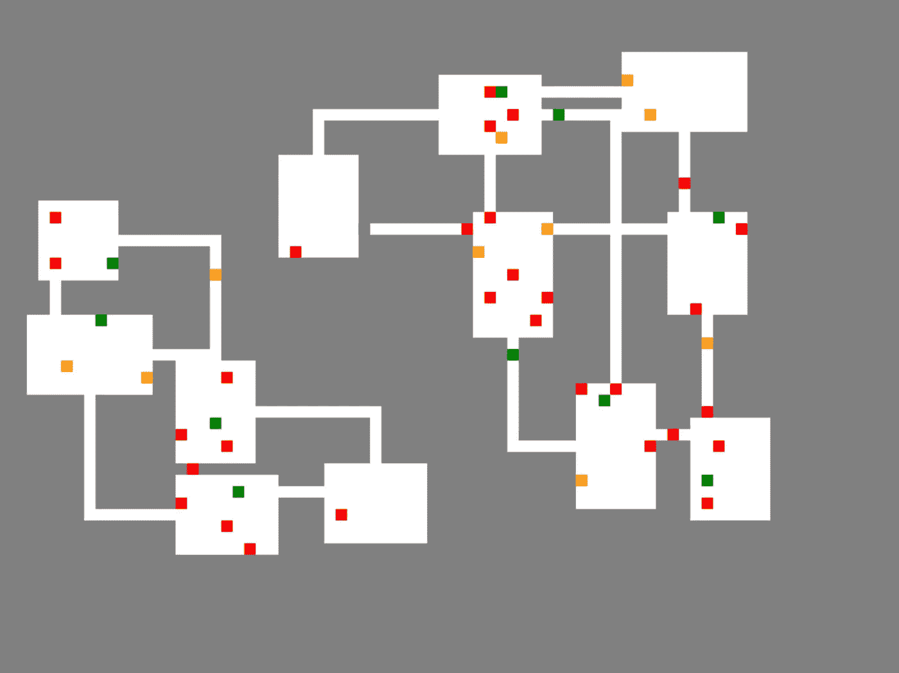

# 如何在 JavaScript Roguelike 中实现所有房间的可达性

> 原文：<https://javascript.plainenglish.io/making-all-rooms-reachable-in-a-javascript-roguelike-eb1265cadf99?source=collection_archive---------17----------------------->



Image by v[ectorpouch](https://www.freepik.com/vectorpouch) on freepik

在流行的 2D 游戏类型 roguelike 中，地牢布局是由一种算法生成的。当我在自己的 roguelike 中编写生成房间的逻辑时，我遇到了一个问题，在我测试的一些自动创建的关卡中，玩家无法到达所有的房间。

这个问题偶尔会出现在[建造拐角通道](https://nevkatz.medium.com/javascript-roguelikes-connecting-diagonal-dungeon-rooms-using-corners-79f460f96615?postPublishedType=repub)教程的产品中，该教程解释了如何建造一个 roguelike，其中房间通过一个直通道或两个在拐角处相交的通道连接。虽然完成的代码通常会导致所有房间都可以到达，但有一点点机会你会得到一个像下面这样的级别。



How is the player in blue supposed to reach the rooms on the left?

在这里，穿蓝色衣服的玩家不能到达左边的三个房间。因为必须击败所有红色的敌人才能完成地下城，玩家将无法前进。

这篇文章描述了一种方法来解决这个问题，使玩家可以从任何房间开始进入所有房间。让我们看看如何添加额外的逻辑来检查无法到达的房间，并尝试将它们连接到地牢的主房间网络。

# 文件结构

虽然本文涵盖了一个更大的游戏项目的第 5 阶段，但是每个阶段都有自己的起始代码目录——所以如果您愿意，您可以直接进入第 5 阶段，而无需任何前期工作。

要下载项目目录，可以去这个 [Git repo](https://github.com/nevkatz/js-roguelike-rooms) ，点击 *Code* ，点击 *Download ZIP。*或者，您可以从命令行克隆它:

```
git clone [https://github.com/nevkatz/js-roguelike-rooms.git](https://github.com/nevkatz/js-roguelike-rooms.git)
```

在下载的 repo 中，有一个结构如下的`phase-5-recursion`目录。

```
phase-5-recursion
  |
  *--index.html
  |
  *--css 
  |   |
  |   *--style.css
  |
  *--js 
      |
      *--**script.js**
      |
      *--game.js
      |
      *--**room.js**
      |
      *--path.js
```

在这个目录中，前面阶段的所有方法都已经完成，所以您可以专注于本文的任务。虽然以前的 roguelike 文章中的代码没有详细介绍，但是您可以在您正在工作的`phase-5-recursion`目录中查看它。下面是我们关注的两个 JavaScript 文件:

*   `script.js`负责管理游戏
*   `room.js`，其中包含了`Room`类

您也可以在`solutions`目录中查看完成的代码。

在深入研究之前，让我们先看看现有代码最相关的方面，从`Game`和`Room`类开始。

# 游戏课

在下面你会发现`Game`类，它保存了地牢布局、房间记录以及对游戏的`<canvas>`元素和其被称为`context`的绘制方法的引用。

地牢布局保存在`map`属性中，作为瓷砖代码的 2D 数组。在下面的示例`map`值中，一个 4x4 的房间位于 6x6 地图的中心。

```
[[0,0,0,0,0,0],
 [0,1,1,1,1,0],
 [0,1,1,1,1,0],
 [0,1,1,1,1,0],
 [0,1,1,1,1,0],
 [0,0,0,0,0,0]]
```

`rooms`数组存储游戏中的`Room`对象。

# 房间类

`Room`类是一个表示单个房间的对象，它包含许多与连接到其他房间相关的方法和属性。

The room class.

每个`Room`对象都有一个名为`neighbors`的属性，这是它通过路径连接到的其他`Room`对象的数组。每个房间存放三个坐标为`x`和`y`的物体:

*   `start`，代表左上角
*   `end`，代表右下角
*   `center`，在房间生成时用于计算`start`和`end`

# 到目前为止代码是如何工作的

在我们的`script.js`文件中有一个名为`generateMapRooms`的函数，它创建游戏关卡。它是这样工作的:

*   它生成多个房间，将每个房间添加到`Game`对象的`map`和`rooms`属性中。
*   每个`Room`对象试图连接到两个房间:一个房间直接穿过它和它最近的邻居。

虽然这种方法通常会产生一个单一的房间网络，但正如我们前面看到的那样，经常会出现两个或更多单独的房间网络。下面是另一个例子。



Two networks of rooms in a roguelike.

为了确保每个房间都可以被其他房间访问，我们将添加两种方法:

*   搜索给定房间可到达的房间的人；
*   另一个将其余房间连接到主网络。

# 搜索可到达的房间

在`room.js`文件中，您现在可以向`Room`类添加一个名为`searchNeighbors`的方法。

*   当一个给定的`Room`对象调用`searchNeighbors`时，它让它的每个邻居调用它，那些邻居也这样做。
*   这将产生一个从原始房间可以到达的所有房间的列表。

## 它是如何工作的

当原来的`Room`对象调用这个方法时，不会传入任何参数。下面是下一个方法`connectRemaining`中发生的`searchNeighbors`调用的预览。

```
let connectedRooms = this.searchNeighbors();
```

因为没有传入参数，`reachable`由于缺省参数而作为空数组启动。

```
Room.prototype.searchNeighbors = function(reachable=[]) {
```

在下面的循环中，这个初始房间将把它所有的邻居推入`reachable`数组。

```
for (let neighbor of this.neighbors) {

      if (!reachable.includes(neighbor)) {

       **  reachable.push(neighbor);**
```

然后它的每个邻居将调用`searchNeighbors`并做同样的事情。对于那些刚刚习惯递归的人来说，这是使方法递归的原因——因为它调用自己。

```
for (let neighbor of this.neighbors) { if (!reachable.includes(neighbor)) {

         reachable.push(neighbor); **reachable = neighbor.searchNeighbors(reachable);**
      } 
 }
```

因为`reachable`在每个方法调用结束时被返回，每个邻居收集的每个额外的房间将在由原始房间返回的`reachable`数组中结束。

```
return reachable;
```

结果，所有可到达的房间都在前面的`connectedRooms`数组中结束。

但是等等！如果方法调用自身，为什么最终不会导致无限循环？注意这一行:

```
if (!reachable.includes(neighbor)) {
```

因为一个相邻的房间只在它还不在`reachable`数组中的时候调用`searchNeighbors`，所以一个已经在列表中的房间不会再调用这个方法。因此，当添加完所有可到达的房间后，方法调用结束。

现在我们可以找到所有可到达的房间，让我们写一个方法来识别那些不可到达的房间，并把它们带入网络。

# 连接其余房间

下面是`connectRemaining`方法，它使用`searchNeighbors`获得可到达房间的列表，然后识别不在列表中的不可到达房间。然后，它会尝试将无法到达的房间连接到主网络。

The connectRemaining method.

让我们来分析一下发生了什么。

方法调用房间首先用`[findPotentialRooms](https://gist.github.com/nevkatz/3d29f95b2e58f3709621b28c4417cf88)`获得一个潜在房间的数组，这在[渲染房间](/connecting-rooms-in-a-javascript-roguelike-8e6212c54c9)教程中有介绍。

```
let rooms = this.findPotentialRooms();
```

然后，它初始化一个`connectedRooms`数组，将它设置为等于由`searchNeighbors`返回的可到达房间列表。

```
let connectedRooms = this.searchNeighbors();
```

然后，`connectRemaining`方法将从游戏的所有房间中过滤出可到达的房间，留下一个只有`unreachable`房间的列表。

```
let unreachable = rooms.filter(x => !connectedRooms.includes(x));
```

然后，它将遍历每个无法到达的房间，并尝试将每个房间连接到网络中的一个房间。房间调用`[nearestNeighbor](https://gist.github.com/nevkatz/69524b6c54f8e5291614a4072d8687d6)`方法，该方法在[带拐角的建筑通道](http://which sorts the connectedRooms from closest to farthers)文章中有所介绍，并传入`connectedRooms`作为要使用的房间列表。

```
for (var room of unreachable) {let success = room.nearestNeighbor(connectedRooms);

      if (success) { numConnected++; }
}
```

当一个房间在这里调用`[nearestNeighbor](https://gist.github.com/nevkatz/69524b6c54f8e5291614a4072d8687d6)`方法时，它将从最近到最远对`connectedRooms`进行排序，并尝试首先连接到最近的房间。如果不起作用，它将尝试下一个最接近的房间，以此类推，直到它连接到一个房间或用尽列表中的所有房间。

让我们回顾一下这里发生了什么:

*   给定的房间将调用`connectRemaining`，它使用`searchNeighbors`来收集从方法调用房间可到达的房间列表。
*   然后通过从游戏的房间列表中过滤出可到达的房间来生成不可到达房间的列表。
*   然后，每个不可到达的房间尝试连接到一个可到达的房间，从离它最近的房间开始。
*   最后，出于调试的目的，我希望返回一个对象，其中包含连接的房间数量以及最初无法到达的房间数量。

```
return {numConnected, numDisc:unreachable.length};
```

# 完成的主要功能

现在所有的方法都完成了，是时候完成`script.js`中的游戏逻辑了。下面是集成了`nearestNeighbor`和`connectRemaining`逻辑的完整`generateMapRooms`功能。

The completed generateMapRooms method.

注意，在循环的底部，我们让每个房间调用`connectRemaining`来确保每个房间都可以从其他房间到达。

```
for (var myRoom of game.rooms) { myRoom.connectRemaining();}
```

只有在极少数情况下才需要这种方法，因此，即使您打印日志语句来指示它何时连接到以前无法到达的房间，您也可能需要多次刷新浏览器才能看到它发生。

如果你想有更好的机会看到它的运行，试着通过在`generateMapRooms`中注释掉最初的`[nearestNeighbor](https://gist.github.com/nevkatz/69524b6c54f8e5291614a4072d8687d6)()`调用来预先连接更少的房间。

```
for (var room of game.rooms) { success = room.findFacingRooms(min); ** // success = room.nearestNeighbor();**
}
```

或者，您可以注释掉`[findFacingRooms](https://gist.github.com/nevkatz/dec1067b6836240a38129d26b94ca917)`方法。

```
for (var room of game.rooms) { **// success = room.findFacingRooms(min);** success = room.nearestNeighbor();
}
```

只是一定要运行其中一个方法，免得你根本没有任何段落。

一旦您注释掉了一个房间连接方法，您可以尝试在您的`unreachable`循环中记录一些语句。

```
for (var room of unreachable) { **console.log(`${room.id} is disconnected`);** let success = room.nearestNeighbor(connectedRooms);

      if (success) {
 **console.log(`${room.id} has been connected`);**
         numConnected++;
      }
}
```

回到`generateMapRooms`，您还可以捕获返回对象的属性，并记录每次调用`connectRemaining`后连接了多少个房间。

```
for (var myRoom of game.rooms) { let {numConnected, numDisc} = myRoom.connectRemaining(); console.log(`Room${myRoom.id} connected ${numConnected} out of ${numDisc} rooms`);}
```

恭喜你！你已经完成了教程，现在应该有完整的游戏工作。请随意将您的工作与下面的 CodePen 或 Netlify 上的这个[演示](https://stellular-biscuit-6757a3.netlify.app/solution/index.html)进行比较。

The final game on CodePen.

# 可能的后续步骤

*   尝试添加滚动逻辑、滑动控制或加速度控制。
*   考虑将图像用于地板和墙砖。
*   尝试为玩家、武器、药剂和敌人使用精灵。
*   看看能不能加一个离玩家足够远的目标物品作为挑战。
*   尝试调整房间生成算法，使房间总是靠得更近。

我希望你喜欢这篇用递归连接剩余房间的教程。日安！

*考虑注册*[***Medium***](https://medium.com/@nevkatz/membership)*无限制访问我以及其他作者的文章。*

*更多内容请看*[***plain English . io***](https://plainenglish.io/)*。报名参加我们的* [***免费周报***](http://newsletter.plainenglish.io/) *。关注我们关于*[***Twitter***](https://twitter.com/inPlainEngHQ)*和*[***LinkedIn***](https://www.linkedin.com/company/inplainenglish/)*。加入我们的* [***社区不和谐***](https://discord.gg/GtDtUAvyhW) *。*