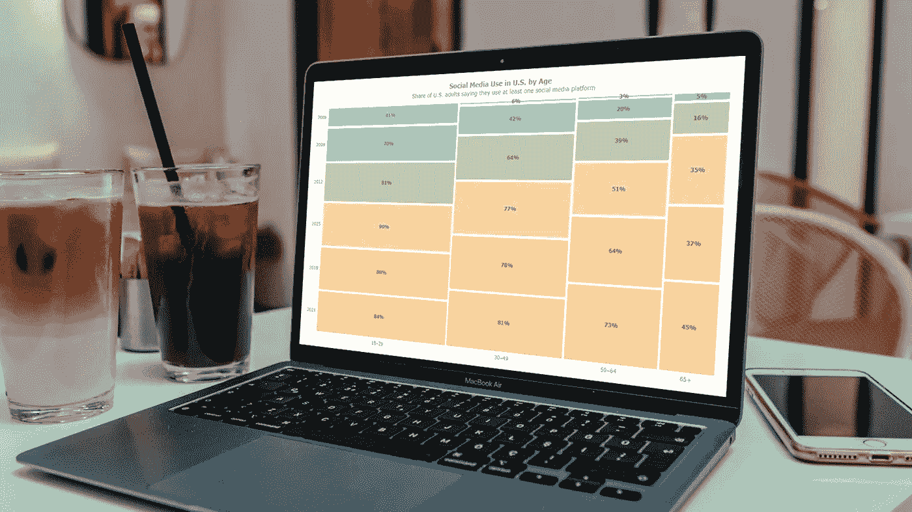
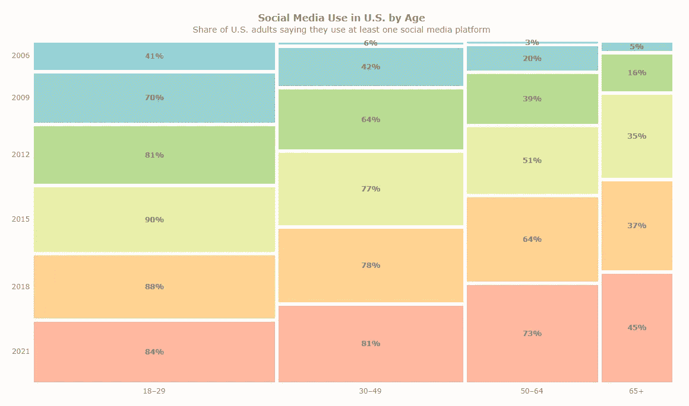
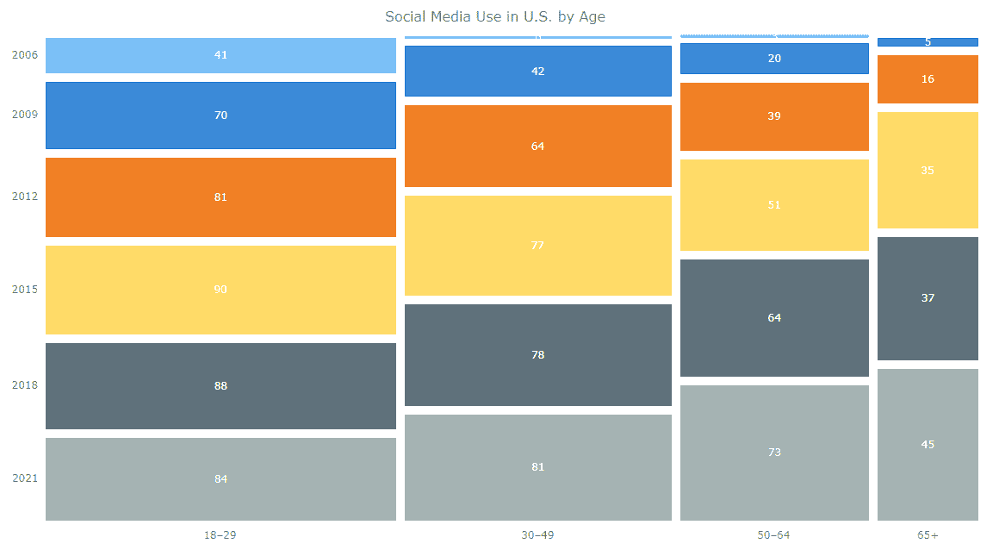
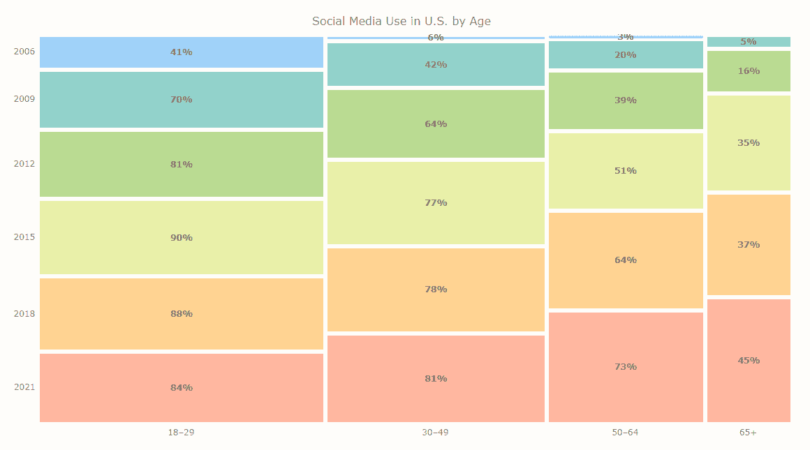
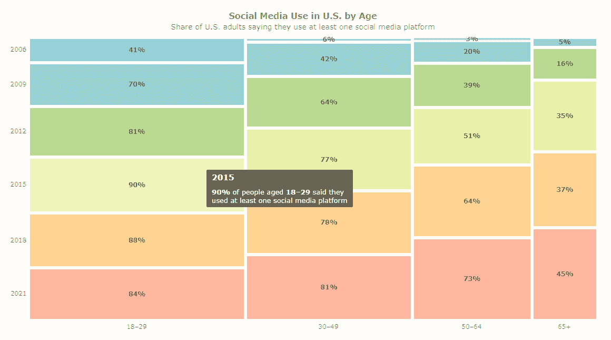

# 用 JavaScript 制作镶嵌图

> 原文：<https://javascript.plainenglish.io/making-mosaic-plots-with-javascript-7934bc1aa48c?source=collection_archive---------17----------------------->



**你听说过马赛克阴谋吗？**这是一种非常有趣的图表类型，旨在帮助探索变量之间的关系。镶嵌图(也称为镶嵌图)将数据可视化为矩形图块，其宽度编码一个变量，高度编码另一个变量。

如果您想学习如何轻松创建这样一个优雅的图表，请跟我来，我现在就向您展示诀窍！在本教程中，我将使用 JavaScript 构建一个交互式马赛克图，展示美国社交媒体的使用情况，并详细解释每一步。

# 待建镶嵌图

为了让你有心情进行一些创造性的工作，我邀请你先睹为快，看看将在文章结尾完成的最终马赛克情节。是时候开始行动了！



# 基本镶嵌图

如果您曾经用 JavaScript 创建过图表，那么您已经了解它是如何工作的。在这种情况下，您只需[选择一个 JS 图表库](https://www.anychart.com/blog/2017/03/05/how-to-choose-the-right-javascript-charting-component-10-factors-you-have-to-consider/)并遵循其[马赛克绘图文档](https://docs.anychart.com/Basic_Charts/Marimekko_Chart/Mosaic_Chart)。但是如果这是你第一次这样的经历(或者你之前的经历不太容易也不太令人兴奋)，这篇教程正是为你准备的！

让我们从定义应该采取的步骤开始。一般来说，任何基于 JS 的酷的交互式数据可视化，包括镶嵌图，都建立在四个基本步骤上:

1.  为你的图表准备一个网页。
2.  参考要使用的 JavaScript 文件。
3.  设置要可视化的数据。
4.  写一些 JS 代码来产生你需要的情节。

现在，和我一起深入研究每一个问题吧！

# 1.获取网页

重要的事情先来。我创建了一个基本的 HTML 页面。在`<body>`部分，我包含了一个块级元素`<div>`，这将是镶嵌图被渲染的位置，并为它提供了一个唯一的`id`属性，在本例中为`container`。我还将其高度和宽度设置为 100%,因为我希望看到马赛克图沿着整个网页延伸。

以下是我的 HTML 页面的外观:

```
<html>
  <head>
    <title>Mosaic Plot in JS</title>
    <style type="text/css">      
      html, body, #container { 
        width: 100%; height: 100%; margin: 0; padding: 0; 
      } 
    </style>
  </head>
  <body>
    <div id="container"></div>
  </body>
</html>
```

# 2.参考 JavaScript 文件

现在，是时候加载脚本了，这些脚本将用于在网页上创建预期的镶嵌图。

在这里，我将使用 AnyChart 的 [JS 图表库](https://www.anychart.com)。它功能丰富，拥有全面的[文档](https://docs.anychart.com)和 [API 参考](https://api.anychart.com/)，以及[图库](https://www.anychart.com/products/anychart/gallery/)中众多现成的示例。此外，AnyChart 是模块化的，这意味着人们可以只连接几个轻量级脚本来提供实际需要的功能，而不是不必要地让整个库过载一个网页或应用程序。

一个马赛克图需要两个模块: [Core](https://docs.anychart.com/Quick_Start/Modules#core) 和 [Mekko](https://docs.anychart.com/Quick_Start/Modules#mekko) 。我通过在`<head>`部分包含以下内容将它们添加到页面中:

```
<script src="https://cdn.anychart.com/releases/8.11.0/js/anychart-core.min.js"></script>
<script src="https://cdn.anychart.com/releases/8.11.0/js/anychart-mekko.min.js"></script>
```

我还在`<body>`部分放了一个`<script>`标签。(或者可以去`<head>`段。并不重要。)那是我即将到来的马赛克情节的完整 JavaScript 代码将被放置的地方。

这里是我在这一点上得到的:

```
<html>
  <head>
    <title>Mosaic Plot in JS</title>
    <script src="https://cdn.anychart.com/releases/8.11.0/js/anychart-core.min.js"></script>
    <script src="https://cdn.anychart.com/releases/8.11.0/js/anychart-mekko.min.js"></script>
    <style type="text/css">      
      html, body, #container { 
        width: 100%; height: 100%; margin: 0; padding: 0; 
      } 
    </style>
  </head>
  <body>  
    <div id="container"></div>
    <script>
 ***// The JS mosaic plotting code will come here.***    </script>
  </body>
</html>
```

# 3.设置数据

然后是数据。正如我在引言中指出的，我想看看美国的社交媒体采用情况。据报道，如今约四分之三的美国成年人至少使用一个社交媒体网站。让我们更深入地探究不同年龄组和年龄的情况——这将是一个很酷的马赛克情节的例子！

我将可视化的数据来自皮尤研究中心。它看起来并不复杂，所以我将把它直接添加到代码中。请注意数据的格式，因为这是镶嵌图“理解”在哪个轴上表示什么的方式。

```
let data = {
  header: ['#', '2006', '2009', '2012', '2015', '2018', '2021'],
  rows: [
    ['18–29', 41, 70, 81, 90, 88, 84],
    ['30–49', 6, 42, 64, 77, 78, 81],
    ['50–64', 3, 20, 39, 51, 64, 73],
    ['65+', 0, 5, 16, 35, 37, 45]
  ]
};
```

# 4.写一些 JS 代码

我已经为我的镶嵌图找到了一个位置，绘制它的脚本，以及需要可视化的数据。现在这些东西都设置好了，我将在`<script>`标签中做一些快速的 JavaScript 编码。

我在这里做的第一件事是添加`anychart.onDocumentReady()`函数。其他所有东西都将放入其中，并在网页完全加载后执行。

```
<script>
  anychart.onDocumentReady(function () {
 ***// The JS mosaic plotting code will come here.***  });
</script>
```

然后我添加上一步的数据:

```
anychart.onDocumentReady(function () { let data = {
    header: ['#', '2006', '2009', '2012', '2015', '2018', '2021'],
    rows: [
      ['18–29', 41, 70, 81, 90, 88, 84],
      ['30–49', 6, 42, 64, 77, 78, 81],
      ['50–64', 3, 20, 39, 51, 64, 73],
      ['65+', 0, 5, 16, 35, 37, 45]
    ]
  };});
```

然后，在同一个函数中，我创建了一个镶嵌图的实例:

```
let chart = anychart.mosaic();
```

并将数据加载到其中:

```
chart.data(data);
```

我还为整个马赛克图添加了一个标题:

```
chart.title("Social Media Use in U.S. by Age");
```

最后，我通过指定`<div>`元素的 ID 来定义放置可视化的位置(参见步骤 1 ),并绘制最终的镶嵌图。

```
chart.container('container'); chart.draw();
```

下面是我的镶嵌图的完整 JavaScript 代码:

```
anychart.onDocumentReady(function () {

 ***// set the data to visualize***  let data = {
    header: ['#', '2006', '2009', '2012', '2015', '2018', '2021'],
    rows: [
      ['18–29', 41, 70, 81, 90, 88, 84],
      ['30–49', 6, 42, 64, 77, 78, 81],
      ['50–64', 3, 20, 39, 51, 64, 73],
      ['65+', 0, 5, 16, 35, 37, 45]
    ]
  }; ***// create a mosaic plot***  let chart = anychart.mosaic();

 ***// load the data to the plot***  chart.data(data); ***// set the plot title***  chart.title("Social Media Use in U.S. by Age");

 ***// set the mosaic chart container element id***  chart.container('container');

 ***// draw the resulting chart***  chart.draw();

});
```

答对了。一个基本的镶嵌图就在这几行代码中准备好了！



我们可以立即看到，最年轻年龄组的人使用社交媒体的比例比其他任何年龄组都高。嗯，这是意料之中的。但是看看与 10 年或 15 年前相比，现在有多少其他年龄组的人使用社交媒体。看看你还能注意到什么。

在 [AnyChart 游乐场](https://playground.anychart.com/1xYCN7zI)查看这个基本的马赛克图。为了以防万一，完整的代码也在下面:

```
<html>
  <head>
    <title>Mosaic Plot in JS</title>
    <script src="https://cdn.anychart.com/releases/8.11.0/js/anychart-core.min.js"></script>
    <script src="https://cdn.anychart.com/releases/8.11.0/js/anychart-mekko.min.js"></script>
    <style type="text/css">      
      html, body, #container { 
        width: 100%; height: 100%; margin: 0; padding: 0; 
      } 
    </style>
  </head>
  <body>  
    <div id="container"></div>
    <script> anychart.onDocumentReady(function () {

 ***// set the data to visualize***        let data = {
          header: ['#', '2006', '2009', '2012', '2015', '2018', '2021'],
          rows: [
            ['18–29', 41, 70, 81, 90, 88, 84],
            ['30–49', 6, 42, 64, 77, 78, 81],
            ['50–64', 3, 20, 39, 51, 64, 73],
            ['65+', 0, 5, 16, 35, 37, 45]
          ]
        }; ***// create a mosaic plot***        let chart = anychart.mosaic();

 ***// load the data to the plot***        chart.data(data); ***// set the plot title***        chart.title("Social Media Use in U.S. by Age");

 ***// set the mosaic chart container element id***        chart.container('container');

 ***// draw the resulting chart***        chart.draw();

      }); </script>
  </body>
</html>
```

# 高级镶嵌图

在本教程的上一部分中构建的镶嵌图基于 AnyChart JS 图表库中配置的该图表类型的默认设置。但是也有各种选项来调整可视化。现在，跟我一起利用定制的力量，使我的马赛克图更加时尚，信息量更大。

# 1.更改马赛克情节设计主题

首先，我想使马赛克情节的颜色更加复杂，并使用一些柔和的色调。AnyChart 提供了一系列预置的[图表设计主题](https://docs.anychart.com/Appearance_Settings/Themes)。其中有一个美丽的蜡笔，我马上就要使用。为此，我通过在`<head>`部分添加一个链接来加载专用的 JS 文件:

```
<script src="https://cdn.anychart.com/releases/8.11.0/themes/pastel.js"></script>
```

并在 JS 代码中设置主题:

```
anychart.theme("pastel");
```

# 2.增强镶嵌图标签

其次，我使用 HTML 改进了镶嵌图标签中的字体样式，并添加了百分号%以明确这些值是百分比:

```
chart.labels()
  .useHtml(true)
  .format("<span style='font-size:12px; font-weight:700; color: #786b61;'>{%value}%</span>");
```

# 3.调整镶嵌图的平铺间距

第三，我减少瓷砖之间的间距。由于图表颜色现在变浅了，这将进一步美化镶嵌图，并为图块中显示的标签提供更多空间。

```
chart.pointsPadding(3);
```



在 AnyChart Playground 上看看这个定制版的马赛克图及其完整代码。

# 4.改进镶嵌图标题

第四，我修改标题的外观。HTML 可以帮我定制字体和添加字幕。

```
chart
  .title()
  .enabled(true)
  .useHtml(true)
  .text("<span style = 'font-size:16px; font-weight:600;'>Social Media Use in U.S. by Age</span><br><span style = 'font-size:14px;'>Share of U.S. adults saying they use at least one social media platform</span>");
```

# 5.增强镶嵌图工具提示

第五，也是最后一点，我改变了工具提示的内容，使其更具信息性。在工具提示的标题中，我显示了年份，在主要部分，我用百分比和年龄组来解释，而不是默认显示的原始数字。

```
let tooltip = chart.tooltip();
tooltip
  .useHtml(true)
  .titleFormat("<b><span style='font-size:15px;'>{%SeriesName}</b>")
  .format("<span style='font-size:13px;'><b>{%value}%</b> of people aged <b>{%x}</b> said they<br> used at least one social media platform</span>");
```

那么，你觉得有了所有这些定制的教程的最终镶嵌图怎么样？



在 [AnyChart Playground](https://playground.anychart.com/d0G2JcXJ) 上查看这个最终版本的马赛克图及其完整源代码。

```
<html>
  <head>
    <title>Mosaic Plot in JS</title>
    <script src="https://cdn.anychart.com/releases/8.11.0/js/anychart-core.min.js"></script>
    <script src="https://cdn.anychart.com/releases/8.11.0/js/anychart-mekko.min.js"></script>
    <script src="https://cdn.anychart.com/releases/8.11.0/themes/pastel.js”></script>
    <style type="text/css">      
      html, body, #container { 
        width: 100%; height: 100%; margin: 0; padding: 0; 
      } 
    </style>
  </head>
  <body>  
    <div id="container"></div>
    <script> anychart.onDocumentReady(function () {

 ***// set the data to visualize***        let data = {
          header: ['#', '2006', '2009', '2012', '2015', '2018', '2021'],
          rows: [
            ['18–29', 41, 70, 81, 90, 88, 84],
            ['30–49', 6, 42, 64, 77, 78, 81],
            ['50–64', 3, 20, 39, 51, 64, 73],
            ['65+', 0, 5, 16, 35, 37, 45]
          ]
        }; ***// create a mosaic plot***        let chart = anychart.mosaic();

 ***// set one of the pre-built design themes***        anychart.theme("pastel"); 

 ***// load the data to the plot***        chart.data(data);

 ***// configure the label settings***        chart.labels()
          .useHtml(true)
          .format("<span style='font-size:12px; font-weight:700; color: #786b61;'>{%value}%</span>");

 ***// set the padding between the points***        chart.pointsPadding(3);

 ***// set the plot title***        chart
          .title()
          .enabled(true)
          .useHtml(true)
          .text("<span style = 'font-size:16px; font-weight:600;'>Social Media Use in U.S. by Age</span><br><span style = 'font-size:14px;'>Share of U.S. adults saying they use at least one social media platform</span>");

 ***// format the tooltip using html***        let tooltip = chart.tooltip();
        tooltip
          .useHtml(true)
          .titleFormat("<b><span style='font-size:15px;'>{%SeriesName}</b>")
          .format("<span style='font-size:13px;'><b>{%value}%</b> of people aged <b>{%x}</b> said they<br> used at least one social media platform</span>");

 ***// set the mosaic chart container id***        chart.container('container');

 ***// draw the resulting chart***        chart.draw();

      }); </script>
  </body>
</html>
```

# 结论

我希望你喜欢这个教程，并意识到它是多么容易建立一个伟大的前瞻性，交互式马赛克情节。HTML 和 JavaScript 的工作知识在这样的任务中总是很有帮助的。但是现在你看到它不是太必要，因为每件事都可以非常简单和直观。

现在轮到你了！去制作你自己的马赛克图来应用你新获得的技能。或者学习[如何创建其他](https://www.anychart.com/blog/category/javascript-chart-tutorials/)[类型](https://docs.anychart.com/Basic_Charts/Marimekko_Chart/Mosaic_Chart)的 JavaScript 图表。当然，不要忘记在你选择的社交媒体平台上分享你的数据可视化！

非常感谢 Shachee Swadia 为我们的博客制作了这个惊人的马赛克情节指南！

***查看更多***[***JavaScript 制图教程***](https://www.anychart.com/blog/category/javascript-chart-tutorials/) ***。***

您愿意为我们的博客创建客座博文吗？ [***让我们认识一下***](https://www.anychart.com/support/) ***！***

*最初发表于 2022 年 8 月 15 日*[*https://www.anychart.com*](https://www.anychart.com/blog/2022/08/15/mosaic-plot/)*。*

*更多内容请看*[***plain English . io***](https://plainenglish.io/)*。报名参加我们的* [***免费周报***](http://newsletter.plainenglish.io/) *。关注我们关于*[***Twitter***](https://twitter.com/inPlainEngHQ)[***LinkedIn***](https://www.linkedin.com/company/inplainenglish/)*[***YouTube***](https://www.youtube.com/channel/UCtipWUghju290NWcn8jhyAw)*[***不和***](https://discord.gg/GtDtUAvyhW) *。***