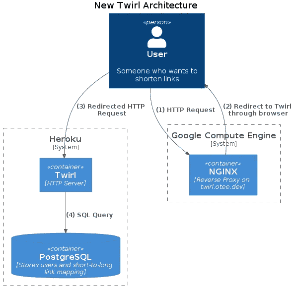
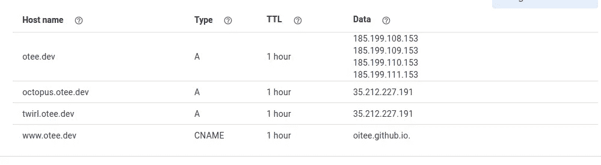
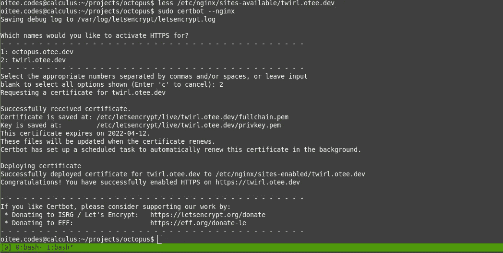
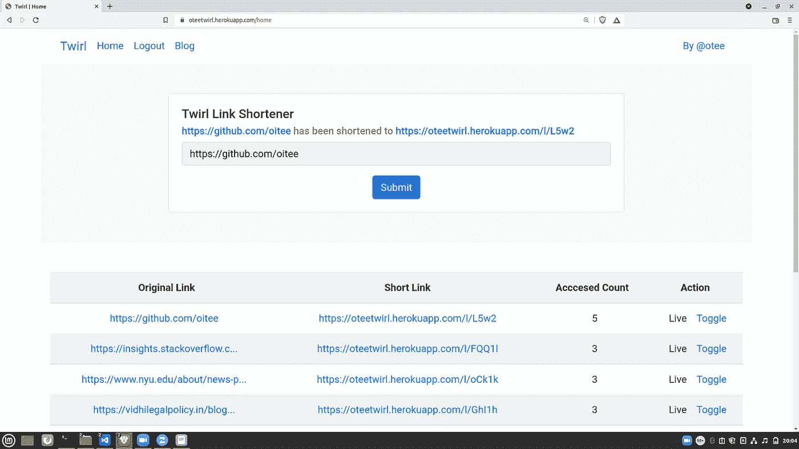
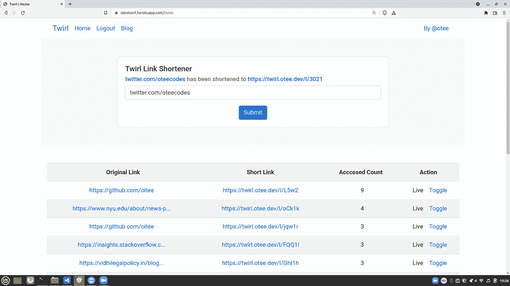

# 如何让短链接更短:使用 NGINX 和自定义域

> 原文：<https://javascript.plainenglish.io/making-short-links-shorter-using-nginx-custom-domain-44d2637fb329?source=collection_archive---------18----------------------->

## 如何缩短 Twirl 生成的短链接的指南？


在这篇文章中，我解释了如何缩短由[旋转](https://otee.dev/2022/01/13/making-short-links-shorter.html)产生的短链接。比如从`oteetwirl.herokuapp.com/l/L5w2`到`twirl.otee.dev/l/L5w2`。

# 问题陈述

1.  **Twirl** 是一款基于用户的网址缩短应用。要了解更多关于 Twirl 是如何建造和设计的，请阅读[这个](https://otee.dev/2021/11/14/twirl-user-management.html)、[这个](https://otee.dev/2021/12/08/storing-passwords-securely.html)和[这个](https://otee.dev/2021/12/20/twirl-link-shortening.html)。下面是托管 Twirl 的 GitHub 库:[https://github.com/oitee/twirl](https://github.com/oitee/twirl)。
2.  Twirl 部署在 **Heroku** 上，作为一款免费应用。在[oteetwirl.herokuapp.com](https://oteetwirl.herokuapp.com/)有售。
3.  Heroku 上不提供支持 HTTPS 的自定义域名免费服务。这使得 Twirl 生成的结果短链接并不那么短。
4.  解决方案:我们继续在 Heroku 上运行 Twirl，但使用了一个**更短的自定义域**，这将缩短应用程序生成的短链接。比如，app 应该生成[](https://twirl.otee.dev/l/L5w2)**而不是生成[【oteetwirl.herokuapp.com/l/L5w2】](https://oteetwirl.herokuapp.com/l/L5w2)**
5.  **为了公开这个新的短链接，Twirl 还应该在其 UI 上显示短链接的较短版本。**

# **技术考虑**

**大体上，有三种方法可以做到这一点:**

1.  ****方法一:完全迁移到 IaaS** :在自有服务器上运行整个应用，比如谷歌云计算。这将允许我们选择我们的域名，也运行系统。但是如果我们这样做，我们将需要管理数据库，并让服务器一直运行(不像 Heroku 的自动睡眠选项)。这里更大的担忧是世界已经知道了 oteetwirl.herokuapp.com。为了不中断用户体验，我们不仅要将 Heroku 数据库中的数据复制到 GCP 服务器上，还要持续提供该应用程序上的旧短网址(即，让 Heroku 将当前短链接的请求重定向到 GCP)。**
2.  ****方法 II:定制到 PaaS 的重定向**:提供从较短链接(使用定制的短域名)到主系统的重定向机制，主系统继续在 Heroku 上运行。这具有成本效益的优势，因为我们已经有了一个 GCP 服务器，它是为另一个项目设置的**
3.  ****方法三:I & II** 的混合:在方法一中，理论上，我们可以让数据库在 Heroku 上运行，但让应用程序在 GCP 上运行，而不是提升和转移的迁移方式。但是这仍然不如方法二划算，因为 GCP 上的 HTTP 服务器必须连续运行。**

**因此，我们的首选方法是第二种方法:**

****

***上面的 C4 图是用* [*这个*](https://gist.github.com/oitee/725732646af54024d4bc242608e1cf4e) 生成的**

# **步骤 1:创建 DNS 条目**

**我们为 GCP 虚拟机添加 DNS 条目，我们已经生成了另一个项目:**

****

**所以现在， [twirl.otee.dev](https://twirl.otee.dev) 指向我的 GCP 虚拟机。**

# **步骤 2:设置 NGINX**

**我们将大致遵循官方文档中提到的[重写 URL 的步骤:](https://www.nginx.com/blog/creating-nginx-rewrite-rules/)**

1.  **我们将使用`return`指令**
2.  **我们将使用 HTTP 状态 301 重定向到客户端(永久移动)**
3.  **我们将通过保持一切不变来构造重定向 URL，除了主机名。**
4.  **我们将使用 LetsEncrypt 设置 HTTPS**

**为了执行步骤 1、2、3，我们在这里创建一个新文件:`/etc/nginx/sites-available/twirl.otee.dev`,包含:**

```
server {
    listen 80;
    listen 443 ssl;
    server_name twirl.otee.dev;
    return 301 $scheme://oteetwirl.herokuapp.com$request_uri;
}
```

**接下来，我们通过创建一个符号链接来启用该站点:**

```
sudo ln -s /etc/nginx/sites-available/twirl.otee.dev /etc/nginx/sites-enabled/twirl.otee.dev
```

**接下来，我们应该重启 NGINX:**

```
sudo systemctl status nginx
sudo systemctl restart nginx
```

**在这一点上，如果我们去`twirl.otee.dev`它应该带我们旋转，它运行在 Heroku 上。但是，因为我们使用的是一个`.dev`域，所以我们有必要为`twirl.otee.dev`创建一个 SSL 证书，以便支持 HTTPS。**

**如果安装了 certbot，我们可以简单地使用这个命令:`sudo certbot --nginx`。如果未安装 certbot，则需要安装它(参见[文档](https://certbot.eff.org/instructions?ws=nginx&os=ubuntufocal))。**

****

**现在，重定向到 [twirl.otee.dev](https://twirl.otee.dev) 应该可以工作了。但如果没有，我们可能不得不刷新 DNS 缓存。谷歌域名可以这样做:[https://dns.google/cache](https://dns.google/cache)。**

**至此，我们已经实现了为我们的短链接使用短域名的目标。例如，下面的链接现在应该工作:`[twirl.otee.dev/l/L5w2](https://twirl.otee.dev/l/L5w2)`。**

# **步骤 3:在 Twirl 上显示短链接**

**虽然我们已经启用了域名`twirl.otee.dev`的短链接重定向，但 Twirl 应用程序仍然会显示较长的 URL，使用 Heroku 的默认域名。**

****

**我们希望 Twirl 显示 twirl.otee.dev/l/L5w2，而不是显示 oteetwirl.herokuapp.com/l/L5w2。目前，Twirl 的设计方式是服务器生成唯一的 URL 路径，最终的链接由[客户端 JavaScript](https://github.com/oitee/twirl/blob/a58e20c/public/views/home.mustache#L139) 通过追加当前域来构建:**

```
function shortLinkHref(link) {
  let finalLink = window.location.protocol + "//" + window.location.host + link;
  return `<a href='${link}' target='_blank'> ${finalLink}<a/>`;
}
```

**代替这种方法，我们可以在服务器端本身创建短链接。为此，我们应该首先从服务器上的环境中公开预期的域名。这是必需的，因为**服务器不知道它服务请求的域名**。它只知道它在本地端口上服务请求。即使它知道机器的 IP 地址(有时就是这种情况)，它仍然不知道哪些域名(可以有多个)映射到该 IP 地址，因为这一部分(即域名到 IP 地址的转换)必须由客户端通过进行 DNS 查询来完成。因此，应将目标域名作为附加信息提供给服务器。这纯粹是装饰性的，服务器会通过在给定的域名后面附加一个简短的 URL 路径来盲目地生成这个简短的 URL。**

**为了实现这一点，服务器被暴露给一个新的环境变量，即`CUSTOM_DOMAIN_NAME`，它包含我们更短的域名，即`twirl.otee.dev`。现在，每次收到缩短链接的请求时，服务器都会发回完整的短 URL(而不像前面那样只发送 URL 路径)。**

**根据这种设计，前端不能在从服务器接收的短链路上运行。这造成了一个小小的障碍，因为当用户点击主页上的**切换**按钮时，客户端 JavaScript 需要生成启用和禁用现有短链接的请求。之前，客户端 JavaScript 会以以下方式生成这些请求:**

```
async function updateStatus(link, currentStatus) {
  // 'link' is the URL path of a short link, 
  // 'currentStatus' indicates whether a short link is enabled or disabled at the moment
  link = link.substring(3);
  if (currentStatus) {
    await fetch(`/l/disable/${link}`, { method: "POST" });
  } else {
    await fetch(`/l/enable/${link}`, { method: "POST" });
  }
  await analyticsGenerator();
}
```

**为了允许客户端 JavaScript 生成上述请求，服务器除了发送完整的短 URL 之外，还发送短 URL 路径(没有前三个常见字符`/l/`)。这允许上述功能在没有许多改变的情况下运行:**

```
async function updateStatus(linkPath, currentStatus) {
  if (currentStatus) {
    await fetch(`/l/disable/${linkPath}`, { method: "POST" });
  } else {
    await fetch(`/l/enable/${linkPath}`, { method: "POST" });
  }
  await analyticsGenerator();
}
```

**现在，swift 在其主页上显示较短的短链接。🎉**

****

***原载于 2022 年 1 月 13 日*[*https://otee . dev*](https://otee.dev/2022/01/13/making-short-links-shorter.html)*。链接原文:*[*https://otee.dev/2022/01/13/making-short-links-shorter.html*](https://otee.dev/2022/01/13/making-short-links-shorter.html)**

***更多内容请看*[***plain English . io***](http://plainenglish.io/)*。报名参加我们的* [***免费周报***](http://newsletter.plainenglish.io/) *。在我们的* [***社区***](https://discord.gg/GtDtUAvyhW) *获得独家获得写作机会和建议。***