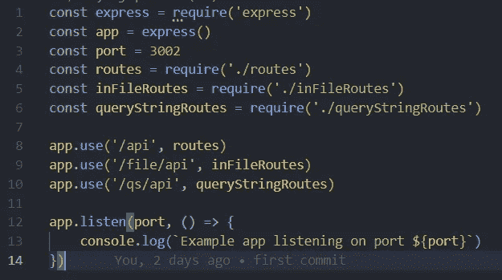
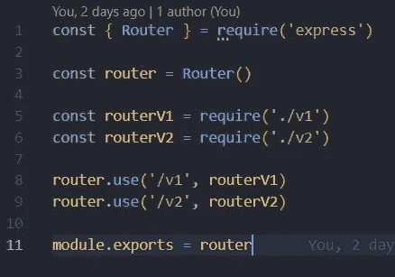
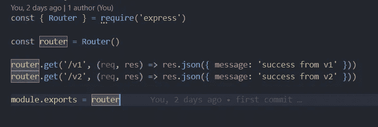
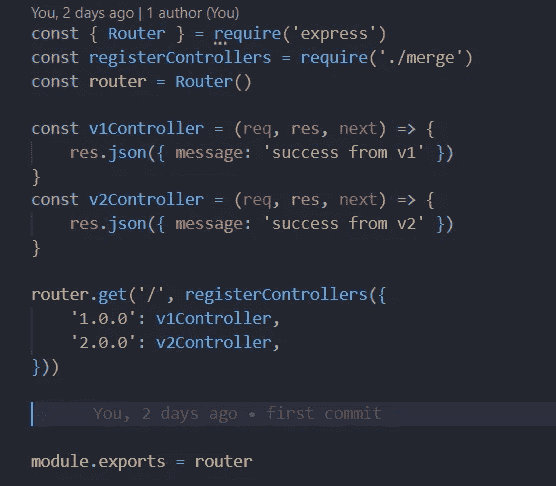
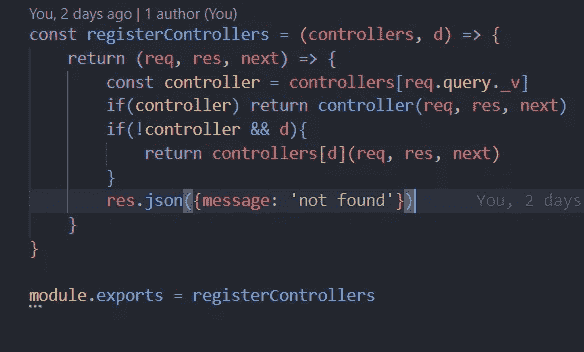

# 管理 Express 应用程序中的 API 版本

> 原文：<https://javascript.plainenglish.io/manage-api-version-in-express-app-8f3bca44a33c?source=collection_archive---------3----------------------->

## 使用查询字符串、文件或基于路径的方法管理您的 API 版本


Photo by [CHUTTERSNAP](https://unsplash.com/@chuttersnap?utm_source=medium&utm_medium=referral) on [Unsplash](https://unsplash.com?utm_source=medium&utm_medium=referral)

# 介绍

对于任何企业应用程序来说，在将多个应用程序与单个数据源进行通信时，API 都是必不可少的一部分。因为我们要处理多个应用程序，所以我们自然需要为它们维护 API 版本。

版本的一般使用情况是，当您有一个移动应用程序和一个 web 应用程序，您需要对后端进行一些修复，但也需要对前端进行更改，这样您就可以使用版本控制的强大功能来自动更新它们，而无需进行太多更改。

有几种方法可以管理一个 API 版本，我们今天将讨论这一点。

## 样板文件

让我们为示例应用程序创建一个样板文件，然后我们将为每种方法添加示例。我们将研究这些方法:

*   途径
*   文件
*   查询字符串

因此，我们为它们创建单独的文件，并将它们的路径添加到测试中:



Boilerplate app for all types of versioning

## 基于路线的版本控制


Route folder structure

对于任何版本可维护的途径来说，这都是理想的解决方案，在这种途径中，我们为每个版本定义一个对应的文件夹，并为特定的 API 版本维护定义相应的文件。

这种方法被广泛使用，并且更加稳定，因为每条路径都有自己的文件，并且属于特定的文件夹。这种方法的唯一常见问题是不容易找到路由的控制器，您需要在文件夹中找到特定 API 的其他版本。因为您可以很容易地使用代码编辑器搜索来找到版本，所以问题较少，并且被广泛接受。



Importing and using route

这就是我们导入和使用路线的方式。每条路线都有自己的一组路线，并且可以位于嵌套层中。

对于任何路由，版本号将在开始处。例如，

```
GET /api/v1/company/:companyId/employee/:employeeId/status
```

## 文件级路由


这种方法非常松散，但创建起来很快。在这种方法中，我们将为所有版本维护相同的文件。



File-based structure

对于任何路由，版本号都会在末尾。例如，

```
GET /api/company/:companyId/employee/:employeeId/v1/status
```

## 查询基于字符串的路线

这种方法与上面两种不同，因为您不需要添加路由定义，而是接受一个版本并根据该版本分配控制器。这种方法已经在市场上取得了进展，因为它只是后端级别的更改，指向 API 的任何版本或更改默认版本。

在这种方法中，我们不需要遵循任何文件夹结构，但是我们可以随心所欲地定义路由:



manage the version using QS

这里，我们创建了一个`registerController`方法，该方法根据控制器对象获取版本，并根据输入返回正确的控制器。下面是`registerController`的实现:



Implementation of register controller

我们正在检查是否有正确的查询字符串，然后将默认值分配给控制器。我们需要传递参数，因为返回值应该是可执行的。

这种路由实现的一个例子是:

```
GET /api/company/:companyId/employee/:employeeId/status?_v=1.0.0
GET /api/company/:companyId/employee/:employeeId/status?_v=2.0.0
```

这种方法应该放在最后，因为其他中间件应该在这之前执行。

## 结论

你也可以在你的项目中使用和实现许多其他的想法，但是每一种方法都是某种东西的衍生物。

希望你喜欢这个新知识。您可以在这里找到本文的源代码:

[](https://github.com/Piyush-Use-Personal/manage-express-version) [## GitHub-Piyush-使用-个人/管理-快速-版本

### 此时您不能执行该操作。您已使用另一个标签页或窗口登录。您已在另一个选项卡中注销，或者…

github.com](https://github.com/Piyush-Use-Personal/manage-express-version) 

*更多内容看* [***说白了。报名参加我们的***](https://plainenglish.io/) **[***免费周报***](http://newsletter.plainenglish.io/) *。关注我们关于* [***推特***](https://twitter.com/inPlainEngHQ)[***LinkedIn***](https://www.linkedin.com/company/inplainenglish/)*[***YouTube***](https://www.youtube.com/channel/UCtipWUghju290NWcn8jhyAw)*[***不和***](https://discord.gg/GtDtUAvyhW) *。*****