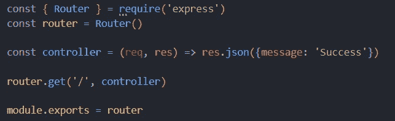
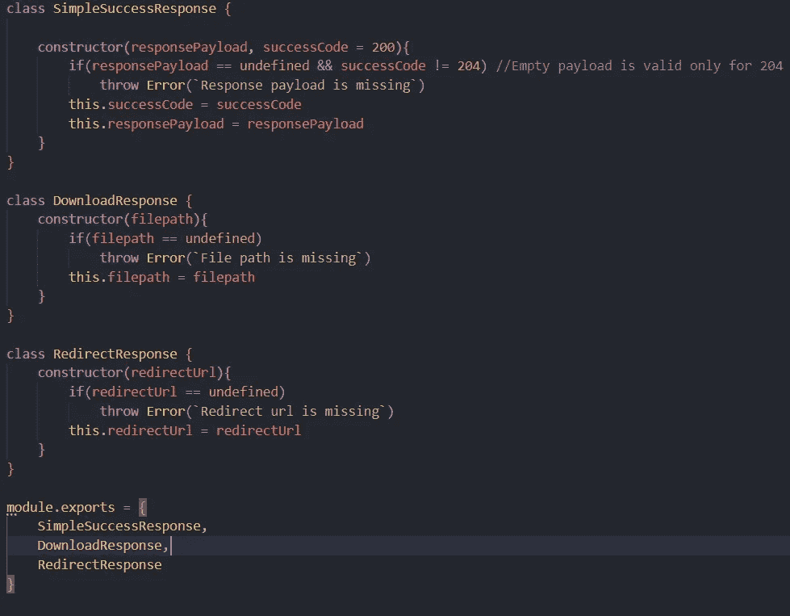
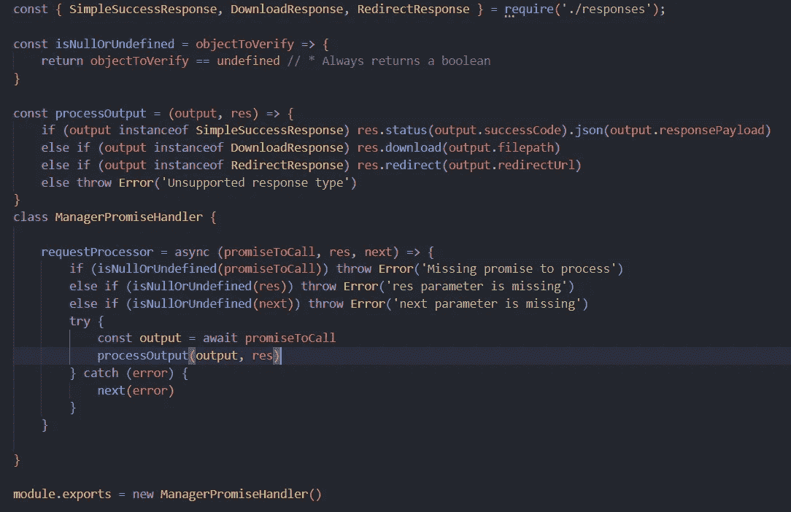
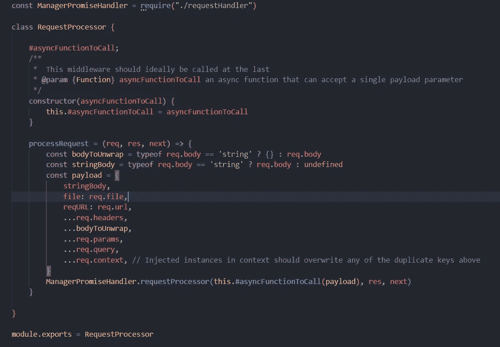
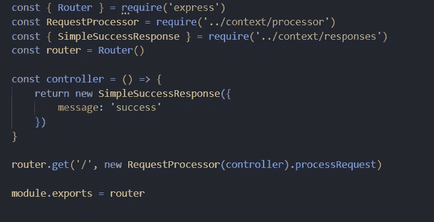
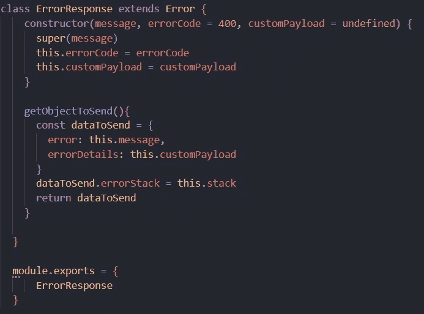
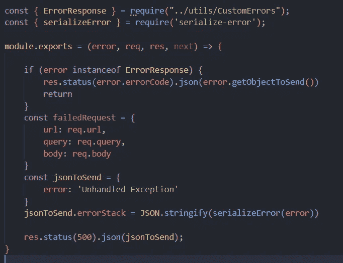

# 在 Express 中管理基于上下文的参数

> 原文：<https://javascript.plainenglish.io/manage-context-based-parameters-in-express-e65f6c889427?source=collection_archive---------3----------------------->


Photo by [Anne Nygård](https://unsplash.com/@polarmermaid?utm_source=medium&utm_medium=referral) on [Unsplash](https://unsplash.com?utm_source=medium&utm_medium=referral)

当涉及到为任何应用程序设计代码结构时，一个人可以采取许多方法，所以今天我将分享我最喜欢的方法之一，用于创建 express 应用程序并在更隔离的环境中管理其控制器

# 什么是基于上下文的路线？

基于上下文的路由可以定义为控制器功能比请求和响应对象更加独立。一个常规方法，可以用在我们不能访问请求和响应对象的其他代码位置

## 典型的快速路线

一个典型的 express 路由看起来就像下图，我们需要从 express 传递请求和响应对象，稍后用于从请求对象获取参数并将响应对象返回给客户端



但是，如果我们想使用控制器中的功能，以便在应用程序中的任何其他地方进行访问，那么理想的方法是将代码放在公共文件中，然后更新控制器中的引用，并在新的位置调用该方法

## 我们如何构建上下文路由器？

从上下文开始，我们需要首先构造响应类型。在一般的应用程序中，我们可以有三种类型的响应

*   成功/错误响应
*   重定向响应
*   文件响应



我们创建了三个不同的类来处理普通响应、重定向响应和下载或文件响应。我们稍后会用到这些类

让我们来创建第二块拼图，即承诺处理器。我们需要一个地方来添加所有应用程序的所有默认设置，所以让我们创建该文件并将其命名为`requestHandler`



requestProcessor.js

我们现在创建了另一个类`ManagePromiseHandler`,我们在验证所有参数是否正确之后运行输入承诺，然后根据我们之前创建的响应类型处理输出

现在，我们有了两个重要的东西，让我们创建一个实际的处理器，并将文件命名为`processor`，在这里我们将从请求中析构所有字段，并将其分配给上下文变量，我们将把该变量传递给控制器，如`body`和`query`



process.js

现在我们已经有了所有的东西，所以让我们改变路线和它的控制器，使用新的方法来处理它

## 路线变更

现在，任何控制器都没有请求或响应参数，取而代之的是，它们将所有的值放在一个对象中，我们需要将控制器作为参数传递



需要注意的一点是，控制器的返回应该是前面定义的响应格式之一。现在，该路由应该可以正常工作了

> 你可以使用下面的结构来传递数据

```
const controller = ({ name }) => { return new SimpleSuccessResponse({ message: 'success', name })}
```

## 处理程序错误

现在，下一个问题是我们如何处理错误响应。理想情况下，您可以单独管理错误响应，但让我们也创建一个类似的错误处理方法。我们将从创建一个`CustomError`文件开始，或者我们也可以将它放入响应中



ErrorResponse

现在，我们有了 error 类，让我们创建一个将在全局级别处理错误的中间件，我们将基于输入错误生成响应，并且为了跟踪错误堆栈，我们可以使用 serialize-error 包



在 Express 应用程序的底部，我们可以包括以下格式的错误

```
app.use(errorHandler)// to use it
    throw new ErrorResponse('No data found')
and the error will be handled
```

这应该就是错误处理

## 结论

有几种方法可以构建您的代码库，但这是我喜欢的大多数应用程序中的版本，如果您喜欢并在您的项目中使用它，那么您可以找到源代码

编码快乐！

*更多内容尽在* [***说白了. io***](https://plainenglish.io/) *。报名参加我们的* [***免费周报***](http://newsletter.plainenglish.io/) *。关注我们关于* [***推特***](https://twitter.com/inPlainEngHQ) ，[***LinkedIn***](https://www.linkedin.com/company/inplainenglish/)*，*[***YouTube***](https://www.youtube.com/channel/UCtipWUghju290NWcn8jhyAw)*，* [***不和***](https://discord.gg/GtDtUAvyhW) *。对增长黑客感兴趣？检查* [***电路***](https://circuit.ooo/) *。*