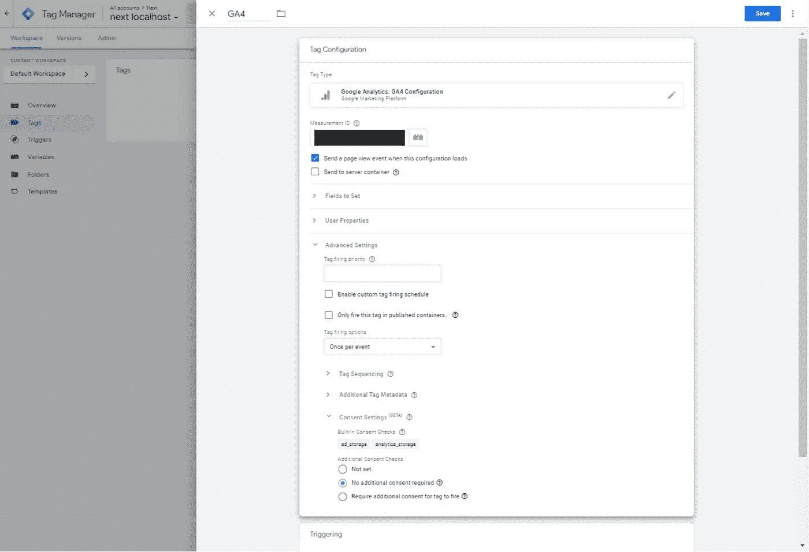

# 使用 Google 标签管理器管理 Next.js 中的 Cookie 同意

> 原文：<https://javascript.plainenglish.io/manage-cookie-consent-in-next-js-with-google-tag-manager-4d58818266ea?source=collection_archive---------1----------------------->

## 关于如何在 Next.js 项目中获得用户的 Cookie 同意并使用 Google Tag Manager 内置同意概述处理它的指南。


如今，大多数网站都需要 Cookie 许可系统来遵守 GDPR(和其他)欧洲法规。基本上，这意味着你不能在用户的计算机上存储 cookies，如果他们不允许你这样做的话。你也不能允许你网站上活跃的其他服务(如分析或广告)在你的域名上存储 cookies。

在本文中，我将展示如何在 Next.js 项目中获得用户的 Cookie 同意，并使用 Google Tag Manager 内置的同意概述来处理它。

## 先决条件

要跟进这个项目，您需要:

*   一个 Google Tag Manager 帐户和它的带有启用同意概述的容器(我将向您展示如何启用它)
*   set cookie 使用 Google Tag Manager 实现的服务(我们将使用 Google Analytics，因为大多数 Google 服务都有自动同意检查，但其他服务也可以轻松实现)
*   一个基本的 Next.js 项目，其中我们将实现 cookie 同意的标志
*   我们将使用的 Next.js 布局的基本知识

## 限制

我们将构建一个基本的例子，在这个例子中，用户可以接受或拒绝 cookie，对于接受和拒绝哪些 cookie 没有粒度或选择。但是将这个例子扩展到一个更完整的解决方案将是一件容易的事情。

## 它将如何工作

我们的 Next.js 项目将在页面中包含一个标签管理器容器，它将成为我们所有监控代码(分析、广告、再营销……)的入口点，标签管理器将基于用户同意“运行”代码，因此我们将制作一个横幅，让用户给予(或拒绝)同意。同意(确切地说是同意，因为有更多的同意)被持久化，并在每个页面请求时被发送到标记管理器，以便标记被正确地触发，cookies 根据用户的选择被设置。

正如我们所说，有更多的同意和更多的 cookie 类型，标签管理器将支持:

*   ad_storage(跟踪广告的 cookies)
*   分析 _ 存储(cookies 跟踪统计数据)
*   functionality_storage(存储供网站使用的数据的 cookies，如语言)
*   personalization_storage(基于用户偏好定制用户体验的 cookies)
*   security_storage(存储登录信息、密钥等的 cookies)

还有一些默认情况下启用的必要 cookies，这是站点正常工作所必需的(例如电子商务中的购物车功能)

谷歌服务(如分析和广告)有内置的同意检查，对于其他服务，你需要指定所需的同意才能工作(稍后会详细介绍)

对于这个例子，我们将实现内置同意的 Google Analytics。

# 设置标签管理器

登录到您的谷歌标签管理器帐户，创建一个新的帐户和一个新的容器，给它一个名称，并选择 Web 作为目标平台。


在标签管理器中启用同意概述，标题为管理->容器设置:


创建一个新标签来处理 Google Analytics(您需要一个 Google Analytics GA4 活动帐户及其测量 ID):转到**标签**，单击**新建**按钮，单击**标签配置**并添加 ***Google Analytics: GA4 配置*** 标签类型。通过添加测量 ID 进行配置(您可以从 Google Analytics 配置中获得)，然后向下滚动到*同意设置*，并选择*无需额外同意*。如你所见，GA4 为 *ad_storage* 和 *analytics_storage 启用了内置的同意检查。*这意味着您需要向 Tag Manager 提供这两项许可，以便从 Google Analytics 启用 cookie 存储和跟踪。



然后，您需要配置触发触发器，以便在 Next.js 中的每个页面上触发分析，您需要触发所有页面和历史更改。点击*选择一个触发器使该标签触发……*选择*所有页面*，然后点击+按钮添加另一个触发器，再次点击+号创建一个自定义触发器。在 Nextjs 中将其命名为*页面更改*点击*选择一个触发类型开始设置…* 选择*历史更改*并保存。最后，您的标记配置应该如下所示:


不要忘记提交工作区来发布它。

# 创建新的 Next.js 项目

我们现在可以创建一个新的 Next.js 项目并安装我们需要的依赖项，我们将使用 cookies-next 来处理 cookies，并使用 Tailwind 来设置同意弹出窗口的样式。

创建新项目:

```
**npx create-next-app consent**
```

添加 cookies 下一个模块:

```
**npm install --save cookies-next**
```

按照官方指南安装和配置顺风 CSS [:](https://tailwindcss.com/docs/guides/nextjs)

[](https://tailwindcss.com/docs/guides/nextjs) [## 用 Next.js - Tailwind CSS 安装 Tailwind CSS

### 顺风 CSS 框架的文档。

tailwindcss.com](https://tailwindcss.com/docs/guides/nextjs) 

在这一点上，如果你用`**npm run dev**`运行应用程序，并前往`[**http://localhost:3000**](http://localhost:3000)` ，你应该得到基本的 Next.js 主屏幕:


## 将标记管理器代码添加到项目中

首先，我们需要将标签管理器代码添加到我们的项目中；为此，我们将使用**next/script API**([https://nextjs.org/docs/api-reference/next/script](https://nextjs.org/docs/api-reference/next/script))。从标签管理器 Admin - >中获取 JavaScript 代码(您需要获取放在**头**中的代码)安装 Google 标签管理器:


复制的代码将被添加到 our _app.js 中，以便在我们项目的每个页面上执行:

要测试一切是否正确，您可以使用标签管理器中的**预览**功能。转到您当前在 Tag Manager 中使用的工作区，然后单击预览按钮。系统会提示您输入要测试的 URL，键入 [http://localhost:3000](http://localhost:3000) ，然后连接。将会打开一个包含您的本地站点的新页面，如果一切都已配置好，该页面将会显示一个通知，告知您 Tag Manager 已连接:


您还可以在标签助手页面上看到页面渲染和触发标签的工作流程，因为您可以看到标签管理器将正确触发 GA4 标签(它将在加载了的*容器中触发):*


## 在每个页面上添加同意弹出窗口

我们现在需要在项目的每个页面上添加一个同意弹出窗口，该弹出窗口将有一个**关闭按钮**，一个**拒绝 cookie 按钮**和一个**接受 cookie 按钮**。根据用户的选择，同意 cookie 将与首选项一起保存在用户的计算机上。仅当首选项 cookie 不存在时，弹出窗口才会打开。关闭按钮不会保存 cookie，因此弹出窗口将再次显示。

使用这些特性创建弹出窗口有许多策略，我们将使用 Nextjs 布局特性和弹出窗口本身的组件。[了解 Next.js 中布局的更多信息](https://nextjs.org/docs/basic-features/layouts)。

首先，我们创建一个新组件(在`**component/consent.js**`):

这是一个基本的 div，绝对位于页面底部，有 3 个按钮，每个按钮单击都会关闭横幅(通过隐藏它)，而且**接受**和**拒绝**按钮将设置一个 cookie(名称为 localConsent，持续时间为一年)，该 cookie 的值可以为 true 或 false。用户上的 cookie 不会再次显示横幅，cookie 的值将在以后用于启用(或禁用)Tag Manager 上的一致性。

将通过使用 Next.js 布局将 consent.js 组件添加到页面中，在**组件**文件夹中添加一个名为`**layout.js**` **的文件。**

并使用`**app.js**` **:** 实现

这样，每个页面都将包含同意横幅。


Before accepting the cookie

此时，如果您运行您的项目，页面底部将出现同意横幅，当您单击其中一个按钮时，横幅将隐藏，并且(如果您单击了**接受**或**拒绝**)将设置本地同意 cookie。如果本地同意 cookie 存在，横幅将不会再次显示，但如果您(手动)删除 cookie，横幅将会显示回来。


After accepting the cookie

你可能会注意到，由于我们还没有实现同意模式，Google Analytics(通过标签管理器)还设置了两个 cookies 来跟踪你。

## 实施同意模式

现在所有的部分都就位了，我们可以开始把它们连接起来。正如 Google 所记录的，同意模式应该总是以拒绝开始，然后应该使用本地存储的用户偏好进行更新。这个检查必须在站点的每个页面上进行，所以我们现在必须再次修改`**_app.js**` 以将默认同意值**拒绝**添加到我们的标签管理器代码中:

```
gtag(‘consent’, ‘default’, {
   ‘ad_storage’: ‘denied’,
   ‘analytics_storage’: ‘denied’
});
```

这样就变成了:

如果您删除了 **localConsent** cookie，并使用 Tag Manager Tag Assistant 测试您的项目，您将看到两个指定范围的同意状态被拒绝，并且我们发送了一个默认值，没有更新:


如果您单击 Accept now，那么在 Tag Manager 端将不会发生任何事情，同样，如果您重新加载 localConsent cookie 设置为 *true* 的页面，那么您的同意仍然会被拒绝，并且不会检测到更新。我们需要找到一种方法来通知标签管理器更新，一旦同意就在按钮点击和页面加载时通知。

对于(accept)按钮，我们在 content.js 组件的 Accept 函数中添加了 gtag 更新:

因此，当单击该按钮时，ad_storage 和 analytics storage 的 Tag Manager 上的许可设置为 granted。
删除所有 localhost cookies 并用 Tag Assistant 再次测试，您会看到当您单击 accept all 时，将触发一个新的*同意*事件来检测更新。您还会注意到，如果您没有单击 Accept，则 GA4 cookies 中的一个没有设置，该 cookie 是跟踪您的 cookie。如果您单击“拒绝”,同意不会更新，因此 GA 不会发送跟踪 cookie。


如果您重新加载页面或移动到另一个页面，同意再次被初始化为拒绝，因此为了在导航期间保持，我们需要在`**_app.js**` 文件中实现更新，方法是读取 cookie 并在需要时发送 gtag 更新事件:

如果您现在在标签助手中测试，您将会看到在移动到页面或重新加载时发送了更新为“已授予”的内容(如果之前已给予同意)。

## 对更多服务实施同意

正如我们之前提到的，谷歌服务已经内置了同意检查。如果您需要为其他跟踪服务(脸书像素、Pinterest 跟踪、其他广告或分析系统)实现它，您需要知道哪些是要启用的服务的范围(ad_storage、analytics_storage 等)，并将它们添加到标签的同意设置中的*需要标签启动的附加同意*:


Adding Consent for non-Google services

# 改进和扩展

由于这是一个基础项目，只是一个关于如何使用 Google Tag Manager 管理 Next.js 中的同意的概念，所以它不能被视为一个完整的产品化项目。

您可能想要改进和扩展项目，以下是您可以/应该为生产环境做的几件事:

*   除了 Accept/Deny all 之外，您希望用户通过给用户选择接受和拒绝哪个范围的机会来单独管理同意范围；您可以将首选项存储在多个 cookie 中，或者存储在单个 cookie 中的序列化对象中。
*   让用户管理 cookie 首选项，在首次设置后，允许用户删除或授予单个同意范围。

感谢阅读。

## 进一步阅读

[](/i-built-a-serverless-live-chat-app-with-next-js-fauna-and-wundergraph-for-graphql-live-queries-b671d9646f6) [## 我用 Next.js、Fauna 和 WunderGraph 为 GraphQL 实时查询构建了一个无服务器的实时聊天应用程序

### 这是使用无服务器技术创建可扩展的实时聊天应用程序的一步一步的指南，并有来自…

javascript.plainenglish.io](/i-built-a-serverless-live-chat-app-with-next-js-fauna-and-wundergraph-for-graphql-live-queries-b671d9646f6) [](https://blog.bitsrc.io/next-js-13-what-do-the-new-bleeding-edge-features-actually-do-d3e5fd418563) [## Next.js 13:新的前沿特性实际上是做什么的？

### 你听说过 Next.js 13 是一个游戏改变者，但是为什么？让我们看看有哪些新功能，有哪些变化，以及它们…

blog.bitsrc.io](https://blog.bitsrc.io/next-js-13-what-do-the-new-bleeding-edge-features-actually-do-d3e5fd418563) 

*更多内容请看*[***plain English . io***](https://plainenglish.io/)*。报名参加我们的* [***免费周报***](http://newsletter.plainenglish.io/) *。关注我们关于*[***Twitter***](https://twitter.com/inPlainEngHQ)[***LinkedIn***](https://www.linkedin.com/company/inplainenglish/)*[***YouTube***](https://www.youtube.com/channel/UCtipWUghju290NWcn8jhyAw)*[***不和***](https://discord.gg/GtDtUAvyhW) *。对增长黑客感兴趣？检查* [***电路***](https://circuit.ooo/) *。***