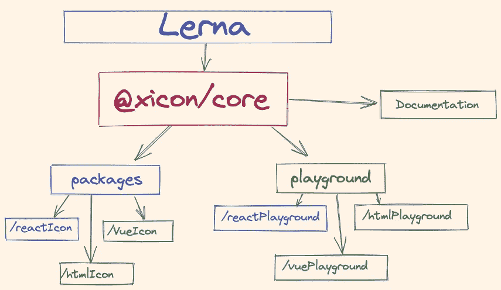
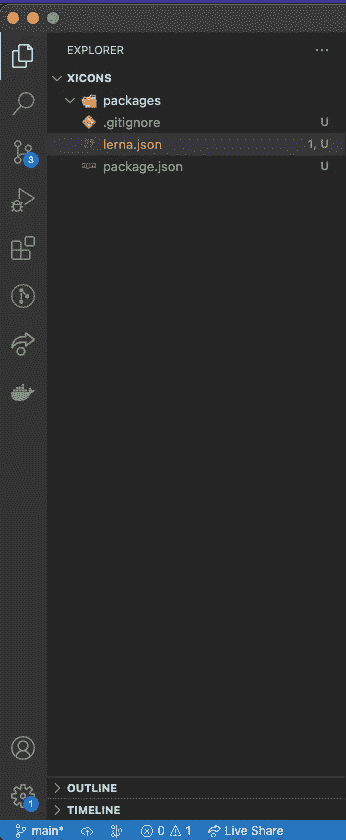
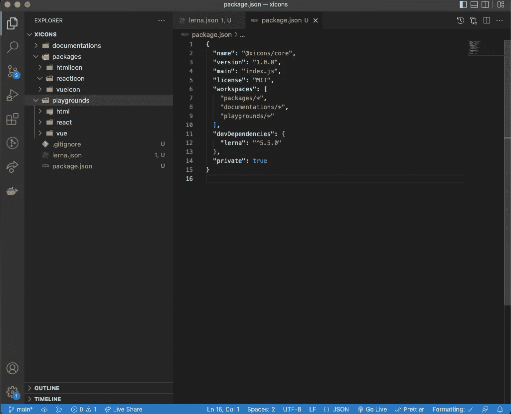
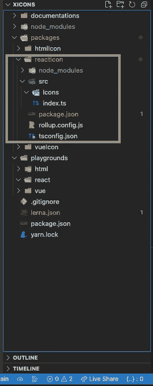
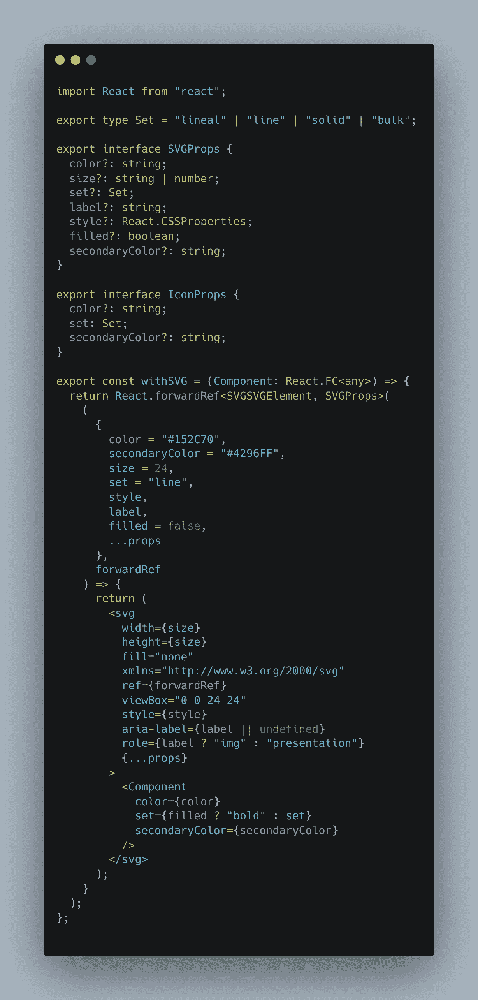
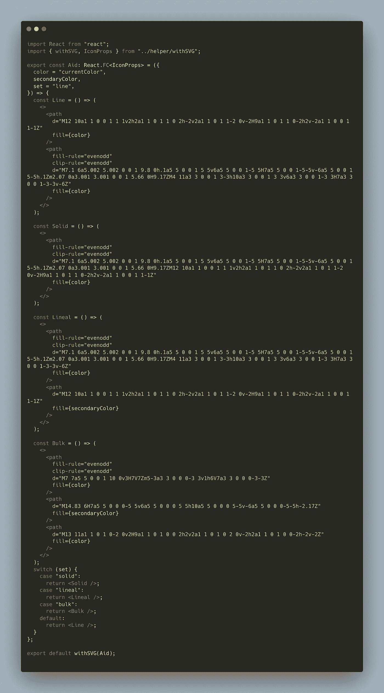
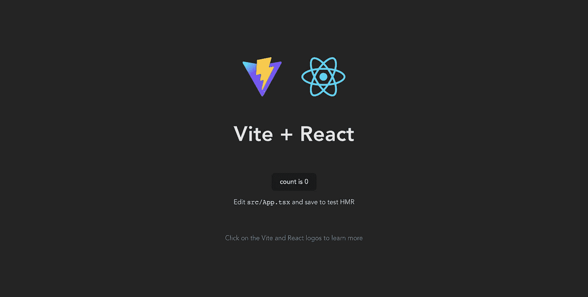
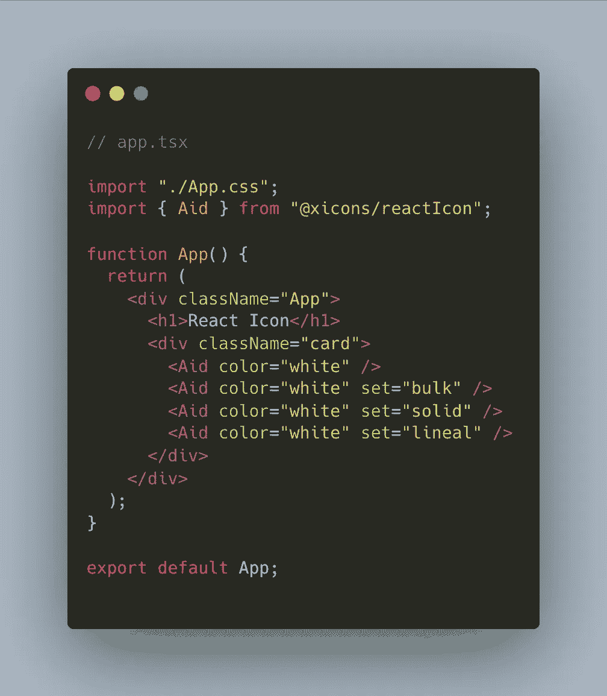
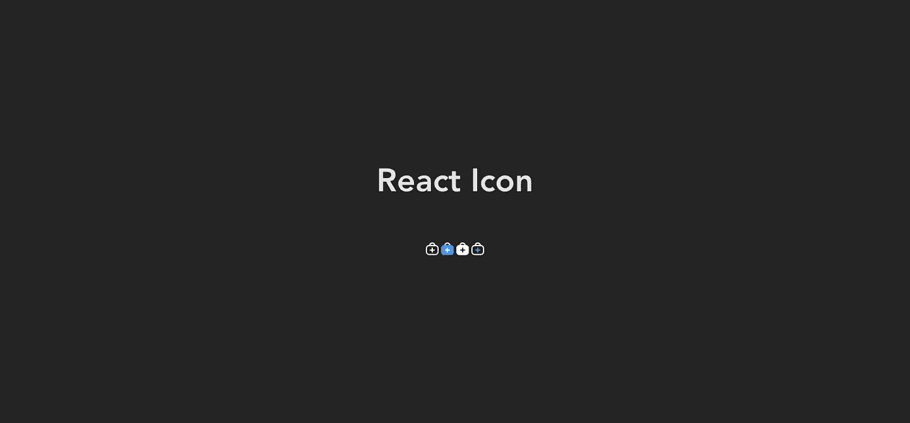
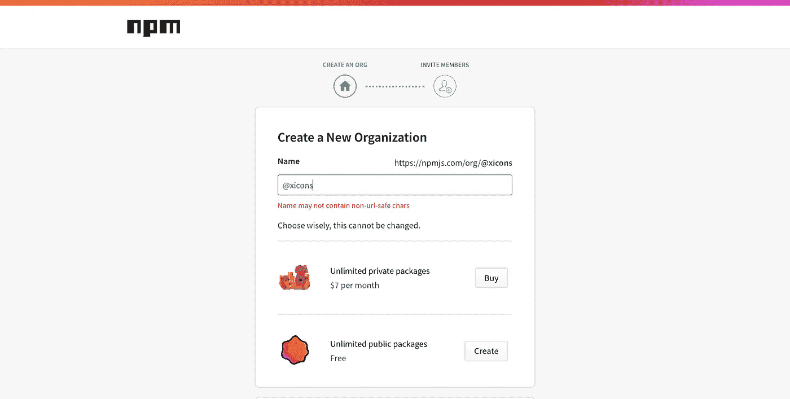

# 使用 Lerna 管理 JavaScript“mono repos ”,构建一个 React 图标库并发布到 NPM

> 原文：<https://javascript.plainenglish.io/managing-javascript-monorepos-with-lerna-building-a-react-icon-library-publishing-to-npm-70855bfb31d9?source=collection_archive---------0----------------------->

## 使用 TypeScript、Vite、Rollup，使用 Commitizen 实现更好的 Git 提交，使用 Lerna 实现自动生成 changelog、标签发布和语义版本控制


Photo by [Harpal Singh](https://unsplash.com/@aquatium?utm_source=unsplash&utm_medium=referral&utm_content=creditCopyText) on [Unsplash](https://unsplash.com/s/photos/icons?utm_source=unsplash&utm_medium=referral&utm_content=creditCopyText)

# 介绍

在本文中，我们将构建一个 React 图标库。本教程的本质是分解使用 Lerna 管理“monorepo”的过程。这篇文章不是针对初学者，中级反应知识和打字基础是必需的。作为初学者开始使用 React，我建议查看新的 [React 文档](https://beta.reactjs.org/learn):

[](https://beta.reactjs.org/) [## 反应文档测试版

### 我们重写了 React 文档，但有一些不同:所有的解释都是用钩子写的，而不是…

beta.reactjs.org](https://beta.reactjs.org/) 

对于[的打字稿，请查看](https://www.typescripttutorial.net/):

 [## TypeScript 教程

### TypeScript 是类型化的 JavaScript。TypeScript 将类型添加到 JavaScript 中，通过捕捉…

www.typescripttutorial.net](https://www.typescripttutorial.net/) 

# 单一报告

*在版本控制系统中，monorepo 是一种软件开发策略，许多项目的代码存储在同一个库中。——*[*百科*](https://en.wikipedia.org/wiki/Monorepo)



“monorepo”允许我们在一个存储库中拥有多个项目。对于我们的图标库，我们可以让库针对不同的框架、React、Vue.js 和普通的 HTML、CSS 和 js 项目。我们还可以用一个文档网站在同一个存储库中测试每一个实现。所有这些都将在接下来的部分中演示。

# 技术

## **勒纳**

*Lerna 是一个快速的现代构建系统，用于管理和发布来自同一个存储库的多个 JavaScript/TypeScript 包。—* [*勒纳官方*](https://lerna.js.org/)

## **打字稿**

TypeScript 是带有类型语法的 JavaScript。

TypeScript 是一种基于 JavaScript 的强类型编程语言，在任何规模下都能为您提供更好的工具。— [*打字稿*](https://www.typescriptlang.org/)

## **汇总**

*Rollup 是一个 JavaScript 的模块捆绑器，它将小段代码编译成更大更复杂的东西，比如一个库或应用程序。它为 JavaScript 的 ES6 修订版中包含的代码模块使用新的标准化格式，而不是以前的特殊解决方案，如 CommonJS 和 AMD。ES 模块让你自由无缝地组合你最喜欢的库中最有用的单个函数。这最终在任何地方都是可能的，但是 Rollup 让你今天就可以做到。—* [*网站*](https://www.rollupjs.org/guide/en/)

## **Docusaurus**

*快速建立优化的网站，专注于你的内容—* [*网站*](https://docusaurus.io/)

## **邀请**

*Vite 下一代前端工具准备好迎接一个最终能赶上你的开发环境。—* [*网站*](https://vitejs.dev/)

## **故事书**

*构建组件驱动的 UI 更快 Storybook 是一款开源工具，用于孤立地构建 UI 组件和页面。它简化了 UI 开发、测试和文档。—* [*网站*](https://storybook.js.org/)

# 装置

要继续学习本教程，您需要在您的计算机上安装以下软件:

## **Node.js/NPM:**

你可以安装最新版本的 Node.js，它还附带了 NPM。

[](https://nodejs.org/en/download/) [## 下载| Node.js

### Node.js 是基于 Chrome 的 V8 JavaScript 引擎构建的 JavaScript 运行时。

nodejs.org](https://nodejs.org/en/download/) 

## **纱线**

安装纱线版本 1。

[](https://classic.yarnpkg.com/lang/en/docs/install/#mac-stable) [## 故事

### 在您开始使用 Yarn 之前，您首先需要在您的系统上安装它。有许多不同的方法来安装…

classic.yarnpkg.com](https://classic.yarnpkg.com/lang/en/docs/install/#mac-stable) 

## **代码编辑器**

出于本教程的目的，我将使用 VSCode，这是一个免费的开源 IDE，点击此链接下载或使用您选择的任何 IDE。

[](https://code.visualstudio.com/) [## Visual Studio 代码-代码编辑。重新定义的

### Visual Studio Code 是一个重新定义和优化的代码编辑器，用于构建和调试现代 web 和云…

code.visualstudio.com](https://code.visualstudio.com/) 

## **设置**

创建一个名为“xicons”的目录，这是我将命名我们的图标库，你可以随意命名。

```
mkdir xicons && cd xicons
```

上面创建了一个名为“xicons”的目录，并将 cd 放入该目录。

```
yarn init -y
```

当您运行上面的代码时，会生成一个包含以下内容的`package.json`文件:

```
{"name": "xicons","version": "1.0.0","main": "index.js","license": "MIT"}
```

让我们通过运行`npx lerna init`来初始化 Lerna:

```
npx lerna init
Need to install the following packages:
  lerna@5.5.0
Ok to proceed? (y) y
```



运行上面的程序会生成上面的文件，我们很快会详细讨论。`lerna.json`包含 Lerna 的配置。packages 文件夹是我们每个库所在的位置。很快会有更多。

```
// lerna.json{"$schema": "node_modules/lerna/schemas/lerna-schema.json","useNx": true,"useWorkspaces": true,"version": "0.0.0"}
```

更新生成的 lerna.json 以包括以下内容:

```
// lerna.json{"$schema": "node_modules/lerna/schemas/lerna-schema.json","useNx": true,"useWorkspaces": true,"version": "0.0.0","npmClient": "yarn","stream": true,"packages": ["packages/*"]}
```

Lerna 使用 Yarn workspace，这就是为什么我们将 npmClient 设置为`yarn`。我们会注意到`package.json`的一些更新

```
{
//newly added"name": "@xicons/core","version": "1.0.0","main": "index.js","license": "MIT",
// added by lerna"workspaces": ["packages/*"],"devDependencies": {"lerna": "^5.5.0"},
// newly added"private": true}
```

我更新了名称，以匹配我们将在 NPM 上用于发布我们的包的名称空间。`@xicons`将是我们组织的名称，/'后面的内容将是该包的名称。`@xicons/core`是我们的父包，这仅用于管理目的，不会发布到 NPM。这就是我们设置`"private": true`的原因。Lerna 在发布到 NPM 时会忽略它。当我们初始化 Lerna 时，它向我们的 package.json 添加了“workspaces”键，并添加了一个目录数组——目前只有 packages 目录。

现在，让我们按照我们的架构设计来创建其余的文件夹结构。


创建上述架构后，我们的项目如下所示:



您会注意到，我们在包的同一级别上有文档和游乐场，它们也被添加到工作区阵列中。

出于本文的目的，我们将把重点放在 React 包上，同样的想法也适用于其他包。如果你喜欢冒险，你可以创建图标的 Vue.js 和 HTML 版本。在我们继续之前，让我们使用“commitzen”设置一个更好的提交方式。

```
yarn add -D commitizen -W
```

请注意-w 标志非常重要，因此包被添加到工作区中。

```
"scripts": {"commit": "cz"},
```

我们还添加了一个命令来运行脚本提交:

```
yarn add -D cz-conventional-changelog -W
```

Lerna 将使用传统的 changelog 来为每个版本从我们的提交中生成 Changelog。

我们将更新`lerna.json`。

```
"command": {
"publish": {
"conventionalCommits": true
}}
```

加上上面的，这将使我们能够在每次发布时生成一个变更日志。我们的更新`lerna.json`:

```
{"$schema": "node_modules/lerna/schemas/lerna-schema.json","useNx": true,"useWorkspaces": true,"version": "0.0.0","npmClient": "yarn","stream": true,"packages": ["packages/*"],"command": {"publish": {"conventionalCommits": true}}}
```

最后，更新 package.json:

```
// xicons/package.json"config": {"commitizen": {"path": "cz-conventional-changelog"}},
```

# React 图标库

现在我们已经有了 Monorepo 设置的所有基础，让我们继续设置我们的 React 图标库。我们将使用 TypeScript 和 Rollup 作为我们的捆绑软件。`cd packages/reactIcon`然后运行`yarn init -y`初始化新项目。

```
yarn add -D react rollup typescript rollup-plu
gin-typescript2 [@types/react](http://twitter.com/types/react)
```

安装以上所有库并更新我们的`package.json`,如下所示:

```
{"name": "@xicons/reactIcon","version": "1.0.0","main": "lib/index.js","license": "MIT","scripts": {"build": "rollup -c","dev": "rollup -c -w"},"files": ["lib"],"devDependencies": {"react": "^18.2.0","rollup": "^2.79.0","rollup-plugin-typescript2": "^0.33.0","typescript": "^4.8.2"}}
```

**汇总配置**

```
import Ts from "rollup-plugin-typescript2";export default {input: ["src/index.ts"],output: {dir: "lib",format: "esm",sourcemap: true,},plugins: [Ts()],preserveModules: true,external: ["react"],};
```

反应图标的文件结构:



我们所有的图标库代码都进入了 src。我们有一个 icons 文件夹，其中存放了所有图标的组件和 index.ts 导出的所有内容。出于本文的目的，我们使用 SexyIcons 的社区版本，您可以在这里找到:

您可以选择任何图标并将它们导出为 SVG 供您试验。我们将把辅助图标转换成反应组件。

src/helper/withSVG.tsx



上面的 HOC 用于向 SVG 添加样式，并抽象出`<svg></svg>`标记以避免重复。

src/icons/Aid.tsx



图标本身有 4 组——线条、实线、直线和大块。我们允许用户选择他们想要渲染的集合，如果没有选择集合，就将 Line set 作为默认设置。

使用图标的 API 将如下所示:

```
<Aid /><Aid color="purple" secondaryColor="violet" /><Aid set="bulk" color="purple" secondaryColor="violet" />
```

**在 React App 里**

```
import React from "react";
import { Cart } from "[@xicons/react](http://twitter.com/sexyicons/react)Icon";const App = () => {
  return <Cart />;
};export default App;
```

**反应操场**

现在我们已经建立了图标库，是时候建立一个平台来测试它了，甚至在部署到 NPM 之前，以确保 API 和库按预期工作。对于操场，我们将使用带有 React 类型脚本模板的 Vite。

```
cd playgrounds/reactyarn create vite . --template react-ts
```

运行:

```
yarnyarn devVITE v3.0.9  ready in 1183 ms➜  Local:   [http://127.0.0.1:5174/](http://127.0.0.1:5174/)
  ➜  Network: use --host to expose
```



所以在我们的操场上使用我们的图标库，我们需要先建立它。为此，我们可以转到 React 图标目录并运行`yarn build`。

```
yarn run v1.22.18
$ rollup -csrc/index.ts → lib...
created lib in 4.2s
✨  Done in 5.74s.
```

然后，我们的构建文件被输出到`lib`文件夹中，就像我们在汇总配置中所做的那样。



我们的图标现在直接从我们的图标库中呈现在我们的操场上。

我们甚至可以让 Lerna 在 monorepo 的每个包中运行我们的构建或开发脚本，从而很好地利用它。

```
"build": "yarn lerna run build","dev": "yarn lerna run dev",
```

通过将上述内容添加到核心 package.json，它将在 monorepo 中的每个 package.json 上运行任何构建或开发脚本。

发布我们的库就像运行:

```
"publish": "yarn build && yarn lerna run publish",
```

# 出版

发布到 NPM 之前，您需要访问网站并注册一个帐户(如果您还没有)。并创建与核心 packages.json 中的名称空间相匹配的组织。



然后，要在您的计算机上验证 NPM，您需要运行:

```
npm login
```

然后你就可以发布你的 npm 包了。Lerna 为您处理一切——在 Github 上创建标签和 changelog，增加每个包的版本号——这一切都像魔法一样工作。

```
yarn publish
```

**代码库:**

[](https://github.com/sexyicons/sexyicons) [## GitHub - sexyicons/sexyicons:各种用途的瘸子图标

### 性感图标的反应组件性感图标的设计有一个自定义的关键线和独特的设计原则，其概念…

github.com](https://github.com/sexyicons/sexyicons) 

**NPM:**

[](https://www.npmjs.com/package/@sexyicons/react) [## @sexyicons/react

### 性感图标的反应组件:图标比语言更响亮。最新版本:0.4.0，最后发布时间:4 天前…

www.npmjs.com](https://www.npmjs.com/package/@sexyicons/react) 

**故事书**

 [## Webpack 应用程序

### 编辑描述

sexyicons-storybook.vercel.app](https://sexyicons-storybook.vercel.app/) 

# 结论

野外有很多开源 Node.js 和 JavaScript 库使用 Monorepo 和 Lerna 来管理，像 [Create React APP](https://github.com/facebook/create-react-app) 、 [NestJS](https://github.com/nestjs/nest) 、 [Chakra UI](https://github.com/chakra-ui/chakra-ui/) 等。我希望这能很好地向您介绍 monorepo 架构，如果您有位于不同仓库的 JavaScript 项目，并且您认为可以将它们放在一起以使团队协作更容易，您可以尝试将它们放在一个仓库中。如果你想在你的下一个项目中尝试得更好。

下次见，快乐编码:)

*更多内容看* [***说白了就是 io***](https://plainenglish.io/) *。报名参加我们的* [***免费周报***](http://newsletter.plainenglish.io/) *。关注我们关于* [***推特***](https://twitter.com/inPlainEngHQ) ， [***领英***](https://www.linkedin.com/company/inplainenglish/) *，*[***YouTube***](https://www.youtube.com/channel/UCtipWUghju290NWcn8jhyAw)*[***不和***](https://discord.gg/GtDtUAvyhW) *。**