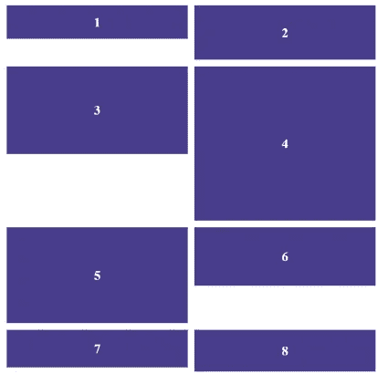
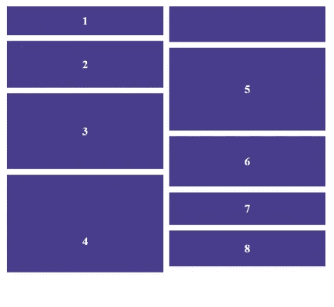
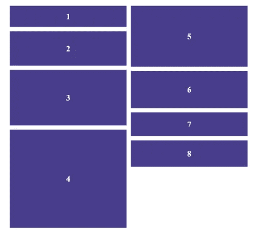
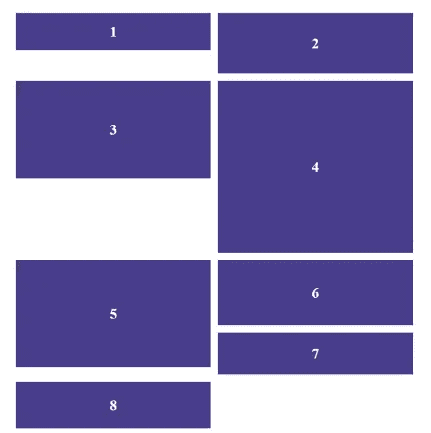
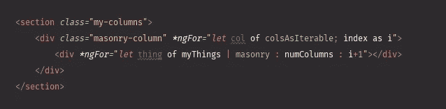
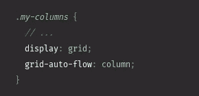

# 带棱角的砖石布局

> 原文：<https://javascript.plainenglish.io/masonry-layouts-with-angular-71c0b5a80c36?source=collection_archive---------2----------------------->

## 关于如何使用自定义角管实现砖石布局的指南。


Photo by [Gareth David](https://unsplash.com/@gareth_david?utm_source=medium&utm_medium=referral) on [Unsplash](https://unsplash.com?utm_source=medium&utm_medium=referral)

由于 Pinterest 的有效实施，砖石布局通常被称为“Pinterest 布局”，是一种视觉上吸引人的方式来显示不同高度/宽度的项目集合。它最常用于以视觉上有趣且不浪费空间的方式显示不同尺寸的图像。它的表达很简单，但是它的实现看起来很复杂。

事实证明，砖石布局需要 JavaScript 成为真正的功能性布局。以下是一些仅使用 CSS 的尝试以及失败的原因。

## 网络法🚫

```
display: grid;
grid-template-columns: 1fr 1fr;
grid-column-gap: 16px;
grid-auto-flow: row;
```

使用网格的问题是行会自动调整大小以匹配最大的元素，导致元素之间有间隙，如下图所示。



Grid method

## 文本列方法🚫

```
columns: 2;
```

使用 columns CSS 属性，我们可以实现一些乍一看似乎正确的东西。然而，这里的问题是元素是从上到下排序的，而不是从左到右。因此，如果页面高度没有限制，元素会在一列中向下排序，永远不会分成两列。此外，为了在下一列中包装一个 div，可以对它进行切片。



Text column method

## 柔性盒方法🚫

```
display: flex;
flex-direction: column;
flex-wrap: wrap;
max-height: 900px;
```

使用 flexbox 方法，我们解决了 div 被分割到多个列的问题。然而，文本列方法的其余问题也存在于 flexbox 方法中。



Flexbox method

## 浮动法🚫

```
float: left;
```

使用 float，我们获得了与使用 grid 相同的结果。浮动元素会自动对齐，再次导致元素之间的间隙。



Float method

## 一种测角方法✔

使用一个定制的角形管道，我们可以实现一个砖石布局，给定一个单一的项目阵列，超过 X 个列。方法如下:

管道转换一个对象数组，并接受一些列和一个列号。在检查有效输入后，它简单地使用模操作符返回给定数组的每个列号的子集。实际上，它的用法如下:



在这个例子中，我用一个`ngFor`迭代了许多列，在每一列中都有一个`myThings`列表。但是砌筑管道只返回适当列的`myThings`数组的子集。这实现了具有独立的项目列的布局，这些项目可以独立于它们的邻居自由地调整大小，解决了间隙问题。

重要的是要知道，对于上面显示的例子来说，你的 CSS 至少需要包括以下内容:



首先，您可能会担心，在每个更新周期对一个非常大的数组执行管道中的函数会导致性能问题。但是管道经过了优化，因此只有在给定的输入发生变化时才会被调用。虽然这样可以节省性能，但是在更新数组时必须小心，因为简单地推送元素或更改数组中的元素不会导致管道再次运行，从而导致不均匀的列。

感谢您的阅读；希望这篇文章对你有帮助。有关数组与管道一起使用的可能问题的更多信息，请查看 Angular 文档。

 [## 有角的

### Angular 是一个构建移动和桌面 web 应用程序的平台。加入数百万开发者的社区…

angular.io](https://angular.io/guide/pipes) 

*更多内容请看*[***plain English . io***](https://plainenglish.io/)*。报名参加我们的* [***免费周报***](http://newsletter.plainenglish.io/) *。关注我们关于*[***Twitter***](https://twitter.com/inPlainEngHQ)*和**[***LinkedIn***](https://www.linkedin.com/company/inplainenglish/)*。加入我们的* [***社区***](https://discord.gg/GtDtUAvyhW) *。**