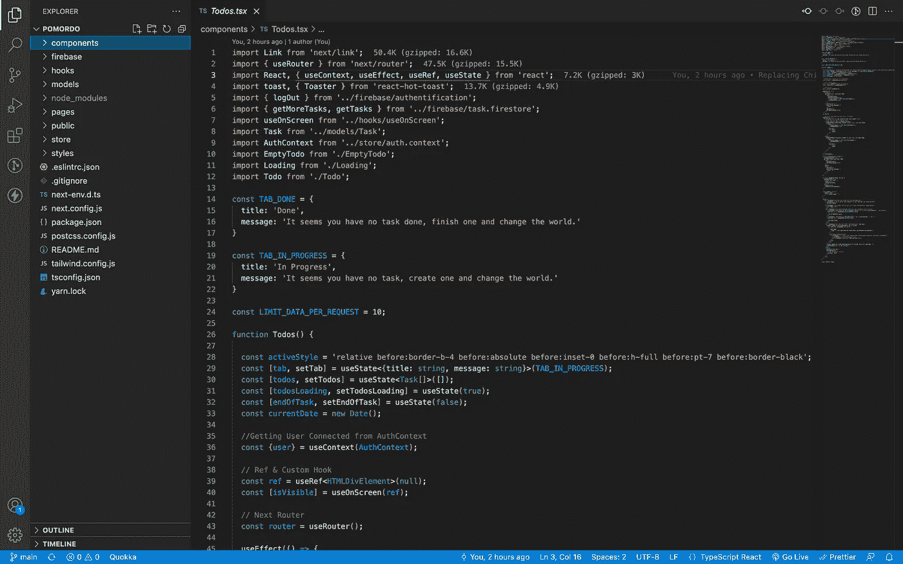
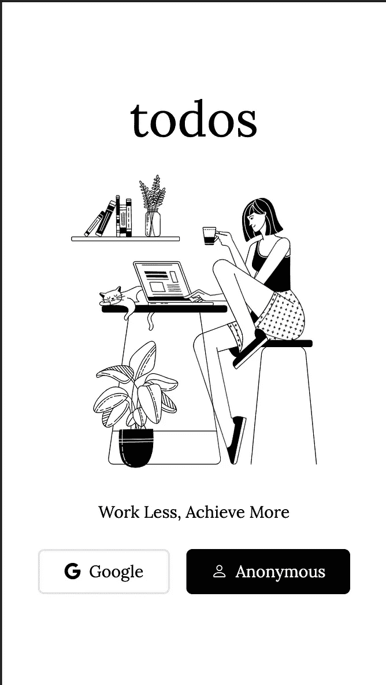
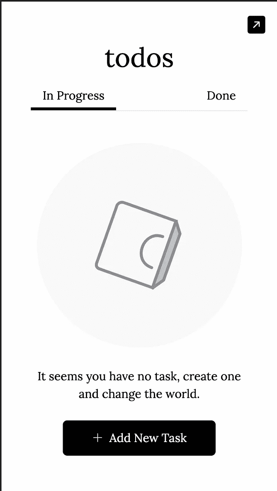
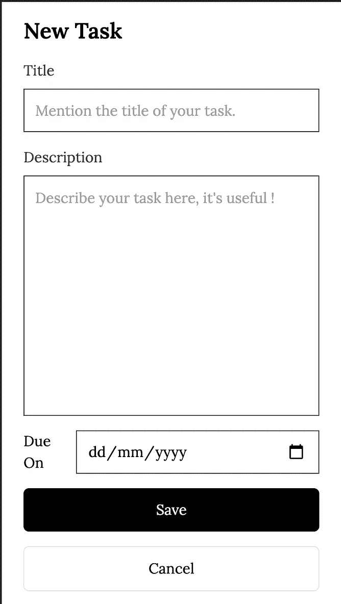
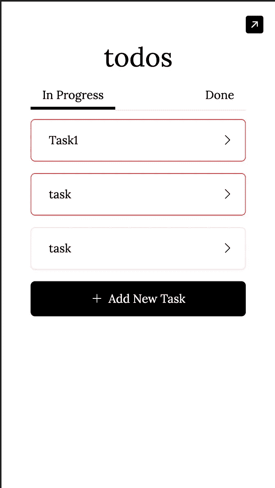
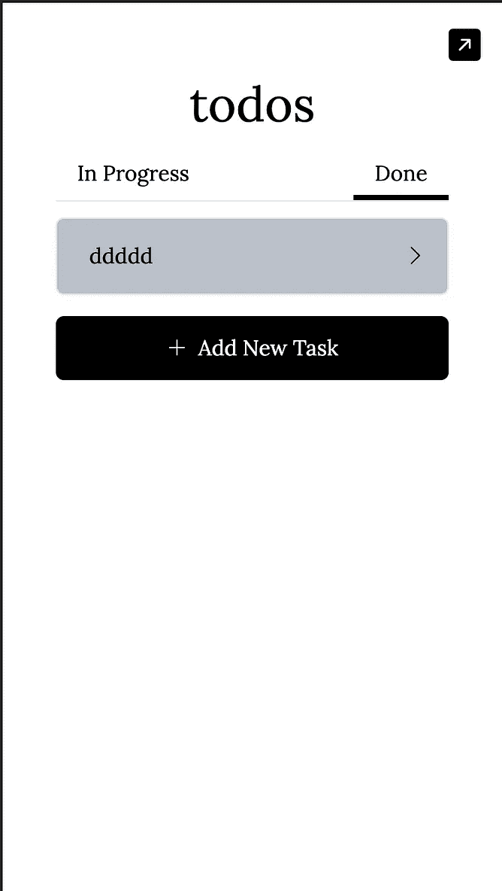
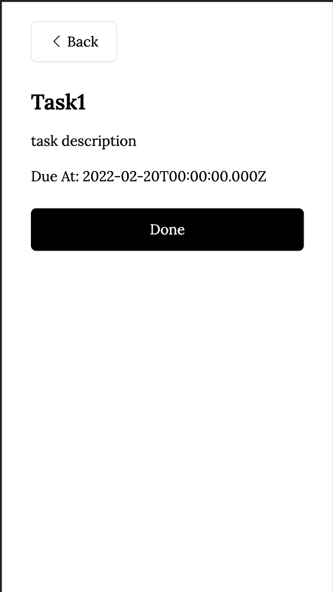

# 掌握使用 Next.js 和 Firebase 构建应用程序

> 原文：<https://javascript.plainenglish.io/master-building-an-app-with-next-js-and-firebase-64ca4867a202?source=collection_archive---------1----------------------->

## 了解在 Next.js 和 Firebase 中开发应用程序的技巧。

Screenshot of the project

如果您阅读了这篇文章，那么您希望了解如何在 Next.js 和 Firebase 中开发应用程序，或者您只是一个好奇的人，想要探索这些选项。这是一件好事，因为 Next.js 和 Firebase 是目前 web 开发中必不可少的工具。

在本文中，您将学习如何使用 Next.js 和 Firebase 开发应用程序。通过数小时的实践和应用你将在这里找到的技巧，如果有人告诉我你是 web 开发领域的佼佼者，我会毫不怀疑。

为了实现这个项目，我将使用**洛蒂动画**来获得良好的用户体验，我还将使用**顺风 CSS** 作为我的组件的样式，使用**反应热吐司**作为通知。

# 概观

在本文中，我们将看到:

*   ***如何用 Firebase 认证实现认证*** ，
*   ***如何管理对认证用户页面的访问*** ，
*   ***用 Firebase Firestore 进行数据操作。***

为了实现上述概念，我们将开发一个 **Todo 应用程序**作为本文的教学模型。

# 1.我们开始吧

[**Next.js**](https://nextjs.org/) 是生产用的 React 框架。Next.js 为您提供了最佳的开发人员体验，它拥有生产所需的所有功能:混合静态&服务器渲染、类型脚本支持、智能绑定、路径预取等等。不需要配置(*你可以在 Next.js 主页上看到*)。

要利用所有这些优势，您应该从👉[此处](https://nextjs.org/docs/getting-started)

**Firebase** 是一个后端即服务，它为您提供一套解决方案，您只需将这些解决方案与我们的解决方案互联即可。在这些现成的解决方案中，我们注意到:身份认证、数据库、存储和许多其他解决方案。

要利用所有这些优势，您应该从👉[此处](https://firebase.google.com/)

## 履行

对于我们的项目，我们将使用 yarn 来创建项目，并添加项目的不同依赖项。我们的项目将在打字稿中完成！

1️⃣创建的项目:`yarn create next-app --typescript`

2️⃣安装消防基地:`yarn add firebase`

## a.火基配置

在下面的文件中，我展示了 firebase 的初始化，正如您将看到的，我导出了 Firebase 的实例，该实例将被 Firestore 重新用于身份验证和数据操作。

firebase.ts

## b.使用 Firebase 和 Next.js 进行身份验证

1️⃣:我首先用 Firebase 创建实现认证逻辑的服务。为此，我使用了三个函数:

-一个用于与 Google 的连接，
-另一个用于匿名认证，
-最后一个用于注销。

2️⃣:一旦完成了这些，我们就创建连接页面来实现应用程序中的连接。

为此，我创造了:

*   将呈现的连接以及连接页面的组件。

components/Login.tsx

pages/index.tsx

*   然后，我创建了一个身份验证上下文，允许我通过添加到应用程序根的提供者来保存和共享整个应用程序中的用户状态。

store/auth.context.tsx

pages/__app.tsx

*   最后，我创建了一个组件，用于检查用户在请求访问受保护资源时是否登录。该组件允许在他不在时将他重定向到登录页面，在他在时将他重定向到所请求的资源。

components/AuthCheck.tsx

现在，组件将 AuthCheck 作为父组件，以确保受保护的资源只有在登录时才可访问。我将在下面几行中向您展示这一点。

## c.用 Firestore 和 Next.js 进行数据操作

身份验证完成后，让我们继续应用程序中其他页面及其服务的实现。

1️⃣:让我们创建一个从 Firebase 创建、检索和修改数据的服务。

firebase/firestore.ts

2️⃣:让我们创建一个服务，它使用前一个服务的功能来收集任务。

firebase/task.firestore.ts

3️⃣:现在让我们为应用程序的其余部分创建页面和组件。

*   获取所有任务:`pages/todo/index.tsx`、`components/Todos.tsx`、`components/Todo.tsx`、`components/EmptyTodo.tsx`和`components/Loading.tsx`

pages/todo/index.tsx

components/Todos.tsx

components/Todo.tsx

components/EmptyTodo.tsx

components/Loading.tsx

*   用于创建任务并将其标记为完成:`pages/todo/new-task.tsx`和`components/NewTodo.tsx`

pages/todo/new-task.tsx

components/NewTodo.tsx

*   用于查看任务详情:`pages/todo/detail/[todoId].tsx`和`components/SingleTodo.tsx`

pages/todo/detail/[todoId].tsx

components/SingleTodo.tsx

# 临终遗言

在本文中，我们讨论了如何使用 Next.js 掌握 Firebase 开发。

我们探索了:

*   ***如何用 Firebase 认证实现认证*** ，
*   ***如何管理对认证用户页面的访问*** ，
*   ***用 Firebase Firestore 进行数据操作。***

还有很多其他你可以用 Firebase 做的事情，你可以在[***Firebase 官方网站*** 上找到。](http://firebase.google.com)

> 我希望这篇文章能让你对这个问题有更清晰的认识。不要犹豫去看 [**源代码**](https://github.com/ShekMak/todo-next) 或者去看 [**演示**](http://todo-next-firebase-lottie.vercel.app/) *😊。*

感谢您阅读这篇文章，我期待您的反馈。

# 参考

 [## GitHub-shek mak/Todo-Next:Todo Next 是一个演示应用程序，给出了如何使用 Nextjs 的提示…

### Todo Next 是一个演示应用程序，给出了如何在项目中使用 Nextjs、Firebase 和 Lottie 动画的技巧。…

github.com](https://github.com/ShekMak/todo-next)  [## Vercel 的 next . js-React 框架

### 生产级反应可扩展的应用。世界领先的公司使用 Vercel 的 Next.js 来构建静态和…

nextjs.org](https://nextjs.org)  [## 重火力点

### 由 Google 支持，受到应用程序开发团队的喜爱——从初创公司到全球企业，我们刚刚完成了 Firebase…

firebase.google.com](https://firebase.google.com)  [## 免费 Lottie 动画文件、工具和插件

### 世界上最大的在线平台，世界上最小的动画格式，供设计师、开发人员等使用…

lottiefiles.com](https://lottiefiles.com)  [## 无需离开你的 HTML 就能快速建立现代网站。

### 顺风 CSS 框架的文档。

tailwindcss.com](https://tailwindcss.com)  [## 反应-热-吐司-镇上最好的反应通知-反应-热-吐司

### 使用 react-hot-toast 将漂亮的通知添加到 React 应用程序中。轻量级。默认吸烟热。

react-hot-toast.com](https://react-hot-toast.com/) 

*更多内容看* [***说白了。报名参加我们的***](http://plainenglish.io/) **[***免费每周简讯***](http://newsletter.plainenglish.io/) *。在我们的* [***社区不和谐***](https://discord.gg/GtDtUAvyhW) *获得独家获得写作机会和建议。***