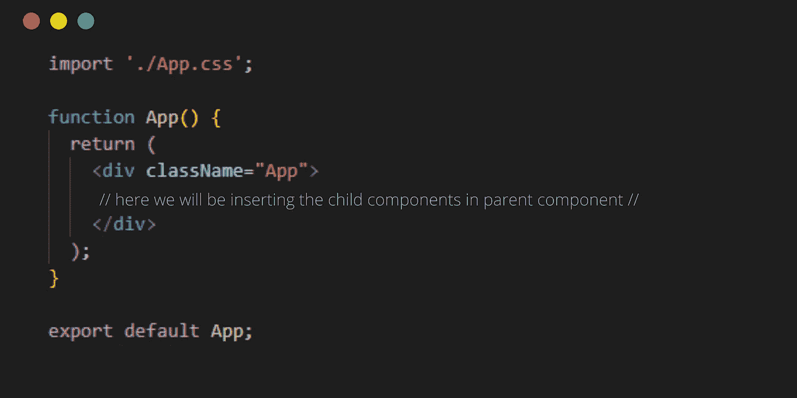
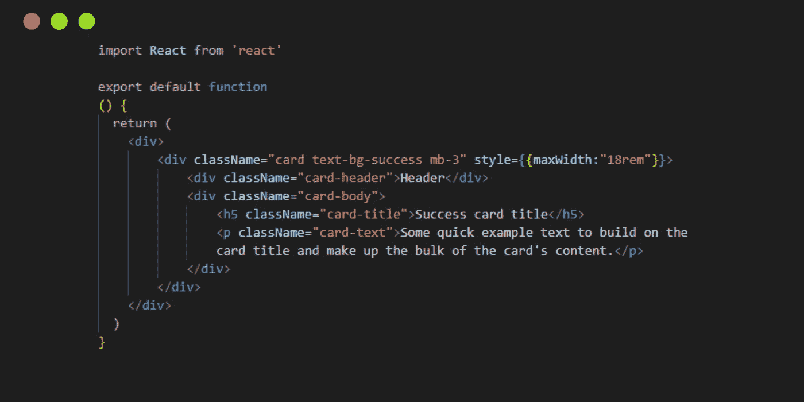
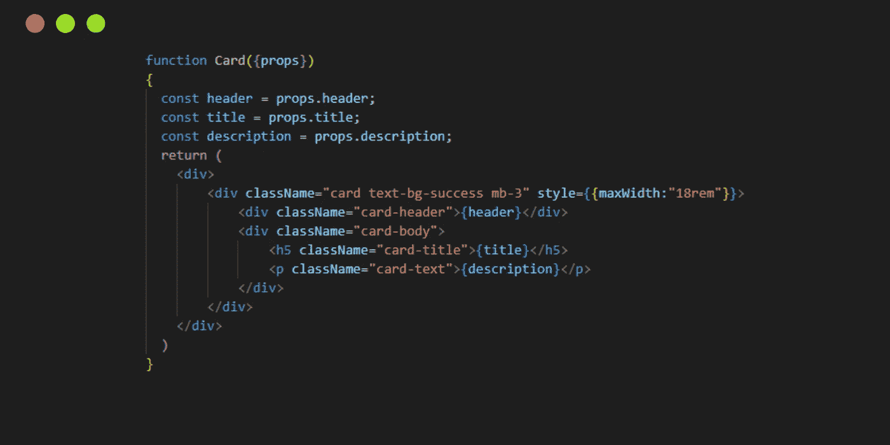

# React 中的主道具和道具类型

> 原文：<https://javascript.plainenglish.io/master-props-and-proptypes-in-react-a42279a51f7a?source=collection_archive---------9----------------------->

## React 有一个用于验证 props 的内置系统，称为 PropTypes。


React 鼓励开发者通过将 UI 划分为组件来构建网站。即使我们将它们放在一起，并且它们相互依赖，也总是需要将数据从一个组件传递到另一个组件——特别是从父组件传递到子组件。React 将组件之间传递的数据称为道具，我们将详细讨论它们。

至此，让我们一起解开这些重要而复杂的术语👨🏻‍🤝‍👨🏻。

# 什么是道具？

首先，让我再解释一下什么是反应。React 旨在轻松制作单页面应用程序。React 使创建交互式 ui 变得简单。为应用程序的每个状态创建简单的视图，当数据发生变化时，React 将更新和呈现必要的组件。

现在让我们深入了解什么是道具，以及它们在 React 中的用途。术语“props”实际上是“properties”的简称。它用于将用户在父组件中插入的值传递给子组件。这使得网站更加动态和用户友好。

现在，我们知道 props 是将一个值从一个组件传递到另一个组件的东西。让我们用下面的例子来理解如何访问和传递数据。我举了一个动态的卡片例子。

首先，我的 App.js 如下图所示:



App.js

现在我将制作 Card.js 文件，我们将在其中使用基于功能的组件。我正在从 bootstrap 网站复制其中一个[卡的源代码](https://getbootstrap.com/docs/5.2/components/card/)。所以我的 Card.js 文件看起来像这样:



Card.js

您可以看到，我们制作了一个 React 组件。


Live Server

# React 中使用道具的两种方式

在我向你解释我们如何在 React 中使用道具之前。我想告诉你，我们可以使用带有或不带有析构的道具。

## 具有解构功能的道具

我们将把 props 变量的名称作为函数参数传递。


Card.js

您的 App.js 将如下图所示，因为您已经在 App.js 中传递了 props 值。访问 props 值可以通过将变量名放在花括号中来完成。

## 不破坏的道具

以前，我们在基于组件的函数中将变量作为参数传递。但现在我们将传递道具作为论据。我们将声明 props 变量。



Card.js

还可以通过用{props.header}替换{header}来避免声明 props 变量。

# 传递默认值

有时您不想传递值，而是使用默认值来避免任何类型的错误。

```
Card.defaultProps = {
    header: "Heading",
    title: "Title", 
    description: "Description"  
}
```

我希望你们都喜欢这个博客。喜欢，分享，评论我的博客，给我一些写更多博客的新想法。

*更多内容请看*[***plain English . io***](https://plainenglish.io/)*。报名参加我们的* [***免费周报***](http://newsletter.plainenglish.io/) *。关注我们关于*[***Twitter***](https://twitter.com/inPlainEngHQ)[***LinkedIn***](https://www.linkedin.com/company/inplainenglish/)*[***YouTube***](https://www.youtube.com/channel/UCtipWUghju290NWcn8jhyAw)*[***不和***](https://discord.gg/GtDtUAvyhW) *。***