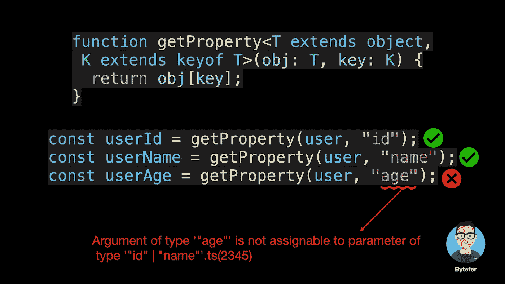

# 掌握 Type 运算符的 TypeScript 键

> 原文：<https://javascript.plainenglish.io/master-the-typescript-keyof-type-operator-bf7f18865a8b?source=collection_archive---------1----------------------->


欢迎来到**掌握打字稿**系列。本系列将以动画的形式介绍 TypeScript 的核心知识和技术。让我们一起学习吧！以前的文章如下:

*   [**TypeScript 泛型中的 K、T、V 是什么？**](https://medium.com/frontend-canteen/what-are-k-t-and-v-in-typescript-generics-9fabe1d0f0f3)
*   [**使用 TypeScript 像 Pro 一样映射类型**](/using-typescript-mapped-types-like-a-pro-be10aef5511a)
*   [**使用 TypeScript 条件类型像亲**](/use-typescript-conditional-types-like-a-pro-7baea0ad05c5)
*   [**使用 TypeScript 交集类型像亲**](/using-typescript-intersection-types-like-a-pro-a55da6a6a5f7)
*   [**使用打字稿推断像亲**](https://levelup.gitconnected.com/using-typescript-infer-like-a-pro-f30ab8ab41c7)
*   [**使用 TypeScript 模板字面类型像亲**](https://medium.com/javascript-in-plain-english/how-to-use-typescript-template-literal-types-like-a-pro-2e02a7db0bac)
*   [**可视化打字稿:15 种最常用的实用类型**](/15-utility-types-that-every-typescript-developer-should-know-6cf121d4047c)

您在 TypeScript 中使用过 **Partial、Required、Pick 和 Record** 实用程序类型吗？


在这些实用程序类型中使用了`keyof`类型操作符，那么这个操作符做什么呢？如果不清楚，看完这篇文章，也许你就明白了。

在 JavaScript 中，我们可以通过`Object.keys`方法获取对象中的键，该方法返回一个键数组。

```
const user = {
  id: 666,
  name: "bytefer",
}const keys = Object.keys(user); // ["id", "name"]
```

在 TypeScript 中，我们处理的是类型。如果你想得到对象类型中的键，你需要使用`keyof`类型操作符。在 TypeScript 2.1 中引入的该运算符用于获取一个类型中的所有键，其返回类型是联合类型。

```
type User = {
  id: number;
  name: string;
}type UserKeys = keyof User; // "id" | "name"
```

获得对象类型的键后，我们可以通过使用类似于属性访问的语法来访问对应于该键的值的类型。

```
type U1 = User["id"] // number
type U2 = User["id" | "name"] // string | number
type U3 = User[keyof User] // string | number
```

对于上面的代码，我们使用一个 [**索引访问类型**](https://www.typescriptlang.org/docs/handbook/2/indexed-access-types.html#handbook-content) 来查找`User`类型上的特定属性。索引类型本身就是一种类型，所以我们可以完全使用 unions、`keyof`或其他类型。

那么 keyof 运算符在实际中有哪些用途呢？这里我们举个例子。

```
function getProperty(obj, key) {
  return obj[key];
}const user = {
  id: 666,
  name: "bytefer",
}const userName = getProperty(user, "name");
```

这是一个简单的`getProperty`函数，它接收两个参数 obj 和 key，用于获取`obj`对象上参数 key 对应的属性值。

那么如何在 TypeScript 中定义上面的 getProperty 函数呢？这里我们将函数直接放入 TypeScript 项目中。对于上述代码，TypeScript 编译器将提示以下错误信息:


这个信息告诉我们，参数 obj 和 key 隐式地具有“any”类型。为了解决这个问题，我们可以显式定义参数 obj 和 key 的类型。


```
Element implicitly has an 'any' type because expression of type 'string' can't be used to index type '{}'.
  No index signature with a parameter of type 'string' was found on type '{}'.ts(7053)
```

显式指定类型后，参数上的错误信息消失，但函数体中会出现新的错误信息。那么如何解决上述问题呢？这里我们可以使用 TypeScript 泛型和 keyof 运算符:

```
function getProperty<T extends object, K extends keyof T>(
  obj: T, key: K
) {
  return obj[key];
}
```

在上面的代码中，我们定义了两个类型参数:`T`和`K`。对于类型参数 T，`extends`用于将类型参数的实际类型约束为对象类型的子类型。类型参数 K 还使用`extends`将类型参数的实际类型约束为对象类型的所有键的联合类型的子类型。

如果您不熟悉类型参数，我建议您阅读以下文章:

[](https://medium.com/frontend-canteen/what-are-k-t-and-v-in-typescript-generics-9fabe1d0f0f3) [## TypeScript 泛型中的 K，T，V 是什么？

### 用动画讲解，让你轻松掌握 TypeScript 泛型类型参数。

medium.com](https://medium.com/frontend-canteen/what-are-k-t-and-v-in-typescript-generics-9fabe1d0f0f3) 

之后，使用`getProperty`函数，我们可以获得一个对象的指定属性的值。当该键对应的属性不存在时，TypeScript 会提示相应的错误信息。



`keyof`类型操作符不仅可以应用于对象类型，还可以应用于**原始数据类型、任何类型、类和枚举类型**。


前面提到的 TypeScript 内置实用程序类型如 **Partial、Required、Pick 和 Record** 都在内部使用了`keyof`类型操作符和映射类型。如果您想了解更多关于 TypeScript 映射类型的信息，我们建议您阅读本文。

[](/using-typescript-mapped-types-like-a-pro-be10aef5511a) [## 像专业人员一样使用 TypeScript 映射类型

### 映射类型—用动画解释。掌握 TypeScript 映射类型并理解 TypeScript 的内置…

javascript.plainenglish.io](/using-typescript-mapped-types-like-a-pro-be10aef5511a) 

为了让大家更好的理解`keyof`类型操作符的作用，我将以分部效用类型为例来演示其工作流程:


```
/**
 * Make all properties in T optional. 
 * typescript/lib/lib.es5.d.ts
 */
type Partial<T> = {
    [P in keyof T]?: T[P];
};
```


至此，我相信您已经知道了`keyof`类型操作符在 TypeScript 的内置实用程序类型中的作用。如果你想学习打字，那么不要错过**掌握打字**系列。

在 [Medium](https://medium.com/@bytefer) 或 [Twitter](https://twitter.com/Tbytefer) 上关注我，阅读更多关于 TS 和 JS 的内容！


[Bytefer](https://medium.com/@bytefer?source=post_page-----bf7f18865a8b--------------------------------)

## 掌握打字稿系列

[View list](https://medium.com/@bytefer/list/mastering-typescript-series-688ee7c12807?source=post_page-----bf7f18865a8b--------------------------------)47 stories

# 资源

[](https://www.typescriptlang.org/docs/handbook/2/keyof-types.html) [## 文献工作-键入运算符

### keyof 操作符接受一个对象类型，并生成其键的字符串或数字文字并集。以下类型…

www.typescriptlang.org](https://www.typescriptlang.org/docs/handbook/2/keyof-types.html) 

*更多内容看* [***说白了。报名参加我们的***](https://plainenglish.io/) **[***免费周报***](http://newsletter.plainenglish.io/) *。关注我们关于* [***推特***](https://twitter.com/inPlainEngHQ) ，[***LinkedIn***](https://www.linkedin.com/company/inplainenglish/)*，*[***YouTube***](https://www.youtube.com/channel/UCtipWUghju290NWcn8jhyAw)*，以及* [***不和***](https://discord.gg/GtDtUAvyhW) *。***