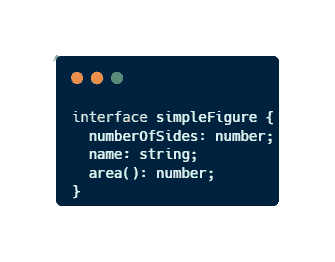
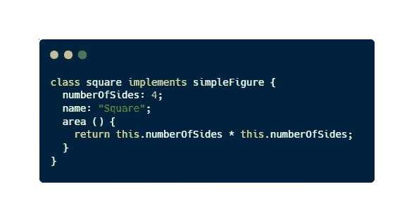
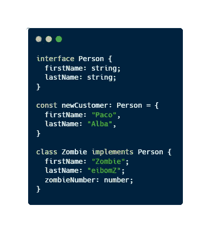

# 掌握 TypeScript —什么是编程中的接口？

> 原文：<https://javascript.plainenglish.io/mastering-javascript-what-is-an-interface-in-programming-in-less-than-3-minutes-b5ba28b76127?source=collection_archive---------2----------------------->

## 使用 JavaScript 示例，在 3 分钟内轻松理解编程中的接口概念。

Photo by [Trevor Vannoy](https://unsplash.com/@tvannoy?utm_source=medium&utm_medium=referral) on [Unsplash](https://unsplash.com?utm_source=medium&utm_medium=referral)

TypeScript 语言对于 JavaScript 开发者来说是一场彻底的革命。它为我们提供了大量的类型和功能来改进我们的 JavaScript 代码。其中有**接口**。

在本文中，我们将发现一个**非常强大的** **概念**，如果我们正在开发一个面向对象的项目，或者如果我们想要一种机制来创建更具描述性的代码，帮助我们以更简单的方式修复错误，我们应该使用这个概念。

*你准备好了解什么是接口了吗？*

# 什么是接口？

接口是与**面向对象编程**相关的概念。

> 接口是没有实现代码的类。它只有定义类所必需的代码。

这就像一个**契约**，我们创建它来声明**如果你想创建这个类**需要实现什么。但是没有说应该如何实现，因为我们没有实现代码。

使用接口，我们可以定义属性和方法，而无需存储任何数据或为这些方法编写实现。一个简单的接口示例可能是这样的:

Example of interface using TypeScript

## 为什么会出现界面？

接口最初是 Java 或 C++等语言中使用的一个概念，用于解决多重继承的问题。

使用接口，**我们可以使用主接口**实现子类，因为我们没有实现任何代码。例如，如果我们遵循前面的例子，我们可以这样做…

Implementing a subclass using an interface

这个概念在 JavaScript 中不存在，因为这种语言中的继承是基于对象的，而不是基于类的。但是 **TypeScript 允许我们实现接口**并在我们的项目中使用它们来编写高质量的代码。

## 使用 TypeScript 的接口的另一个示例

Another example of an interface in TypeScript

# 最后的想法

接口是广泛使用的面向对象编程中的一个强大概念。如果我们正在**实现由于固有的不同形状**的对象，或者如果我们想要**一些检测错误的帮助**，我们应该在我们的项目中使用它。

在本文中，我们已经看到了 TypeScript 如何允许我们使用这种机制、一些示例和一些面向对象的故事。我希望你能完全理解它，它有助于改进你的代码。

你以前了解过接口吗？你在任何项目中使用过它吗？

> *你是不是想买个* [*中等会员*](https://medium.com/@jesuslagares/membership) *？如果你想访问媒体上最好的内容，可以考虑使用我的推荐链接**[*。同样的价格，你会支持我的工作。*](https://medium.com/@jesuslagares/membership)*

# *结论👋*

*谢谢大家！非常感谢您阅读这篇文章。如果你想了解更多关于技术和发展的知识，别忘了**跟我来**。我很想知道你对此的看法，所以不要花花公子**写在评论里**，我会读给你听。*

*如果这篇文章已经帮助你记住了，你可以**为它鼓掌**并分享给你的同志们。*

# *关于作者🤓*

*嗨！很高兴见到你！我是赫苏斯·拉加雷斯。目前，我是一名后端软件工程师，正在加的斯大学完成我的计算机科学学位。*

*我的两大爱好是**技术**和**交流**，所以我会抓住一切机会谈论或撰写关于技术的文章。我喜欢把复杂的概念转换成每个人都能理解的简单概念。*

# *想要连接吗？📲*

*📸[**Instagram**](https://instagram.com/jesuslagares_)**|**💼[**LinkedIn**](https://www.linkedin.com/in/jesus-lagares/)**|**📹[**Youtube**](https://www.youtube.com/c/Jes%C3%BAsLagares)**|**🐦 [**推特**](https://twitter.com/jesuslagares_)*

*📩**jesuslagaresgalan@gmail.com***

*谢谢！❣️*

**更多内容请看*[***plain English . io***](https://plainenglish.io/)*。报名参加我们的* [***免费周报***](http://newsletter.plainenglish.io/) *。关注我们关于*[***Twitter***](https://twitter.com/inPlainEngHQ)[***LinkedIn***](https://www.linkedin.com/company/inplainenglish/)*[***YouTube***](https://www.youtube.com/channel/UCtipWUghju290NWcn8jhyAw)*[***不和***](https://discord.gg/GtDtUAvyhW) *。对增长黑客感兴趣？检查* [***电路***](https://circuit.ooo/) *。****