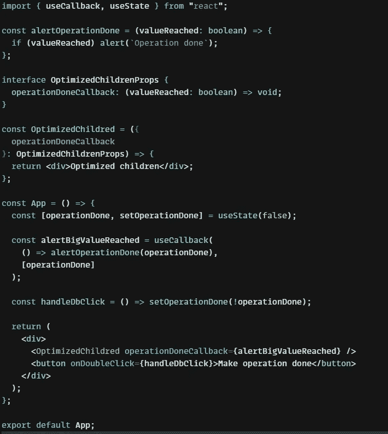

# 掌握 React:解释基本挂钩

> 原文：<https://javascript.plainenglish.io/mastering-react-basic-hooks-explained-9e579fcf4794?source=collection_archive---------15----------------------->

Photo by [Lautaro Andreani](https://unsplash.com/@lautaroandreani?utm_source=medium&utm_medium=referral) on [Unsplash](https://unsplash.com?utm_source=medium&utm_medium=referral)

# 🤔动机

虽然 React 是最成熟的前端库之一，但仍然有很多人不知道基本的钩子。如果你想学习它们，不要担心——这真的很简单。

# ✨简介

React 版本 16.8 带来了该库中最具开创性的变化之一。在这个版本发布之前，类组件语法是创建组件的推荐方法。现在我们可以用钩子将整个组件构建成函数，取代生命周期方法、反应状态等等。让我们来看看他们吧！

# 使用状态

这个钩子允许我们在函数组件中有一个状态变量。虽然你仍然可以把你的状态存储在正常变量中，但你只是失去了反应能力。看看下面这个州的例子。**注意，useState setter 是一个异步函数，总是**。如果您使用的是 TypeScript，您可以为这个钩子传递泛型类型，但这不是强制性的——它会被推断出来。

useState hook example usage

# 使用效果

这个钩子以最优雅的方式取代了所有的类组件生命周期方法，但不仅仅是它们。我们可以用它来观察组件中状态变量的变化。看看这个例子——是的，就这么简单😊。

useEffect hook example usage

# 用户教育

有时，当我们使用 useState 钩子时，我们希望只用一个 setter 进行更复杂的操作，并将逻辑移到里面。这里是 useReducer 钩子，它允许我们以最优雅的方式来做这件事。

useReducer hook example usage

# 使用备忘录

有时候你不得不在一些函数中做一个非常繁重的计算，所以最好不要经常重复。useMemo 是一个钩子，它为我们提供了以最有效的方式使用它的可能性。作为这个钩子中的第二个参数，我们应该确定将导致重新计算的变量作为一个数组。

useMemo hook example usage

# useRef

有时我们需要在页面上用 DOM 元素做一些事情。当使用 document.querySelector 或任何类似的东西进行操作时，由于生命周期和许多其他原因，我们不推荐这样做，我们可以使用这个钩子来获取对指定 DOM 元素的引用，并对它做一些事情。

# 使用回调

当你在组件内部创建一个函数时，你需要知道当组件内部的某些东西改变时，这个函数会被重新创建。为了防止这种行为(例如因为优化的原因)，你可以使用这个钩子。只有当传递的任何依赖项发生更改时，才会记忆并重新创建该函数。这个例子很简单，但是我希望你能理解这个钩子的意思。

useCallback hook example usage

# 反应 18 — useId

这个真的很新鲜。有时，在我们的应用程序中，出于某种原因，我们需要使用一个真正的全局唯一 id(例如，从 map 函数中的数组生成的组件，我们不确定数据的唯一性，或者我们需要确保 id 是全局唯一的—当渲染和水合时)。那些是我们可以使用这个钩子的情况。

useId hook example usage

# 🍟摘要

当然，有更多的 React 内置钩子，但是在本文中，我只关注基本的钩子(和一个新的)。在我个人看来，这些钩子允许你建立你自己的复杂钩子。在下一篇文章中，我将向您展示如何构建它们。

# 👍谢谢大家！

希望你真的喜欢这篇文章。

*更多内容请看*[***plain English . io***](https://plainenglish.io/)*。报名参加我们的* [***免费周报***](http://newsletter.plainenglish.io/) *。关注我们关于*[***Twitter***](https://twitter.com/inPlainEngHQ)*和*[***LinkedIn***](https://www.linkedin.com/company/inplainenglish/)*。加入我们的* [***社区不和谐***](https://discord.gg/GtDtUAvyhW) *。*