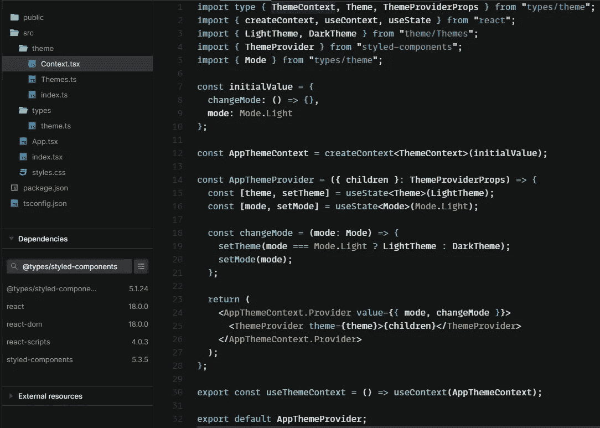

# 掌握 React:用样式组件构建可切换的黑暗模式

> 原文：<https://javascript.plainenglish.io/mastering-react-build-switchable-dark-mode-with-styled-components-b54476ed7da?source=collection_archive---------5----------------------->

Pic from [Pexels](https://www.pexels.com/pl-pl/@pixabay)

# ✨简介

嘿！今天我将向你展示如何使用上下文 API 和样式组件来构建一个可切换的暗/亮主题。如果你读过我以前的文章，你会知道如何使用一个提供者来共享公共状态变量。让我们用上一课学到的知识做一些好东西吧！

# 🚀构建应用程序主题上下文

首先，我们需要创建一个与上一课相似的主题上下文。让我们创建它，但这一次稍微干净一点。

在我们开始做具体的工作之前，我们需要创建主题上下文、主题和主题模式的类型。

types/theme.ts

现在，我们可以用上下文消费者钩子创建确切的上下文提供者。我们走吧。

Theme Context and Provider

好了，我们的主题上下文准备好了，但是接下来呢？现在我们需要安装[样式组件依赖](https://www.npmjs.com/package/styled-components)，创建全局应用程序样式并将其提供给样式组件包装器，当然，还要创建具有指定颜色的主题。我会告诉你怎么做。我们先来创建主题。

Defined Themes

好了，我们现在已经定义了主题，所以我们只需要将它们提供给样式化组件包装器。

Provided theme to the styled-components wrapper

好了，很好，现在我们得到了提供给样式化组件提供者的主题和提供给包装器子代的 **changeMode** 函数。现在，我们可以使用样式组件添加全局样式，以更改全局定义的颜色。但是为了更好地体验样式化组件主题，只需定义所提供主题的类型。

Declare styled-components theme type here

好了，现在是最后两步了。就像这样定义全局样式。

GlobalStyles definition

并将它们插入到我们的主题提供程序中。现在您可以访问 **changeMode** 功能并更改全局主题。

Theme toggling example

# 🍟摘要

不错！现在你的技术突飞猛进。当你理解了上下文 API 之后，你就可以用 React 应用做一些非常棒的事情了。

这个例子到 CodeSandbox 的链接是[这里是](https://codesandbox.io/s/adoring-roentgen-pmc56f?file=/src/App.tsx)。

# 👍谢谢你

希望你喜欢这一课。如果你想通过这种方式学习，就跟着我的简介吧！

*更多内容请看*[***plain English . io***](https://plainenglish.io/)*。报名参加我们的* [***免费周报***](http://newsletter.plainenglish.io/) *。关注我们关于*[***Twitter***](https://twitter.com/inPlainEngHQ)*和*[***LinkedIn***](https://www.linkedin.com/company/inplainenglish/)*。加入我们的* [***社区不和谐***](https://discord.gg/GtDtUAvyhW) *。*